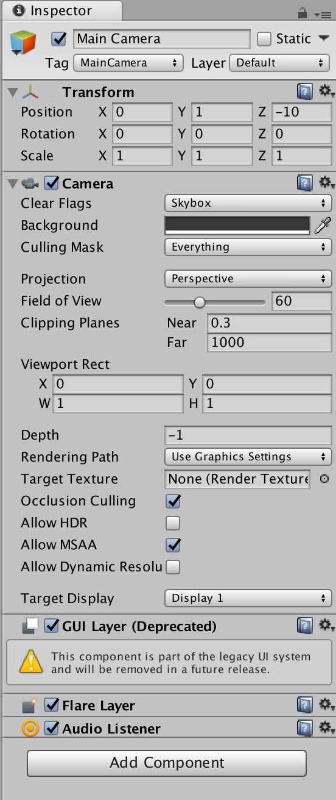
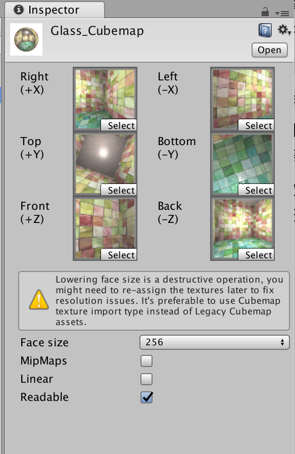

**基础纹理**：法线纹理、渐变纹理和遮罩纹理。（一位或二维纹理）

更复杂的的纹理：

- **立方体纹理（Cubemap）**：环境映射
- **渲染纹理（Render Texture）**
- **程序纹理（Procedure Texture）**

# 立方体纹理

**立方体纹理（Cubemap）**是**环境映射（Environment Mapping）**的一种实现方法。

环境映射可以**模拟物体周围的环境**，而使用环境映射的物体可以**看起来像镀了一层金属一样反射出周围的环境**。

立方体纹理共包含**6张图像**（对应一个立方体的6个面），立方体纹理的名称也由此而来。

立方体的**每个面表示沿着世界空间下的轴向**（上、下、左、右、前、后）观察所得的图像。

与二维纹理坐标不同，**对立方体纹理采样需要提供一个三维的纹理坐标**，表示在世界空间下的一个3D方向。这个方向矢量从立方体的中心出发，当**它向外部延伸时就会和立方体的6个纹理之一发生相交**，采样得到的结果就是由该交点计算而来的。下图给出了使用方向矢量对立方体纹理采样的过程。


**好处**：实现简单快速，得到的效果较好。

**缺点**：

- 场景中引入新的物体、光源，或物体发生移动时，需要**重新生成立方体纹理**。
- 立方体纹理**不能模拟多次反射的结果**，例如两个金属球互相反射的情况（尽量**对凸面体而不是对凹面体使用立方体纹理**，凹面体会反射自身）。

立方体纹理在实时渲染中有很多应用，最常见的是**用于天空盒子（Skybox）以及环境映射**。

## 天空盒子

**天空盒子（Skybox）**是游戏中用于模拟背景的一种方法。

两个信息：

- 用于模拟天空的（尽管也可以用它模拟室内等背景）
- 一个盒子。

当在场景中使用了天空盒子，整个场景就被包围在一个立方体内，**每个面使用的技术都是立方体纹理映射技术**。

Unity中，使用天空盒子非常简单，只需要创建一个**Skybox材质**，再把它赋给该场景的相关设置即可。

如何创建一个**Skybox材质**：

1. 新建一个材质，命名为`SkyboxMat`
2. 在`SkyboxMat`的Unity Shader下拉菜单中选择Unity自带的`Skybox/6 Sided`，该材质需要**6张纹理**。
3. 使用资源`Assets/Textures/Chapter10/Cubemaps`文件夹下的6张纹理**对第2步中的材质赋值**（注意6张纹理的正确位置，如**posz纹理对应Front[+Z]属性**），为了让天空盒子正常渲染，需要把6张纹理的**Wrap Mode**设置为**Clamp**，以防止**在接缝处出现不匹配的现象**。

上述步骤可以得到如下图结果。


该材质中，除了6张纹理属性外还有**3个属性**：

- `Tint Color`：用于控制该材质的整体颜色。
- `Exposure`：用于调整天空盒子的高度。
- `Rotation`：用于调整天空盒子沿+y轴方向的旋转角度。

为场景添加Skybox：

1. 新建一个场景。
2. 在`Window->Lighting`菜单中，把`SkyboxMat`赋给Skybox选项，如下图所示。


为了让摄像机正常显示天空盒子，需要保证渲染场景的**摄像机中Camera组件中的Clear Flags被设置为Skybox**。



经过该设置，可以得到如下场景：


**注意**：在`Window->Lighting->Skybox`中设置的天空盒子会应用于该场景中的所有摄像机。如果希望某些摄像机可以使用不同的天空盒子，可以通过该摄像机添加**Skybox**来覆盖之前的设置。

即，在摄像机上单击`Component->Rendering->Skybox`来完成对场景默认天空盒子的覆盖。

Unity中，天空盒子是**在所有不透明物体之后渲染的**，而其背后使用的网格是**一个立方体或一个细分后的球体**。

## 创建用于环境映射的立方体纹理

立方体纹理最常见的用处是用于环境映射。通过这种方法，可以模拟出**金属质感的材质**。

Unity中，创建**用于环境映射的立方体纹理的方法有3种**：

1. 直接由一些特殊布局的纹理创建。

    需要**提供一张具有特殊布局的纹理**（例如类似**立方体展开图的交叉布局、全景布局**等），之后设置该纹理的**Texture Type为Cubemap**即可，Unity会为我们做好剩下的事情。

    基于物理渲染中，通常会使用一张**HDR图像**来生成高质量的**Cubemap**。

    （官方推荐使用该方法创建立方体纹理，因为第一种方法可以**对纹理数据进行压缩**，而且可以支持**边缘修正**、**光滑反射glossy reflection**和**HDR功能**）

2. 手动创建一个**Cubemap资源**，再把6张图赋给它。

    首先在项目资源中**创建一个Cubemap**，然后把6张纹理拖曳到它的面板中。

3. 由脚本生成。

    前两种方法都需要**提前准备好立方体的图像**，得到的立方体纹理往往是**被场景中的物体所共用的**。但理想情况下，希望**根据物体在场景中位置的不同，生成它们各自不同的立方体纹理**。此时需要使用脚本来创建。

    通过Unity提供的`Camera.RenderToCubemap`函数来实现，该函数可以把**从任意位置观察到的场景图像存储到6张图像中，从而创建出该位置上对应的立方体纹理**。

`Camera.RenderToCubemap`关键代码（由于该代码需要添加菜单栏条目，因此需要把它放到**Editor文件夹**下才能正确执行）：

```c#
using UnityEngine;
using UnityEditor;
using System.Collections;

public class RenderCubemapWizard : ScriptableWizard {
	
  // 在renderFromPosition（由用户指定）位置处动态创建一个摄像机
  // 调用Camera.RenderToCubemap函数把当前位置观察到的图像渲染到用户指定的立方体纹理cubemap中
  // 完成后再销毁临时摄像机
	public Transform renderFromPosition;
	public Cubemap cubemap;
	
	void OnWizardUpdate () {
		helpString = "Select transform to render from and cubemap to render into";
		isValid = (renderFromPosition != null) && (cubemap != null);
	}
	
	void OnWizardCreate () {
		// create temporary camera for rendering
		GameObject go = new GameObject( "CubemapCamera");
		go.AddComponent<Camera>();
		// place it on the object
		go.transform.position = renderFromPosition.position;
		// render into cubemap		
		go.GetComponent<Camera>().RenderToCubemap(cubemap);
		
		// destroy temporary camera
		DestroyImmediate( go );
	}
	
	[MenuItem("GameObject/Render into Cubemap")]
	static void RenderCubemap () {
		ScriptableWizard.DisplayWizard<RenderCubemapWizard>(
			"Render cubemap", "Render!");
	}
}
```

当准备好上述代码后，创建一个**Cubemap**非常简单。

1. 使用和之前的相同的场景，并创建一个**空的GameObject对象**（使用其位置信息来**渲染立方体纹理**）。
2. 新建一个用于**存储的立方体纹理**，Project视图下单击右键，选择`Create->Legacy->Cubemap`创建。该立方体纹理命名为`Cubemap_0`，为了让该脚本顺利将图像渲染到该立方体纹理中，需要在它的面板中勾选**Readable**选项。
3. 从Unity菜单栏选择`GameObject->Render into Cubemap`，把第1步创建的**GameObject**和第2步创建的`Cubemap_0`分别拖曳到窗口中的**Render From Position**和**Cubemap**选项。
4. 单击窗口中的**Render!**按钮，就可以把从该位置观察到的世界空间下的6张图像渲染到`Cubemap_0`中的。


需要为**Cubemap**设置大小，**Face size值**越大，渲染出来的立方体纹理分辨率越大，效果可能越好，但需要占用的内存也越大。

准备好需要的立方体纹理后，可以对物体使用环境映射技术。最常见的应用是**反射和折射**。

## 反射

使用反射效果的物体通常**看起来就像镀了层金属**。

**反射效果**：通过**入射光线方向**和**表面法线方向**来计算反射方向，再**利用反射方向对立方体纹理采样即可**。

1. 新建一个场景，替换场景的默认天空盒子，把之前创建的天空盒子材质拖曳到`Window->Lighting->Skybox`选项中。（也可以为摄像机添加Skybox组件来覆盖默认的天空盒子）
2. 向场景中拖曳一个**Teapot模型**，调整其位置与创建`Cubemap_0`时使用的空**GameObject**的位置相同。
3. 新建一个材质，名为`ReflectionMat`，把材质赋给第2步中创建的**Teapot模型**。
4. 新建一个Unity Shader，名为`Reflection`，把其赋给第3步中创建的材质。

打开`Reflection`，写入以下代码：

```c++
// Upgrade NOTE: replaced '_Object2World' with 'unity_ObjectToWorld'
// Upgrade NOTE: replaced 'mul(UNITY_MATRIX_MVP,*)' with 'UnityObjectToClipPos(*)'

Shader "Unity Shaders Book/Chapter 10/Reflection" {
	Properties {
		_Color ("Color Tint", Color) = (1, 1, 1, 1)
		// 声明3个新的属性
		// _ReflectColor:控制反射颜色
		_ReflectColor ("Reflection Color", Color) = (1, 1, 1, 1)
		// _ReflectAmount:控制这个材质的反射程度
		_ReflectAmount ("Reflect Amount", Range(0, 1)) = 1
		// _Cubemap:模拟反射的环境映射纹理
		_Cubemap ("Reflection Cubemap", Cube) = "_Skybox" {}
	}
	SubShader {
		Tags { "RenderType"="Opaque" "Queue"="Geometry"}
		
		Pass { 
			Tags { "LightMode"="ForwardBase" }
			
			CGPROGRAM
			
			#pragma multi_compile_fwdbase
			
			#pragma vertex vert
			#pragma fragment frag
			
			#include "Lighting.cginc"
			#include "AutoLight.cginc"
			
			fixed4 _Color;
			fixed4 _ReflectColor;
			fixed _ReflectAmount;
			samplerCUBE _Cubemap;
			
			struct a2v {
				float4 vertex : POSITION;
				float3 normal : NORMAL;
			};
			
			struct v2f {
				float4 pos : SV_POSITION;
				float3 worldPos : TEXCOORD0;
				fixed3 worldNormal : TEXCOORD1;
				fixed3 worldViewDir : TEXCOORD2;
				fixed3 worldRefl : TEXCOORD3;
				SHADOW_COORDS(4)
			};
			
			v2f vert(a2v v) {
				v2f o;
				
				o.pos = UnityObjectToClipPos(v.vertex);
				
				o.worldNormal = UnityObjectToWorldNormal(v.normal);
				
				o.worldPos = mul(unity_ObjectToWorld, v.vertex).xyz;
				
				o.worldViewDir = UnityWorldSpaceViewDir(o.worldPos);
				
				// Compute the reflect dir in world space
				// 在顶点着色器中计算该顶点处的反射方向,通过使用CG的reflect函数来实现
				// 物体反射到摄像机中的光线方向可以由光路可逆的原则来反向求得
				// 即,我们可以计算视角方向关于顶点法线的反射方向来求得入射光线的方向
				o.worldRefl = reflect(-o.worldViewDir, o.worldNormal);
				
				TRANSFER_SHADOW(o);
				
				return o;
			}
			
			// 片元着色器中,利用反射方向对立方体纹理采样
			fixed4 frag(v2f i) : SV_Target {
				fixed3 worldNormal = normalize(i.worldNormal);
				fixed3 worldLightDir = normalize(UnityWorldSpaceLightDir(i.worldPos));		
				fixed3 worldViewDir = normalize(i.worldViewDir);		
				
				fixed3 ambient = UNITY_LIGHTMODEL_AMBIENT.xyz;
				
				fixed3 diffuse = _LightColor0.rgb * _Color.rgb * max(0, dot(worldNormal, worldLightDir));
				
				// Use the reflect dir in world space to access the cubemap
				// 对立方体纹理采样需要使用CG的texCUBE函数
				// 注意上面的计算中并为对i.worldRefl进行归一化操作
				// 这是因为,由于采样的参数仅仅是作为方向变量传递给texCUBE函数的,因此没有必要进行归一化
				fixed3 reflection = texCUBE(_Cubemap, i.worldRefl).rgb * _ReflectColor.rgb;
				
				UNITY_LIGHT_ATTENUATION(atten, i, i.worldPos);
				
				// Mix the diffuse color with the reflected color
				// 最后使用_ReflectAmount来混合漫反射颜色和反射颜色,并和环境光照相加后返回
				fixed3 color = ambient + lerp(diffuse, reflection, _ReflectAmount) * atten;
				
				return fixed4(color, 1.0);
			}
			
			ENDCG
		}
	}
	FallBack "Reflective/VertexLit"
}
```

上述计算中，使用**在顶点着色器中计算反射方向**，当然也可以选择**在片元着色器中计算**，这样得到的效果更加细腻。但对于绝大多数人来说这种差别往往是可以忽略不计的，**因此出于性能的考虑，选择在顶点着色器中计算反射方向**。

保存返回场景，在材质面板中将`Cubemap_0`拖曳到**Reflection Cubemap**属性中，并调整其他参数，可以得到如下结果。


## 折射

当光线从一种介质（例如空气）斜射入另一种介质（例如玻璃）时，传播方向一般会发生改变。

当给定入射角时，可以使用**斯涅耳定律（Snell's Law）**来计算反射角。

当光从介质1沿着和表面法线夹角为$\theta_1$的方向斜射入介质2时，可以使用如下公式计算折射光线与法线的夹角$\theta_2$：
$$
n_1\sin\theta_1=n_2\sin\theta_2	\tag{1}
$$
其中，$n_1$和$n_2$分别是两个介质的**折射率（index of refraction）**。真空的折射率是1，玻璃的折射率为1.5。


对一个透明物体来说，**一种更准确的模拟方法需要计算两次折射**：

1. 当光线进入它的内部时
2. 当光线从它内部射出时

但**想要在实时渲染中模拟出第二次折射方向是比较复杂的**，而且仅仅模拟一次得到的效果从视觉上看起来也不错。

>图形学第一准则：如果它看起来是对的，那么它就是对的。

因此在实时渲染中，通常仅模拟第一次折射。

1. 新建一个场景，替换场景的默认天空盒子，把之前创建的天空盒子材质拖曳到`Window->Lighting->Skybox`选项中。（也可以为摄像机添加Skybox组件来覆盖默认的天空盒子）
2. 向场景中拖曳一个**Teapot模型**，调整其位置与创建`Cubemap_0`时使用的空**GameObject**的位置相同。
3. 新建一个材质，名为`RefractionMat`，把材质赋给第2步中创建的**Teapot模型**。
4. 新建一个Unity Shader，名为`Refraction`，把其赋给第3步中创建的材质。

打开`Refraction`，写入以下代码：

```c++
// Upgrade NOTE: replaced '_Object2World' with 'unity_ObjectToWorld'
// Upgrade NOTE: replaced 'mul(UNITY_MATRIX_MVP,*)' with 'UnityObjectToClipPos(*)'

Shader "Unity Shaders Book/Chapter 10/Refraction" {
	Properties {
		_Color ("Color Tint", Color) = (1, 1, 1, 1)
		// 声明了4个新属性
		// _RefractColor:控制折射的颜色
		// _RefractAmount:控制这个材质折射的程度
		// _RefractRatio:不同介质的透射比,以此计算折射方向
		// _Cubemap:模拟折射的环境映射纹理
		_RefractColor ("Refraction Color", Color) = (1, 1, 1, 1)
		_RefractAmount ("Refraction Amount", Range(0, 1)) = 1
		_RefractRatio ("Refraction Ratio", Range(0.1, 1)) = 0.5
		_Cubemap ("Refraction Cubemap", Cube) = "_Skybox" {}
	}
	SubShader {
		Tags { "RenderType"="Opaque" "Queue"="Geometry"}
		
		Pass { 
			Tags { "LightMode"="ForwardBase" }
		
			CGPROGRAM
			
			#pragma multi_compile_fwdbase	
			
			#pragma vertex vert
			#pragma fragment frag
			
			#include "Lighting.cginc"
			#include "AutoLight.cginc"
			
			fixed4 _Color;
			fixed4 _RefractColor;
			float _RefractAmount;
			fixed _RefractRatio;
			samplerCUBE _Cubemap;
			
			struct a2v {
				float4 vertex : POSITION;
				float3 normal : NORMAL;
			};
			
			struct v2f {
				float4 pos : SV_POSITION;
				float3 worldPos : TEXCOORD0;
				fixed3 worldNormal : TEXCOORD1;
				fixed3 worldViewDir : TEXCOORD2;
				fixed3 worldRefr : TEXCOORD3;
				SHADOW_COORDS(4)
			};
			
			// 顶点着色器中,计算折射方向
			v2f vert(a2v v) {
				v2f o;
				o.pos = UnityObjectToClipPos(v.vertex);
				
				o.worldNormal = UnityObjectToWorldNormal(v.normal);
				
				o.worldPos = mul(unity_ObjectToWorld, v.vertex).xyz;
				
				o.worldViewDir = UnityWorldSpaceViewDir(o.worldPos);
				
				// Compute the refract dir in world space
				// 使用CG的refract函数计算折射方向
				// 第一个参数为入射光线的方向,必须是归一化后的矢量
				// 第二个参数是表面法线,同样需要归一化
				// 第三个参数是入射光线所在材质的折射率和折射光照明所在材质的折射率比值
				// 它的返回就是计算而得到的折射方向,它的模等于入射光线的模
				o.worldRefr = refract(-normalize(o.worldViewDir), normalize(o.worldNormal), _RefractRatio);
				
				TRANSFER_SHADOW(o);
				
				return o;
			}
			
			// 在片元着色器中使用折射方向对立方体纹理进行采样
			fixed4 frag(v2f i) : SV_Target {
				fixed3 worldNormal = normalize(i.worldNormal);
				fixed3 worldLightDir = normalize(UnityWorldSpaceLightDir(i.worldPos));
				fixed3 worldViewDir = normalize(i.worldViewDir);
								
				fixed3 ambient = UNITY_LIGHTMODEL_AMBIENT.xyz;
				
				fixed3 diffuse = _LightColor0.rgb * _Color.rgb * max(0, dot(worldNormal, worldLightDir));
				
				// Use the refract dir in world space to access the cubemap
				// 此处未对i.worldRefr进行归一化操作,因为对立方体纹理的采样只需要提供方向即可
				fixed3 refraction = texCUBE(_Cubemap, i.worldRefr).rgb * _RefractColor.rgb;
				
				UNITY_LIGHT_ATTENUATION(atten, i, i.worldPos);
				
				// Mix the diffuse color with the refract color
				// 最后使用_RefractAmount混合漫反射颜色和折射颜色,并和环境光照相加后返回
				fixed3 color = ambient + lerp(diffuse, refraction, _RefractAmount) * atten;
				
				return fixed4(color, 1.0);
			}
			
			ENDCG
		}
	} 
	FallBack "Reflective/VertexLit"
}
```

保存后返回场景，在材质面板中把`Cubemap_0`拖曳到**Reflection Cubemap属性中**，并调整其他参数。


## 菲涅尔反射

使用**菲涅尔反射（Fresnel reflection）**来根据视角控制反射程度。

> **菲涅尔反射**描述了一种光学现象，即当光线照射到物体表面上时，一部分发生反射，一部分进入物体内部，发生折射或散射。
>
> 被反射的光和入射光之间存在一定的比率关系，这个**比率关系可以通过菲涅尔等式进行计算**。
>
> **经常使用的例子**：当站在湖边，直接低头看脚边的水面时，就会发现水几乎是透明的，可以直接看到水底的小鱼和石子；但是当抬头看远处的水面时，会发现几乎看不到水下的情景，而只能看到水面反射的环境。

事实上，不仅仅是水、玻璃这样的反光物体具有菲涅尔效果，**几乎任何物体都或多或少包含了菲涅尔效果。**

这是基于物理的渲染中非常重要的一项**高光反射计算因子**。

可以在 **Johb Hable的《Everything Has Fresnel》**中看到现实生活中各种物体的菲涅尔效果。

真实世界中的菲涅尔等式非常复杂度，实时渲染中，**通常使用一些近似公式进行计算**。

一个著名的近似公式就是**Schlick菲涅尔近似等式**：
$$
F_{Schlick}(v,n)=F_0+(1-F_0)(1-v\cdot n)^5	\tag{2}
$$
其中，$F_0$是一个反射系数，用于控制菲涅尔反射的强度，$v$是视角方向，$n$是表面法线。

另一个比较广泛的等式是**Empricial菲涅尔近似等式**：
$$
F_{Empricial}(v,n)=max(0, min(1, bias+scale\times(1-v\cdot n)^{power}))	\tag{3}
$$
其中，**bias、scale和power**是控制项。

使用上述菲涅尔近似等式，可以**在边界处模拟反射光强和折射光强/漫反射光强之间的变化**。

**许多车漆、水面等材质的渲染中**，会经常使用菲涅尔反射来模拟更加真实的反射效果。

**Schlick菲涅尔近似等式**模拟菲涅尔反射：

1. 新建一个场景，替换场景的默认天空盒子，把之前创建的天空盒子材质拖曳到`Window->Lighting->Skybox`选项中。（也可以为摄像机添加Skybox组件来覆盖默认的天空盒子）
2. 向场景中拖曳一个**Teapot模型**，调整其位置与创建`Cubemap_0`时使用的空**GameObject**的位置相同。
3. 新建一个材质，名为`FresnelMat`，把材质赋给第2步中创建的**Teapot模型**。
4. 新建一个Unity Shader，名为`Fresnel`，把其赋给第3步中创建的材质。

打开`Fresnel`，写入以下代码：

```c++
// Upgrade NOTE: replaced '_Object2World' with 'unity_ObjectToWorld'
// Upgrade NOTE: replaced 'mul(UNITY_MATRIX_MVP,*)' with 'UnityObjectToClipPos(*)'

Shader "Unity Shaders Book/Chapter 10/Fresnel" {
	Properties {
		_Color ("Color Tint", Color) = (1, 1, 1, 1)
		// 声明用于调整菲涅尔反射的属性以及反射使用的Cubemap
    // _FresnelScale: 为1物体将完全反射Cubemap中的图像
    //  							为0则是一个具有边缘光照效果的漫反射物体 
		_FresnelScale ("Fresnel Scale", Range(0, 1)) = 0.5
		_Cubemap ("Reflection Cubemap", Cube) = "_Skybox" {}
	}
	SubShader {
		Tags { "RenderType"="Opaque" "Queue"="Geometry"}
		
		Pass { 
			Tags { "LightMode"="ForwardBase" }
		
			CGPROGRAM
			
			#pragma multi_compile_fwdbase
			
			#pragma vertex vert
			#pragma fragment frag
			
			#include "Lighting.cginc"
			#include "AutoLight.cginc"
			
			fixed4 _Color;
			fixed _FresnelScale;
			samplerCUBE _Cubemap;
			
			struct a2v {
				float4 vertex : POSITION;
				float3 normal : NORMAL;
			};
			
			struct v2f {
				float4 pos : SV_POSITION;
				float3 worldPos : TEXCOORD0;
  				fixed3 worldNormal : TEXCOORD1;
  				fixed3 worldViewDir : TEXCOORD2;
  				fixed3 worldRefl : TEXCOORD3;
 	 			SHADOW_COORDS(4)
			};
			
			// 在顶点着色器中计算世界空间下的法线/视角/反射方向
			v2f vert(a2v v) {
				v2f o;
				o.pos = UnityObjectToClipPos(v.vertex);
				
				o.worldNormal = UnityObjectToWorldNormal(v.normal);
				
				o.worldPos = mul(unity_ObjectToWorld, v.vertex).xyz;
				
				o.worldViewDir = UnityWorldSpaceViewDir(o.worldPos);
				
				o.worldRefl = reflect(-o.worldViewDir, o.worldNormal);
				
				TRANSFER_SHADOW(o);
				
				return o;
			}
			
			// 在片元着色器中计算菲涅尔反射,并使用结果值混合漫反射光照和反射光照
			fixed4 frag(v2f i) : SV_Target {
				fixed3 worldNormal = normalize(i.worldNormal);
				fixed3 worldLightDir = normalize(UnityWorldSpaceLightDir(i.worldPos));
				fixed3 worldViewDir = normalize(i.worldViewDir);
				
				fixed3 ambient = UNITY_LIGHTMODEL_AMBIENT.xyz;
				
				UNITY_LIGHT_ATTENUATION(atten, i, i.worldPos);
				
				fixed3 reflection = texCUBE(_Cubemap, i.worldRefl).rgb;
				
				// 使用Schlick菲涅尔近似等式来计算fresnel变量,并使用它来混合漫反射光照和反射光照
				// 某些情况下也会直接把fresnel和反射光照相乘后叠加到漫反射光照上,模拟边缘光照的效果
				fixed fresnel = _FresnelScale + (1 - _FresnelScale) * pow(1 - dot(worldViewDir, worldNormal), 5);
				
				fixed3 diffuse = _LightColor0.rgb * _Color.rgb * max(0, dot(worldNormal, worldLightDir));
				
				fixed3 color = ambient + lerp(diffuse, reflection, saturate(fresnel)) * atten;
				
				return fixed4(color, 1.0);
			}
			
			ENDCG
		}
	} 
	FallBack "Reflective/VertexLit"
}
```

保存后返回场景，在材质面板中把`Cubemap_0`拖曳到**Cubemap**属性中，并调整其他参数，得到下图效果。


# 渲染纹理

一个摄像机的**渲染结果会输出到颜色缓冲中**，并显示在屏幕上。

现在的GPU**允许把整个三维场景渲染到一个中间缓冲中**，即**渲染目标纹理（Render Target Texture，RTT）**。

而不是**传统的帧缓冲或后备缓冲（back buffer）**。

与之相关的是**多重渲染目标（Multiple Render Target，MRT）**，指的是GPU允许把场景同时渲染到多个渲染目标纹理中，而**不再需要为每个渲染目标纹理单独渲染完整的场景**。（**延迟渲染**就是使用多重渲染目标的一个应用）

Unity为渲染目标纹理定义了一种专门的纹理类型——**渲染纹理（Render Texture）**。

使用渲染纹理通常有两种方式：

1. 在Project目录下**创建一个渲染纹理**，然后把**某个摄像机的渲染目标设置成该渲染纹理**，这样一来该摄像机的渲染结果就会实时更新到渲染纹理中，而不会显示在屏幕上。（使用该方法可以选择渲染纹理的**分辨率**、**滤波模式**等纹理属性）
2. 在屏幕后处理时使用**GrabPass**命令或**OnRenderImage**函数来获取当前屏幕图像，Unity会把这个屏幕图像放到一张**和屏幕分辨率等同的渲染纹理中**，可以在自定义的Pass中把它们当成普通的纹理来处理，从而实现各种屏幕特效。

## 镜子效果

使用渲染纹理模拟镜子效果。

1. 新建一个场景，默认情况下场景将包含一个摄像机和一个平行光，并且使用内置的天空盒子。在`Window->Lighting->Skybox`中去掉场景中的天空盒子。

2. 新建一个材质，名为`MirrorMat`。

3. 新建一个Unity Shader，名为`Mirror`，把其赋给第2步中创建的材质。

4. 在场景中**创建6个立方体**，并调整它们的位置和大小，**使得它们构成围绕着摄像机的房间的6面墙**。给它们赋予相应的标准材质，让它们的颜色互不相同。向场景中**添加3个点光源**，并调整它们的位置，使它们可以照亮整个房间。

5. 创建**3个球体**和**2个立方体**，调整它们的位置和大小，并给它们赋予标准材质，这些物体作为房间内的饰品。

6. 创建一个**四边形（Quad）**，调整它的位置和大小，作为镜子，把第2步中创建的材质赋给它。

7. 在Project视图下创建一个渲染纹理（`Create->Render Texture`），名为`MirrorTexture`。

8. 为了得到从镜子出发观察到的场景图像，**创建一个摄像机，并调整它的位置、裁剪平面、视角等**，使得它的显示图像是希望的镜子图像。由于该摄像机不需要直接显示在屏幕上，而是**用于渲染到纹理**。因此，把第7步中创建的`MirrorTexture`拖曳到该摄像机的`Target Texture`上。

    下图显示了**摄像机面板**和**渲染纹理**的相关设置。


镜子实现的原理很简单，使用一个**渲染纹理作为输入属性**，并**把该渲染纹理在水平方向上翻转后直接显示到物体上**即可。

打开`Mirror`，写入以下代码：

```c++
// Upgrade NOTE: replaced 'mul(UNITY_MATRIX_MVP,*)' with 'UnityObjectToClipPos(*)'

Shader "Unity Shaders Book/Chapter 10/Mirror" {
	Properties {
		// 声明一个纹理属性,对应了由镜子摄像机渲染得到的渲染纹理
		_MainTex ("Main Tex", 2D) = "white" {}
	}
	SubShader {
		Tags { "RenderType"="Opaque" "Queue"="Geometry"}
		
		Pass {
			CGPROGRAM
			
			#pragma vertex vert
			#pragma fragment frag
			
			sampler2D _MainTex;
			
			struct a2v {
				float4 vertex : POSITION;
				float3 texcoord : TEXCOORD0;
			};
			
			struct v2f {
				float4 pos : SV_POSITION;
				float2 uv : TEXCOORD0;
			};
			
			// 在顶点着色器中计算纹理坐标
			v2f vert(a2v v) {
				v2f o;
				o.pos = UnityObjectToClipPos(v.vertex);
				
				o.uv = v.texcoord;
				// Mirror needs to filp x
				// 翻转了x分量的纹理坐标,因为镜子里显示的图像都是左右相反的
				o.uv.x = 1 - o.uv.x;
				
				return o;
			}
			
			// 片元着色器中对渲染纹理进行采样和输出
			fixed4 frag(v2f i) : SV_Target {
				return tex2D(_MainTex, i.uv);
			}
			
			ENDCG
		}
	} 
 	FallBack Off
}
```

保存后返回场景，并把创建的**MirrorTexture渲染纹理**拖曳到材质的Main Tex属性中，得到下图效果。


## 玻璃效果

Unity 中可以**使用一种特殊的Pass来完成获取屏幕图像的目的**，这就是**GrabPass**。

在Shader中**定义了一个GrabPass后**，Unity会把**当前屏幕的图像绘制在一张纹理中**，以便在后续的Pass中访问它。

通常使用**GrabPass**来实现诸如**玻璃等透明材质的模拟**，与使用简单的透明混合不同，使用**GrabPass**可以对该物体后面的图像进行更复杂的处理（例如**使用法线来模拟折射效果**，而不再是简单的和原屏幕颜色进行混合）。

**注意**：在使用GrabPass的时候，需要额外**小心物体的渲染队列的设置**。GrabPass通常用于**渲染透明物体**，尽管代码里并不包含混合指令，但往往**仍然需要把物体的渲染队列设置成透明队列**（`"Queue"="Transparent"`）。保证**当渲染该物体时，所有不透明物体都已经被绘制在屏幕上**，从而获取正确的屏幕图像。

首先使用一张**法线纹理**来修改模型的法线信息，使用反射，通过一个**Cubemap**来模拟玻璃的反射，而在模拟折射时，则使用**GrabPass**获取玻璃后面的屏幕图像，并**使用切线空间下的法线对屏幕纹理坐标偏移后**，再对屏幕图像进行采样来**模拟近似的折射效果**。

1. 新建一个场景，默认情况下场景将包含一个摄像机和一个平行光，并且使用内置的天空盒子。在`Window->Lighting->Skybox`中去掉场景中的天空盒子。
2. 新建一个材质，名为`GlassRefractionMat`。
3. 新建一个Unity Shader，名为`GlassRefraction`，把其赋给第2步中创建的材质。
4. 构建一个**测试玻璃效果的场景**，由一个**6面围成的封闭房间**，并在房间中**放置一个立方体和一个球体**，其中**球体位于立方体内部**，为了模拟玻璃对内部物体的折射效果。把第2步中创建的材质赋给立方体。
5. 为了得到本场景适用的环境映射纹理，适用之前创建立方体纹理的脚本（通过`GameObject->Render into Cubemap`打开编辑窗口）来创建它。该**Cubemap**命名为`Glass_Cubemap`。



打开`GlassRefraction`，写入以下代码：

```c++
// Upgrade NOTE: replaced '_Object2World' with 'unity_ObjectToWorld'
// Upgrade NOTE: replaced 'mul(UNITY_MATRIX_MVP,*)' with 'UnityObjectToClipPos(*)'

Shader "Unity Shaders Book/Chapter 10/Glass Refraction" {
	Properties {
		// 该玻璃的材质纹理,默认为白色纹理
		_MainTex ("Main Tex", 2D) = "white" {}
		// 玻璃法线纹理
		_BumpMap ("Normal Map", 2D) = "bump" {}
		// 用于模拟反射的环境纹理
		_Cubemap ("Environment Cubemap", Cube) = "_Skybox" {}
		// 控制模拟折射时图像的扭曲程度
		_Distortion ("Distortion", Range(0, 100)) = 10
		// 控制折射程度,为0时该玻璃只包含反射,为1时该玻璃只包含折射
		_RefractAmount ("Refract Amount", Range(0.0, 1.0)) = 1.0
	}
	SubShader {
		// We must be transparent, so other objects are drawn before this one.
		// 定义相应的渲染队列
		// 将Queue设置成Transparent以确保该物体渲染时,其他所有不透明物体都已经被渲染到屏幕上了
		// 否则可能无法正确得到"透过玻璃看到的图像"
		// 设置RenderType的目的是为了在使用着色器替换(Shader Replacement)时,该物体可以在需要时被正确渲染
		// 这通常发生在需要得到摄像机的深度和法线纹理时
		Tags { "Queue"="Transparent" "RenderType"="Opaque" }
		
		// This pass grabs the screen behind the object into a texture.
		// We can access the result in the next pass as _RefractionTex
		// 使用GrabPass获取屏幕图像,定义一个Pass
		// 该Pass中定义一个字符串,决定抓取得到的屏幕图像将会被存入哪个纹理中
		// 实际上可以忽略声明该字符串,但直接声明纹理名称的方法往往可以得到更高的性能
		GrabPass { "_RefractionTex" }
		
		// 定义渲染玻璃所需的Pass
		Pass {		
			CGPROGRAM
			
			#pragma vertex vert
			#pragma fragment frag
			
			#include "UnityCG.cginc"
			
			// 为了在Shader中访问各个属性,需要定义它们对应的变量
			sampler2D _MainTex;
			float4 _MainTex_ST;
			sampler2D _BumpMap;
			float4 _BumpMap_ST;
			samplerCUBE _Cubemap;
			float _Distortion;
			fixed _RefractAmount;
			// 此处定义_RefractionTex和_RefractionTex_TexelSize
			// 这对应在使用GrabPass时指定的纹理名称
			// _RefractionTex_TexelSize可以得到该纹理的纹素大小
			// 例如一个大小为256x512的纹理,其纹素大小为(1/256,1/512)
			// 需要在对屏幕图像的采样坐标进行偏移时使用该变量
			sampler2D _RefractionTex;
			float4 _RefractionTex_TexelSize;
			
			struct a2v {
				float4 vertex : POSITION;
				float3 normal : NORMAL;
				float4 tangent : TANGENT; 
				float2 texcoord: TEXCOORD0;
			};
			
			struct v2f {
				float4 pos : SV_POSITION;
				float4 scrPos : TEXCOORD0;
				float4 uv : TEXCOORD1;
				float4 TtoW0 : TEXCOORD2;  
			    float4 TtoW1 : TEXCOORD3;  
			    float4 TtoW2 : TEXCOORD4; 
			};
			
			v2f vert (a2v v) {
				v2f o;
				o.pos = UnityObjectToClipPos(v.vertex);
				
				// 通过内置的ComputeGrabScreenPos函数得到对应被抓取的屏幕图像的采样坐标
				o.scrPos = ComputeGrabScreenPos(o.pos);
				
				// 计算_MainTex和_BumpMap的采样坐标,并把它们分别存储在xy和zw分类中
				o.uv.xy = TRANSFORM_TEX(v.texcoord, _MainTex);
				o.uv.zw = TRANSFORM_TEX(v.texcoord, _BumpMap);
				
				float3 worldPos = mul(unity_ObjectToWorld, v.vertex).xyz;  
				fixed3 worldNormal = UnityObjectToWorldNormal(v.normal);  
				fixed3 worldTangent = UnityObjectToWorldDir(v.tangent.xyz);  
				fixed3 worldBinormal = cross(worldNormal, worldTangent) * v.tangent.w; 
				
				// 由于需要在片元着色器中把法线方向从切线空间(法线纹理采样得到)变换到世界空间下,以便对Cubemap进行采样
				// 因此,需要在这里计算该顶点对应的从切线空间到世界空间的变换矩阵,并把该矩阵分开存储
				// TtoW0等值的w轴同样被利用起来,用于存储世界空间下的顶点坐标
				o.TtoW0 = float4(worldTangent.x, worldBinormal.x, worldNormal.x, worldPos.x);  
				o.TtoW1 = float4(worldTangent.y, worldBinormal.y, worldNormal.y, worldPos.y);  
				o.TtoW2 = float4(worldTangent.z, worldBinormal.z, worldNormal.z, worldPos.z);  
				
				return o;
			}
			
			fixed4 frag (v2f i) : SV_Target {	
				// 通过TtoW0等变量的w分量得到世界坐标,并用该值得到该片元对应的视角方向	
				float3 worldPos = float3(i.TtoW0.w, i.TtoW1.w, i.TtoW2.w);
				fixed3 worldViewDir = normalize(UnityWorldSpaceViewDir(worldPos));
				
				// Get the normal in tangent space
				// 对法线纹理进行采样,得到切线空间下的法线方向
				fixed3 bump = UnpackNormal(tex2D(_BumpMap, i.uv.zw));	
				
				// Compute the offset in tangent space
				// 使用该值与_Distortion属性以及_RefractionTex_TexelSize来对屏幕图像的采样坐标进行偏移,模拟折射效果
				// _Distortion值越大,偏移量越大,玻璃背后的物体看起来变形程度越大
				float2 offset = bump.xy * _Distortion * _RefractionTex_TexelSize.xy;
				// 此处使用切线空间下的法线方向来进行偏移,因为该空间下的法线可以反映顶点局部空间下的法线方向
				i.scrPos.xy = offset * i.scrPos.z + i.scrPos.xy;
				// 对scrPos透视除法得到真正的屏幕坐标,再使用该坐标对抓取的屏幕图像_RefractionTex进行采样,得到模拟的折射颜色
				fixed3 refrCol = tex2D(_RefractionTex, i.scrPos.xy/i.scrPos.w).rgb;
				
				// Convert the normal to world space
				// 把法线方向从切线空间变换到世界空间下,使用变换矩阵的每一行,即TtoW0/TtoW1/TtoW2,分别和法线方向点乘,构成新的法线方向
				bump = normalize(half3(dot(i.TtoW0.xyz, bump), dot(i.TtoW1.xyz, bump), dot(i.TtoW2.xyz, bump)));
				// 并据此得到的视角方向相对于法线方向的反射方向
				fixed3 reflDir = reflect(-worldViewDir, bump);
				// 使用反射方向对Cubemap进行采样
				fixed4 texColor = tex2D(_MainTex, i.uv.xy);
				// 并把结果和主纹理颜色相乘后得到反射颜色
				fixed3 reflCol = texCUBE(_Cubemap, reflDir).rgb * texColor.rgb;
				
				// 使用_RefractAmount属性对反射和折射颜色进行混合,作为最终的输出颜色
				fixed3 finalColor = reflCol * (1 - _RefractAmount) + refrCol * _RefractAmount;
				
				return fixed4(finalColor, 1);
			}
			
			ENDCG
		}
	}
	
	FallBack "Diffuse"
}
```

完成后，把`Glass_Diffuse.jpg`和`Glass_Normal.jpg`文件赋给材质的**Main Tex和Normal Map属性**，把之前创建的`Glass_Cubemap`赋给**Environment Cubemap属性**，再调整`_RefractAmount`属性即可得到下图玻璃效果。


前面的实现中，在**GrabPass**中使用一个字符串指明被抓取的屏幕图像将会存储在哪里。

实际上，**GrabPass支持两种形式**：

1. 直接使用`GrabPass{}`，然后在后续的Pass中直接使用`_GrabTexture`来访问屏幕图像。但是当场景中有多个物体使用这样的形式来抓取屏幕时，这种方法的性能消耗比较大，因为**对于每一个使用它的物体，Unity都会为它单独进行一次昂贵的屏幕抓取操作**。（但这种方法可以**让每个物体得到不同的屏幕图像**，取决于它们的**渲染队列及渲染它们时当前的屏幕缓冲中的颜色**）
2. 使用`GrabPass{"TextureName"}`，可以在后续使用`TextureName`来访问屏幕图像。使用这种方法同样可以抓取屏幕，但Unity只会**在每一帧时为第一个**使用名为`TextureName`的纹理的物体执行一次抓取屏幕的操作，而这个纹理**同样可以在其他Pass中被访问**。这种方法更高效，因为不管场景中有多少物体使用该命令，每一帧中Unity都只会执行一次抓取工作，但这也**意味着所有物体都会使用同一张屏幕图像**。

## 渲染纹理  VS  GrabPass

**GrabPass**的好处在于实现简单，只需要在Shader中写几行代码就可以实现抓取屏幕的目的。

**渲染纹理**需要创建一个渲染纹理和一个额外的摄像机，再**把摄像机的Render Target设置为新建的渲染纹理对象**，最后**把渲染纹理传递给相应的Shader**。

**从效率上看**，使用**渲染纹理的效率往往要好于GrabPass**，尤其在移动设备上。

**渲染纹理可以自定义渲染纹理的大小**，尽管这种方法需要**把部分场景再次渲染一遍**，但可以通过调整摄像机的渲染层来减少二次渲染时的场景大小，或**使用其他方法来控制摄像机是否需要开启**。

使用**GrabPass**获取到的**图像分辨率和显示屏幕是一致的**，这意味着在一些高分辨率的设备上可能会造成严重的带宽影响。而且在移动设备上，G**rabPass虽然不会重新渲染场景，但它往往需要CPU直接读取后备缓冲**（back buffer）中的数据，**破坏了CPU和GPU之间的并行性**（这是比较耗时的，甚至在一些移动设备上是不支持的）。

Unity引入**命令缓冲（Command Buffers）**来扩展Unity 的渲染流水线，可以得到类似抓屏的效果，可以**在不透明物体渲染后把当前的图像复制到一个临时的渲染目标纹理中，然后在那里进行一些额外操作**（例如模糊等）。最后把图像传递给需要使用它的物体进行处理和显示。


# 程序纹理

**程序纹理（Procedural Texture）**指的是那些由计算机生成的图像，通常**使用一些特定的算法来创建个性化图案或非常真实的自然元素**（例如木头，石子等）。

**好处**：使用各种参数来控制纹理的外观，而这些属性不仅仅是那些**颜色属性**，甚至可以是完全不同类型的**图案属性**。这使得可以得到**更加丰富的动画和视觉效果**。

## Unity中实现简单的程序纹理

使用一个算法来生成一个波点纹理，**在脚本中调整一些参数，如背景颜色、波点颜色等**，以控制最终生成的纹理外观。

1. 新建一个场景，默认情况下场景将包含一个摄像机和一个平行光，并且使用内置的天空盒子。在`Window->Lighting->Skybox`中去掉场景中的天空盒子。
2. 新建一个材质，名为`ProceduralTextureMat`。
3. 使用第七章的Shader`SingleTexture`，把其赋给第2步中创建的材质。
4. 新建一个立方体，并把第2步的材质赋给它。
5. 并没有为`ProceduralTextureMat`材质赋予任何纹理，因为想要**脚本来创建程序纹理**。为此，创建一个脚本`ProceduralTextureGeneration.cs`，并把它拖曳到第4步创建的立方体。

打开`ProceduralTextureGeneration.cs`，进行如下修改：

```c#
using UnityEngine;
using System.Collections;
using System.Collections.Generic;

[ExecuteInEditMode]
public class ProceduralTextureGeneration : MonoBehaviour {

	// 声明一个材质,将使用该脚本中生成的程序纹理
	public Material material = null;

	// 声明该程序纹理使用的各种参数
	// #region和#endregion仅仅只是为了阻止代码,并没有其他作用
	// 由于生成的纹理是由若干个圆点构成的,因此在下面的代码中,声明了4个纹理属性:
	// 纹理的大小,数值通常是2的整数幂
	// 纹理的背景颜色
	// 圆点的颜色
	// 模糊因子,用于模糊圆形边界的
	// 对于每个属性都使用get/set方法
	// 为了在面板上修改属性时仍然可以执行set函数,使用开源插件SetProperty
	// 此处当修改了材质属性时,可以执行_UpdateMaterial()函数来使用新的属性重新生成程序纹理
	#region Material properties
	[SerializeField, SetProperty("textureWidth")]
	private int m_textureWidth = 512;
	public int textureWidth {
		get {
			return m_textureWidth;
		}
		set {
			m_textureWidth = value;
			_UpdateMaterial();
		}
	}

	[SerializeField, SetProperty("backgroundColor")]
	private Color m_backgroundColor = Color.white;
	public Color backgroundColor {
		get {
			return m_backgroundColor;
		}
		set {
			m_backgroundColor = value;
			_UpdateMaterial();
		}
	}

	[SerializeField, SetProperty("circleColor")]
	private Color m_circleColor = Color.yellow;
	public Color circleColor {
		get {
			return m_circleColor;
		}
		set {
			m_circleColor = value;
			_UpdateMaterial();
		}
	}

	[SerializeField, SetProperty("blurFactor")]
	private float m_blurFactor = 2.0f;
	public float blurFactor {
		get {
			return m_blurFactor;
		}
		set {
			m_blurFactor = value;
			_UpdateMaterial();
		}
	}
	#endregion

	// 为了保存生成的程序纹理,声明一个Texture2D类型的纹理变量
	private Texture2D m_generatedTexture = null;

	// Use this for initialization
	// 在Start函数中进行相应的检查,以得到需要使用该程序纹理的材质
	void Start () {
		// 首先检查material是否为空,如果为空,尝试从使用该脚本所在的物体上得到相应的材质
		if (material == null) {
			Renderer renderer = gameObject.GetComponent<Renderer>();
			if (renderer == null) {
				Debug.LogWarning("Cannot find a renderer.");
				return;
			}
			material = renderer.sharedMaterial;
		}

		// 调用_UpdateMaterial函数来为其生成程序纹理
		_UpdateMaterial();
	}

	private void _UpdateMaterial() {
		// 确保material不为空
		if (material != null) {
			// 调用_GenerateProceduralTexture函数来生成一张程序纹理,并赋给m_generatedTexture
			m_generatedTexture = _GenerateProceduralTexture();
			// 利用material.SetTexture函数把生成的纹理赋值给材质
			// 材质material中需要有一个名为_MainTex的纹理属性
			material.SetTexture("_MainTex", m_generatedTexture);
		}
	}

	private Color _MixColor(Color color0, Color color1, float mixFactor) {
		Color mixColor = Color.white;
		mixColor.r = Mathf.Lerp(color0.r, color1.r, mixFactor);
		mixColor.g = Mathf.Lerp(color0.g, color1.g, mixFactor);
		mixColor.b = Mathf.Lerp(color0.b, color1.b, mixFactor);
		mixColor.a = Mathf.Lerp(color0.a, color1.a, mixFactor);
		return mixColor;
	}

	private Texture2D _GenerateProceduralTexture() {
		Texture2D proceduralTexture = new Texture2D(textureWidth, textureWidth);

		// The interval between circles
		// 定义圆与圆之间的间距
		float circleInterval = textureWidth / 4.0f;
		// The radius of circles
		// 定义圆的半径
		float radius = textureWidth / 10.0f;
		// The blur factor
		// 定义模糊系数
		float edgeBlur = 1.0f / blurFactor;

		for (int w = 0; w < textureWidth; w++) {
			for (int h = 0; h < textureWidth; h++) {
				// Initalize the pixel with background color
				// 使用背景颜色进行初始化
				Color pixel = backgroundColor;

				// Draw nine circles one by one
				// 依次画9个圆
				for (int i = 0; i < 3; i++) {
					for (int j = 0; j < 3; j++) {
						// Compute the center of current circle
						// 计算当前所绘制的圆的圆心位置
						Vector2 circleCenter = new Vector2(circleInterval * (i + 1), circleInterval * (j + 1));

						// Compute the distance between the pixel and the center
						// 计算当前像素与圆心的距离
						float dist = Vector2.Distance(new Vector2(w, h), circleCenter) - radius;

						// Blur the edge of the circle
						// 模糊圆的边界
						Color color = _MixColor(circleColor, new Color(pixel.r, pixel.g, pixel.b, 0.0f), Mathf.SmoothStep(0f, 1.0f, dist * edgeBlur));

						// Mix the current color with the previous color
						// 与之前得到的颜色进行混合
						pixel = _MixColor(pixel, color, color.a);
					}
				}

				proceduralTexture.SetPixel(w, h, pixel);
			}
		}

		proceduralTexture.Apply();

		return proceduralTexture;
	}
}
```

代码首先**初始化一张二维纹理**，提前**计算一些生成纹理时需要的变量**，使用一个两层的嵌套循环**遍历纹理中的每个像素**，并在纹理上**依次绘制9个圆形**，最后调用`Texture2D.Apply`函数**强制把像素值写入纹理中**，并返回该程序纹理。

保存脚本后返回场景，调整相应的参数可以得到如下图

（可以通过调整脚本面板中的材质参数来得到不同的程序纹理）。


## Unity的程序材质

**程序材质（Procedural Materials）**：Unity专门使用程序纹理的材质。

这类材质与之前使用的那些材质在本质上是一样的，不同的是，**它们使用的纹理不是普通的纹理，而是程序纹理**。

**注意**：程序材质和它使用的程序纹理并不是在Unity 创建的，而是使用一个名为**Substance Designer**软件在Unity外部生成的。

**Substance Designer**是一个非常出色的纹理生成工具，很多3A游戏项目都使用由它生成的材质。

>可以从Unity的资源商店或网络中获取到很多免费或付费的Substance材质，这些材质都是以`.sbsar`为后缀的。可以直接把这些材质像其他资源一样拖入Unity项目中。

当这些文件导入Unity后，会生成一个**程序纹理资源（Procedural Material Asset）**，它可以包含一个或多个程序材质。

下图包含了两个程序纹理——**Cereals和Cereals_1**，每个程序纹理使用不同的纹理参数，因此Unity为它们生成了不同的程序纹理，例如**Cereals_Diffuse和Cereals_1_Diffuse**等。


程序材质的使用和普通材质是一样的，把它们拖曳到相应的模型上即可。

程序纹理的强大之处在于它的**多变性**，可以通过**调整程序纹理的属性来控制纹理的外观**，甚至可以生成看似完全不同的纹理。程序材质的**自由度很高**，可以和Shader配合得到非常出色的视觉效果。


