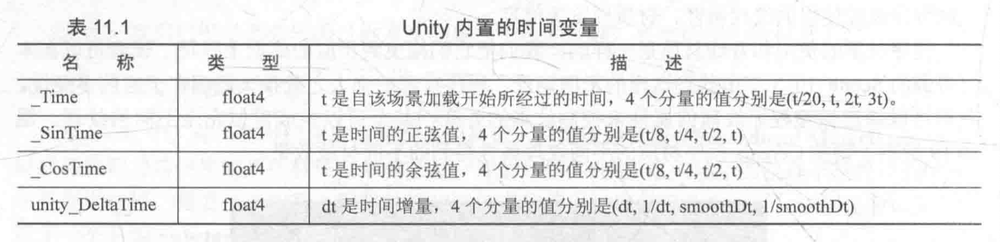
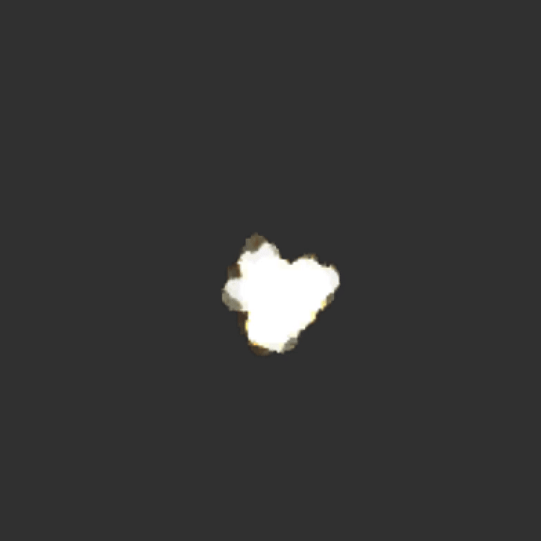
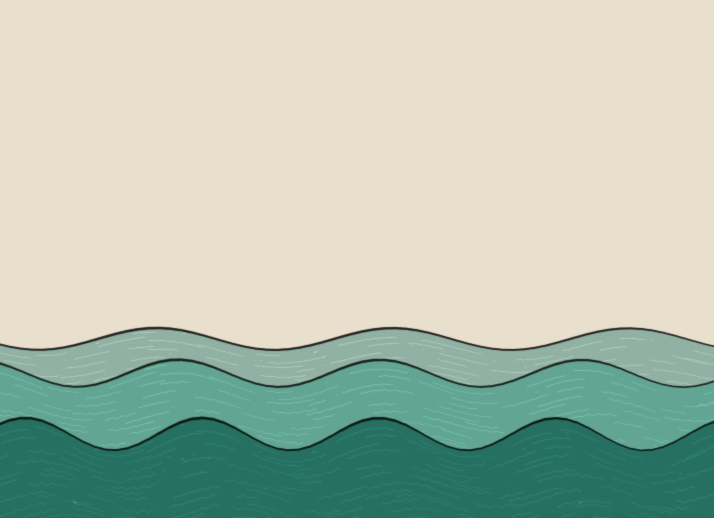
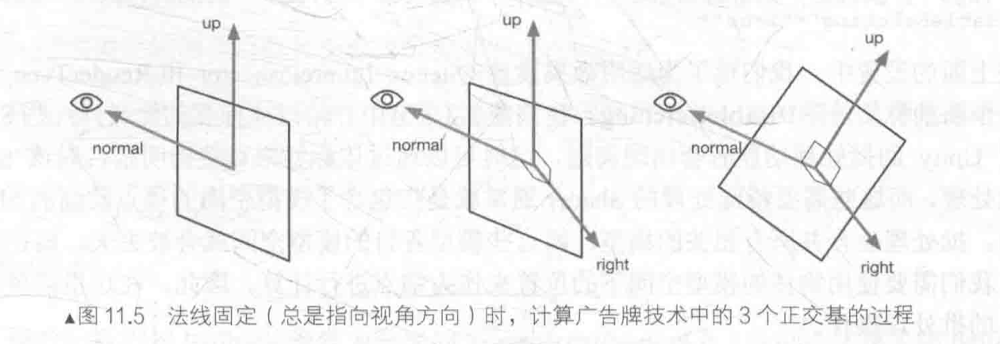
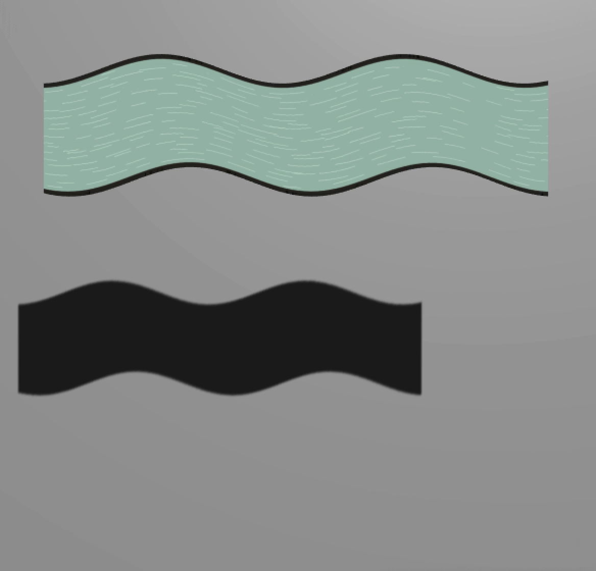

向Unity Shader中引入时间变量，以实现各种动画效果。


# Unity Shader中的内置变量（时间篇）

动画效果往往是**将时间添加到一些变量的计算中**，以便在时间变化时画面也可以随之变化。

Unity Shader提供一系列关于时间的内置变量在Shader中访问**运行时间**，实现各种动画效果。

下表给出这些内置的时间变量。




# 纹理动画

**纹理动画在游戏应用非常广泛**，尤其在各种资源都比较局限的移动平台上，往往会使**用纹理动画来代替复杂的粒子系统**等模拟各种动画效果。

## 序列帧动画

**原理**：像放电影一样，**依次播放一系列关键帧图像**，当播放速度达到一定数值时，看起来就是一个连续的动画。

**优点**：灵活性很强，**不需要进行任何物理计算就可以得到非常细腻的动画效果**。

**缺点**：由于序列帧中**每张关键帧图像都不一样**，因此，要**制作一张出色的序列帧纹理所需要的美术工程量比较大**。

要实现序列帧动画，需要提供一张**包含关键帧图像的图像**。


上述图像包含了8x8张关键帧图像，它们大小相同，播放顺序从左到右，从上到下。

Unity中实现序列帧动画：

1. 新建一个场景，默认情况下场景包含一个摄像机和一个平行光，并且使用了内置的天空盒子，在`Window->Lighting->Skybox`中去掉场景中的天空盒子。
2. 新建一个材质，名为`ImageSequenceAnimationMat`。
3. 新建一个Unity Shader，名为`ImageSequenceAnimation`，把新的Shader赋给第2步的材质。
4. 在场景中创建一个四边形（Quad），调整它的位置使其正面朝向摄像机，把第2步中的材质拖曳给它。

序列帧动画的精髓在于，需要**在每个时刻计算该时刻下应该播放的关键帧的位置**，并对该关键帧进行纹理采样。

打开`ImageSequenceAnimation`，输入以下代码：

```c++
// Upgrade NOTE: replaced 'mul(UNITY_MATRIX_MVP,*)' with 'UnityObjectToClipPos(*)'

Shader "Unity Shaders Book/Chapter 11/Image Sequence Animation" {
	Properties {
		// 声明多个属性,以设置该序列帧动画的相关参数
		_Color ("Color Tint", Color) = (1, 1, 1, 1)
		// _MainTex包含所有关键帧图像的纹理
		_MainTex ("Image Sequence", 2D) = "white" {}
		// _HorizontalAmount该图像在水平方向包含的关键帧图像个数
    	_HorizontalAmount ("Horizontal Amount", Float) = 4
		// _VerticalAmount该图像在竖直方向包含的关键帧图像个数
    	_VerticalAmount ("Vertical Amount", Float) = 4
		// _Speed控制序列帧动画的播放速度
    	_Speed ("Speed", Range(1, 100)) = 30
	}
	SubShader {
		// 由于序列帧图像通常是透明纹理,需要设置Pass的相关状态,以渲染透明效果
		// 序列帧图像通常包含透明通道,因此可以被当成是一个半透明对象
		// 此处使用半透明的"标配"来设置它的SubShader标签
		// "Queue"和"RenderType"都设为"Transparent",把"IgnoreProjector"设为True
		Tags {"Queue"="Transparent" "IgnoreProjector"="True" "RenderType"="Transparent"}
		
		Pass {
			Tags { "LightMode"="ForwardBase" }
			
			// Pass中使用Blend命令开启并设置混合模式,同时关闭深度写入
			ZWrite Off
			Blend SrcAlpha OneMinusSrcAlpha
			
			CGPROGRAM
			
			#pragma vertex vert  
			#pragma fragment frag
			
			#include "UnityCG.cginc"
			
			fixed4 _Color;
			sampler2D _MainTex;
			float4 _MainTex_ST;
			float _HorizontalAmount;
			float _VerticalAmount;
			float _Speed;
			  
			struct a2v {  
			    float4 vertex : POSITION; 
			    float2 texcoord : TEXCOORD0;
			};  
			
			struct v2f {  
			    float4 pos : SV_POSITION;
			    float2 uv : TEXCOORD0;
			};  
			
			// 进行基本的顶点变换,把顶点纹理坐标存储到了v2f结构体里
			v2f vert (a2v v) {  
				v2f o;  
				o.pos = UnityObjectToClipPos(v.vertex);  
				o.uv = TRANSFORM_TEX(v.texcoord, _MainTex);  
				return o;
			}  
			
			fixed4 frag (v2f i) : SV_Target {
				// 要播放帧动画,本质上说需要计算每个时刻播放的关键帧在纹理中的位置
				// 由于序列帧纹理都是按行按列排列,因此这个位置可以认为是该关键帧所在的行列索引数
				// 下面三行计算了行列数,使用Unity内置时间变量_Time.y(自该场景加载后所经过的时间)
				// 把_Time.y和速度属性_Speed相乘后得到模拟的时间,并使用CG的floor函数对结果值取整来得到整数时间time
				float time = floor(_Time.y * _Speed);  
				float row = floor(time / _HorizontalAmount);
				float column = time - row * _HorizontalAmount;
				
//				half2 uv = float2(i.uv.x /_HorizontalAmount, i.uv.y / _VerticalAmount);
//				uv.x += column / _HorizontalAmount;
//				uv.y -= row / _VerticalAmount;
				
				// 使用行列索引值来构建真正的采样坐标
				// 由于序列帧图像包含许多关键帧图像,意为着采样坐标需要映射到每个关键帧图像的坐标范围内
				// 把原纹理坐标i.uv按行数和列数进行等分,得到每个子图像的纹理坐标范围
				// 使用当前的行列数对上面的结果进行偏移,得到当前子图像的纹理坐标
				// 需要注意,对竖直方向的坐标偏移需要使用减法,这是因为在Unity中纹理坐标竖直方向的顺序(从下到上逐渐增大)和序列帧纹理中的顺序(播放顺序从上到下)是相反的
				half2 uv = i.uv + half2(column, -row);
				uv.x /=  _HorizontalAmount;
				uv.y /= _VerticalAmount;
				
				fixed4 c = tex2D(_MainTex, uv);
				c.rgb *= _Color;
				
				return c;
			}
			
			ENDCG
		}  
	}
	// 把Fallback设置为内置的Transparent/VertexLit(也可以选择关闭Fallback)
	FallBack "Transparent/VertexLit"
}
```

保存后返回场景，将`Boom.png`（由于是透明纹理，因此需要勾选该纹理的**Alpha Is Transparency**属性）赋给`ImageSequenceAnimationMat`中的`Image Sequence`属性，并将**Horizontal Amount**和**Vertical Amount**设置为8（因为`Boom.png`包含了8行8列的关键帧图像），完成后单击播放，并调整Speed属性，可以**得到一段连续的爆炸动画**。



## 滚动的背景

很多2D游戏使用不断滚动的背景来**模拟游戏角色在场景中的穿梭**，这些背景往往包含多个层（layers）来模拟一种**视差效果**。（实现往往利用**纹理动画**）

1. 新建一个场景，默认情况下场景包含一个摄像机和一个平行光，并且使用了内置的天空盒子，在`Window->Lighting->Skybox`中去掉场景中的天空盒子，由于需要模拟2D游戏中的滚动背景，因此需要把摄像机的投影模式设置为**正交投影**。
2. 新建一个材质，名为`ScrollingBackgroundMat`。
3. 新建一个Unity Shader，名为`ScrollingBackground`，把新的Shader赋给第2步的材质。
4. 在场景中创建一个四边形（Quad），调整它的位置使其正面朝向摄像机，把第2步中的材质拖曳给它，该四边形用于**显示游戏背景**。

打开`ScrollingBackground`，输入代码：

```c++
// Upgrade NOTE: replaced 'mul(UNITY_MATRIX_MVP,*)' with 'UnityObjectToClipPos(*)'

Shader "Unity Shaders Book/Chapter 11/Scrolling Background" {
	Properties {
		// 第一层(较远)的背景纹理
		_MainTex ("Base Layer (RGB)", 2D) = "white" {}
		// 第二层(较近)的背景纹理
		_DetailTex ("2nd Layer (RGB)", 2D) = "white" {}
		// 两层的水平滚动速度
		_ScrollX ("Base layer Scroll Speed", Float) = 1.0
		_Scroll2X ("2nd layer Scroll Speed", Float) = 1.0
		// 控制纹理的整体亮度
		_Multiplier ("Layer Multiplier", Float) = 1
	}
	SubShader {
		Tags { "RenderType"="Opaque" "Queue"="Geometry"}
		
		Pass { 
			Tags { "LightMode"="ForwardBase" }
			
			CGPROGRAM
			
			#pragma vertex vert
			#pragma fragment frag
			
			#include "UnityCG.cginc"
			
			sampler2D _MainTex;
			sampler2D _DetailTex;
			float4 _MainTex_ST;
			float4 _DetailTex_ST;
			float _ScrollX;
			float _Scroll2X;
			float _Multiplier;
			
			struct a2v {
				float4 vertex : POSITION;
				float4 texcoord : TEXCOORD0;
			};
			
			struct v2f {
				float4 pos : SV_POSITION;
				float4 uv : TEXCOORD0;
			};
			
			v2f vert (a2v v) {
				// 顶点着色器进行最基本的顶点变换
				// 把顶点从模型空间变换到裁剪空间中
				v2f o;
				o.pos = UnityObjectToClipPos(v.vertex);
				
				// 计算两层背景纹理的纹理坐标
				// 首先利用TRANSFORM_TEX得到初始的纹理坐标
				// 利用内置的_Time.y变量在水平方向上对纹理坐标进行偏移,以此达到滚动的效果
				// 把两张纹理的纹理坐标存储在同一个变量o.uv中,以减少占用的插值寄存器空间
				o.uv.xy = TRANSFORM_TEX(v.texcoord, _MainTex) + frac(float2(_ScrollX, 0.0) * _Time.y);
				o.uv.zw = TRANSFORM_TEX(v.texcoord, _DetailTex) + frac(float2(_Scroll2X, 0.0) * _Time.y);
				
				return o;
			}
			
			fixed4 frag (v2f i) : SV_Target {
				// 对两张背景纹理进行采样
				fixed4 firstLayer = tex2D(_MainTex, i.uv.xy);
				fixed4 secondLayer = tex2D(_DetailTex, i.uv.zw);
				
				// 使用第二层纹理的透明通道来混合两张纹理,使用CG的lerp函数
				fixed4 c = lerp(firstLayer, secondLayer, secondLayer.a);
				// 使用_Multiplier参数和输出颜色进行相乘,以调整背景亮度
				c.rgb *= _Multiplier;
				
				return c;
			}
			
			ENDCG
		}
	}
	// 把Fallback设置为内置的VertexLit
	FallBack "VertexLit"
}
```

保存后返回场景，把`Far_Background.png`和`Near_Background.png`分别赋给材质的`Base Layer`和`2nd Layer`属性，并**调整它们的滚动速度**（由于想要在视觉上模拟`Base Layer`比`2nd Layer`更远的效果，因此`Base Layer`的滚动速度要比`2nd Layer`的速度慢一些）。


# 顶点动画

如果**一个游戏中所有的物体都是静止的**，则这样枯燥的世界恐怕很难引起玩家的兴趣。

游戏中通常使用顶点动画来模拟**飘动的旗帜**、**湍流的小溪**等效果。

两种常见的**顶点动画应用**：

1. 流动的河流
2. 广告牌技术

## 流动的河流

**河流的模拟**是顶点动画最常见的应用之一，使用**正弦函数**等来模拟水流的波动效果。

1. 新建一个场景，默认情况下场景包含一个摄像机和一个平行光，并且使用了内置的天空盒子，在`Window->Lighting->Skybox`中去掉场景中的天空盒子，由于需要模拟2D游戏中的滚动背景，因此需要把摄像机的投影模式设置为**正交投影**。
2. 新建一个材质，名为`WaterMat`，由于需要模拟多层水流效果，因此创建`WaterMat1`和`WaterMat2`材质。
3. 新建一个Unity Shader，名为`Water`，把新的Shader赋给第2步的材质。
4. 在场景中创建多个**Water模型**，调整它的位置使其正面朝向摄像机，把第2步中的材质拖曳给它。

打开`Water`，输入以下代码：

```c++
// Upgrade NOTE: replaced 'mul(UNITY_MATRIX_MVP,*)' with 'UnityObjectToClipPos(*)'

Shader "Unity Shaders Book/Chapter 11/Water" {
	Properties {
		// _MainTex河流纹理
		_MainTex ("Main Tex", 2D) = "white" {}
		// _Color控制整体颜色
		_Color ("Color Tint", Color) = (1, 1, 1, 1)
		// _Magnitude控制水流波动的幅度
		_Magnitude ("Distortion Magnitude", Float) = 1
		// _Frequency控制波动频率
 		_Frequency ("Distortion Frequency", Float) = 1
		// _InvWaveLength控制波长的倒数
 		_InvWaveLength ("Distortion Inverse Wave Length", Float) = 10
		// _Speed控制河流纹理的移动速度
 		_Speed ("Speed", Float) = 0.5
	}
	SubShader {
		// Need to disable batching because of the vertex animation
		// 设置"DisableBatching",一些SubShader在使用Unity的批处理功能时会出现问题
		// 此时可以通过该标签来直接指明是否对该SubShader使用批处理
		// 这些需要特殊处理Shader通常就是指包含了模型空间的顶点动画的Shader
		// 因为批处理会合并所有相关的模型,而这些模型各自的模型空间就会丢失
		// 这里需要在物体的模型空间下对顶点位置进行偏移,因此在这里需要取消对该Shader的批处理操作
		Tags {"Queue"="Transparent" "IgnoreProjector"="True" "RenderType"="Transparent" "DisableBatching"="True"}
		
		Pass {
			// 设置Pass的渲染状态
			Tags { "LightMode"="ForwardBase" }
			
			// 关闭深度写入,开启并设置混合模式,关闭剔除功能
			// 为了让水流的每个面都能显示
			ZWrite Off
			Blend SrcAlpha OneMinusSrcAlpha
			Cull Off
			
			CGPROGRAM  
			#pragma vertex vert 
			#pragma fragment frag
			
			#include "UnityCG.cginc" 
			
			sampler2D _MainTex;
			float4 _MainTex_ST;
			fixed4 _Color;
			float _Magnitude;
			float _Frequency;
			float _InvWaveLength;
			float _Speed;
			
			struct a2v {
				float4 vertex : POSITION;
				float4 texcoord : TEXCOORD0;
			};
			
			struct v2f {
				float4 pos : SV_POSITION;
				float2 uv : TEXCOORD0;
			};
			
			// 顶点着色器中进行相关的顶点动画
			v2f vert(a2v v) {
				v2f o;
				
				// 计算顶点位移量
				float4 offset;
				// 只希望对顶点的x方向进行位移,因此yzw的位移量被设置为0
				offset.yzw = float3(0.0, 0.0, 0.0);
				// 利用_Frequency属性和内置的_Time.y变量来控制正弦函数的频率
				// 为了让不同位置具有不同的位移,对上述结果加上模型空间下的位置分量,并乘以_InvWaveLength来控制波长
				// 最后对结果值乘以_Magnitude属性来控制波动幅度,得到最终的位移
				offset.x = sin(_Frequency * _Time.y + v.vertex.x * _InvWaveLength + v.vertex.y * _InvWaveLength + v.vertex.z * _InvWaveLength) * _Magnitude;
				o.pos = UnityObjectToClipPos(v.vertex + offset);
				
				// 把位移量添加到顶点位置上,再进行正常的顶点变换即可
				o.uv = TRANSFORM_TEX(v.texcoord, _MainTex);
				// 进行纹理动画,使用_Time.y和_Speed来控制在水平方向上的纹理动画
				o.uv +=  float2(0.0, _Time.y * _Speed);
				
				return o;
			}
			
			fixed4 frag(v2f i) : SV_Target {
				// 对纹理采样再添加颜色控制
				fixed4 c = tex2D(_MainTex, i.uv);
				c.rgb *= _Color.rgb;
				
				return c;
			} 
			
			ENDCG
		}
	}
	// 把Fallback设置为内置的Transparent/VertexLit
	FallBack "Transparent/VertexLit"
}
```

保存后返回场景，把`Water.psd`拖曳到材质的**Main Tex属性**上，并调整相关参数。

为了让河流更加美观，可以**复制多个材质并使用不同的参数**，再**赋给不同的Water模型**，得到如下效果。



## 广告牌

**广告牌技术（Billboarding）**根据视角方向来旋转一个被纹理着色的多边形（通常为简单的四边形，这个**多边形就是广告牌**），使得**多边形看起来好像总是面对着摄像机**。

广告牌技术被用于很多应用，例如**渲染烟雾、云朵、闪光效果**等。

**本质**：构建**旋转矩阵**。一个变换矩阵需要**3个基向量**。

**广告牌技术**使用的基向量通常就是**表面法线（normal）**、**指向上的方向（up）**以及**指向右的方向（right）**。

除此之外，还需要指定一个**锚点（anchor location）**：该锚点在**旋转过程中是固定不变的**，以此来**确定多边形在空间中的位置**。

广告牌技术的难点在于，如何根据需求**构建3个相互正交的基向量**。

首先通过初始计算得到目标的**表面法线**（例如视角方向）和**指向上的方向**，两者往往是**不垂直的**。

但是两者其中之一是**固定的**，例如：

- 当模拟草丛时，希望广告牌的指向上的方向永远是`(0,1,0)`，而法线方向应该随视角变化；
- 当模拟粒子效果时，希望**广告牌的法线方向是固定的**，即**总是指向视角方向**，指向上的方向则可以发生变化。

假设**法线方向是固定的**，首先**根据初始的表面法线和指向上的方向**来计算出目标方向的指向右的方向（通过叉积操作）：$right=up\times normal$。

对其归一化后，**再由法线方向和指向右的方向计算出正交的指向上的方向**即可：$up'=normal\times right$

至此可以得到用于旋转的**3个正交基**，计算过程如下（如果指向上的方向是固定的，**计算过程类似**）：



1. 新建一个场景，默认情况下场景包含一个摄像机和一个平行光，并且使用了内置的天空盒子，在`Window->Lighting->Skybox`中去掉场景中的天空盒子。
2. 新建一个材质，名为`BillboardMat`。
3. 新建一个Unity Shader，名为`Billboard`，把新的Shader赋给第2步的材质。
4. 在场景中创建多个**四边形（Quad）**，调整它的位置使其正面朝向摄像机，把第2步中的材质拖曳给它。这些四边形就是用于广告牌技术的广告牌。

打开`Billboard`，输入以下代码：

```c++
// Upgrade NOTE: replaced '_World2Object' with 'unity_WorldToObject'
// Upgrade NOTE: replaced 'mul(UNITY_MATRIX_MVP,*)' with 'UnityObjectToClipPos(*)'

Shader "Unity Shaders Book/Chapter 11/Billboard" {
	Properties {
		// _MainTex广告牌显示的透明纹理
		_MainTex ("Main Tex", 2D) = "white" {}
		// _Color控制显示整体颜色
		_Color ("Color Tint", Color) = (1, 1, 1, 1)
		// _VerticalBillboarding调整是固定法线还是固定指向上的方向,即约束垂直方向的程度
		_VerticalBillboarding ("Vertical Restraints", Range(0, 1)) = 1 
	}
	SubShader {
		// Need to disable batching because of the vertex animation
		// 广告牌技术中,需要使用物体的模型空间下的位置作为锚点进行计算
		// 因此在这里取消对该Shader的批处理操作
		Tags {"Queue"="Transparent" "IgnoreProjector"="True" "RenderType"="Transparent" "DisableBatching"="True"}
		
		Pass { 
			Tags { "LightMode"="ForwardBase" }
			
			// 关闭深度写入,开启并设置混合模式,关闭剔除功能
			// 让广告牌的每个面都能显示
			ZWrite Off
			Blend SrcAlpha OneMinusSrcAlpha
			Cull Off
		
			CGPROGRAM
			
			#pragma vertex vert
			#pragma fragment frag
			
			#include "Lighting.cginc"
			
			sampler2D _MainTex;
			float4 _MainTex_ST;
			fixed4 _Color;
			fixed _VerticalBillboarding;
			
			struct a2v {
				float4 vertex : POSITION;
				float4 texcoord : TEXCOORD0;
			};
			
			struct v2f {
				float4 pos : SV_POSITION;
				float2 uv : TEXCOORD0;
			};
			
			// 顶点着色器是核心,所有的计算都是在模型空间下进行的
			v2f vert (a2v v) {
				v2f o;
				
				// Suppose the center in object space is fixed
				// 使用模型空间的原点作为广告牌的锚点,利用内置变量获取模型空间下的视角位置
				float3 center = float3(0, 0, 0);
				float3 viewer = mul(unity_WorldToObject,float4(_WorldSpaceCameraPos, 1));
				
				// 计算三个正交矢量
				// 根据观察位置和锚点计算目标法线方向
				float3 normalDir = viewer - center;
				// If _VerticalBillboarding equals 1, we use the desired view dir as the normal dir
				// Which means the normal dir is fixed
				// Or if _VerticalBillboarding equals 0, the y of normal is 0
				// Which means the up dir is fixed
				// 根据_VerticalBillboarding属性来控制垂直方向上的约束度
				// 当_VerticalBillboarding为1时,意味着法线方向固定为视角方向
				// 当_VerticalBillboarding为0时,意味着向上方向固定为(0,1,0)
				normalDir.y =normalDir.y * _VerticalBillboarding;
				// 对计算得到的法线方向进行归一化操作来得到单位向量
				normalDir = normalize(normalDir);
				// Get the approximate up dir
				// If normal dir is already towards up, then the up dir is towards front
				// 得到粗略的向上方向,为了防止法线方向和向上方向平行(如果平行叉积得到的结果将是错误的)
				// 对法线方向的y分量进行判断,以得到合适的向上方向
				float3 upDir = abs(normalDir.y) > 0.999 ? float3(0, 0, 1) : float3(0, 1, 0);
				// 根据法线方向和粗略的向上方向得到向右方向,并对结果进行归一化
				float3 rightDir = normalize(cross(upDir, normalDir));
				// 由于此时向上的方向还是不准确的,需要根据准确的法线方向和向右方向得到最后的向上方向
				upDir = normalize(cross(normalDir, rightDir));
				
				// Use the three vectors to rotate the quad
				// 得到所需的3个正交基矢量,根据原始位置相对于锚点的偏移量以及3个正交基矢量,以计算得到新的顶点位置
				float3 centerOffs = v.vertex.xyz - center;
				float3 localPos = center + rightDir * centerOffs.x + upDir * centerOffs.y + normalDir * centerOffs.z;
              
			  	// 把模型空间的顶点位置变换到裁剪空间中
				o.pos = UnityObjectToClipPos(float4(localPos, 1));
				o.uv = TRANSFORM_TEX(v.texcoord,_MainTex);

				return o;
			}
			
			fixed4 frag (v2f i) : SV_Target {
				// 对纹理进行采样,再与颜色值相乘即可
				fixed4 c = tex2D (_MainTex, i.uv);
				c.rgb *= _Color.rgb;
				
				return c;
			}
			
			ENDCG
		}
	} 
	// 把Fallback设置为内置的Transparent/VertexLit
	FallBack "Transparent/VertexLit"
}
```

上面的例子中，使用的是Unity自带的**四边形（Quad）**而不是自带的**平面（Plane）**，这是因为代码是**建立在一个竖直摆放的多边形的基础上的**，即**多边形的顶点结构需要满足在模型空间下是竖直排列的**。

只有这样，才能用`v.vertex`来计算得到**正确的相对于重心的位置偏移**。

保存后返回场景，将`star.png`拖曳到材质的**Main Tex**中，即可得到下图结果。


## 注意事项

如果**在模型空间下进行了一些顶点动画**，则批处理往往就会破坏这种动画效果。

此时可以通过**SubShader的DisableBatching**标签来**强制取消对该Unity Shader**的批处理。然而取消批处理会带来一定的性能下降，增加了**Draw Call**，尽量避免使用模型空间下的一些**绝对位置和方向**来进行计算。

> **广告牌例子**中，为了**避免显式使用模型空间的中心来作为锚点**，可以利用顶点颜色来存储每个顶点到锚点的距离值，这种做法在商业游戏中很常见。

如果想要**对包含顶点动画的物体添加阴影**，如果仍然**使用内置的Diffuse等**包含的阴影Pass来渲染，就得不到正确的阴影效果（**无法向其他物体正确地投射阴影**）。

因为**Unity的阴影绘制**需要调用一个**ShadowCaster Pass**，而如果直接使用这些**内置的ShadowCaster Pass**，这个Pass中并**没有进行相关的顶点动画**，因此Unity会仍然按照原来的顶点位置来计算阴影。此时需要提供一个**自定义的ShadowCaster Pass**，在这个Pass中，进行同样的顶点变换过程。

**注意**：前面的实现中，如果涉及半透明物体则**把Fallback设置成Transparent/VertexLit**，而**Transparent/VertexLit**中并没有定义**ShadowCaster Pass**，因此也就不会产生阴影。

下面的例子与河流场景类似，模拟一个波动的水流，同时开启了场景中**平行光的阴影效果**，并添加一个平面接收来自“水流”的阴影。此处**把Fallback设置为内置的VertexLit**，这样Unity将**根据Fallback最终找到VertexLit**中的ShadowCaster Pass来渲染阴影。



为了**正确绘制变形对象的阴影**，需要**提供自定义的ShadowCaster Pass**。代码如下：

```c++
// Upgrade NOTE: replaced 'mul(UNITY_MATRIX_MVP,*)' with 'UnityObjectToClipPos(*)'

Shader "Unity Shaders Book/Chapter 11/Vertex Animation With Shadow" {
	Properties {
		_MainTex ("Main Tex", 2D) = "white" {}
		_Color ("Color Tint", Color) = (1, 1, 1, 1)
		_Magnitude ("Distortion Magnitude", Float) = 1
 		_Frequency ("Distortion Frequency", Float) = 1
 		_InvWaveLength ("Distortion Inverse Wave Length", Float) = 10
 		_Speed ("Speed", Float) = 0.5
	}
	SubShader {
		// Need to disable batching because of the vertex animation
		Tags {"DisableBatching"="True"}
		
		Pass {
			Tags { "LightMode"="ForwardBase" }
			
			Cull Off
			
			CGPROGRAM  
			#pragma vertex vert 
			#pragma fragment frag
			
			#include "UnityCG.cginc" 
			
			sampler2D _MainTex;
			float4 _MainTex_ST;
			fixed4 _Color;
			float _Magnitude;
			float _Frequency;
			float _InvWaveLength;
			float _Speed;
			
			struct a2v {
			    float4 vertex : POSITION;
			    float4 texcoord : TEXCOORD0;
			};
			
			struct v2f {
			    float4 pos : SV_POSITION;
			    float2 uv : TEXCOORD0;
			};
			
			v2f vert(a2v v) {
				v2f o;
				
				float4 offset;
				offset.yzw = float3(0.0, 0.0, 0.0);
				offset.x = sin(_Frequency * _Time.y + v.vertex.x * _InvWaveLength + v.vertex.y * _InvWaveLength + v.vertex.z * _InvWaveLength) * _Magnitude;
				o.pos = UnityObjectToClipPos(v.vertex + offset);
				
				o.uv = TRANSFORM_TEX(v.texcoord, _MainTex);
				o.uv +=  float2(0.0, _Time.y * _Speed);
				
				return o;
			}
			
			fixed4 frag(v2f i) : SV_Target {
				fixed4 c = tex2D(_MainTex, i.uv);
				c.rgb *= _Color.rgb;
				
				return c;
			} 
			
			ENDCG
		}
		
		// Pass to render object as a shadow caster
		Pass {
			Tags { "LightMode" = "ShadowCaster" }
			
			CGPROGRAM
			
			#pragma vertex vert
			#pragma fragment frag
			
			#pragma multi_compile_shadowcaster
			
			#include "UnityCG.cginc"
			
			float _Magnitude;
			float _Frequency;
			float _InvWaveLength;
			float _Speed;
			
			struct v2f { 
          // 使用V2F_SHADOW_CASTER定义阴影投射需要定义的变量
			    V2F_SHADOW_CASTER;
			};
			
			v2f vert(appdata_base v) {
				v2f o;
				
        // 按之前对顶点的处理方法计算顶点的偏移量
				float4 offset;
				offset.yzw = float3(0.0, 0.0, 0.0);
				offset.x = sin(_Frequency * _Time.y + v.vertex.x * _InvWaveLength + v.vertex.y * _InvWaveLength + v.vertex.z * _InvWaveLength) * _Magnitude;
        // 直接把顶点的偏移量加到顶点位置变量中
				v.vertex = v.vertex + offset;
        
        // 使用TRANSFER_SHADOW_CASTER_NORMALOFFSET让Unity完成剩下的事情
				TRANSFER_SHADOW_CASTER_NORMALOFFSET(o)
				
				return o;
			}
			
			fixed4 frag(v2f i) : SV_Target {
          // 使用SHADOW_CASTER_FRAGMENT让Unity自动完成阴影投射部分
          // 把结果输出到深度图和阴影映射纹理中
			    SHADOW_CASTER_FRAGMENT(i)
			}
			ENDCG
		}
	}
	FallBack "VertexLit"
}
```

阴影投射的重点在于需要**按正常Pass的处理来剔除片元或进行顶点动画**，以便阴影可以和物体正常渲染的结果相匹配。

自定义的阴影投射Pass中，通常使用Unity提供的内置宏`V2F_SHADOW_CASTER`、`TRANSFER_SHADOW_CASTER_NORMALOFFSET`和`SHADOW_CASTER_FRAGMENT`来计算阴影投射时需要的各种变量，而我们**仅仅只需关注自定义计算的部分**。

通过Unity 的这3个内置宏（`UnityCG.cginc`文件中被定义），可以方便地**自定义需要的阴影投射的Pass**，但由于**这些宏里需要使用一些特定的输入变量**，因此需要保证为它们提供这些变量。

例如，`TRANSFER_SHADOW_CASTER_NORMALOFFSET`会使用名称`v`作为输入结构体，`v`中需要包含顶点位置`v.vertex`和顶点法线`v.normal`的信息，可以直接使用内置的`appdata_base`结构体，它包含了这些必要的顶点变量。

如果需要进行顶点动画，可以在顶点着色器中直接修改`v.vertex`，再传递给`TRANSFER_SHADOW_CASTER_NORMALOFFSET`即可。


