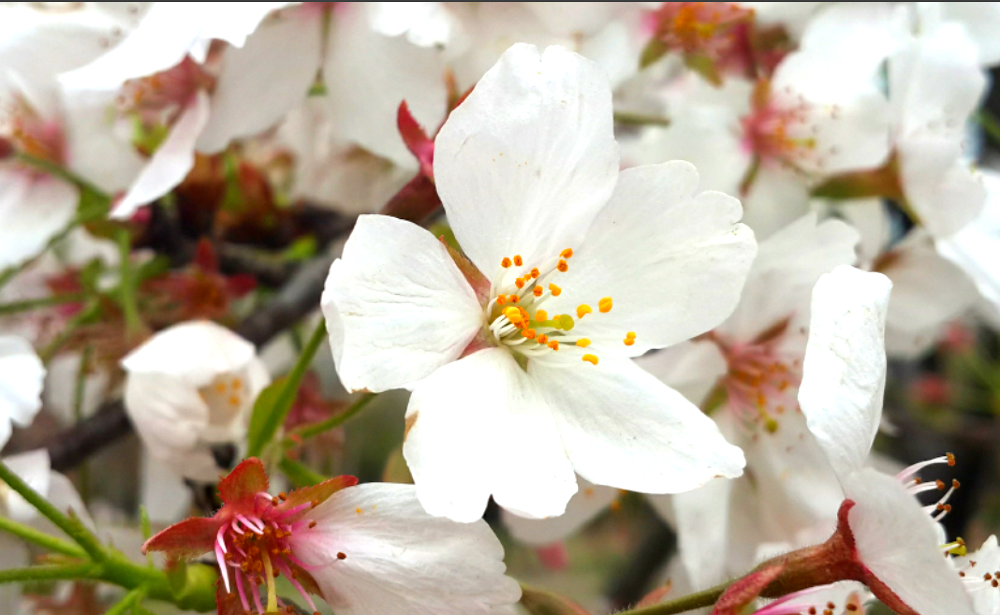
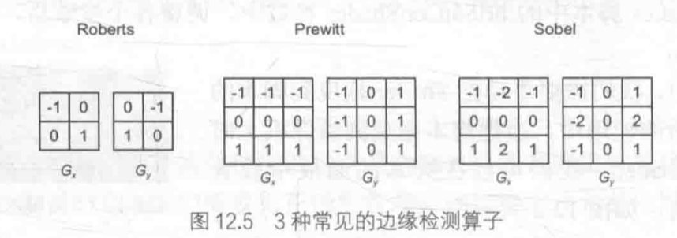
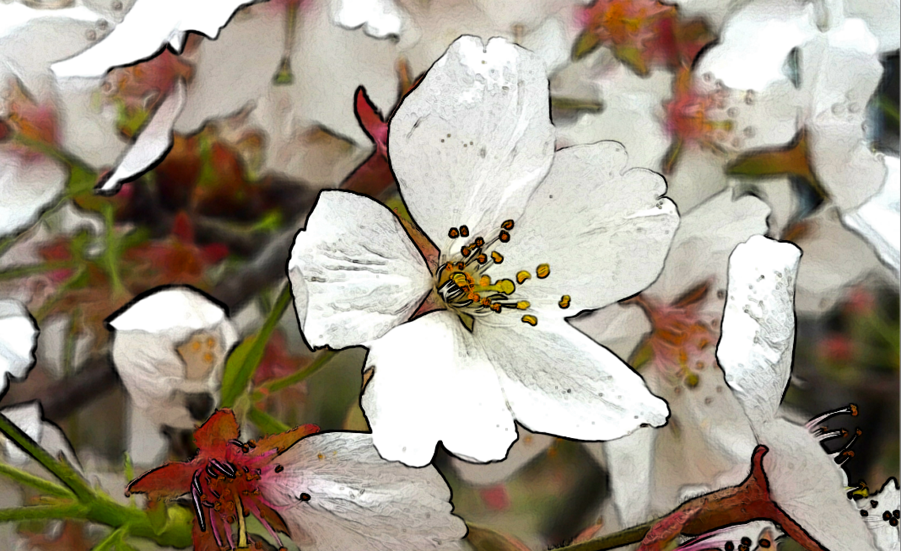
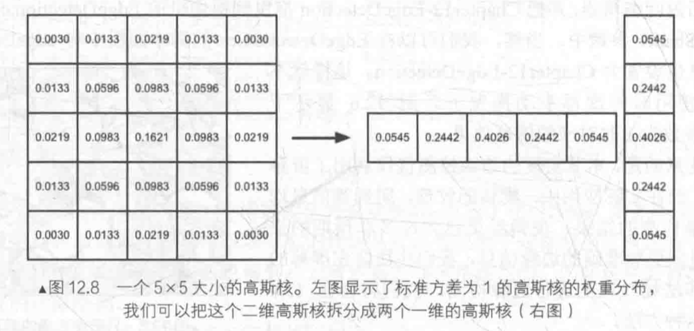

**屏幕后处理效果（Screen Post-processing Effects）**是游戏中实现屏幕特效的常见方法。

# 建立一个基本的屏幕后处理脚本系统

屏幕后处理，指在渲染完整个场景得到的屏幕图像后，再**对这个图像进行一系列操作，实现各种屏幕特效**。

这种技术，可以**为游戏画面添加更多的艺术效果**，例如：**景深（Depth of Field）**、**运动模糊（Motion Blur）**等。

**实现屏幕后处理的基础在于得到渲染后的屏幕图像**，即抓取屏幕，Unity提供这样一个方便的接口——`OnRenderImage`函数，声明如下：

```c#
MonoBehaviour.OnRenderImage (RenderTexture src, RenderTexture dest)
```

脚本中**声明此函数后**，Unity会**把当前渲染得到的图像存储在第一个对应的源渲染纹理**中，通过函数中的**一系列操作后**，再把目标渲染纹理，即**第二个参数对应的渲染纹理显示到屏幕上**。

`OnRenderImage`函数中，通常利用`Graphics.Blit`函数来**完成对渲染纹理的处理**。它有三种函数声明：

```c#
public static void Blit(Texture src, REnderTexture dest);
public static void Blit(Texture src, REnderTexture dest, Material mat, int pass = -1);
public static void Blit(Texture src, Material mat, int pass = -1);
```

其中：

- 参数`src`对应了源纹理，在**屏幕后处理技术中**，这个参数通常就是**当前屏幕的渲染纹理**或是**上一步处理后得到的渲染纹理**。
- 参数`dest`是目标纹理，如果它的值为null就**会直接将结果显示在屏幕上**。
- 参数`mat`是使用的材质，这个材质**使用的Unity Shader将会进行各种屏幕后处理操作**，而`src`纹理将会被传递给Shader中名为`_MainTex` 的纹理属性。
- 参数`Pass`默认值为**-1**，表示将会**依次调用Shader内的所有Pass**。否则只会**调用给定索引的Pass**。

默认情况下，`OnRenderImage`函数会**在所有的不透明和透明的Pass执行完毕后被调用**，以便对场景中所有游戏对象都产生影响。有时，希望在不透明的Pass（即渲染队列小于等于2500Pass，内置的Background、Geometry和Alpha Test渲染队列均在此范围内）执行完毕后立即调用`OnRenderImage`函数，从而不对透明物体产生任何影响。（可以在`OnRenderImage`函数前添加`ImageEffectOpaque`属性来实现这种目的）

**Unity实现屏幕屏幕后处理效果**，过程通常如下：首先在摄像机中**添加一个用于屏幕后处理的脚本**，该脚本中，实现`OnRenderImage`函数来获取当前屏幕的渲染纹理。之后，调用`Graphics.Blit`函数使用特定的Unity Shader来**对当前图像进行处理，再把返回的渲染纹理显示到屏幕上**。对于一些复杂的屏幕特效，需要多次调用`Graphics.Blit`函数来对上一步的输出结果进行下一步处理。

**注意：**进行**屏幕后处理之前**，需要检查一系列条件是否满足，例如**当前平台是否支持渲染纹理和屏幕特效**，是否**支持当前使用的Unity Shader等**。为此，创建一个**用于屏幕后处理效果的基类**，在实现各种屏幕特效时，只需要**继承自该基类**，再实现派生类中不同的操作即可。

`PostEffectsBase.cs`的主要代码如下：

```c#
using UnityEngine;
using System.Collections;

// 所有屏幕后处理效果都需要绑定在某个摄像机上,并且希望在编辑器状态下也可以执行该脚本来查看效果
[ExecuteInEditMode]
[RequireComponent (typeof(Camera))]
public class PostEffectsBase : MonoBehaviour {

	// Called when start
	// 提前检查各种资源和条件是否满足,在Start函数中调用CheckResource函数
	protected void CheckResources() {
		bool isSupported = CheckSupport();
		
		if (isSupported == false) {
			NotSupported();
		}
	}

	// Called in CheckResources to check support on this platform
	protected bool CheckSupport() {
		if (SystemInfo.supportsImageEffects == false || SystemInfo.supportsRenderTextures == false) {
			Debug.LogWarning("This platform does not support image effects or render textures.");
			return false;
		}
		
		return true;
	}

	// Called when the platform doesn't support this effect
	protected void NotSupported() {
		enabled = false;
	}
	
	// 一些屏幕特效可能需要更多的设置,例如设置一些默认值等,可以重载Start/CheckResources或CheckSupport函数
	protected void Start() {
		CheckResources();
	}

	// Called when need to create the material used by this effect
	// 每个屏幕后处理效果通常都需要指定一个Shader来创建一个用于处理渲染纹理的材质
	// 因此基类中也提供了这样的方法
  // CheckShaderAndCreateMaterial函数接受两个参数，第一个参数指定该特效需要使用的Shader
  // 第二个参数则是用于后期处理的材质
  // 该函数首先检查Shader的可用性，检查过后返回一个使用该Shader的材质，否则返回null
	protected Material CheckShaderAndCreateMaterial(Shader shader, Material material) {
		if (shader == null) {
			return null;
		}
		
		if (shader.isSupported && material && material.shader == shader)
			return material;
		
		if (!shader.isSupported) {
			return null;
		}
		else {
			material = new Material(shader);
			material.hideFlags = HideFlags.DontSave;
			if (material)
				return material;
			else 
				return null;
		}
	}
}
```


# 调整屏幕的亮度、饱和度和对比度

屏幕特效——调整屏幕的亮度、饱和度和对比度。

1. 新建一个场景，默认情况下场景将包含一个摄像机和一个平行光，并且使用内置的天空盒子。在`Window->Lighting->Skybox`中去掉场景中的天空盒子。
2. 将`Sakura0.jpg`（纹理类型已经设置为**Sprite**）拖曳到场景中，并调整其位置使其可以填充整个场景。
3. 新建一个脚本`BrightnessSaturationAndContrast.cs`，把该脚本拖曳到摄像机上。
4. 新建一个Unity Shader`BrightnessSaturationAndContrast`。

首先编写`BrightnessSaturationAndContrast.cs`脚本：

```c#
using UnityEngine;
using System.Collections;

// 继承之前创建的基类
public class BrightnessSaturationAndContrast : PostEffectsBase {

	// 声明该效果需要的Shader,并据此创建相应的材质
	// briSatConShader是指定的Shader
	public Shader briSatConShader;
	// briSatConMaterial是创建的材质
	private Material briSatConMaterial;
	// 提供名为material的材质访问它
	public Material material {  
		// get函数调用基类的CheckShaderAndCreateMaterial函数来得到对应的材质
		get {
			briSatConMaterial = CheckShaderAndCreateMaterial(briSatConShader, briSatConMaterial);
			return briSatConMaterial;
		}  
	}

	// 亮度/饱和度/对比度的参数
	// Unity提供的Range属性为每个参数提供了合适的变化区间
	[Range(0.0f, 3.0f)]
	public float brightness = 1.0f;

	[Range(0.0f, 3.0f)]
	public float saturation = 1.0f;

	[Range(0.0f, 3.0f)]
	public float contrast = 1.0f;

	// 定义OnRenderImage函数进行真正的特效处理
	void OnRenderImage(RenderTexture src, RenderTexture dest) {
		// 每当OnRenderImage函数被调用时,它会检查材质是否可用
		if (material != null) {
			// 如果可用,就把参数传递给材质
			material.SetFloat("_Brightness", brightness);
			material.SetFloat("_Saturation", saturation);
			material.SetFloat("_Contrast", contrast);
			// 在调用Graphics.Blit进行处理
			Graphics.Blit(src, dest, material);
		} else {
			// 否则,直接把原图像显示到屏幕上,不做任何处理
			Graphics.Blit(src, dest);
		}
	}
}
```

实现`BrightnessSaturationAndContrast`：

```c++
// Upgrade NOTE: replaced 'mul(UNITY_MATRIX_MVP,*)' with 'UnityObjectToClipPos(*)'

Shader "Unity Shaders Book/Chapter 12/Brightness Saturation And Contrast" {
	Properties {
		// 声明本例使用的各个属性
		// 事实上,可以省略Properties中的属性声明,其声明的属性仅仅是为了显示在材质面板中
		// 但对于屏幕特效来说,使用的材质都是临时创建的,也不需要在材质面板上临时调整,而是直接从脚本传递给Shader
		// Graphics.Blit把第一个参数传递给Shader中名为_MainTex的纹理属性
		_MainTex ("Base (RGB)", 2D) = "white" {}
		// 除此以外,还声明用于调整亮度,饱和度和对比度的属性
		// 这些值由脚本传递而得
		_Brightness ("Brightness", Float) = 1
		_Saturation("Saturation", Float) = 1
		_Contrast("Contrast", Float) = 1
	}
	SubShader {
		// 定义用于屏幕后处理的Pass
		// 屏幕后处理实际上是在场景中绘制了一个与屏幕同宽同高的四边形面片
		// 为了防止其对其他物体产生影响,需要设置相关的渲染状态
		Pass {  
			// 此处关闭深度写入,为了防止其挡住在其后面被渲染的物体
			// 例如,当前的OnRenderImage函数在所有不透明的Pass执行完毕后立即被调用
			// 不关闭深度写入就会影响后面透明的Pass的渲染
			// 这些状态设置可以认为是用于屏幕后处理的Shader的标配
			ZTest Always Cull Off ZWrite Off
			
			CGPROGRAM  
			#pragma vertex vert  
			#pragma fragment frag  
			  
			#include "UnityCG.cginc"  
			  
			// 为了在代码中访问各个属性,需要在CG代码中声明对应的变量
			sampler2D _MainTex;  
			half _Brightness;
			half _Saturation;
			half _Contrast;
			  
			struct v2f {
				float4 pos : SV_POSITION;
				half2 uv: TEXCOORD0;
			};
			
			//定义顶点着色器
			// 使用Unity内置的appdate_img结构体作为顶点着色器的输入
			// 它只包含图像处理时必须的顶点坐标和纹理坐标变量
			v2f vert(appdata_img v) {
				v2f o;
				
				o.pos = UnityObjectToClipPos(v.vertex);
				
				// 把正确的纹理坐标传递给片元着色器
				// 以便对屏幕图像进行正确的采样
				o.uv = v.texcoord;
						 
				return o;
			}

			// 实现用于调整亮度,饱和度和对比度的片元着色器
			fixed4 frag(v2f i) : SV_Target {
				// 得到对原屏幕图像的采样结果renderTex
				fixed4 renderTex = tex2D(_MainTex, i.uv);  
				  
				// Apply brightness
				// 利用_Brightness属性来调整亮度
				fixed3 finalColor = renderTex.rgb * _Brightness;
				
				// Apply saturation
				// 计算该像素对应的亮度值,通过每个颜色分量乘以一个特定的系数再相加得到
				fixed luminance = 0.2125 * renderTex.r + 0.7154 * renderTex.g + 0.0721 * renderTex.b;
				// 使用该亮度值创建一个饱和度为0的颜色值
				fixed3 luminanceColor = fixed3(luminance, luminance, luminance);
				// 使用_Saturation属性在其和上一步得到的颜色之间进行插值,从而得到希望的饱和度颜色,对比度的处理类似
				finalColor = lerp(luminanceColor, finalColor, _Saturation);
				
				// Apply contrast
				// 创建一个对比度为0的颜色值(各分量均为0.5)
				fixed3 avgColor = fixed3(0.5, 0.5, 0.5);
				// 再用_Contrast属性在其和上一步得到的颜色之间进行插值,从而得到最终的结果
				finalColor = lerp(avgColor, finalColor, _Contrast);
				
				return fixed4(finalColor, renderTex.a);  
			}  
			  
			ENDCG
		}  
	}
	// 关闭该Unity Shader的Fallback
	Fallback Off
}
```

完成后返回编辑器，并把`BrightnessSaturationAndContrast`拖曳到摄像机的`BrightnessSaturationAndContrast.cs`脚本中的`briSatConShader`参数中。调整各个参数后，可以得到如下图的结果：




# 边缘检测

**边缘检测**是一种描边的实现方法，原理是使用一些**边缘检测算子**对图像进行**卷积（convolution）操作**。

## 常见的边缘检测算子

卷积的操作在于**选择卷积核**。

>边是如何形成的？
>
>如果相邻像素之间存在**差别明显**的颜色、亮度、纹理等属性，就会认为它们之间应该有一条边界。
>
>这种相邻像素之间的差值可以用**梯度（gradient）**表示，边缘处的梯度绝对值会比较大。

基于此，几种不同的**边缘检测算子**被先后提出来，它们都包含**两个方向的卷积核**，分别用于检测**水平方向和竖直方向**上的边缘信息。



**在进行边缘检测时**，需要对每个像素分别进行一次卷积计算，得到两个方向上的梯度值$G_x$和$G_y$，而整体的梯度可按下面的公式计算：$G=\sqrt{G_x^2+G_y^2}$，出于性能的考虑，会采用绝对值来操作：$G=|G_x|+|G_y|$

当得到梯度$G$之后， 可以据此判断哪些像素对应了**边缘**（梯度值越大，越有可能是边缘点）

## 实现

使用Sobel算子进行边缘检测，实现描边效果。

1. 新建一个场景，默认情况下场景将包含一个摄像机和一个平行光，并且使用内置的天空盒子。在`Window->Lighting->Skybox`中去掉场景中的天空盒子。
2. 将`Sakura0.jpg`（纹理类型已经设置为**Sprite**）拖曳到场景中，并调整其位置使其可以填充整个场景。
3. 新建一个脚本`EdgeDetection.cs`，把该脚本拖曳到摄像机上。
4. 新建一个Unity Shader`EdgeDetection`。

首先编写`EdgeDetection.cs`脚本：

```c#
using UnityEngine;
using System.Collections;

// 基础屏幕后处理的基类
public class EdgeDetection : PostEffectsBase {

	// 声明该效果需要的Shader,并据此创建相应的材质
	public Shader edgeDetectShader;
	private Material edgeDetectMaterial = null;
	public Material material {  
		get {
			edgeDetectMaterial = CheckShaderAndCreateMaterial(edgeDetectShader, edgeDetectMaterial);
			return edgeDetectMaterial;
		}  
	}

	// 调整边缘线强度,描边颜色以及背景颜色的参数
	// 当edgesOnly值为0时,边缘将会叠加在原渲染图像上
	// 当edgesOnly值为1时,则会只显示边缘,不显示原渲染图像
	[Range(0.0f, 1.0f)]
	public float edgesOnly = 0.0f;
	// 边缘颜色由edgeColor指定
	public Color edgeColor = Color.black;
	// 背景颜色由backgroundColor指定
	public Color backgroundColor = Color.white;

	// 定义OnRenderImage进行真正的特效处理
	void OnRenderImage (RenderTexture src, RenderTexture dest) {
		if (material != null) {
			// 如果材质可用,就把参数传递给材质
			material.SetFloat("_EdgeOnly", edgesOnly);
			material.SetColor("_EdgeColor", edgeColor);
			material.SetColor("_BackgroundColor", backgroundColor);

			// 再调用Graphics.Blit进行处理
			Graphics.Blit(src, dest, material);
		} else {
			// 否则直接把原图像显示在屏幕上,不作任何处理
			Graphics.Blit(src, dest);
		}
	}
}
```

实现`EdgeDetection`：

```c++
// Upgrade NOTE: replaced 'mul(UNITY_MATRIX_MVP,*)' with 'UnityObjectToClipPos(*)'

Shader "Unity Shaders Book/Chapter 12/Edge Detection" {
	Properties {
		// 声明使用的各个属性
		// _MainTex对应输入渲染纹理
		_MainTex ("Base (RGB)", 2D) = "white" {}
		_EdgeOnly ("Edge Only", Float) = 1.0
		_EdgeColor ("Edge Color", Color) = (0, 0, 0, 1)
		_BackgroundColor ("Background Color", Color) = (1, 1, 1, 1)
	}
	SubShader {
		// 定义用于屏幕后处理的Pass,设置相关的渲染状态
		Pass {  
			ZTest Always Cull Off ZWrite Off
			
			CGPROGRAM
			
			#include "UnityCG.cginc"
			
			#pragma vertex vert  
			#pragma fragment fragSobel
			
			sampler2D _MainTex;  
			// 声明了一个新的变量_MainTex_TexelSize
			// 提供访问_MainTex纹理对应的每个纹素的大小
			// 例如一张512x512大小的纹理,该值为1/512
			// 由于卷积需要对相邻区域内的纹理进行采样,因此需要利用_MainTex_TexelSize计算各个相邻区域的纹理坐标
			uniform half4 _MainTex_TexelSize;
			fixed _EdgeOnly;
			fixed4 _EdgeColor;
			fixed4 _BackgroundColor;
			
			// 顶点着色器中,计算边缘检测时需要的纹理坐标
			struct v2f {
				float4 pos : SV_POSITION;
				// 定义一个9维纹理数组,对应Sobel算子采样时需要的9个邻域纹理坐标
				half2 uv[9] : TEXCOORD0;
			};
			  
			// 通过把计算采样纹理坐标的代码从片元着色器中转移到顶点着色器中,可以减少运算,提高性能
			// 由于从顶点着色器到片元着色器的插值是线性的,因此这样的转移并不会影响纹理坐标的计算结果
			v2f vert(appdata_img v) {
				v2f o;
				o.pos = UnityObjectToClipPos(v.vertex);
				
				half2 uv = v.texcoord;
				
				o.uv[0] = uv + _MainTex_TexelSize.xy * half2(-1, -1);
				o.uv[1] = uv + _MainTex_TexelSize.xy * half2(0, -1);
				o.uv[2] = uv + _MainTex_TexelSize.xy * half2(1, -1);
				o.uv[3] = uv + _MainTex_TexelSize.xy * half2(-1, 0);
				o.uv[4] = uv + _MainTex_TexelSize.xy * half2(0, 0);
				o.uv[5] = uv + _MainTex_TexelSize.xy * half2(1, 0);
				o.uv[6] = uv + _MainTex_TexelSize.xy * half2(-1, 1);
				o.uv[7] = uv + _MainTex_TexelSize.xy * half2(0, 1);
				o.uv[8] = uv + _MainTex_TexelSize.xy * half2(1, 1);
						 
				return o;
			}
			
			fixed luminance(fixed4 color) {
				return  0.2125 * color.r + 0.7154 * color.g + 0.0721 * color.b; 
			}
			
			// Sobel利用Sobel算子对原图进行边缘检测
			half Sobel(v2f i) {
				// 首先定义水平方向和竖直方向的卷积核
				const half Gx[9] = {-1,  0,  1,
									-2,  0,  2,
									-1,  0,  1};
				const half Gy[9] = {-1, -2, -1,
									0,  0,  0,
									1,  2,  1};		
				
				half texColor;
				half edgeX = 0;
				half edgeY = 0;
				// 依次对9个像素进行采样,计算他们的亮度值,再与卷积核中对应的权重进行相乘后
				// 叠加到各自的梯度上
				for (int it = 0; it < 9; it++) {
					texColor = luminance(tex2D(_MainTex, i.uv[it]));
					edgeX += texColor * Gx[it];
					edgeY += texColor * Gy[it];
				}
				// 从1中减去水平方向和竖直方向梯度值的绝对值,得到edge
				// edge值越小,说明该位置越可能是一个边缘点
				half edge = 1 - abs(edgeX) - abs(edgeY);
				
				return edge;
			}
			
			fixed4 fragSobel(v2f i) : SV_Target {
				// 调用Sobel函数计算当前像素的梯度值edge
				half edge = Sobel(i);
				
				// 利用该值分别计算背景为原图和纯色下的颜色值
				fixed4 withEdgeColor = lerp(_EdgeColor, tex2D(_MainTex, i.uv[4]), edge);
				fixed4 onlyEdgeColor = lerp(_EdgeColor, _BackgroundColor, edge);
				// 利用_EdgeOnly在两者之间插值得到最终的像素值
				return lerp(withEdgeColor, onlyEdgeColor, _EdgeOnly);
 			}
			
			ENDCG
		} 
	}
	// 关闭Fallback
	FallBack Off
}
```

完成后返回编辑器，并把`EdgeDetection`拖曳到摄像机的`EdgeDetection.cs`脚本中的`edgeDetectShader`参数中。调整各个参数后，可以得到如下图的结果：



**注意：**该方式实现的**边缘检测**仅仅利用了屏幕颜色信息，实际应用中，物体的纹理、阴影等信息均会影响边缘的检测结果，使得结果包含许多**非预期的描边**。

为了得到更加准确的边缘信息，往往会在屏幕的**深度纹理和法线纹理**上进行边缘检测。


# 高斯模糊

模糊的实现方式有很多中，例如**均值模糊**（使用各元素相等的卷积核，相加等于1）、**中值模糊**（对所有像素排序后的中值替换原颜色）。

## 高斯滤波

高斯模糊同样利用卷积计算，使用卷积核名为**高斯核**。

高斯核是一个**正方形大小的滤波核**，其中每个元素的计算都是基于下面的**高斯方程**：
$$
G(x,y)=\frac{1}{2\pi \sigma^2}e^{\frac{x^2+y^2}{2\sigma^2}}	\tag{1}
$$
其中，$\sigma$是标准方差（一般取值为1），$x$和$y$分别对应**当前位置到卷积核中心的整数距离**。

构建一个**高斯核**，只需要计算**高斯核**中各个位置对应的**高斯值**。

为了保证滤波后图像不会变暗，需要**对高斯核中的权重进行归一化**，让**每个权重除以所有权重的和**，以保证所有权重的和为1。

因此，高斯函数中$e$**之前的系数实际不会对结果有任何影响**。

下图为一个标准方差为1的$5\times5$高斯核。



高斯方差很好地**模拟了邻域每个像素对当前处理像素的影响程度**——距离越近，影响越大。

**高斯核的维数越高，模糊程度越大**。

使用一个$N\times N$的高斯核对图像进行**卷积滤波**，就需要$N\times N\times W\times H$（$W$和$H$分别是图像的宽和高）次纹理采样。

当$N$的大小不断增加时，采样次数会变得非常巨大。

但可以**使用两个一维的高斯核先后对图像进行滤波**，得到而的结果与直接使用二维高斯核是一样的，但采样次数只需要$2\times N\times W\times H$。

进一步观察到，**两个一维高斯核中包含很多重复的权重**，对于一个大小为$5$的一维高斯核，实际只需要记录$3$个权重值即可。

高斯模式先后调用两个Pass：

- 第一个Pass使用**竖直方向**的一维高斯核对图像进行滤波
- 第二个Pass使用**水平方向**的一维高斯核对图像进行滤波

实现中，将利用**图像缩放**来进一步提高性能，并通过**调整高斯滤波的应用次数**来控制模糊程度（次数越多，图像越模糊）。

## 实现

1. 新建一个场景，默认情况下场景将包含一个摄像机和一个平行光，并且使用内置的天空盒子。在`Window->Lighting->Skybox`中去掉场景中的天空盒子。
2. 将`Sakura1.jpg`（纹理类型已经设置为**Sprite**）拖曳到场景中，并调整其位置使其可以填充整个场景。
3. 新建一个脚本`GaussianBlur.cs`，把该脚本拖曳到摄像机上。
4. 新建一个Unity Shader`GaussianBlur`。

首先编写`GaussianBlur.cs`脚本：

```c#
using UnityEngine;
using System.Collections;

public class GaussianBlur : PostEffectsBase {

	public Shader gaussianBlurShader;
	private Material gaussianBlurMaterial = null;

	public Material material {  
		get {
			gaussianBlurMaterial = CheckShaderAndCreateMaterial(gaussianBlurShader, gaussianBlurMaterial);
			return gaussianBlurMaterial;
		}  
	}

	// Blur iterations - larger number means more blur.
	// 高斯模糊的迭代次数
	[Range(0, 4)]
	public int iterations = 3;
	
	// Blur spread for each iteration - larger value means more blur
	// 模糊范围
	// blurSpread越大,模糊程度越高,但采样数却不会受到影响
	// 过大的blurSpread值会造成虚影
	[Range(0.2f, 3.0f)]
	public float blurSpread = 0.6f;
	
	// 缩放系数
	// downSample越大,需要处理的像素数越少,同时也能进一步提高模糊程度
	// 过大的downSample会使图像像素化
	[Range(1, 8)]
	public int downSample = 2;
	
	/// 1st edition: just apply blur
//	void OnRenderImage(RenderTexture src, RenderTexture dest) {
//		if (material != null) {
//			int rtW = src.width;
//			int rtH = src.height;
//			RenderTexture buffer = RenderTexture.GetTemporary(rtW, rtH, 0);
//
//			// Render the vertical pass
//			Graphics.Blit(src, buffer, material, 0);
//			// Render the horizontal pass
//			Graphics.Blit(buffer, dest, material, 1);
//
//			RenderTexture.ReleaseTemporary(buffer);
//		} else {
//			Graphics.Blit(src, dest);
//		}
//	} 

	/// 2nd edition: scale the render texture
//	void OnRenderImage (RenderTexture src, RenderTexture dest) {
//		if (material != null) {
//			int rtW = src.width/downSample;
//			int rtH = src.height/downSample;
//			RenderTexture buffer = RenderTexture.GetTemporary(rtW, rtH, 0);
//			buffer.filterMode = FilterMode.Bilinear;
//
//			// Render the vertical pass
//			Graphics.Blit(src, buffer, material, 0);
//			// Render the horizontal pass
//			Graphics.Blit(buffer, dest, material, 1);
//
//			RenderTexture.ReleaseTemporary(buffer);
//		} else {
//			Graphics.Blit(src, dest);
//		}
//	}

	/// 3rd edition: use iterations for larger blur
	void OnRenderImage (RenderTexture src, RenderTexture dest) {
		if (material != null) {
			// 声明缓冲区大小时,使用小于原屏幕分辨率的尺寸
			// 对图像进行降采样不仅可以减少需要处理的像素个数,提高性能
			// 适当的降采样往往还可以得到更好的模糊效果
			int rtW = src.width/downSample;
			int rtH = src.height/downSample;

			// 利用enderTexture.GetTemporary函数分配了一块与屏幕图像相同大小的缓冲区
			// 高斯模糊需要调用两个Pass,需要使用一块中间缓存来存储第一个Pass执行完毕后得到的模糊结果
			RenderTexture buffer0 = RenderTexture.GetTemporary(rtW, rtH, 0);
			// 将该临时渲染纹理的滤波模式设置为双线性
			// 这样在调用第一个Pass时,需要处理的像素个数为原来的几分之一
			buffer0.filterMode = FilterMode.Bilinear;

			Graphics.Blit(src, buffer0);

			// 加入高斯模糊的迭代次数
			// 利用两个临时缓冲区进行交替迭代
			// 首先定义第一个缓存buffer0,并把src中的图像缩放后存储到buffer0中
			// 迭代过程中,又定义第二个缓存buffer1.
			// 执行第一个Pass时,输入是buffer0,输出是buffer1
			// 完毕后首先把buffer0释放,再把结果值buffer1存储到buffer0中,重新分配buffer1
			// 然后再调用第二个Pass
			// 重复上述过程
			// 迭代结束后,buffer0将存储最终的图像,再利用Graphics.Blit把结果显示在屏幕上,并释放缓存
			for (int i = 0; i < iterations; i++) {
				material.SetFloat("_BlurSize", 1.0f + i * blurSpread);

				RenderTexture buffer1 = RenderTexture.GetTemporary(rtW, rtH, 0);

				// Render the vertical pass
				// 使用Shader中的第一个Pass(竖直方向)对src进行处理,并将结果存储在buffer中
				Graphics.Blit(buffer0, buffer1, material, 0);

				RenderTexture.ReleaseTemporary(buffer0);
				buffer0 = buffer1;
				buffer1 = RenderTexture.GetTemporary(rtW, rtH, 0);

				// Render the horizontal pass
				// 使用Shader中的第二个Pass(水平方向)对src进行处理,返回最终的屏幕图像
				Graphics.Blit(buffer0, buffer1, material, 1);

				// 调用RenderTexture.ReleaseTemporary释放之前分配的缓存
				RenderTexture.ReleaseTemporary(buffer0);
				buffer0 = buffer1;
			}

			Graphics.Blit(buffer0, dest);
			RenderTexture.ReleaseTemporary(buffer0);
		} else {
			Graphics.Blit(src, dest);
		}
	}
}
```

实现`GaussianBlur`：

```c++
// Upgrade NOTE: replaced 'mul(UNITY_MATRIX_MVP,*)' with 'UnityObjectToClipPos(*)'

Shader "Unity Shaders Book/Chapter 12/Gaussian Blur" {
	Properties {
		// _MainTex对应输入的渲染纹理
		_MainTex ("Base (RGB)", 2D) = "white" {}
		_BlurSize ("Blur Size", Float) = 1.0
	}
	SubShader {
		// 利用CGINCLUDE和ENGCG语义来定义一系列代码
		// 这些代码不需要包含在任何Pass语义块中
		// 使用时,只需要在Pass中直接指定需要使用的顶点着色器和片元着色器函数名即可
		// CGINCLUDE类似于C++头文件功能
		// 由于高斯模糊需要定义两个Pass,但它们使用的片元着色器代码是完全相同的
		// 使用CGINCLUDE可以避免编写两个完全一样的frag函数
		CGINCLUDE
		
		#include "UnityCG.cginc"
		
		sampler2D _MainTex;  
		// 由于需要得到相邻像素的纹理坐标,治理再一次使用Unity提供的_MainTex_TexelSize变量
		// 以计算相邻像素的纹理坐标偏移量
		half4 _MainTex_TexelSize;
		float _BlurSize;
		  
		struct v2f {
			float4 pos : SV_POSITION;
			// 5x5大小的高斯核对原图像进行高斯模糊
			// 只需要两个大小为5的一维高斯核
			// 定义一个5维的纹理坐标数组
			// 数组第一个坐标存储当前的采样纹理,而剩余四个坐标则是高斯模糊中对邻域采样时使用的纹理坐标
			half2 uv[5]: TEXCOORD0;
		};
		  
		// 分别定义两个Pass使用的顶点着色器
		v2f vertBlurVertical(appdata_img v) {
			v2f o;
			o.pos = UnityObjectToClipPos(v.vertex);
			
			half2 uv = v.texcoord;
			
			o.uv[0] = uv;
			// 与属性_BlurSize相乘来控制采样距离
			// 在高斯核维数不变的情况下,_BlurSize越大,模糊程度越高,但采样数不会受到影响
			// 但过大的_BlurSize值会造成虚影
			// 把计算采样纹理坐标的代码从片元着色器中转移到顶点着色器中,可以减少运算,提高性能
			// 由于从顶点着色器到片元着色器的插值是线性的,因此这样的转移并不会影响纹理坐标的计算结果
			o.uv[1] = uv + float2(0.0, _MainTex_TexelSize.y * 1.0) * _BlurSize;
			o.uv[2] = uv - float2(0.0, _MainTex_TexelSize.y * 1.0) * _BlurSize;
			o.uv[3] = uv + float2(0.0, _MainTex_TexelSize.y * 2.0) * _BlurSize;
			o.uv[4] = uv - float2(0.0, _MainTex_TexelSize.y * 2.0) * _BlurSize;
					 
			return o;
		}
		
		// 水平方向的顶点着色器与垂直方向类似,只是在计算四个纹理坐标时使用了水平方向的纹素大小进行纹理偏移
		v2f vertBlurHorizontal(appdata_img v) {
			v2f o;
			o.pos = UnityObjectToClipPos(v.vertex);
			
			half2 uv = v.texcoord;
			
			o.uv[0] = uv;
			o.uv[1] = uv + float2(_MainTex_TexelSize.x * 1.0, 0.0) * _BlurSize;
			o.uv[2] = uv - float2(_MainTex_TexelSize.x * 1.0, 0.0) * _BlurSize;
			o.uv[3] = uv + float2(_MainTex_TexelSize.x * 2.0, 0.0) * _BlurSize;
			o.uv[4] = uv - float2(_MainTex_TexelSize.x * 2.0, 0.0) * _BlurSize;
					 
			return o;
		}
		
		// 定义两个Pass共用的片元着色器
		fixed4 fragBlur(v2f i) : SV_Target {
			// 一个5x5的二维高斯核可以拆分成两个大小为5的一维高斯核
			// 由于其对称性,只需要记录3个高斯权重,即代码中的weight变量
			// 首先声明各个邻域像素对应的权重weight,然后将结果值sum初始化为当前的像素值乘以它的权重值
			float weight[3] = {0.4026, 0.2442, 0.0545};
			
			fixed3 sum = tex2D(_MainTex, i.uv[0]).rgb * weight[0];
			
			// 根据对称性,进行两次迭代,每次迭代包含两次纹理采样
			// 并把像素值和权重相乘后的结果叠加到sum中
			for (int it = 1; it < 3; it++) {
				sum += tex2D(_MainTex, i.uv[it*2-1]).rgb * weight[it];
				sum += tex2D(_MainTex, i.uv[it*2]).rgb * weight[it];
			}
			
			// 最后函数返回滤波结果sum
			return fixed4(sum, 1.0);
		}
		    
		ENDCG
		
		ZTest Always Cull Off ZWrite Off
		
		// 定义高斯模糊的两个Pass
		Pass {
			// 设置渲染状态,使用NAME语义定义它们的名字
			// 因此高斯模糊是非常常见的图像处理操作,很多屏幕特效都是建立在它的基础上的,例如Bloom效果
			// 为Pass定义名字,可以在其他Shader中直接通过它们的名字来使用该Pass,而不需要再重复编写代码
			NAME "GAUSSIAN_BLUR_VERTICAL"
			
			CGPROGRAM
			  
			#pragma vertex vertBlurVertical  
			#pragma fragment fragBlur
			  
			ENDCG  
		}
		
		Pass {  
			NAME "GAUSSIAN_BLUR_HORIZONTAL"
			
			CGPROGRAM  
			
			#pragma vertex vertBlurHorizontal  
			#pragma fragment fragBlur
			
			ENDCG
		}
	} 
	FallBack "Diffuse"
}
```

完成后返回编辑器，并把`GaussianBlur`拖曳到摄像机的`GaussianBlur.cs`脚本中的`GaussianBlurShader`参数中。调整各个参数后，可以得到如下图的结果：


# Bloom效果

**Bloom效果**可以**模拟真实摄像机**的一种图像效果，让画面中**较亮的区域扩散到周围的区域**中，造成一种朦胧的效果。

>**Bloom原理：**根据一个阈值提取出图像的较亮区域，把它们存储在一张渲染纹理中，再利用高斯模糊对这张渲染纹理进行模糊处理，模拟光线扩散的效果，最后将其和原图像进行混合，得到最终的效果。

1. 新建一个场景，默认情况下场景将包含一个摄像机和一个平行光，并且使用内置的天空盒子。在`Window->Lighting->Skybox`中去掉场景中的天空盒子。
2. 将`Sakura1.jpg`（纹理类型已经设置为**Sprite**）拖曳到场景中，并调整其位置使其可以填充整个场景。
3. 新建一个脚本`Bloom.cs`，把该脚本拖曳到摄像机上。
4. 新建一个Unity Shader`Bloom`。

首先编写`Bloom.cs`脚本：

```c#
using UnityEngine;
using System.Collections;

public class Bloom : PostEffectsBase {

	public Shader bloomShader;
	private Material bloomMaterial = null;
	public Material material {  
		get {
			bloomMaterial = CheckShaderAndCreateMaterial(bloomShader, bloomMaterial);
			return bloomMaterial;
		}  
	}

	// bloom基于高斯模糊的基础上,因此提供的参数与高斯模糊几乎一致
	// Blur iterations - larger number means more blur.
	[Range(0, 4)]
	public int iterations = 3;
	
	// Blur spread for each iteration - larger value means more blur
	[Range(0.2f, 3.0f)]
	public float blurSpread = 0.6f;

	[Range(1, 8)]
	public int downSample = 2;

	// 只添加了一个新的参数luminanceThreshold来控制提取较亮区域时使用的阈值大小
	// 尽管绝大多数情况下,图像的亮度不会超过1,但如果开启了HDR,硬件会允许我们把颜色值存储在一个更高精度范围的缓冲区中
	// 此时像素的亮度值可能会超过1
	// 因此这里把luminanceThreshold的值规定在[0,4]范围内
	[Range(0.0f, 4.0f)]
	public float luminanceThreshold = 0.6f;
	
	void OnRenderImage (RenderTexture src, RenderTexture dest) {
		if (material != null) {
			material.SetFloat("_LuminanceThreshold", luminanceThreshold);

			int rtW = src.width/downSample;
			int rtH = src.height/downSample;
			
			RenderTexture buffer0 = RenderTexture.GetTemporary(rtW, rtH, 0);
			buffer0.filterMode = FilterMode.Bilinear;
			
			// Bloom效果需要3个步骤
			// 首先,提取图像中较亮的区域,因此没有像高斯模糊那样对src进行降采样
			// 而是通过Graphics.Blit(src, buffer0, material, 0)来使用Shader中的第一个Pass提取图像中的较亮区域
			// 提取得到的较亮区域将存储在buffer0中
			Graphics.Blit(src, buffer0, material, 0);
			
			// 然后进行高斯模糊迭代处理,这些Pass对应了Shader的第二个和第三个Pass
			for (int i = 0; i < iterations; i++) {
				material.SetFloat("_BlurSize", 1.0f + i * blurSpread);
				
				RenderTexture buffer1 = RenderTexture.GetTemporary(rtW, rtH, 0);
				
				// Render the vertical pass
				Graphics.Blit(buffer0, buffer1, material, 1);
				
				RenderTexture.ReleaseTemporary(buffer0);
				buffer0 = buffer1;
				buffer1 = RenderTexture.GetTemporary(rtW, rtH, 0);
				
				// Render the horizontal pass
				Graphics.Blit(buffer0, buffer1, material, 2);
				
				RenderTexture.ReleaseTemporary(buffer0);
				buffer0 = buffer1;
			}

			// 把buffer0传递给材质中的_Bloom纹理属性
			material.SetTexture ("_Bloom", buffer0);  
			// 并调用Graphics.Blit (src, dest, material, 3)使用Shader中的第四个Pass进行最后的混合
			// 将结果存储在目标渲染纹理dest中
			Graphics.Blit (src, dest, material, 3);  

			// 最后释放临时缓存
			RenderTexture.ReleaseTemporary(buffer0);
		} else {
			Graphics.Blit(src, dest);
		}
	}
}
```

实现`Bloom`：

```c++
// Upgrade NOTE: replaced 'mul(UNITY_MATRIX_MVP,*)' with 'UnityObjectToClipPos(*)'

Shader "Unity Shaders Book/Chapter 12/Bloom" {
	Properties {
		// _MainTex对应输入渲染纹理
		_MainTex ("Base (RGB)", 2D) = "white" {}
		// _Bloom是高斯模糊后的较亮区域
		_Bloom ("Bloom (RGB)", 2D) = "black" {}
		// _LuminanceThreshold用于提取较亮区域使用的阈值
		_LuminanceThreshold ("Luminance Threshold", Float) = 0.5
		// _BlurSize用于控制不同迭代之间高斯模糊区域范围
		_BlurSize ("Blur Size", Float) = 1.0
	}
	SubShader {
		CGINCLUDE
		
		#include "UnityCG.cginc"
		
		sampler2D _MainTex;
		half4 _MainTex_TexelSize;
		sampler2D _Bloom;
		float _LuminanceThreshold;
		float _BlurSize;
		
		struct v2f {
			float4 pos : SV_POSITION; 
			half2 uv : TEXCOORD0;
		};	
		
		// 定义提取较亮区域需要使用的顶点着色器和片元着色器
		v2f vertExtractBright(appdata_img v) {
			v2f o;
			
			o.pos = UnityObjectToClipPos(v.vertex);
			
			o.uv = v.texcoord;
					 
			return o;
		}
		
		fixed luminance(fixed4 color) {
			return  0.2125 * color.r + 0.7154 * color.g + 0.0721 * color.b; 
		}
		
		fixed4 fragExtractBright(v2f i) : SV_Target {
			fixed4 c = tex2D(_MainTex, i.uv);
			// 采样得到的亮度值减去阈值_LuminanceThreshold,并把结果截取到0~1范围内
			fixed val = clamp(luminance(c) - _LuminanceThreshold, 0.0, 1.0);
			
			// 把该值与原像素值相乘,得到提取后的亮部区域
			return c * val;
		}
		
		// 定义混合亮部图像和原图像时使用的顶点着色器和片元着色器
		struct v2fBloom {
			float4 pos : SV_POSITION; 
			// 定义两个纹理坐标,并存储在同一个类型为half4的变量uv中
			// 它的xy分量对应_MainTex
			// 它的zw分量是_Bloom,即模糊后的较亮区域的纹理坐标
			half4 uv : TEXCOORD0;
		};
		
		v2fBloom vertBloom(appdata_img v) {
			v2fBloom o;
			
			o.pos = UnityObjectToClipPos (v.vertex);
			o.uv.xy = v.texcoord;		
			o.uv.zw = v.texcoord;
			
			// 需要对这个纹理坐标进行平台差异化处理
			#if UNITY_UV_STARTS_AT_TOP			
			if (_MainTex_TexelSize.y < 0.0)
				o.uv.w = 1.0 - o.uv.w;
			#endif
				        	
			return o; 
		}
		
		fixed4 fragBloom(v2fBloom i) : SV_Target {
			// 片元着色器只需要把两张纹理的采样结果相加混合即可
			return tex2D(_MainTex, i.uv.xy) + tex2D(_Bloom, i.uv.zw);
		} 
		
		ENDCG
		
		// 定义Bloom效果需要的4个Pass
		ZTest Always Cull Off ZWrite Off
		
		Pass {  
			CGPROGRAM  
			#pragma vertex vertExtractBright  
			#pragma fragment fragExtractBright  
			
			ENDCG  
		}
		
		// 第二个和第三个Pass直接使用高斯模糊中的两个Pass
		// 这是通过UsePass语义指明它们的Pass名来实现的
		// 由于Unity内部会把所有Pass的Name转换成大写字母表示
		// 因此在使用UsePass命令时必须使用大写形式的名字
		UsePass "Unity Shaders Book/Chapter 12/Gaussian Blur/GAUSSIAN_BLUR_VERTICAL"
		
		UsePass "Unity Shaders Book/Chapter 12/Gaussian Blur/GAUSSIAN_BLUR_HORIZONTAL"
		
		Pass {  
			CGPROGRAM  
			#pragma vertex vertBloom  
			#pragma fragment fragBloom  
			
			ENDCG  
		}
	}
	// 最后关闭该Fallback
	FallBack Off
}
```

完成后返回编辑器，并把`Bloom`拖曳到摄像机的`Bloom.cs`脚本中的`BloomShader`参数中。调整各个参数后，可以得到如下图的结果：


# 运动模糊

运动模糊是真实世界中的**摄像机的一种效果**，在摄像机曝光时，拍摄场景发生变化，就会**产生模糊的画面**。

（在一些赛车类型的游戏中，为画面添加运动模糊是一种常见的处理方法。）

运动模糊可以**让物体运动看起来更加真实平滑**，但在计算机产生的图像中，由于**不存在曝光**这一物理现象，渲染出来的图像**往往都棱角分明，缺少运动模糊**。

运动模糊**实现**：

1. 一种实现方法是利用一块**累积缓存（accumulation buffer）**来混合多张连续的图像。当物体快速移动产生多张图像后，**取他们之间的平均值作为最后的运动模糊图像**。（这种暴力的方法对性能的消耗很大，因为想要获取多帧图像往往意味着需要在同一帧里渲染多次场景）
2. 另一种实现方法是创建和使用**速度缓存（velocity buffer）**，**存储各个像素当前的运动速度**，然后利用该值来决定模糊的方向和大小。

举例**采用第一种方法的实现**来模拟运动模糊的效果，不需要在一帧中把场景渲染多次，但**需要保存之前的渲染结果**，不断**把当前的渲染图像叠加到之前的渲染图像中**，从而产生一种运动轨迹的视觉效果。

这种方式**比原始的利用累计缓存的方法相比性能更好**，但模糊效果可能会略有影响。

1. 新建一个场景，默认情况下场景将包含一个摄像机和一个平行光，并且使用内置的天空盒子。在`Window->Lighting->Skybox`中去掉场景中的天空盒子。
2. 搭建一个测试运动模糊的场景，构建一个包含3面墙的房间，并放置4个立方体，均使用标准材质。同时把`Translating.cs`脚本拖曳到摄像机中，让其在场景中不断运动。
3. 新建一个脚本`MotionBlur.cs`，把该脚本拖曳到摄像机上。
4. 新建一个Unity Shader`MotionBlur`。

```c#
using UnityEngine;
using System.Collections;

public class MotionBlur : PostEffectsBase {

	public Shader motionBlurShader;
	private Material motionBlurMaterial = null;

	public Material material {  
		get {
			motionBlurMaterial = CheckShaderAndCreateMaterial(motionBlurShader, motionBlurMaterial);
			return motionBlurMaterial;
		}  
	}

	// 定义运动模糊在混合图像时使用的模糊参数
	// blurAmount的值越大,运动拖尾的效果就越明显
	// 为了防止拖尾效果完全替代当前帧的渲染结果,把它的值截取在0.0~0.9之间
	[Range(0.0f, 0.9f)]
	public float blurAmount = 0.5f;
	
	// 定义一个RenderTexture类型的变量,保存之前图像叠加的结果
	private RenderTexture accumulationTexture;

	// 在脚本不运行时,即调用OnDisable函数时,立即销毁accumulationTexture
	// 希望在下一次开始应用运动模糊时重新叠加图像
	void OnDisable() {
		DestroyImmediate(accumulationTexture);
	}

	// 每次调用OnRenderImage时都需要把当前的帧图像和accumulationTexture中的图像混合
	void OnRenderImage (RenderTexture src, RenderTexture dest) {
		if (material != null) {
			// Create the accumulation texture
			// 确认材质可用后,首先判断用于混合图像的accumulationTexture是否满足条件
			// 判断是否为空,以及是否与屏幕分辨率相等
			if (accumulationTexture == null || accumulationTexture.width != src.width || accumulationTexture.height != src.height) {
				// 如果不满足,则说明需要重新创建一个适合于当前分辨率的accumulationTexture变量
				DestroyImmediate(accumulationTexture);
				accumulationTexture = new RenderTexture(src.width, src.height, 0);
				// 创建完毕后,由于我们会自己控制该变量的销毁,因此可以把它的hideFlags设置为HideFlags.HideAndDontSave
				// 这意味着这个变量不会显示在Hierarchy中,也不会保存到场景中
				accumulationTexture.hideFlags = HideFlags.HideAndDontSave;
				// 使用当前的帧图像初始化accumulationTexture
				Graphics.Blit(src, accumulationTexture);
			}

			// We are accumulating motion over frames without clear/discard
			// by design, so silence any performance warnings from Unity
			// 得到有效的accumulationTexture后,调用accumulationTexture.MarkRestoreExpected函数来表明需要进行一个渲染纹理的恢复操作
			// 恢复操作(restore operation)发生在渲染到纹理而该纹理又没有被提前清空或销毁的情况下
			accumulationTexture.MarkRestoreExpected();

			// 将参数传递给材质
			material.SetFloat("_BlurAmount", 1.0f - blurAmount);
			
			// 调用Graphics.Blit (src, accumulationTexture, material)把当前的屏幕图像src叠加到accumulationTexture中
			Graphics.Blit (src, accumulationTexture, material);
			// 使用Graphics.Blit (accumulationTexture, dest)把结果显示在屏幕上
			Graphics.Blit (accumulationTexture, dest);
		} else {
			Graphics.Blit(src, dest);
		}
	}
}
```

实现`MotionBlur`：

```c++
// Upgrade NOTE: replaced 'mul(UNITY_MATRIX_MVP,*)' with 'UnityObjectToClipPos(*)'

Shader "Unity Shaders Book/Chapter 12/Motion Blur" {
	Properties {
		// _MainTex对应输入的渲染纹理
		_MainTex ("Base (RGB)", 2D) = "white" {}
		// _BlurAmount是混合图像时使用的混合系数
		_BlurAmount ("Blur Amount", Float) = 1.0
	}
	SubShader {
		CGINCLUDE
		
		#include "UnityCG.cginc"
		
		sampler2D _MainTex;
		fixed _BlurAmount;
		
		struct v2f {
			float4 pos : SV_POSITION;
			half2 uv : TEXCOORD0;
		};
		
		v2f vert(appdata_img v) {
			v2f o;
			
			o.pos = UnityObjectToClipPos(v.vertex);
			
			o.uv = v.texcoord;
					 
			return o;
		}
		
		// 一个片元着色器用于更新渲染纹理的RGB通道部分
		fixed4 fragRGB (v2f i) : SV_Target {
			// RGB通道版本的Shader对当前图像进行采样,并将其A通道的值设为_BlurAmount
			// 以便在后面混合时可以使用它的透明通道进行混合
			return fixed4(tex2D(_MainTex, i.uv).rgb, _BlurAmount);
		}
		
		// 另一个片元着色器用于更新渲染纹理的A通道部分
		half4 fragA (v2f i) : SV_Target {
			// A通道版本的代码直接返回采样结果
			// 实际上该版本只是为了维护渲染纹理的透明通道值,不让其受到混合时使用的透明度值的影响
			return tex2D(_MainTex, i.uv);
		}
		
		ENDCG
		
		// 定义运动模糊所需的Pass
		ZTest Always Cull Off ZWrite Off
		
		// 第一个Pass用于更新渲染纹理的RGB通道
		Pass {
			Blend SrcAlpha OneMinusSrcAlpha
			ColorMask RGB
			
			CGPROGRAM
			
			#pragma vertex vert  
			#pragma fragment fragRGB  
			
			ENDCG
		}
		
		// 另一个用于更新A通道
		// 之所以要把A通道和RGB通道分开,是因为在更新RGB时需要设置它的A通道来混合图像
		// 但又不希望A通道的值接入渲染纹理中
		Pass {   
			Blend One Zero
			ColorMask A
			   	
			CGPROGRAM  
			
			#pragma vertex vert  
			#pragma fragment fragA
			  
			ENDCG
		}
	}
	// 关闭Shader的Fallback
 	FallBack Off
}
```

完成后返回编辑器，并把`MotionBlur`拖曳到摄像机的`MotionBlur.cs`脚本中的`MotionBlurShader`参数中。调整各个参数后，可以得到如下图的结果：


本例通过混合连续帧之间的图像，这样得到了一张具有模糊拖尾的图像。

然而当物体运动速度过快时，这种方法可能会**造成单独的帧图像变得可见**。
