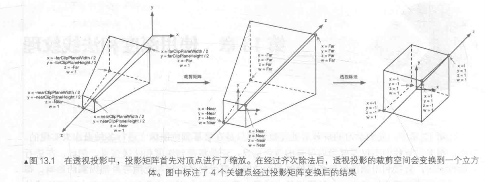
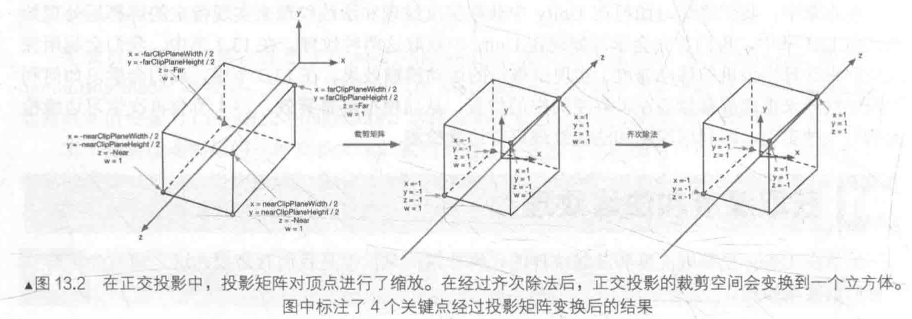
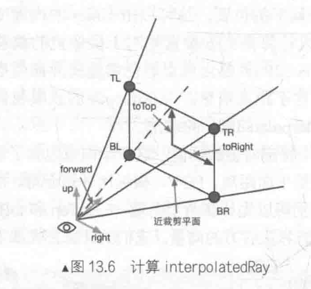
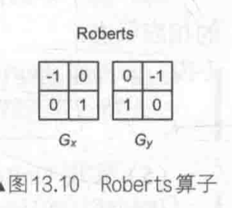
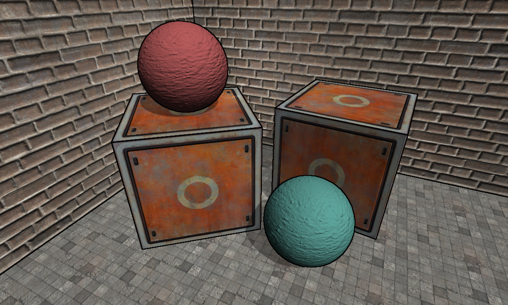

很多时候不仅需要当前屏幕的颜色信息，还希望得到**深度和法线信息**。

例如：在进行**边缘检测**的时候，**直接利用颜色信息**会使检测到的边缘信息受物体纹理和光照等外部因素的影响，得到很多不需要的边缘点。

一种更好的方法是，**在深度纹理和法线纹理上进行边缘检测**，这些图像不会受到纹理和光照的影响，而仅仅保存当前渲染物体的模型信息，通过这种方式检测出来的边缘更加可靠。

# 深度和法线纹理

## 原理

深度纹理是一张渲染纹理，存储高精度的**深度值**。

由于被存储在一张纹理中，**深度纹理的深度值**范围是`[0,1]`，而且通常是**非线性**分布的。

这些深度值来自于顶点变换后得到的**归一化设备坐标（Normalized Device Coordinates，NDC）**。

**模型绘制在屏幕上**：顶点从模型空间变换到齐次裁剪坐标系下（顶点着色器中乘以**MVP变换矩阵**，变换的最后一步使用一个投影矩阵来变换顶点，如果使用**透视投影的摄像机**，则该投影矩阵就是**非线性的**）。

下图给出了Unity中**透视投影**对顶点的变换过程：

- **最左侧的图**显示在投影变换前，即观察空间下视锥体的结构及相应的顶点位置。
- **中间的图**显示应用**透视裁剪矩阵**后的变换结果，即顶点着色器阶段输出的顶点变换结果。
- **最右侧的图**底层硬件进行透视除法后得到的归一化设备坐标。



**注意：**这里的投影过程是建立在**Unity对坐标系的假定上**的（观察空间为**右手坐标系**），使用列矩阵在矩阵右侧进行相乘，且变换到NDC后**z分量**范围在`[-1,1]`之间的情况。（如果是**DirectX**图形接口中，变换后z分量范围在`[0,1]`之间）

如果在其他图形接口下实现类似的效果，需要**对一些计算参数做出相应的变化**。

下图显示Unity中，**正交投影变换过程**，变换后会得到一个范围为`[-1,1]`的立方体，正交投影使用的变换矩阵是**线性的**。



得到**NDC**后，**深度纹理中的像素值**就可以很方便地计算得到了，它们**对应了NDC中顶点坐标的z分量**的值。由于z分量的范围在`[-1,1]`，为了让这些值能够存储在一张图像中，**使用如下公式对其进行映射**：
$$
d = 0.5\cdot z_{ndc} + 0.5 	\tag{1}
$$
其中，$d$对应**深度纹理中的像素值**，$z_{ndc}$对应**NDC坐标中的z分量的值**。

Unity中，深度纹理可以**直接来自于真正的深度缓存**，也可以**由一个单独的Pass渲染而得**。（取决于渲染路径和硬件）

通常来说，使用**延迟渲染路径**（包括遗留的延迟渲染路径），深度纹理可以访问到，因为延迟渲染会把这些信息渲染到**G-buffer**中。

当无法直接获取深度缓存时，**深度和法线纹理是通过一个单独的Pass渲染而得的**。

>具体实现：
>
>Unity使用**着色器替换（Shader Replacement）**技术选择那些渲染类型（即SubShader的RenderType标签）为**Opaque**的物体，判断其使用的**渲染队列使用小于等于2500**（内置的Background、Geometry和AlphaTest），如果满足条件，则把它渲染到**深度和法线纹理**中。
>
>因此，要想让物体能够出现在深度和法线纹理中，就必须**在Shader中设置正确的RenderType标签**。

Unity中，可以选择让一个摄像机生成一张**深度纹理**或是一张**深度+法线纹理**。

当选择前者，即**只需要一张单独的深度纹理时**，Unity会直接**获取深度缓存**或是**按之前讲到的着色器替换技术，选取需要的不透明物体，并使用它投射阴影时使用的Pass**（LightMode被设置为ShadowCaster的Pass）来得到深度纹理。如果Shader中不包含这样一个Pass，则**这个物体就不会出现在深度纹理中**（它也无法向其他物体投射阴影）。

深度纹理的精度通常是**24位或16位**，取决于使用的深度缓存的精度。

如果选择生成一张**深度+法线纹理**，Unity会创建一张**和屏幕分辨率相同、精度为32位（每个通道为8位）的纹理**，观察空间的**法线信息会编码进纹理的R和G通道**，而**深度信息会编码进B和A通道**。

**法线信息的获取**在延迟渲染中是可以非常容易就得到的，Unity只需要合并深度和法线缓存即可。

**前向渲染**中，默认情况下不会创建法线缓存，因此**Unity底层使用一个单独的Pass把整个场景再次渲染一遍**来完成。（这个Pass包含在Unity内置的一个Unity Shader中，可以在内置的`Camera-DepthNormalTexture.shader`文件中找到用于渲染深度和法线信息的Pass）

## 获取

Unity中，通过在脚本中设置摄像机的`depthTextureMode`来获取**深度纹理**。

```c++
camera.depthTextureMode = DepthTextureMode.Depth;
```

当**设置好上述摄像机模式后**，可以在Shader中通过声明`_CameraDepthTexture`变量来访问它。

同理，如果想要获取**深度+法线纹理**，需要在代码中设置：

```c++
camera.depthTextureMode = DepthTextureMode.DepthNormals;
```

然后在Shader中通过声明`_CameraDepthNormalsTexture`变量来访问它。

也可以组合这些模式，让一个摄像机**同时产生一张深度和深度+法线纹理**。

```c++
camera.depthTextureMode |= DepthTextureMode.Depth;
camera.depthTextureMode |= DepthTextureMode.DepthNormals;
```

可以在摄像机的Camera组件上看到当前摄像机是否需要渲染**深度或深度+法线纹理**。

当在Shader中访问到深度纹理`_CameraDepthTexture`后，可以**使用当前像素的纹理坐标**对它进行采样（使用`tex2D`函数采样即可，某些平台（PS系列）可能需要特殊处理）。

Unity提供一个统一的宏`SAMPLE_DEPTH_TEXTURE`，用于处理这些由平台差异造成的纹理。

```c++
float d = SAMPLE_DEPTH_TEXTURE(_CameraDepthTexture, i.uv)
```

其中，`i.uv`是一个`float2`类型的变量，对应**当前像素的纹理坐标**。

类似的宏还有`SAMPLE_DEPTH_TEXTURE_PROJ`和`SAMPLE_DEPTH_TEXTURE_LOD`。

`SAMPLE_DEPTH_TEXTURE_PROJ`宏同样接受两个参数——**深度纹理**和一个`float3`或`float4`类型的**纹理坐标**，它的内部使用`tex2Dproj`函数进行**投影纹理采样**，纹理坐标的前两个分量首先会除以最后一个分量，再进行纹理采样。如果提供**第四个分量**，还会进行一次比较，通常用于**阴影的实现**中。

`SAMPLE_DEPTH_TEXTURE_PROJ`第二个参数通常**由顶点着色器输出插值而得的屏幕坐标**：

```c++
float d = SAMPLE_DEPTH_TEXTURE_PROJ(_CameraDepthTexture, UNITY_PROJ_COORD(i.scrPos));
```

其中，`i.scrPos`在顶点着色器中通过调用`ComputeScreenPos(o.pos)`得到屏幕坐标。

当通过纹理采样得到**深度值**，往往是**非线性的**，来自于**透视投影使用的裁剪矩阵**。

然而，在计算过程中通常需要**线性的深度值**，即，需要**把投影后的深度值**变换到**线性空间**下，例如视角空间下的深度值。（**倒推顶点变换**的过程）

以**透视投影**为例，推导如何由**深度纹理中的深度信息计算得到视角空间下的深度值**：

使用**透视投影的裁剪矩阵**$P_{clip}$对视角空间的一个顶点进行变换后，裁剪空间下顶点的$z$和$w$分量为：
$$
z_{clip} = -z_{view}\frac{Far+Near}{Far-Near}-\frac{2\cdot Near\cdot Far}{Far-Near}	\tag{2}
$$

$$
w_{clip} = -z_{view}	\tag{3}
$$

其中，$Far$和$Near$分别是远近裁剪平面的距离。

之后通过齐次除法可以得到**NDC下的z分量**：
$$
z_{ndc}=\frac{z_{clip}}{w_{clip}}=\frac{Far+Near}{Far-Near}+\frac{2Near\cdot Far}{(Far-Near)\cdot z_{view}}	\tag{4}
$$
深度纹理中的深度值是通过式（1）得到：
$$
d = 0.5\cdot z_{ndc} + 0.5 	\tag{1}
$$
结合上述式子，可以推导出用$d$表示而得的$z_{view}$的表达式：
$$
z_{view}=\frac{1}{\frac{Far-Near}{Near\cdot Far}d-\frac{1}{Near}}	\tag{5}
$$
由于在Unity使用的视角空间中，摄像机正向对应的$z$值均为负值，因此需要对上述结果进行取反：
$$
z_{view}=\frac{1}{\frac{Near-Far}{Near\cdot Far}d+\frac{1}{Near}}	\tag{6}
$$
其取值范围就是视锥体的深度范围，即`[Near,Far]`。如果想要得到在范围`[0,1]`之间的深度值，只需要把上述结果除以$Far$即可。这样，$0$表示该点与摄像机处于同一位置，$1$表示该点位于视锥体的远裁剪平面上。
$$
z_{01}=\frac{1}{\frac{Near-Far}{Near}d+\frac{Far}{Near}}	\tag{7}
$$
Unity中**提供两个辅助函数**来计算上述过程：

- `LinearEyeDepth`：负责把**深度纹理的采样结果转换到视角空间下的深度值**，即$z_{view}$
- `Linear01Depth`：返回一个范围在`[0,1]`的**线性深度值**，即$z_{01}$

两个函数内部使用内置的`_ZBufferParams`变量得到远近裁剪平面的距离。

如果需要获取**深度+法线纹理**，直接使用`tex2D`函数对`_CameraDepthNormalsTexture`进行采样，得到里面存储的**深度和法线信息**。Unity提供辅助函数`DecodeDepthNormal`来对这个采样结果进行解码，从而得到深度值和法线方向。

```c++
inline void DecodeDepthNormal(float4 enc, out float depth, out float3 normal)
{
    depth = DecodeFloatRG(enc.zw);
    normal = DecodeViewNormalStereo(enc);
}
```

`DecodeDepthNormal`的第一个参数是对**深度+法线纹理**的采样结果，这个采样结果是Unity对深度和法线信息编码后的结果，它的**xy分量存储的是视角空间下的法线信息**，而**深度信息被编码进了zw分量**。

通过调用`DecodeDepthNormal`函数对采样结果解码后，可以得到**深度值（范围在`[0,1]`的线性深度值，与单独深度纹理中存储的深度值不同）和法线（视角空间下的法线方向）**。

同样，可以通过调用`DecodeFloatRG`和`DecodeViewNormalStereo`来解码**深度+法线纹理**。

## 查看

查看生成的深度和法线纹理，以便对Shader进行调试。

可以通过**帧调试器（Frame Debugger）**来查看摄像机生成的深度和法线纹理，看到的深度纹理是**非线性空间**的深度值，而**深度+法线纹理都是由Unity编码后的结果**。

有时，显示出**线性空间下的深度信息或解码后的法线方向**会更加有用，可以自行在**片元着色器**中输出转换或解码后的**深度和法线值**。

```c++
float depth = SAMPLE_DEPTH_TEXTURE(_CameraDepthTexture, i.uv);
float linearDepth = Linear01Depth(depth);
return fixed4(linearDepth, linearDepth, linearDepth, 1.0);
```

或是输出法线方向：

```c++
fixed3 normal = DecodeViewNormalStereo(tex2D(_CameraDepthNormalsTexture, i.uv).xy);
return fixed4(normal * 0.5 + 0.5, 1.0);
```

查看深度纹理时，得到的画面可能几乎都是**全黑或全白的**，此时可以**把摄像机的远裁剪平面的距离（Unity默认为1000）调小**，使视锥体的范围刚好覆盖场景的所在区域。

> 由于投影变换时需要**覆盖从近裁剪平面到远裁剪平面**的所有深度区域，当远裁剪平面的距离过大时，会**导致摄像机较近的距离被映射到非常小的深度值**。
>
> - 如果场景是一个封闭的区域，则会导致画面看起来几乎是全黑的。
> - 如果场景是一个开放区域，且物体离摄像机的距离较远，就会导致画面几乎是全白的。


# 运动模糊

应用更加广泛的技术是通过**速度映射图**，存储**每个像素的速度**，然后使用这个速度来决定模糊的**方向和大小**。

**速度缓冲的生成**有多种方法：

一种方法是**把场景中的所有物体的速度渲染到一张纹理中**。该方法缺点在于需要**修改场景中所有物体的Shader代码**，使其添加计算速度的代码并输出到一个渲染纹理中。

另一种方法利用**深度纹理在片元着色器中为每个像素计算其在世界空间下的位置**，通过**使用当前视角*投影矩阵的逆矩阵对NDC下的顶点坐标进行变换**得到。当得到世界空间中的顶点坐标后，使用前一帧的视角*投影矩阵对其进行变换，得到**该位置在前一帧中的NDC坐标。**然后计算前一帧和当前帧的位置差，**生成该像素的速度**。（该方法的优点是可以**在一个屏幕后处理步骤中完成整个效果的模拟**，缺点是需要**在片元着色器中进行两次矩阵乘法**的操作，对性能有所影响）

**深度纹理模拟运动模糊**：

1. 新建一个场景，默认情况下场景包含一个摄像机和一个平行光，并且使用内置的天空盒子。在`Window->Lighting->Skybox`中去掉场景中的天空盒子。
2. 搭建一个**测试运动模糊的场景**。构建一个包含3面墙的房间，放置4个立方体，使用标准材质。同时把`Translating.cs`脚本拖曳给摄像机，让其在场景中不断运动。
3. 新建一个脚本`MotionBlurWithDepthTexture.cs`，把该脚本拖曳到摄像机上。
4. 新建一个Unity Shader`MotionBlurWithDepthTexture`。

编写`MotionBlurWithDepthTexture.cs`脚本：

```c#
using UnityEngine;
using System.Collections;

// 继承屏幕后处理的基类
public class MotionBlurWithDepthTexture : PostEffectsBase {

	// 声明该效果需要的Shader,并据此创建相应的材质
	public Shader motionBlurShader;
	private Material motionBlurMaterial = null;

	public Material material {  
		get {
			motionBlurMaterial = CheckShaderAndCreateMaterial(motionBlurShader, motionBlurMaterial);
			return motionBlurMaterial;
		}  
	}

	// 需要得到摄像机的视角和投影矩阵
	// 定义一个Camera类型的变量以获取该脚本所在的摄像机组件
	private Camera myCamera;
	public Camera camera {
		get {
			if (myCamera == null) {
				myCamera = GetComponent<Camera>();
			}
			return myCamera;
		}
	}

	// 定义运动模糊时,模糊图像使用的大小
	[Range(0.0f, 1.0f)]
	public float blurSize = 0.5f;

	// 定义一个变量保存上一帧摄像机的视角*投影矩阵
	private Matrix4x4 previousViewProjectionMatrix;
	
	void OnEnable() {
		// 需要获取摄像机的深度纹理,设置摄像机的状态
		camera.depthTextureMode |= DepthTextureMode.Depth;

		previousViewProjectionMatrix = camera.projectionMatrix * camera.worldToCameraMatrix;
	}
	
	void OnRenderImage (RenderTexture src, RenderTexture dest) {
		if (material != null) {
			// 计算和传递运动模糊使用的各个属性
			material.SetFloat("_BlurSize", blurSize);
			
			// 两个变换矩阵:
			// 前一帧的视角*投影矩阵
			// 当前帧的视角*投影矩阵的逆矩阵
			material.SetMatrix("_PreviousViewProjectionMatrix", previousViewProjectionMatrix);
			// 调用camera.projectionMatrix和camera.worldToCameraMatrix分别得到当前摄像机的视角矩阵和投影矩阵,并相乘
			Matrix4x4 currentViewProjectionMatrix = camera.projectionMatrix * camera.worldToCameraMatrix;
			// 取逆矩阵,并传递给材质
			Matrix4x4 currentViewProjectionInverseMatrix = currentViewProjectionMatrix.inverse;
			material.SetMatrix("_CurrentViewProjectionInverseMatrix", currentViewProjectionInverseMatrix);
			// 把取逆前的结果存储在previousViewProjectionMatrix中,以便在下一帧时传递给材质的_PreviousViewProjectionMatrix属性
			previousViewProjectionMatrix = currentViewProjectionMatrix;

			Graphics.Blit (src, dest, material);
		} else {
			Graphics.Blit(src, dest);
		}
	}
}
```

实现`MotionBlurWithDepthTexture`：

```c++
// Upgrade NOTE: replaced 'mul(UNITY_MATRIX_MVP,*)' with 'UnityObjectToClipPos(*)'

Shader "Unity Shaders Book/Chapter 13/Motion Blur With Depth Texture" {
	Properties {
		// _MainTex对应输入的渲染纹理
		_MainTex ("Base (RGB)", 2D) = "white" {}
		// _BlurSize是模糊图像时使用的参数
		_BlurSize ("Blur Size", Float) = 1.0
	}
	SubShader {
		CGINCLUDE
		
		#include "UnityCG.cginc"
		
		// 注意,虽然在脚本里设置材质的_CurrentViewProjectionInverseMatrix和_PreviousViewProjectionMatrix属性
		// 却没有在Properties块中声明它们
		// 这是因为Unity没有提供矩阵类型的属性,但仍然可以在CG代码中定义这些矩阵
		sampler2D _MainTex;
		// _MainTex_TexelSize主纹理的纹素大小
		// 使用该变量来对深度纹理的采样坐标进行平台差异化处理
		half4 _MainTex_TexelSize;
		// _CameraDepthTexture是Unity传递的深度纹理
		sampler2D _CameraDepthTexture;
		float4x4 _CurrentViewProjectionInverseMatrix;
		float4x4 _PreviousViewProjectionMatrix;
		half _BlurSize;
		
		struct v2f {
			float4 pos : SV_POSITION;
			half2 uv : TEXCOORD0;
			// 增加专门用于对深度纹理采样的纹理坐标变量
			half2 uv_depth : TEXCOORD1;
		};
		
		v2f vert(appdata_img v) {
			v2f o;
			o.pos = UnityObjectToClipPos(v.vertex);
			
			o.uv = v.texcoord;
			o.uv_depth = v.texcoord;
			
			// 对深度纹理的采样进行平台差异化处理,以便在DirectX平台上,在开启抗锯齿的情况下仍然可以得到正确的结果
			#if UNITY_UV_STARTS_AT_TOP
			if (_MainTex_TexelSize.y < 0)
				o.uv_depth.y = 1 - o.uv_depth.y;
			#endif
					 
			return o;
		}
		
		// 利用深度纹理和当前帧的视角*投影矩阵的逆矩阵来求得该像素在世界空间下的坐标
		fixed4 frag(v2f i) : SV_Target {
			// Get the depth buffer value at this pixel.
			// 使用内置的SAMPLE_DEPTH_TEXTURE宏和纹理坐标对深度纹理进行采样,得到深度值d
			// d是由NDC下的坐标映射而来
			float d = SAMPLE_DEPTH_TEXTURE(_CameraDepthTexture, i.uv_depth);
			// H is the viewport position at this pixel in the range -1 to 1.
			// 想要构建像素的NDC坐标H,需要把这个深度值重新映射回NDC,即使用反函数:H = d * 2 - 1
			// NDC的xy分量可以由像素的纹理坐标映射而来(NDC下的xyz分量范围均为[-1,1])
			float4 H = float4(i.uv.x * 2 - 1, i.uv.y * 2 - 1, d * 2 - 1, 1);
			// Transform by the view-projection inverse.
			// 当得到NDC的坐标H后,可以使用当前帧的视角*投影矩阵的逆矩阵对其进行变换
			float4 D = mul(_CurrentViewProjectionInverseMatrix, H);
			// Divide by w to get the world position. 
			// 并把结果值除以它的w分量来得到世界空间下的坐标表示worldPos
			float4 worldPos = D / D.w;
			
			// Current viewport position 
			float4 currentPos = H;
			// Use the world position, and transform by the previous view-projection matrix.  
			// 当得到世界空间下的坐标,可以使用前一帧的视角*投影矩阵对其进行变换
			// 得到前一帧在NDC下的坐标previousPos
			float4 previousPos = mul(_PreviousViewProjectionMatrix, worldPos);
			// Convert to nonhomogeneous points [-1,1] by dividing by w.
			previousPos /= previousPos.w;
			
			// Use this frame's position and last frame's to compute the pixel velocity.
			// 计算前一帧和当前帧在屏幕空间下的位置差,得到该像素的速度velocity
			float2 velocity = (currentPos.xy - previousPos.xy)/2.0f;
			
			float2 uv = i.uv;
			float4 c = tex2D(_MainTex, uv);
			// 得到速度后,可以使用该速度值对它的邻域像素进行采样
			// 相加后取平均值得到一个模糊的效果
			// 采样时使用_BlurSize来控制采样距离
			uv += velocity * _BlurSize;
			for (int it = 1; it < 3; it++, uv += velocity * _BlurSize) {
				float4 currentColor = tex2D(_MainTex, uv);
				c += currentColor;
			}
			c /= 3;
			
			return fixed4(c.rgb, 1.0);
		}
		
		ENDCG
		
		// 定义运动模糊所需的Pass
		Pass {      
			ZTest Always Cull Off ZWrite Off
			    	
			CGPROGRAM  
			
			#pragma vertex vert  
			#pragma fragment frag  
			  
			ENDCG  
		}
	} 
	// 关闭Shader的Fallback
	FallBack Off
}
```

完成后返回编辑器，并把`MotionBlurWithDepthTexture`拖曳到摄像机的`MotionBlurWithDepthTexture.cs`脚本中的`motionBlurShader`参数中，得到如下图结果。


上述例子实现的**运动模糊**适用于**场景静止、摄像机快速运动的情况**，这是因为在计算时只考虑摄像机的运动。

（因此，如果把代码放在一个物体快速运动而摄像机静止的场景，会发现不会产生任何运动模糊的效果。）

如果想要对快速移动的物体产生运动模糊的效果，就需要生成更加精确的**速度映射图**。


# 全局雾效

**雾效（Fog）**游戏里经常使用的一种效果。

Unity内置的雾效可以产生**基于距离的线性或指数雾效**。

如果想在自己编写的顶点/片元着色器中实现这些雾效，需要在Shader中添加`#pragma multi_compile_fog`指令，同时需要使用相关的内置宏，例如`UNITY_FOG_COORDS`、`UNITY_TRANSFER_FOG`和`UNITY_APPLP_FOG`等。

**缺点**：不仅需要我场景中所有物体添加相关的渲染代码，而且能够实现的效果也非常有限。

（如果需要对雾效进行一些个性化操作时，例如使用基于高度的雾效，仅仅使用Unity内置的雾效就变得不再可行。）

**基于屏幕后处理的全局雾效实现**：可以不需要更改场景内渲染的物体所使用的Shader代码，而仅仅依靠一次屏幕后处理即可。这种方法的自由性很高，可以**方便地模拟各种雾效**（例如均匀雾效、基于距离的线性/指数雾效、基于高度的雾效等）。

**基于屏幕后处理的全局雾效关键**：根据**深度纹理来重建每个像素在世界空间下**的位置，首先**对图像空间下的视锥体射线（从摄像机出发，指向图像上的某点的射线）进行插值**，这条射线**存储该像素在世界空间下的摄像机的方向信息**，之后，把该射线和线性化后的视角空间下的深度相乘，再加上摄像机的世界位置，就可以得到该像素在世界空间下的位置。当得到世界坐标后，就可以轻松地使用各个公式来模拟全局雾效了。

## 重建世界坐标

从**深度纹理**中重建世界坐标。

坐标系中的**一个顶点坐标可以通过它相对于另一个顶点坐标的偏移量**来求得。

（重建像素的世界坐标也是基于该思想）

只需要知道摄像机在世界空间下的位置，以及世界空间下该像素相对于摄像机的偏移量，把它们相加就可以得到该像素的世界坐标。

```c++
float4 worldPos = _WorldSpaceCameraPos + linearDepth * interpolatedRay;
```

其中，`_WorldSpaceCameraPos`是**摄像机在世界空间下的位置**（由Unity内置变量直接访问）。`linearDepth * interpolatedRay`可以计算得到**该像素相对于摄像机的偏移量**，`linearDepth`由**深度纹理得到的线性深度值**，`interpolatedRay`由**顶点着色器输出并插值后得到的射线**，它不仅包含该像素到摄像机的方向，也包含距离信息。

`interpolatedRay`来源于**对近裁剪平面的4个角的某个特定向量的插值**，这4个向量包含它们到摄像机的方向和距离信息，利用摄像机的**近裁剪平面距离**、**FOV**、**横纵比**得到。

下图展示了计算时使用的一些**辅助向量**。



为了方便计算，可以先计算两个向量——`toTop`和`toRight`，它们是起点位于**近裁剪平面中心**，分别指向摄像机正上方和正右方的向量。
$$
halfHeight = Near\times tan(\frac{FOV}{2})	\tag{8}
$$

$$
toTop = camera.up\times halfHeight	\tag{9}
$$

$$
toRight = camera.right\times halfHeight\cdot aspect	\tag{10}
$$

其中，$Near$是近裁剪平面的距离，$FOV$是竖直方向的视角范围，$camera.up$和$camera.right$分别对应摄像机的正上方和正右方。

当得到这两个**辅助向量**后，可以计算4个角相对于摄像机的方向。

左上角$TL$点：
$$
TL = camera.forward\cdot Near + toTop - toRight	\tag{11}
$$
右上角$TR$点：
$$
TR = camera.forward\cdot Near + toTop + toRight	\tag{12}
$$
左下角$BL$点：
$$
BL = camera.forward\cdot Near - toTop - toRight	\tag{13}
$$
右下角$BR$点：
$$
BR = camera.forward\cdot Near - toTop + toRight	\tag{14}
$$
上述4个向量不仅包含方向信息，其模对应了4个点到摄像机的空间距离。

得到的**线性深度值**并非是点到摄像机的欧氏距离，而是**z方向上的距离**。因此，不能直接使用深度值和4个角的单位方向的乘积来计算它们到摄像机的偏移量。

**深度值转换成到摄像机的欧氏距离**，以$TL$点为例，根据相似三角形原理，$TL$所在的射线上，**像素的深度值和它到摄像机的实际距离的比等于近裁剪平面的距离和$TL$向量的模的比**：
$$
\frac{depth}{dist} = \frac{Near}{|TL|}	\tag{15}
$$
由此，可以得到$TL$距离摄像机的欧氏距离$dist$：
$$
dist = \frac{|TL|}{Near}\times depth	\tag{16}
$$
由于4个点互相对称，其他3个向量的模和$TL$相等，因此可以使用同一个因子和单位向量相乘，得到其对应的向量值：
$$
scale = \frac{|TL|}{|Near|}		\tag{17}
$$

$$
Ray_{TL}=\frac{TL}{|TL|}\times scale	\tag{18}
$$

$$
Ray_{TR}=\frac{TR}{|TR|}\times scale	\tag{19}
$$

$$
Ray_{BL}=\frac{BL}{|BL|}\times scale	\tag{20}
$$

$$
Ray_{BR}=\frac{BR}{|BR|}\times scale	\tag{21}
$$

**屏幕后处理的原理**：使用特定的材质去渲染一个刚好填充整个屏幕的四边形面片。这个**四边形面片的4个顶点对应近裁剪平面的4个角**。

可以把上面的计算结果传递给顶点着色器，**顶点着色器根据当前的位置选择它所对应的向量**，然后再将其输出，经插值后传递给片元着色器得到`interpolatedRay`，之后直接利用公式重建该像素在世界空间下的位置。

## 雾的计算

简单的雾效实现，需要**计算一个雾效系数**$f$，作为混合**原始颜色和雾的颜色**的混合系数：

```c++
float3 afterFog = f * fogColor + (1 - f) * origColor;
```

Unity内置的雾效实现中，支持三种雾的计算方式——**线性（Linear）**、**指数（Exponential）**以及**指数的平方（Exponential Squared）**。

当给定距离$z$后，$f$的计算公式分别如下：
$$
f_{Linear}=\frac{d_{max}-|z|}{d_{max}-d_{min}}，d_{min}/d_{max}为受雾影响的最小/最大距离	\tag{22}
$$

$$
f_{Exponential}=e^{-d\cdot|z|}，d是控制雾的浓度的参数	\tag{23}
$$

$$
f_{Exponential-Squared}=e^{-(d-|z|)^2}，d是控制雾的浓度参数		\tag{24}
$$

之后例子采用**类似线性雾的计算方式，计算基于高度的雾效**。

方法：

当给定一点在世界空间下的高度$y$后，$f$的计算公式为：
$$
f=\frac{H_{end}-y}{H_{end}-H_{start}}		\tag{25}
$$
其中，$H_{end}$和$H_{start}$分别表示受雾影响的起始高度的和终止高度。

## 实现

在Unity中实现基于平面后处理的雾效：

1. 新建一个场景，默认情况下场景包含一个摄像机和一个平行光，并且使用内置的天空盒子。在`Window->Lighting->Skybox`中去掉场景中的天空盒子。
2. 搭建一个**测试雾效的场景**。构建一个包含3面墙的房间，放置2个立方体和2个球体，使用标准材质。同时把`Translating.cs`脚本拖曳给摄像机，让其在场景中不断运动。
3. 新建一个脚本`FogWithDepthTexture.cs`，把该脚本拖曳到摄像机上。
4. 新建一个Unity Shader`FogWithDepthTexture`。

编写`FogWithDepthTexture.cs`脚本：

```c#
using UnityEngine;
using System.Collections;

public class FogWithDepthTexture : PostEffectsBase {

	public Shader fogShader;
	private Material fogMaterial = null;

	public Material material {  
		get {
			fogMaterial = CheckShaderAndCreateMaterial(fogShader, fogMaterial);
			return fogMaterial;
		}  
	}

	// 需要获取摄像机的相关参数,如近裁剪平面的距离,FOV等
	// 同时还需要获取摄像机在世界空间下的前方,上方和右方等方向
	// 因此需要两个变量存储摄像机的Camera组件和Transform组件
	private Camera myCamera;
	public Camera camera {
		get {
			if (myCamera == null) {
				myCamera = GetComponent<Camera>();
			}
			return myCamera;
		}
	}

	private Transform myCameraTransform;
	public Transform cameraTransform {
		get {
			if (myCameraTransform == null) {
				myCameraTransform = camera.transform;
			}

			return myCameraTransform;
		}
	}

	// 定义模拟雾效时使用的各个参数
	// fogDensity控制雾的浓度
	[Range(0.0f, 3.0f)]
	public float fogDensity = 1.0f;

	// fogColor控制雾的颜色
	public Color fogColor = Color.white;

	// 使用的雾效模拟函数是基于高度的,因此参数fogStart用于控制雾效的起始高度
	// fogEnd用于控制雾效的终止高度
	public float fogStart = 0.0f;
	public float fogEnd = 2.0f;

	void OnEnable() {
		// 需要获取摄像机的深度纹理,在脚本的OnEnable函数中设置摄像机的相应状态
		camera.depthTextureMode |= DepthTextureMode.Depth;
	}
	
	void OnRenderImage (RenderTexture src, RenderTexture dest) {
		if (material != null) {
			Matrix4x4 frustumCorners = Matrix4x4.identity;

			float fov = camera.fieldOfView;
			float near = camera.nearClipPlane;
			float aspect = camera.aspect;

			// 首先计算近裁剪平面的四个角对应的向量,并把它们存储在一个矩阵类型的变量中
			float halfHeight = near * Mathf.Tan(fov * 0.5f * Mathf.Deg2Rad);
			Vector3 toRight = cameraTransform.right * halfHeight * aspect;
			Vector3 toTop = cameraTransform.up * halfHeight;

			Vector3 topLeft = cameraTransform.forward * near + toTop - toRight;
			float scale = topLeft.magnitude / near;

			topLeft.Normalize();
			topLeft *= scale;

			Vector3 topRight = cameraTransform.forward * near + toRight + toTop;
			topRight.Normalize();
			topRight *= scale;

			Vector3 bottomLeft = cameraTransform.forward * near - toTop - toRight;
			bottomLeft.Normalize();
			bottomLeft *= scale;

			Vector3 bottomRight = cameraTransform.forward * near + toRight - toTop;
			bottomRight.Normalize();
			bottomRight *= scale;

			// 按照一定的顺序把四个方向存储到不同行中
			// 这个顺序非常重要,决定了在顶点着色器中使用哪一行作为该点的待插值向量
			frustumCorners.SetRow(0, bottomLeft);
			frustumCorners.SetRow(1, bottomRight);
			frustumCorners.SetRow(2, topRight);
			frustumCorners.SetRow(3, topLeft);

			// 把结果和其他参数传递给材质
			material.SetMatrix("_FrustumCornersRay", frustumCorners);

			material.SetFloat("_FogDensity", fogDensity);
			material.SetColor("_FogColor", fogColor);
			material.SetFloat("_FogStart", fogStart);
			material.SetFloat("_FogEnd", fogEnd);
			
			// 并调用Graphics.Blit (src, dest, material)把渲染结果显示在屏幕上
			Graphics.Blit (src, dest, material);
		} else {
			Graphics.Blit(src, dest);
		}
	}
}
```

实现`FogWithDepthTexture`：

```c++
// Upgrade NOTE: replaced 'mul(UNITY_MATRIX_MVP,*)' with 'UnityObjectToClipPos(*)'

Shader "Unity Shaders Book/Chapter 13/Fog With Depth Texture" {
	Properties {
		_MainTex ("Base (RGB)", 2D) = "white" {}
		_FogDensity ("Fog Density", Float) = 1.0
		_FogColor ("Fog Color", Color) = (1, 1, 1, 1)
		_FogStart ("Fog Start", Float) = 0.0
		_FogEnd ("Fog End", Float) = 1.0
	}
	SubShader {
		CGINCLUDE
		
		#include "UnityCG.cginc"
		
		// _FrustumCornersRay虽然没有在Properties中声明,但仍可由脚本传递给Shader
		float4x4 _FrustumCornersRay;
		
		sampler2D _MainTex;
		half4 _MainTex_TexelSize;
		// 声明深度纹理_CameraDepthTexture
		// Unity会在背后把得到的深度纹理传递给该值
		sampler2D _CameraDepthTexture;
		half _FogDensity;
		fixed4 _FogColor;
		float _FogStart;
		float _FogEnd;
		
		struct v2f {
			// 顶点位置
			float4 pos : SV_POSITION;
			// 屏幕图像
			half2 uv : TEXCOORD0;
			// 深度纹理
			half2 uv_depth : TEXCOORD1;
			// interpolatedRay变量存储插值后的像素向量
			float4 interpolatedRay : TEXCOORD2;
		};
		
		v2f vert(appdata_img v) {
			// 尽管此处使用了很多判断语句
			// 但由于屏幕后处理所用的模型是一个四边形网格,只包括4个顶点
			// 因此这些操作不会对性能造成很大影响
			v2f o;
			o.pos = UnityObjectToClipPos(v.vertex);
			
			o.uv = v.texcoord;
			o.uv_depth = v.texcoord;
			
			// 对深度纹理的采样坐标进行平台差异化处理
			#if UNITY_UV_STARTS_AT_TOP
			if (_MainTex_TexelSize.y < 0)
				o.uv_depth.y = 1 - o.uv_depth.y;
			#endif
			
			// 决定该点对应了4个角中的哪个角
			// 判断它的纹理坐标
			// Unity中,纹理坐标(0,0)对应左下角,(1,1)对应右上角
			// 可以据此来判断该顶点对应的索引
			// 这个对应关系与脚本中对frustumCorners的赋值顺序是一致的
			int index = 0;
			if (v.texcoord.x < 0.5 && v.texcoord.y < 0.5) {
				index = 0;
			} else if (v.texcoord.x > 0.5 && v.texcoord.y < 0.5) {
				index = 1;
			} else if (v.texcoord.x > 0.5 && v.texcoord.y > 0.5) {
				index = 2;
			} else {
				index = 3;
			}

			// 类似在DirectX平台上开启了抗锯齿,Unity就不会进行这个翻转
			// 为了此时仍然可以得到相应顶点位置的索引值,对索引值进行平台差异化处理
			// 以便在必要时也对索引值进行翻转
			#if UNITY_UV_STARTS_AT_TOP
			if (_MainTex_TexelSize.y < 0)
				index = 3 - index;
			#endif
			
			// 根据索引值获取_FrustumCornersRay中对应的行作为该顶点的_interpolatedRay值
			o.interpolatedRay = _FrustumCornersRay[index];
				 	 
			return o;
		}
		
		// 定义片元着色器来产生雾效
		fixed4 frag(v2f i) : SV_Target {
			// 重建该像素在世界空间中的位置
			// 首先使用SAMPLE_DEPTH_TEXTURE对深度纹理进行采样
			// 再使用LinearEyeDepth得到视角空间下的线性深度值
			float linearDepth = LinearEyeDepth(SAMPLE_DEPTH_TEXTURE(_CameraDepthTexture, i.uv_depth));
			// 之后与interpolatedRay相乘后再和世界空间下的摄像机位置相加,即可得到世界空间下的位置
			float3 worldPos = _WorldSpaceCameraPos + linearDepth * i.interpolatedRay.xyz;

			// 实现基于高度的雾效模拟
			// 根据材质属性_FogEnd和_FogStart计算当前的像素高度worldPos.y对应的雾效系数fogDensity
			float fogDensity = (_FogEnd - worldPos.y) / (_FogEnd - _FogStart); 
			// 再和参数_FogDensity相乘后,利用saturate函数截取到[0,1]范围内,作为最后的雾效系数
			fogDensity = saturate(fogDensity * _FogDensity);
			
			fixed4 finalColor = tex2D(_MainTex, i.uv);
			// 使用该系数将雾的颜色和原始颜色进行混合后返回
			finalColor.rgb = lerp(finalColor.rgb, _FogColor.rgb, fogDensity);
			
			return finalColor;
		}
		
		ENDCG
		
		// 定义雾效渲染所需的Pass
		Pass {
			ZTest Always Cull Off ZWrite Off
			     	
			CGPROGRAM  
			
			#pragma vertex vert  
			#pragma fragment frag  
			  
			ENDCG  
		}
	} 
	// 关闭Shader的Fallback
	FallBack Off
}
```

完成后返回编辑器，并把`FogWithDepthTexture`拖曳到摄像机的`FogWithDepthTexture.cs`中的`fogShader`参数中，得到如下结果：


**注意：**这里的实现是基于摄像机的投影类型是**透视投影**的前提下。如果需要在**正交投影**的情况下重建世界坐标，需要使用不同的公式。


# 边缘检测

在**深度和法线纹理**上进行边缘检测，这些图像**不会受到纹理和光照的影响**，而仅仅保存了当前渲染物体的模型信息，通过这样的方式检测出来的边缘更加可靠。

使用**Roberts算子**进行边缘检测，它的卷积核如下所示：



Roberts算子本质就是计算**左上角和右下角**的差值，乘以**右上角和左下角**的差值，作为评估边缘的依据。

实现中，也会按照这样的方式，**取对角方向的深度或法线值**，比较它们之间的差值，如果超过某个阈值（由参数控制），就认为它们之间存在一条边。

1. 新建一个场景，默认情况下场景包含一个摄像机和一个平行光，并且使用内置的天空盒子。在`Window->Lighting->Skybox`中去掉场景中的天空盒子。
2. 搭建一个**检测边缘的场景**。构建一个包含3面墙的房间，放置2个立方体和2个球体，使用标准材质。同时把`Translating.cs`脚本拖曳给摄像机，让其在场景中不断运动。
3. 新建一个脚本`EdgeDetectNormalsAndDepth.cs`，把该脚本拖曳到摄像机上。
4. 新建一个Unity Shader`EdgeDetectNormalsAndDepth`。

编写`EdgeDetectNormalsAndDepth.cs`脚本：

```c#
using UnityEngine;
using System.Collections;

public class EdgeDetectNormalsAndDepth : PostEffectsBase {

	public Shader edgeDetectShader;
	private Material edgeDetectMaterial = null;
	public Material material {  
		get {
			edgeDetectMaterial = CheckShaderAndCreateMaterial(edgeDetectShader, edgeDetectMaterial);
			return edgeDetectMaterial;
		}  
	}

	// 提供调整边缘线强度描边颜色以及背景颜色的参数
	// 同时添加控制采样距离以及深度和法线进行边缘检测时的灵敏度参数
	[Range(0.0f, 1.0f)]
	public float edgesOnly = 0.0f;

	public Color edgeColor = Color.black;

	public Color backgroundColor = Color.white;

	// sampleDistance用于控制对深度+法线纹理采样时,使用的采样距离
	// 该值越大,描边越宽
	public float sampleDistance = 1.0f;

	// sensitivityDepth和sensitivityNormals将会影响当邻域的深度值或法线值相差多少时
	// 会被认为存在一条边界
	// 如果把灵敏度调的很大,则可能即使是深度或法线上很小的变化也会形成一条边
	public float sensitivityDepth = 1.0f;

	public float sensitivityNormals = 1.0f;
	
	void OnEnable() {
		// 由于需要获取摄像机的深度+法线纹理,在脚本的OnEnable函数中设置摄像机的相应状态
		GetComponent<Camera>().depthTextureMode |= DepthTextureMode.DepthNormals;
	}

	// 此处为OnRenderImage函数添加[ImageEffectOpaque]属性
	// 默认情况下,OnRenderImage函数会在所有不透明和透明的Pass执行完毕后被调用,以便对场景中所有游戏对象都产生影响
	// 但有时,希望在不透明Pass(即渲染队列小于等于2500的Pass,内置的Background/Geometry和AlphaTest渲染队列均在此范围内)
	// 执行完毕后立即调用该函数,而不对透明物体(渲染队列为Transparent的Pass)产生影响
	// 此时可以在OnRenderImage函数前添加[ImageEffectOpaque]属性来实现这样的目的
	// 本例中,只希望对不透明物体进行描边,而不希望透明物体也被描边,因此需要添加该属性
	[ImageEffectOpaque]
	void OnRenderImage (RenderTexture src, RenderTexture dest) {
		if (material != null) {
			// 把各个参数传递给材质
			material.SetFloat("_EdgeOnly", edgesOnly);
			material.SetColor("_EdgeColor", edgeColor);
			material.SetColor("_BackgroundColor", backgroundColor);
			material.SetFloat("_SampleDistance", sampleDistance);
			material.SetVector("_Sensitivity", new Vector4(sensitivityNormals, sensitivityDepth, 0.0f, 0.0f));

			Graphics.Blit(src, dest, material);
		} else {
			Graphics.Blit(src, dest);
		}
	}
}
```

编写`EdgeDetectNormalAndDepth`：

```c++
// Upgrade NOTE: replaced 'mul(UNITY_MATRIX_MVP,*)' with 'UnityObjectToClipPos(*)'

Shader "Unity Shaders Book/Chapter 13/Edge Detection Normals And Depth" {
	Properties {
		_MainTex ("Base (RGB)", 2D) = "white" {}
		_EdgeOnly ("Edge Only", Float) = 1.0
		_EdgeColor ("Edge Color", Color) = (0, 0, 0, 1)
		_BackgroundColor ("Background Color", Color) = (1, 1, 1, 1)
		_SampleDistance ("Sample Distance", Float) = 1.0
		// _Sensitivity的xy分量分别对应发现和深度的检测灵敏度,zw分量没有实际用途
		_Sensitivity ("Sensitivity", Vector) = (1, 1, 1, 1)
	}
	SubShader {
		CGINCLUDE
		
		#include "UnityCG.cginc"
		
		sampler2D _MainTex;
		// 由于需要对邻域像素进行纹理采样
		// 声明存储纹素大小的变量_MainTex_TexelSize
		half4 _MainTex_TexelSize;
		fixed _EdgeOnly;
		fixed4 _EdgeColor;
		fixed4 _BackgroundColor;
		float _SampleDistance;
		half4 _Sensitivity;
		
		// 需要获取的深度+法线纹理_CameraDepthNormalsTexture
		sampler2D _CameraDepthNormalsTexture;
		
		struct v2f {
			float4 pos : SV_POSITION;
			// 定义一个维数为5的纹理坐标数组
			half2 uv[5]: TEXCOORD0;
		};
		  
		v2f vert(appdata_img v) {
			v2f o;
			o.pos = UnityObjectToClipPos(v.vertex);
			
			half2 uv = v.texcoord;
			// 第一个坐标存储屏幕颜色图像的采样纹理
			o.uv[0] = uv;
			
			// 对深度纹理的采样坐标进行平台差异化处理
			// 必要时对其竖直方向进行翻转
			#if UNITY_UV_STARTS_AT_TOP
			if (_MainTex_TexelSize.y < 0)
				uv.y = 1 - uv.y;
			#endif
			
			// 数组中剩余的4个坐标则存储了使用Roberts算子时需要采样的纹理坐标
			// _SampleDistance控制采样距离
			// 通过把计算采样纹理坐标的代码从片元着色器中转移到顶点着色器中,可以减少运算,提高性能
			// 由于从顶点着色器到片元着色器的插值是线性的,因此这样的转移并不会影响纹理坐标的计算结果
			o.uv[1] = uv + _MainTex_TexelSize.xy * half2(1,1) * _SampleDistance;
			o.uv[2] = uv + _MainTex_TexelSize.xy * half2(-1,-1) * _SampleDistance;
			o.uv[3] = uv + _MainTex_TexelSize.xy * half2(-1,1) * _SampleDistance;
			o.uv[4] = uv + _MainTex_TexelSize.xy * half2(1,-1) * _SampleDistance;
					 
			return o;
		}
		
		half CheckSame(half4 center, half4 sample) {
			// 首先对输入参数进行处理,得到两个采样点的法线和深度值
			// 注意这里并没有解码得到真正的法线值,而是直接使用了xy分量
			// 因为只需要比较两个采样值之间的差异度,而并不需要知道它们真正的法线值
			half2 centerNormal = center.xy;
			float centerDepth = DecodeFloatRG(center.zw);
			half2 sampleNormal = sample.xy;
			float sampleDepth = DecodeFloatRG(sample.zw);
			
			// difference in normals
			// do not bother decoding normals - there's no need here
			// 两个采样点的对应值相减并取绝对值,再乘以灵敏度参数
			half2 diffNormal = abs(centerNormal - sampleNormal) * _Sensitivity.x;
			// 把差异值的每个分量相加再和一个阈值比较
			// 如果小于阈值,则返回1,说明差异不明显,不存在一条边界
			// 否则返回0
			int isSameNormal = (diffNormal.x + diffNormal.y) < 0.1;
			// difference in depth
			float diffDepth = abs(centerDepth - sampleDepth) * _Sensitivity.y;
			// scale the required threshold by the distance
			int isSameDepth = diffDepth < 0.1 * centerDepth;
			
			// return:
			// 1 - if normals and depth are similar enough
			// 0 - otherwise
			// CheckSame函数的返回值为0表明两点之间存在边界,为1表明不存在边界
			// 最后把法线和深度的检查结果相乘,作为组合后的返回值
			return isSameNormal * isSameDepth ? 1.0 : 0.0;
		}
		
		fixed4 fragRobertsCrossDepthAndNormal(v2f i) : SV_Target {
			// 使用4个纹理坐标对深度+法线纹理进行采样
			half4 sample1 = tex2D(_CameraDepthNormalsTexture, i.uv[1]);
			half4 sample2 = tex2D(_CameraDepthNormalsTexture, i.uv[2]);
			half4 sample3 = tex2D(_CameraDepthNormalsTexture, i.uv[3]);
			half4 sample4 = tex2D(_CameraDepthNormalsTexture, i.uv[4]);
			
			half edge = 1.0;
			
			// 调用CheckSame函数分别计算对角线上两个纹理值的差值
			edge *= CheckSame(sample1, sample2);
			edge *= CheckSame(sample3, sample4);
			
			// 当通过CheckSame函数得到边缘信息后,片元着色器就利用该值进行颜色混合
			fixed4 withEdgeColor = lerp(_EdgeColor, tex2D(_MainTex, i.uv[0]), edge);
			fixed4 onlyEdgeColor = lerp(_EdgeColor, _BackgroundColor, edge);
			
			return lerp(withEdgeColor, onlyEdgeColor, _EdgeOnly);
		}
		
		ENDCG
		
		// 定义边缘检测需要使用的Pass
		Pass { 
			ZTest Always Cull Off ZWrite Off
			
			CGPROGRAM      
			
			#pragma vertex vert  
			#pragma fragment fragRobertsCrossDepthAndNormal
			
			ENDCG  
		}
	} 
	// 关闭该Shader的Fallback
	FallBack Off
}
```

完成后返回编辑器，把`EdgeDetectNormalAndDepth`拖曳到摄像机的`EdgeDetectNormalsAndDepth.cs`脚本中的`edgeDetectShader`参数中，得到如下结果：



本例实现的边缘检测效果是**基于整个屏幕空间进行的**，即场景内的所有物体都会被添加描边效果。

但有时希望**只对特定的物体进行描边**，例如当玩家选中场景中的某个物体后，**想要该物体周围添加一层描边效果**，此时可以使用Unity提供的`Graphics.DrawMesh`或`Graphics.DrawMeshNow`函数把需要描边的物体再次渲染一遍（**在所有不透明物体渲染完毕之后**），然后再使用本节提到的**边缘检测算法计算深度或法线纹理中每个像素的梯度值**，判断它们是否小于某个阈值，如果是，就在Shader中使用`clip()`函数将该像素剔除掉，从而显示出原来的物体颜色。
