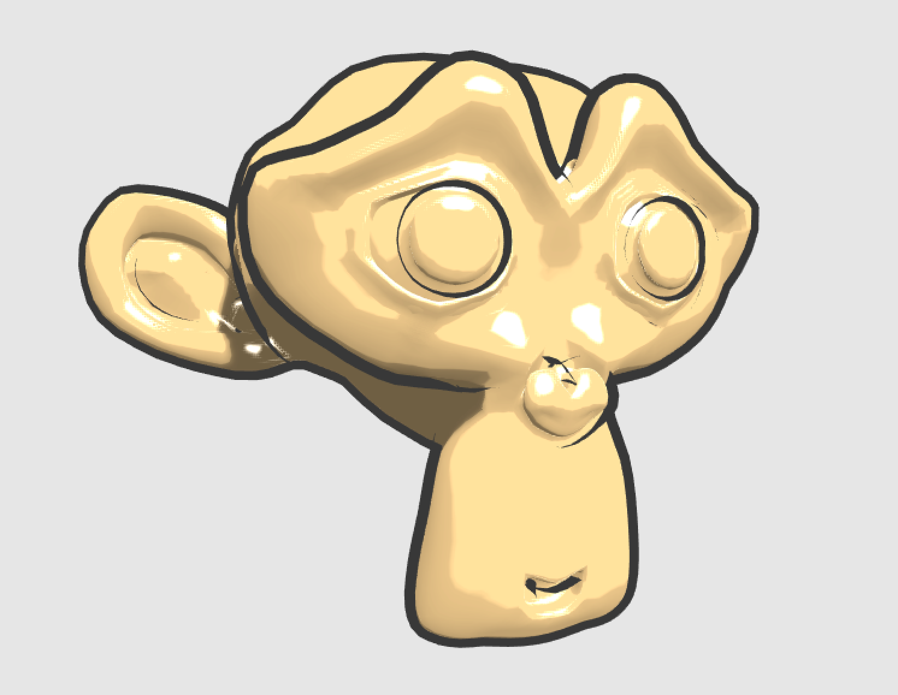
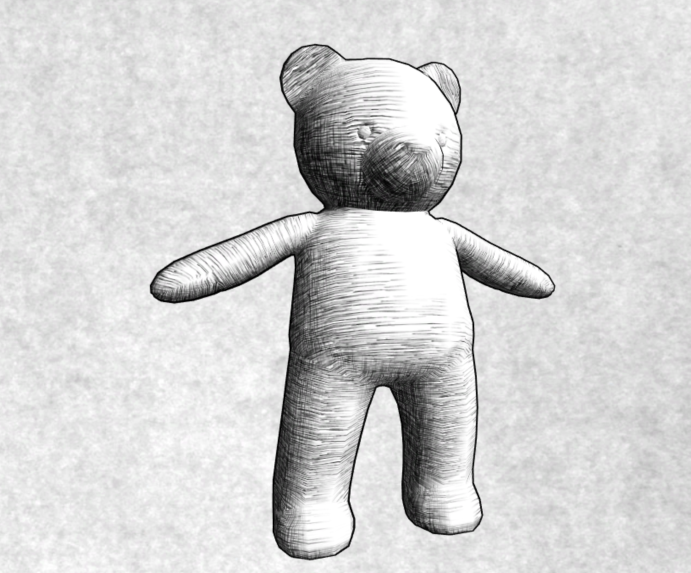

游戏渲染一般都以**照相写实主义（photorealism）**作为主要目标，但也有许多游戏使用**非真实感渲染（Non-Photorealistic Rendering，NPR）**的方法来渲染游戏画面。

非真实感渲染的**主要目标**：**使用一些渲染方法使得画面达到和某些特殊的绘画风格相似的效果**，例如卡通、水彩风格等。

# 卡通风格的渲染

卡通风格是**游戏中常见的一种渲染风格**，使用这种风格的游戏画面通常有一些**共有的特点**，**物体都被黑色的线条描边**，以及**分明的明暗变化**等。

实现卡通渲染有很多方法，其中之一就是使用**基于色调的着色技术（tone-based shading）**。实现中往往**使用漫反射系数对一张一维纹理进行采样**，以控制漫反射的色调。

卡通风格中，模型的高光往往是一块块**分界明显的纯色区域**。

除了**光照模型不同外**，卡通风格通常需要**在物体边缘部分绘制轮廓**（描边）。

## 渲染轮廓线

实时渲染中，**轮廓线渲染**是应用非常广泛的一种效果。

《Real Time Rendering》把绘制模型轮廓线的方法分成五种类型：

1. **基于观察角度和表面法线的轮廓线渲染**。使用**视角方向和表面法线的点乘结果**来得到轮廓线的信息，可以在一个Pass中就得到渲染结果，但模型渲染出来的描边效果不尽人意。
2. **过程式几何轮廓线渲染**。使用两个Pass渲染，第一个Pass渲染背面的面片，并使用这些技术让它的轮廓可见；第二个Pass再正常渲染正面的面片。优点快速有效，并且适用于绝大多数表面平滑的模型。缺点是不适合类似于立方体这样平整的模型。
3. **基于图像处理的轮廓线渲染**。优点在于可以适用于任何类型的模型，但一些深度和法线变化很小的轮廓无法被检测出来，例如桌子上的纸张。
4. **基于轮廓边检测的轮廓线渲染**。上述方法的最大问题是**无法控制轮廓线的风格渲染**，对于一些情况，希望可以渲染出独特风格的轮廓线，例如**水墨风格**等。希望检测出精确的轮廓边，然后直接渲染它们。检测一条边是否是轮廓边的公式很简单，只需检查和这条边相邻的两个三角面片是否满足如下条件：

$$
(n_{0}\cdot v > 0) \ne (n_{1}\cdot v > 0)	\tag{1}
$$

其中，$n_{0}$和$n_{1}$分别表示两个相邻三角面片的法向量，$v$是从视角到该边上任意顶点的方向。

上述公式的本质在于检查两个相邻的三角面片是否一个朝正面，一个朝背面。可以在**几何着色器（Geometry Shader）**的帮助下实现上面的检测过程。缺点**实现复杂**，**动作连贯性不好**（由于是逐帧单独提取轮廓，因此帧与帧之间会出现跳跃性）。

5. **混合上述几种渲染方法**。首先找到精确的轮廓边，把模型和轮廓边渲染到纹理中，再使用图像处理的方法识别出轮廓线，并在图像空间下进行**风格化渲染**。

使用**过程式几何轮廓线渲染的方法**对模型进行轮廓描边，使用两个Pass渲染模型：

- 第一个Pass中，使用轮廓线颜色渲染整个背面的面片，并在视角空间下把模型顶点沿着法线方向向外扩张一段距离，以此让背部轮廓线可见。

    ```c++
    viewPos = viewPos + viewNormal * _Outline;
    ```

- 如果**直接使用顶点法线进行扩展**，对于一些内凹的模型，可能发生**背面面片遮挡正面面片**的情况。为了尽可能防止出现这样的情况，**在扩张背面顶点之前，首先对顶点法线的z分量进行处理**，使它们等于一个定值，然后**把法线归一化后再对顶点进行扩张**。这样的好处在于，扩展后的背面更加扁平化，从而降低遮挡正面面片的可能性。

    ```c++
    viewNormal.z = -0.5;
    viewNormal = normalize(viewNormal);
    viewPos = viewPos + viewNormal * _Outline;
    ```

## 添加高光

卡通风格中的高光往往是**模型上一块块分界明显的纯色区域**。为了实现这种效果，就不能再使用简单的光照模型。

**Blinn-Phong模型：**使用法线点乘光照方向以及视角方向和的一半，再和另一个参数进行指数操作得到高光反射系数。

```c++
float spec = pow(max(0, dot(normal, halfDir)), _Gloss);
```

对于卡通渲染需要的高光反射模型，同样需要计算`normal`和`halfDir`的点乘结果，之后需要**把该值与一个阈值进行比较**，如果小于该阈值，则高光反射系数为`0`，否则返回`1`。

```c++
float spec = dot(worldNormal, worldHalfDir);
spec = step(threshold, spec);
```

其中，`step`函数接受两个参数，**第一个参数是参考值**，**第二个参数是待比较的数值**。如果第二个参数大于等于第一个参数，则返回`1`，否则返回`0`。

这种粗暴的判断方法会在**高光区域的边界造成锯齿**（高光区域的边缘不是平滑渐变的，而是**由0突变到1**），可以在边界处很小的一块区域内，进行平滑处理：

```c++
float spec = dot(worldNormal, worldHalfDir);
spec = lerp(0, 1, smoothstep(-w, w, spec - threshold));
```

此处，没有使用`step`函数返回0或1，而是使用CG的`smoothstep`函数。其中，`w`是一个很小的值，当`spec-threshold`小于`-w`时，返回`0`，大于`w`时，返回`1`，否则在`0`到`1`之间进行插值。

这样可以在`[-w,w]`区间内，即高光区域的边界处，得到一个从`0`到`1`平滑变化的`spec`值，从而实现抗锯齿的目的。尽管可以把`w`设为一个很小的定值，但在本例中，选择使用邻域像素之间的近似导数值，可以通过CG的`fwidth`函数来得到。

**卡通渲染中的高光往往有更多个性化的需要**，例如，很多卡通高光特效希望可以随意伸缩、方块化光照区域。

## 实现

1. Unity中新建一个场景，默然情况下场景包含一个摄像机和一个平行光，并且使用了内置的天空盒子。在`Window->Lighting->Skybox`中去掉场景中的天空盒子。
2. 新建一个材质，名为`ToonShadingMat`。
3. 新建一个Unity Shader，名为`ToonShading`。把新的Unity Shader赋给第2步中创建的材质。
4. 在场景中拖曳一个`Suzanne`模型，并把第2步中的材质赋给该模型。
5. 保存场景。

编写`ToonShading`：

```c++
// Upgrade NOTE: replaced '_Object2World' with 'unity_ObjectToWorld'
// Upgrade NOTE: replaced 'mul(UNITY_MATRIX_MVP,*)' with 'UnityObjectToClipPos(*)'

Shader "Unity Shaders Book/Chapter 14/Toon Shading" {
	Properties {
		_Color ("Color Tint", Color) = (1, 1, 1, 1)
		_MainTex ("Main Tex", 2D) = "white" {}
		// _Ramp用于控制漫反射色调的渐变纹理
		_Ramp ("Ramp Texture", 2D) = "white" {}
		// _Outline用于控制轮廓线宽度
		_Outline ("Outline", Range(0, 1)) = 0.1
		// _OutlineColor用于控制轮廓线颜色
		_OutlineColor ("Outline Color", Color) = (0, 0, 0, 1)
		// _Specular高光反射颜色
		_Specular ("Specular", Color) = (1, 1, 1, 1)
		// _SpecularScale用于计算高光反射时使用的阈值
		_SpecularScale ("Specular Scale", Range(0, 0.1)) = 0.01
	}
    SubShader {
		Tags { "RenderType"="Opaque" "Queue"="Geometry"}
		
		// 定义渲染轮廓线需要的Pass
		Pass {
			// 该轮廓线值渲染背面的三角面片,因此需要设置正确的渲染状态
			// 使用NAME命令为该Pass定义了名称
			NAME "OUTLINE"
			
			// 使用Cull指令把正面的三角面片提出,而只渲染背面
			Cull Front
			
			CGPROGRAM
			
			#pragma vertex vert
			#pragma fragment frag
			
			#include "UnityCG.cginc"
			
			float _Outline;
			fixed4 _OutlineColor;
			
			struct a2v {
				float4 vertex : POSITION;
				float3 normal : NORMAL;
			}; 
			
			struct v2f {
			    float4 pos : SV_POSITION;
			};
			
			v2f vert (a2v v) {
				v2f o;
				
				// 顶点着色器中,首先把顶点和法线变换到视角空间下
				// 为了让描边可以在观察空间达到最好的效果
				float4 pos = mul(UNITY_MATRIX_MV, v.vertex); 
				float3 normal = mul((float3x3)UNITY_MATRIX_IT_MV, v.normal);  
				// 设置法线的z分量
				normal.z = -0.5;
				// 对其归一化后再将顶点沿其方向扩张,得到扩张后的顶点坐标
				// 对法线的处理是为了尽可能避免背面扩张后的顶点挡住正面的面片
				pos = pos + float4(normalize(normal), 0) * _Outline;
				// 把顶点中视角空间变换到裁剪空间
				o.pos = mul(UNITY_MATRIX_P, pos);
				
				return o;
			}
			
			float4 frag(v2f i) : SV_Target { 
				return float4(_OutlineColor.rgb, 1);               
			}
			
			ENDCG
		}
		
		// 定义光照模型所在的Pass,以渲染模型的正面
		Pass {
			// 光照模型需要使用Unity提供的光照信息
			// 需要为Pass进行相应的设置,并添加相应的编译指令
			Tags { "LightMode"="ForwardBase" }
			
			Cull Back
		
			CGPROGRAM
		
			#pragma vertex vert
			#pragma fragment frag
			
			#pragma multi_compile_fwdbase
		
			#include "UnityCG.cginc"
			#include "Lighting.cginc"
			#include "AutoLight.cginc"
			#include "UnityShaderVariables.cginc"
			
			fixed4 _Color;
			sampler2D _MainTex;
			float4 _MainTex_ST;
			sampler2D _Ramp;
			fixed4 _Specular;
			fixed _SpecularScale;
		
			struct a2v {
				float4 vertex : POSITION;
				float3 normal : NORMAL;
				float4 texcoord : TEXCOORD0;
				float4 tangent : TANGENT;
			}; 
		
			struct v2f {
				float4 pos : POSITION;
				float2 uv : TEXCOORD0;
				float3 worldNormal : TEXCOORD1;
				float3 worldPos : TEXCOORD2;
				SHADOW_COORDS(3)
			};
			
			v2f vert (a2v v) {
				v2f o;
				
				// 计算世界空间下的法线方向和顶点位置
				// 并使用Unity提供的内置宏SHADOW_COORDS和TRANSFER_SHADOW计算阴影所需的各个变量
				o.pos = UnityObjectToClipPos( v.vertex);
				o.uv = TRANSFORM_TEX (v.texcoord, _MainTex);
				o.worldNormal  = UnityObjectToWorldNormal(v.normal);
				o.worldPos = mul(unity_ObjectToWorld, v.vertex).xyz;
				
				TRANSFER_SHADOW(o);
				
				return o;
			}
			
			float4 frag(v2f i) : SV_Target { 
				fixed3 worldNormal = normalize(i.worldNormal);
				// 计算光照模型中需要的各个方向矢量,并对它们进行归一化处理
				fixed3 worldLightDir = normalize(UnityWorldSpaceLightDir(i.worldPos));
				fixed3 worldViewDir = normalize(UnityWorldSpaceViewDir(i.worldPos));
				fixed3 worldHalfDir = normalize(worldLightDir + worldViewDir);
				
				fixed4 c = tex2D (_MainTex, i.uv);
				// 计算材质的反射率albedo
				fixed3 albedo = c.rgb * _Color.rgb;
				
				// 计算环境光照ambient
				fixed3 ambient = UNITY_LIGHTMODEL_AMBIENT.xyz * albedo;
				
				// 使用内置的宏UNITY_LIGHT_ATTENUATION计算当前世界坐标下的阴影值
				UNITY_LIGHT_ATTENUATION(atten, i, i.worldPos);
				
				fixed diff =  dot(worldNormal, worldLightDir);
				// 计算半郎伯漫反射系数,并和阴影值相乘得到最终的漫反射系数
				diff = (diff * 0.5 + 0.5) * atten;
				
				// 使用该漫反射系数对渐变纹理_Ramp进行采样,并将结果和材质的反射率,光照颜色相乘,作为最后的的漫反射光照
				fixed3 diffuse = _LightColor0.rgb * albedo * tex2D(_Ramp, float2(diff, diff)).rgb;
				
				fixed spec = dot(worldNormal, worldHalfDir);
				fixed w = fwidth(spec) * 2.0;
				// 高光使用fwidth进行边界抗锯齿处理,并将计算得到的高光反射系数和高光反射颜色相乘,得到高光反射的光照部分
				// 使用step(0.0001, _SpecularScale),这是因为当_SpecularScale为0时,可以完全消除高光反射的光照
				fixed3 specular = _Specular.rgb * lerp(0, 1, smoothstep(-w, w, spec + _SpecularScale - 1)) * step(0.0001, _SpecularScale);
				
				// 最后返回环境光照,漫反射光照和高光反射光照叠加的结果
				return fixed4(ambient + diffuse + specular, 1.0);
			}
		
			ENDCG
		}
	}
	// 设置合适的Fallback
	FallBack "Diffuse"
}
```




# 素描风格的渲染

1. Unity中新建一个场景，默然情况下场景包含一个摄像机和一个平行光，并且使用了内置的天空盒子。在`Window->Lighting->Skybox`中去掉场景中的天空盒子。
2. 新建一个材质，名为`HatchingMat`。
3. 新建一个Unity Shader，名为`Hatching`。把新的Unity Shader赋给第2步中创建的材质。
4. 在场景中拖曳一个`TeddyBear`模型，并把第2步中的材质赋给该模型。
5. 保存场景。

编写`ToonShading`：

```c++
// Upgrade NOTE: replaced '_Object2World' with 'unity_ObjectToWorld'
// Upgrade NOTE: replaced 'mul(UNITY_MATRIX_MVP,*)' with 'UnityObjectToClipPos(*)'

///
///  Reference: 	Praun E, Hoppe H, Webb M, et al. Real-time hatching[C]
///						Proceedings of the 28th annual conference on Computer graphics and interactive techniques. ACM, 2001: 581.
///
Shader "Unity Shaders Book/Chapter 14/Hatching" {
	Properties {
		// _Color用于控制模型颜色的属性
		_Color ("Color Tint", Color) = (1, 1, 1, 1)
		// _TileFactor是纹理的平铺系数,值越大,模型上的素描线条越密
		_TileFactor ("Tile Factor", Float) = 1
		_Outline ("Outline", Range(0, 1)) = 0.1
		// _Hatch0至_Hatch5对应了渲染时使用的6张素描纹理,它们的线条密度依次增大
		_Hatch0 ("Hatch 0", 2D) = "white" {}
		_Hatch1 ("Hatch 1", 2D) = "white" {}
		_Hatch2 ("Hatch 2", 2D) = "white" {}
		_Hatch3 ("Hatch 3", 2D) = "white" {}
		_Hatch4 ("Hatch 4", 2D) = "white" {}
		_Hatch5 ("Hatch 5", 2D) = "white" {}
	}
	
	SubShader {
		Tags { "RenderType"="Opaque" "Queue"="Geometry"}
		
		// 用于素描风格往往也需要在物体周围渲染轮廓线,因此直接使用之前的渲染轮廓线的Pass
		// Unity会把所有Pass的名称转换成大写模式,所以需要在UsePass中使用大写格式的Pass名称
		UsePass "Unity Shaders Book/Chapter 14/Toon Shading/OUTLINE"
		
		// 定义光照模型所在的Pass
		Pass {
			Tags { "LightMode"="ForwardBase" }
			
			CGPROGRAM
			
			#pragma vertex vert
			#pragma fragment frag 
			
			#pragma multi_compile_fwdbase
			
			#include "UnityCG.cginc"
			#include "Lighting.cginc"
			#include "AutoLight.cginc"
			#include "UnityShaderVariables.cginc"
			
			fixed4 _Color;
			float _TileFactor;
			sampler2D _Hatch0;
			sampler2D _Hatch1;
			sampler2D _Hatch2;
			sampler2D _Hatch3;
			sampler2D _Hatch4;
			sampler2D _Hatch5;
			
			struct a2v {
				float4 vertex : POSITION;
				float4 tangent : TANGENT; 
				float3 normal : NORMAL; 
				float2 texcoord : TEXCOORD0; 
			};
			
			// 需要在顶点着色器中计算6张纹理的混合权重
			struct v2f {
				float4 pos : SV_POSITION;
				float2 uv : TEXCOORD0;
				// 一共声明6张纹理,意味着需要6个混合权重,把它们存储在两个fixed3类型的变量中
				fixed3 hatchWeights0 : TEXCOORD1;
				fixed3 hatchWeights1 : TEXCOORD2;
				// 为了添加阴影效果,声明worldPos变量
				float3 worldPos : TEXCOORD3;
				// 使用SHADOW_COORDS宏声明阴影纹理的采样坐标
				SHADOW_COORDS(4)
			};
			
			v2f vert(a2v v) {
				v2f o;
				
				// 对顶点进行基本的坐标变换
				o.pos = UnityObjectToClipPos(v.vertex);
				
				// 使用_TileFactor得到纹理采样坐标
				o.uv = v.texcoord.xy * _TileFactor;
				
				// 在计算6张纹理的混合权重之前,首先需要计算逐顶点光照
				// 使用世界空间下的光照方向和法线方向得到漫反射系数diff
				fixed3 worldLightDir = normalize(WorldSpaceLightDir(v.vertex));
				fixed3 worldNormal = UnityObjectToWorldNormal(v.normal);
				fixed diff = max(0, dot(worldLightDir, worldNormal));
				
				// 把权重初始化为0,并把diff缩放到[0,7]范围,得到hatchFactor
				o.hatchWeights0 = fixed3(0, 0, 0);
				o.hatchWeights1 = fixed3(0, 0, 0);
				
				float hatchFactor = diff * 7.0;
				
				// 把[0,7]的区间均匀划分为7个子区间
				// 通过判断]atchFactor所处的子区间来计算对应的纹理混合权重
				if (hatchFactor > 6.0) {
					// Pure white, do nothing
				} else if (hatchFactor > 5.0) {
					o.hatchWeights0.x = hatchFactor - 5.0;
				} else if (hatchFactor > 4.0) {
					o.hatchWeights0.x = hatchFactor - 4.0;
					o.hatchWeights0.y = 1.0 - o.hatchWeights0.x;
				} else if (hatchFactor > 3.0) {
					o.hatchWeights0.y = hatchFactor - 3.0;
					o.hatchWeights0.z = 1.0 - o.hatchWeights0.y;
				} else if (hatchFactor > 2.0) {
					o.hatchWeights0.z = hatchFactor - 2.0;
					o.hatchWeights1.x = 1.0 - o.hatchWeights0.z;
				} else if (hatchFactor > 1.0) {
					o.hatchWeights1.x = hatchFactor - 1.0;
					o.hatchWeights1.y = 1.0 - o.hatchWeights1.x;
				} else {
					o.hatchWeights1.y = hatchFactor;
					o.hatchWeights1.z = 1.0 - o.hatchWeights1.y;
				}
				
				// 计算顶点的世界坐标
				o.worldPos = mul(unity_ObjectToWorld, v.vertex).xyz;
				
				// 使用TRANSFER_SHADOW宏计算阴影纹理的采样坐标
				TRANSFER_SHADOW(o);
				
				return o; 
			}
			
			fixed4 frag(v2f i) : SV_Target {			
				// 得到6张纹理的混合权重之后,对每张纹理进行采样并和它们对应的权重值相乘得到每张纹理的采样颜色
				fixed4 hatchTex0 = tex2D(_Hatch0, i.uv) * i.hatchWeights0.x;
				fixed4 hatchTex1 = tex2D(_Hatch1, i.uv) * i.hatchWeights0.y;
				fixed4 hatchTex2 = tex2D(_Hatch2, i.uv) * i.hatchWeights0.z;
				fixed4 hatchTex3 = tex2D(_Hatch3, i.uv) * i.hatchWeights1.x;
				fixed4 hatchTex4 = tex2D(_Hatch4, i.uv) * i.hatchWeights1.y;
				fixed4 hatchTex5 = tex2D(_Hatch5, i.uv) * i.hatchWeights1.z;
				
				// 计算纯白在渲染中的贡献度,通过从1中减去所有6张纹理的权重来得到的
				// 因为素描中往往有留白的部分,因此希望在最后的渲染中光照最亮的部分是纯白色
				fixed4 whiteColor = fixed4(1, 1, 1, 1) * (1 - i.hatchWeights0.x - i.hatchWeights0.y - i.hatchWeights0.z - 
							i.hatchWeights1.x - i.hatchWeights1.y - i.hatchWeights1.z);
				
				// 混合各个颜色值
				fixed4 hatchColor = hatchTex0 + hatchTex1 + hatchTex2 + hatchTex3 + hatchTex4 + hatchTex5 + whiteColor;
				
				// 并和阴影atten,模型颜色_Color相乘后返回最终的渲染结果
				UNITY_LIGHT_ATTENUATION(atten, i, i.worldPos);
								
				return fixed4(hatchColor.rgb * _Color.rgb * atten, 1.0);
			}
			
			ENDCG
		}
	}
	FallBack "Diffuse"
}
```


