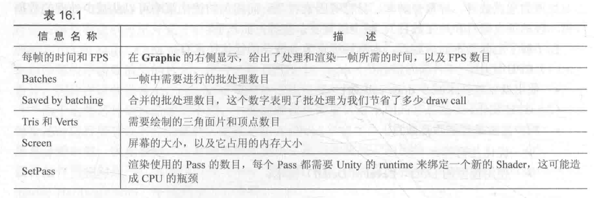

> 程序优化的第一条准则：**不要优化**。
>
> 程序优化的第二条准则（仅针对专家！）：**不要优化**。
>
> ——Michael A. Jackson

对问题认识不清以及过度优化往往会让事情变得更加复杂，产生更多的程序错误。

然而，如果在游戏开发过程中从来都没有考虑优化，则**结果往往是惨不忍睹的**。

**正确的做法：**从一开始就把优化当成游戏设计中一部分。

# 移动平台的特点

与PC平台相比，移动平台上的GPU架构有很大的不同（由于处理资源等条件的限制，移动设备上的GPU架构专注于尽可能**使用小的带宽和功能**）。

>例如，为了尽可能移除那些隐藏的表面，减少**overdraw**（一个像素被绘制多次），PowerVR芯片（通常用于iOS设备和某些Android设备）使用**基于瓦片的延迟渲染**（Tiled-based Deferred Rendering, TBDR）架构，把所有的渲染图像装入一个个瓦片（tile）中，再由硬件找到可见的片元，而只有这些可见片元才会执行片元着色器。
>
>另一些基于瓦片的GPU架构，如Adreno（高通的芯片）和Mali（ARM的芯片）则会使用Early-Z或相似的技术进行一个低精度的深度检测，来剔除那些不需要渲染的片元。
>
>还有Tegra（英伟达的芯片）则使用传统的架构设计，因此在这些设备上，overdraw更可能造成性能的瓶颈。

由于不同芯片架构造成的不同，一些游戏往往需要针对不同的芯片发布不同的版本，以便对每个芯片进行更有针对性的优化。


# 影响性能的因素

对于一个游戏来说，主要使用两种计算资源：**CPU和GPU**。

他们会互相合作，让游戏在预期的**帧率（CPU）和分辨率（GPU）**下工作。

- **CPU**
    - 每一帧中过多的**draw call**（主要因素）
        - draw call：CPU在每次通知GPU进行渲染之前，都需要提前准备好顶点数据（位置、法线、颜色、纹理坐标等），然后调用一系列API把它们放到GPU可以访问到的指定位置，最后调用一个绘制命令（产生一个draw call）。
        - 每次调用draw call时，CPU往往都需要**改变很多渲染状态的设置**（这些操作都是非常耗时的）。
        - 如果一帧中需要的draw call数目过多的话，就会导致CPU把大部分时间都花费在提交draw call的工作上面了。
    - 复杂的脚本或者物理模拟（物理、布料模拟、蒙皮、粒子模拟）
- **GPU**（负责整个渲染流水线，从处理CPU传递过来的模型数据开始，进行顶点、片元着色器等一系列工作，最后输出屏幕上的每个像素）
    - 顶点处理
        - 过多的顶点
        - 过多的逐顶点计算
    - 片元处理
        - 过多的片元（由于**分辨率或overdraw**造成）
        - 过多的逐片元计算
- **带宽**
    - 使用了尺寸很大且未压缩的纹理
    - 分辨率过高的帧缓存

了解上述内容后，可以采用的**优化技术**有：

- CPU优化
    - 使用**批处理技术**减少draw call数目
- GPU优化
    - 减少需要处理的顶点数目
        - 优化几何体
        - 使用模型的LOD（Level of Detail）技术
        - 使用遮挡剔除（Occlusion Culling）技术
    - 减少需要处理的片元数目
        - 控制绘制顺序
        - 警惕透明物体
        - 减少实时光照
    - 减少计算复杂度
        - 使用Shader的LOD（Level of Detail）技术
        - 代码方面的优化
    - 节省内存带宽
        - 减少纹理大小
        - 利用分辨率缩放


# Unity中的渲染分析工具

开始优化之前，**需要知道哪个步骤造成了性能瓶颈**。——可以利用Unity提供的一些渲染分析工具来实现。

## 渲染统计窗口

渲染统计窗口（Rendering Statistics Window）**显示当前游戏的各个渲染统计变量**。

可以通过在**Game视图**右上方的菜单中单击**Stats按钮**来打开它。


渲染统计窗口主要包含3方面的信息：

- 音频（Audio）
- 图像（Graphics）
- 网络（Network）

渲染统计窗口中显示了很多重要的渲染数据，例如：**FPS**、**批处理数目**、**顶点**和**三角网格的数目**。

下表列出了渲染统计窗口中显示的各个信息：




**Batches**和**Saved by batching**更容易让开发者理解批处理的优化结果。

如果想看draw call的数目等其他更加详细的数据，可以通过Unity编辑器的性能分析器来查看。

## 性能分析器的渲染区域

单击`Window->Profiler`来打开Unity的**性能分析器（Profiler）**。

性能分析器中的渲染区域（Rendering Area）提供更多关于渲染的统计信息。


性能分析器显示了绝大部分在渲染统计窗口中提供的信息，例如：

- 绿线显示批处理数目
- 蓝线显示Pass数目

同时还给出了许多其他非常有用的信息，例如，**draw call数目**、**动态批处理/静态批处理数目**、**渲染纹理的数目**和**内存占用**等。

结合渲染统计窗口和性能分析器，可以查看与渲染相关的绝大多数重要的数据。

**注意：**性能分析器给出的draw call数目和批处理数目、Pass数目并不相等，并且看起来好像要大于估算的数目，这是因为Unity在背后需要进行很多工作（例如，初始化各个缓存、为阴影更新深度纹理和阴影映射纹理等，因此需要花费比“预期”更多的draw call）。

## 帧调试器

**帧调试器（Frame Debugger）**可以帮助查看每一个draw call的工作，通过`Window->Frame Debugger`打开。

在该窗口中，**可以清楚地看到每一个draw call的工作和结果**：


帧调试器的调试面板上显示了渲染这一帧所需要的所有的渲染事件，本例中，**事件数目为5**，其中包含**3个draw call事件**（其他渲染事件多为清空缓存等）。

通过单击面板上的每个事件，可以**在Game视图查看该事件的绘制结果**，同时渲染统计面板上的数据也会显示截止到当前事件为止的各个渲染统计数据。

## 其他性能分析工具

对于移动平台上的游戏来说，更希望得到在真机上运行游戏时的性能数据，此时，Unity提供的各个工具就无法满足需求了。

- 对于**Android**来说，**高通的Adreno分析工具**可以对不同的测试机进行详细的性能分析。**英伟达提供NVPerfHUD工具**得到几乎所有需要的性能分析数据（每个draw call的GPU时间，每个Shader花费的cycle数目）。
- 对于**iOS**来说，Unity内置的分析器可以得到整个场景花费的GPU时间。**PowerVRAM的PVRUniSCo shader分析器**可以给出一个大致的性能评估。Xcode中的OpenGL ES Driver Instruments可以给出一些宏观上的性能信息（设备利用率、渲染器利用率等）。
    - 相比较于Android平台，对iOS的性能分析更加困难（工具较少），而且PowerVR芯片采用了基于瓦片的延迟渲染其，**想要得到每个draw call花费的GPU时间是几乎不可能的**。


# 减少draw call数目

**批处理（batching）**：减少每一帧需要的draw call数目。

为了把一个对象渲染到屏幕上，CPU需要**检查哪些光源影响了该物体**，**绑定shader并设置它的参数**，再把渲染命令发送给GPU。当场景中包含大量对象时，这些操作就会非常耗时。

**极端的例子：**渲染一千个三角形，把它们按一千个单独的网格进行渲染所花费的时间要远远大于渲染一个包含了一千个三角形的网格。

在这两种情况下，GPU的性能消耗其实没多大区别，但CPU的draw call数目就会成为性能瓶颈。

**批处理的思想**：每次面对draw call时尽可能多地处理多个物体。

>什么样的物体可以一起处理？使用同一个材质的物体。
>
>对于使用同一个材质的物体，它们之间的不同仅仅在于顶点数据的差别，可以把这些顶点数据合并在一起，再一起发送给GPU，就可以完成一次批处理。

## 动态批处理

如果场景中有一些模型**共享了同一个材质并满足一些条件**，Unity就可以自动把它们进行批处理，从而只需要花费一个draw call就可以渲染所有的模型。

**动态批处理基本原理：**每一帧把可以进行批处理的模型网格进行合并，并把合并后模型数据传递给GPU，然后使用同一个材质对其渲染。

**好处：**经过批处理的物体仍然可以移动，这是由于在处理每帧时Unity都会重新合并一次网格。

虽然**Unity的动态批处理不需要进行任何额外工作**，但只有满足条件的模型和材质才可以被动态处理。

（**注意：**随着Unity版本的变化，这些条件也会有一些改变。）

**条件限制：**

- 能够进行动态批处理的**网格顶点属性规模要小于900**。如果Shader中需要使用顶点位置、法线和纹理坐标这3个顶点属性，则想要让模型能够被动态批处理，它的顶点数目不能超过300。（数字在新的Unity版本中可能会有变化）
- 所有对象都**需要使用同一个缩放尺度**（可以是`(1,1,1)`、`(1,2,3)`、`(1.5,1.4,1.3)`等，但必须都一样）。例外情况是**，如果所有物体都使用了不同的非统一缩放，则它们也是可以被动态批处理的**。
- **光照纹理（lightmap）**的物体需要小心处理。这些物体需要额外的渲染参数，例如，在**光照纹理上的索引**、**偏移量和缩放信息**等。为了让这些物体可以被动态批处理，需要保证它们指向光照纹理中的同一个位置。
- **多Pass 的Shader**会中断批处理。前向渲染中，有时需要使用额外的Pass来为模型添加更多的光照效果，但这样一来模型就不会被动态批处理了。

## 静态批处理

静态批处理**适用于任何大小的几何模型**。

**实现原理：**只在运行开始阶段，把需要进行静态批处理的模型合并到一个新的网格结构中，意味着这些模型不可以在运行时刻被移动。（但由于它只进行一次合并操作，因此比动态批处理更加高效）

**缺点：**往往需要占用更多的内存来存储合并后的几何结构。（如果在静态批处理前一些物体共享了相同的网格，则在内存中每一个物体都会对应一个该网格的复制品，即**一个网格会变成多个网格再发送给GPU**。如果这类使用同一网格的对象很多，就会成为一个性能瓶颈。）

>如果在一个使用了1000个相同树模型的森林中使用静态批处理，则会多使用1000倍的内存。
>
>此时，解决方法要么忍受这种牺牲内存换取性能的方法，要么不使用静态批处理，而使用动态批处理技术（小心控制模型的顶点属性数目），或者自己编写批处理的方法。

静态批处理的实现非常简单，只需要把物体面板上的**static**复选框选上即可（实际上只需要勾选Batching Static即可）。


内部实现上，Unity首先**把这些静态物体变换到世界空间下**，然后为它们构建一个更大的顶点和索引缓存。

对于使用同一材质的物体，Unity只需要调用一个**draw call**就可以绘制全部物体，而对于使用不同材质的物体，静态批处理可以减少这些draw call之间的状态切换，而这些切换往往是费时的操作。

如果场景中包含除了平行光以外的其他光源，并且在shader中定义了额外的Pass来处理它们，这些额外的Pass部分是不会被处理的。

但是，处理平行光的Base Pass部分仍然会被静态批处理，因此，仍然可以节省两个draw call。

## 共享材质

无论是动态批处理还是静态批处理，都**要求模型之间共享同一个材质**。

但不同的模型之间总会需要有不同的渲染属性，例如，使用不同的纹理、颜色等，此时需要使用一些策略来尽可能地合并材质。

- 如果两个材质只有使用的纹理不同，可以把这些纹理合并到一张更大的纹理中，这张更大的纹理被称为是一张**图集（atlas）**。一旦使用了同一张纹理，就可以使用同一个材质，再使用不同的采样坐标对纹理采样即可。
- 若除了纹理不同之外，不同物体在材质上还有一些微小的参数变化（颜色不同，浮点属性不同），但不管是动态批处理还是静态批处理，它们的前提都是要使用同一个材质（指向的材质必须是**同一实体**）。这意味着，只需调整参数，就会影响到所有使用这个材质的对象。（如果是微小的调整，常用的方法是使用网格的顶点数据来存储这些参数）

经过批处理后的物体会被处理成更大的**VBO**发送给GPU，**VBO中的数据可以作为输入传递给顶点着色器**，因此可以巧妙地对VBO中的数据进行控制，从而达到不同效果的目的。

>森林场景中所有的树使用了同一种材质，希望它们可以通过批处理来减少draw call，但不同树的颜色可能不同，此时可以利用网格的顶点颜色数据来调整。

如果需要在脚本中访问共享材质，应该使用`Renderer.sharedMaterial`来保证修改的是和其他物体共享的材质，但这意味着修改会应用到所有使用该材质的物体上。

另一个类似的API是`Renderer.material`，如果使用其修改材质，Unity会创建一个该材质的复制品，从而破坏批处理在物体上的应用。

## 批处理的注意事项

- 尽可能选择**静态批处理**，但得时刻小心对内存的消耗，并且记住经过静态批处理的物体不可以再被移动。
- 如果无法进行静态批处理，而要使用动态批处理的话，要**小心各种条件限制**，例如，尽可能让这样的物体少并且尽可能让这些物体包含少量的顶点属性和顶点数目。
- 对于游戏中的小道具，例如可以捡拾的金币等，使用动态批处理。
- 对于包含动画的这类物体，无法全部使用静态批处理，但其中如果有不动的部分，可以把这部分标识成`Static`。

由于批处理需要把多个模型变换到世界空间下再合并它们，因此，**如果shader中存在一些基于模型空间下的坐标的运算**，则往往会得到错误的结果。

- 解决办法：在shader中使用`DisableBatching`标签来强制使用该Shader的材质不会被批处理。
- 使用**半透明材质的物体**通常需要使用严格的从后往前的绘制顺序来保证透明混合的正确性。对于这些物体，Unity会首先保证它们的绘制顺序，再尝试对它们进行批处理。（当绘制顺序无法满足时，批处理无法在这些物体上被成功应用）


# 减少需要处理的顶点数目

## 优化几何体

3D游戏制作通常都是由模型制作开始的。

在建模时，有一条规则：**尽可能减少模型中三角面片的数目**。一些对于模型没有影响、或是肉眼非常难察觉到区别的顶点都要尽可能去掉。为了**尽可能减少模型中的顶点数目**，美工人员往往需要**优化网格结构**。

Unity渲染统计窗口中，可以查看渲染当前帧需要的**三角面片数目和顶点数目**。（注意：Unity中显示的数目往往要多于模型软件里显示的顶点数，**通常Unity中显示的数目要大很多**。）

>原因：
>
>三维软件更多地是站在人类的角度理解顶点的，即组成几何体的每一个点就是一个单独的点。而Unity是站在GPU的角度（有时需要把一个顶点拆分成两个或更多的顶点）上去计算顶点数的。
>
>这种把顶点一分为多的原因：
>
>1. 为了分离纹理坐标（uv splits）
>2. 产生平滑的分界（smoothing splits）
>
>本质：对于GPU来说**，顶点的每一个属性和顶点之间必须是一对一的关系**。而分离纹理坐标，是因为建模时一个顶点的纹理坐标有多个。
>
>例如，对于一个立方体，它的6个面之间虽然使用了一些相同的顶点，但在不同面上，同一个顶点的纹理坐标可能并不相同。对于GPU来说，这是不可理解的。因此必须把这个顶点拆分成多个具有不同纹理坐标的顶点。而平滑边界也是类似的，不同的是，此时一个顶点可能会对应多个法线信息或切线信息。
>
>通常是因为我们要决定一个边是一条**硬边（hard edge）**还是一条**平滑边（smooth edge）**。

对于GPU来说，本质上只关心有多少个顶点，因此，**尽可能减少顶点的数目才是需要关心的事情**。

**移除不必要的硬边以及纹理衔接，避免边界平滑和纹理分离。**

## 模型的LOD技术

另一个减少顶点数目的方法是使用**LOD（Level of Detail）技术**。

**原理：**当一个物体离摄像机很远时，模型上的很多细节是无法被察觉到的。因此LOD允许当对象逐渐远离摄像机时，减少模型上的面片数量，从而提高性能。

Unity中，可以使用**LOD Group组件**来为一个物体构建一个LOD。

需要为同一个对象准备多个包含不同细节程序的模型，**然后把它们赋给LOD Group组件中的不同等级**，Unity就会自动判断当前位置上需要使用哪个等级的模型。

## 遮挡剔除技术

**遮挡剔除（Occlusion culling）技术**，用于消除那些在其他物体后面看不到的物件，这意味着不会浪费在计算那些看不到的顶点上，进而提升性能。

区分**遮挡剔除**和**摄像机的视锥体剔除（Frustum Culling）**：

- **视锥体剔除**只会剔除掉那些不在摄像机的视野范围内的对象，但不会判断视野中是否有物体被其他物体挡住。
- **遮挡剔除**使用一个虚拟的摄像机来遍历场景，从而构建一个潜在可见的对象集合的层级结构。运行时刻，每个摄像机将会使用这个数据来识别哪些物体是可见的，而哪些被其他物体挡住不可见。使用遮挡剔除技术，不仅可以减少处理的顶点数目，还可以**减少overdraw**，提高游戏性能。

**模型的LOD技术和遮挡剔除技术可以同时减少CPU和GPU的负荷**，CPU可以提交更少的draw call，而GPU需要处理的顶点和片元数目也减少了。


# 减少需要处理的片元数目

优化重点在于**减少overdraw（同一个像素被绘制了多次）**。

Unity提供查看overdraw的视图，可以在Scene视图左上方的下拉菜单中选中**Overdraw**即可。

实际上，这里的视图只是提供查看物体相互遮挡的层数，**并不是真正的最终屏幕绘制的overdraw**。

即，它显示的是，**如果没有使用任何深度测试和其他优化策略时的overdraw**。这种视图是通过把所有对象都渲染成一个透明的轮廓，通过查看透明颜色的累计程度，来判断物体之间的遮挡。（可以使用一些措施来防止这种最坏情况的出现）

## 控制绘制顺序

为了最大限度地避免overdraw，一个重要的优化策略就是**控制绘制顺序**。

由于**深度测试**的存在，如果可以保证物体都是从前往后绘制的，则就可以很大程度上减少overdraw。

因此，**在后面绘制的物体由于无法通过深度测试**，就不会再进行后面的渲染处理。

Unity中，渲染队列小于2500（“Background”、“Geometry”和“AlphaTest”）的对象都被认为是不透明（opaque）的物体，这些物体总体上是**从前往后绘制的**，而使用其他的队列（“Transparent”、“Overlay”）的物体，则是**从后往前绘制的**。（这意味着，可以尽可能地把物体的队列设置为不透明物体的渲染队列，而尽量避免使用半透明队列）

可以**充分利用Unity的渲染队列来控制绘制顺序**。

>第一人称射击游戏中，对于游戏中的主要人物角色，他们使用的shader往往比较复杂，但是，由于他们通常会挡住屏幕的很大一部分区域，因此可以先绘制它们（使用更小的渲染队列）。
>
>对于一些敌方角色，它们通常会出现在各种掩体后面，因此，可以在所有常规的不透明物体后面渲染它们（使用更大的渲染队列）。
>
>对于天空盒子来说，它几乎覆盖了所有的像素，而且它永远会出现在所有物体的后面，因此，它的队列可以设置为"Geometry+1"，这样，就可以保证不会因为它而造成overdraw。

**好的排序思想往往可以节省掉很多渲染时间。**

## 时刻警惕透明物体

半透明物体**没有开启深度写入**，如果想要得到正确的渲染效果，需要从后往前渲染，即，**半透明物体几乎一定会造成overdraw**。如果不注意，在一些机器上可能会造成严重的性能下降。

>例如，**对于GUI对象来说，它们大多被设置成了半透明**，如果屏幕中GUI占据的比例太多，而主摄像机又没有进行调整而是投影整个屏幕，那么GUI就会造成大量overdraw。

如果场景中包含大面积的半透明对象，**或者有很多层互相覆盖的半透明对象**（即便它们每个的面积可能都不大），或者是透明的粒子效果，在移动设备上也会造成大量的overdraw。（这是应该尽量避免的）

对于上述GUI的这种情况，可以**尽量减少窗口中GUI所占的面积**，如果实在无能为力，可以**把GUI的绘制和三维场景的绘制交给不同的摄像机**，而其中**负责三维场景的摄像机的视角范围尽量不要和GUI的相互重叠**。

（当然，这样会对游戏的美观度产生一定影响，因此可以在代码中对机器的性能进行判断，可以先关闭一些耗费性能的功能，如果发现机器表现非常良好，可以再尝试开启一些特效功能）

移动平台上，**透明度测试也会影响游戏性能**。虽然透明度测试**没有关闭深度测试**，但由于它的实现使用了**discard或clip**操作，而这些操作会导致一些硬件的优化策略失效。

>例如，PowerVR使用的基于瓦片的延迟渲染技术，为减少overdraw它会在调用片元着色器前就判断哪些瓦片被真正渲染的。但是，由于透明度测试在片元着色器中使用了`discard`函数改变了片元是否会被渲染的结果，因此，GPU就无法使用上述的优化策略了。
>
>即，只要在执行了所有的片元着色器后，GPU才知道哪些片元会被真正渲染到屏幕上，这样，原先那些可以减少overdraw的优化就都无效了。这种时候，**使用透明度混合的性能往往比使用透明度测试更好**。

## 减少实时光照和阴影

**实时光照对于移动平台是一种非常昂贵的操作**。

如果场景中**包含过多的点光源**，并且使用多个Pass的Shader，就很有可能会造成性能下降。

>例如，一个场景中如果包含了3个逐像素的点光源，而且使用了逐像素的Shader，则很有可能将**draw call数目（CPU的瓶颈）**提高三倍，同时也会增加**overdraw（GPU的瓶颈）**。

因为，对于逐像素的光源来说，**被这些光源照亮的物体需要被再渲染一次。**

同时，无论是静态批处理还是动态批处理，对于这种额外的处理逐像素光源的Pass都无法进行批处理，即，**批处理会中断**。

**游戏场景还是需要光照才能得到出色的画面效果**。但很多成功的移动平台的游戏，它们的画面效果看起来好像包含了很多光源，但其实这都是骗人的。这些游戏往往使用了**烘焙技术**，把光照提前烘焙到一张光照纹理（lightmap）中，然后**在运行时刻只需要根据纹理采样得到光照结果即可**。

另一个模拟光源的方法是使用**God Ray**。场景中很多小型光源的效果都是靠这种方法模拟的，它们一般并不是真的光源，很多情况是通过**透明纹理**模拟得到的。

在移动平台上，**一个物体使用的逐像素光源数目应该小于1**（不包括平行光），如果一定要使用更多的实时光，可以选择用**逐顶点光照**来代替。

**实时阴影**同样是一个非常消耗性能的效果，不仅是CPU需要提交更多的draw call，GPU也需要进行更多的处理。因此，应该尽量减少实时阴影，例如，**使用烘焙把静态物体的阴影信息存储到光照纹理中**，而只对场景中的动态物体使用适当的实时阴影。


# 节省带宽

**大量使用未经压缩的纹理**以及**使用过大的分辨率**都会造成由于带宽而引发的性能瓶颈。

## 减少纹理大小

使用**纹理图集**可以减少draw call的数目，而这些纹理的大小同样是一个需要考虑的问题。

所有纹理的**长宽比最好是正方形**，且**长宽值最好是2的整数幂**。（很多优化策略只有在这种时候才可以发挥最大效用）

尽可能使用**渐远纹理技术（mipmapping）**和**纹理压缩**，Unity中可以通过纹理导入面板来查看纹理的各个**导入属性**，通过把纹理类型设置为`Advance`，就可以自定义许多选项（例如是否生成多级渐远纹理（mipmap））。

>当勾选`Generate Mip Maps`选项后，Unity就会为同一张纹理创建出很多不同大小的小纹理，构成一个纹理金字塔。
>
>在游戏运行中，就可以根据距离物体的远近，来动态选择使用哪一个纹理。
>
>因此，距离物体很远的时候，就算使用了非常精细的纹理，肉眼也是分辨不出来的，此时，完全可是使用更小更模糊的纹理来代替，让GPU使用分辨率更小的纹理，大量节省访问的像素数目。

在某些设备上，关闭多级渐远纹理往往会造成严重的性能问题，因此，**除非确定该纹理不会发生缩放**（例如GUI和2D游戏中使用的纹理等）**都应该为纹理生成相应的多级渐远纹理。**

**纹理压缩同样可以节省带宽**，但对于像Android这样的平台，**有很多不同架构的GPU**，纹理压缩就变得有点复杂，因为不同的GPU架构有它自己的纹理压缩格式。

- PowerVRAM的PVRTC格式
- Tegra的DXT格式
- Adreno的ATC格式

所幸的是Unity可以根据不同的设备选择不同的压缩格式，需要**把纹理压缩格式设置为自动压缩即可**。

但是GUI类型的纹理是个例外，由于对画质的要求，不希望对这些纹理进行压缩。

## 利用分辨率缩放

**过高的屏幕分辨率**是造成性能下降的原因之一，尤其是对于很多低端手机，除了分辨率高，其他硬件条件并不尽人意，而这恰恰是游戏性能的**两个瓶颈**：

- 过大的屏幕分辨率
- 糟糕的GPU

因此，需要对于特定机器进行分辨率的缩放，可能会造成游戏效果的下降，但**性能和画面**之间永远是个需要权衡的话题。

Unity中设置屏幕分辨率可以直接调用`Screen.SetResolution`，实际使用中可能会遇到一些情况。

雨松MOMO有一篇文章可以参考。

https://www.xuanyusong.com/archives/3205


# 减少计算复杂度

计算复杂度同样也会影响游戏的渲染性能。

## Shader的LOD技术

Shader的LOD技术可以**控制使用的Shader等级**。

**原理：**只有Shader的LOD值小于某个设定的值，这个Shader才会被使用，而使用了那些超过设定值的Shader的物体将不会被渲染。

通常在SubShader中使用下面的语句来指明该shader的LOD值：

```c++
SubShader {
		Tags {"RenderType" = "Opaque"}
		LOD 200
}
```

也可以**在Unity Shader的导入面板**上看到该Shader使用的LOD值。

默认情况下，允许的LOD等级是**无限大的**，即，任何被当前显卡支持的Shader都可以被使用。

但是，在某些情况下可能需要去掉一些使用了而复杂计算的Shader渲染，此时，可以使用`Shader.maximumLOD`或`Shader.globalMaximumLOD`来设置允许的最大LOD值。

Unity内置的Shader使用了不同的LOD值：

- Diffuse的LOD为200
- Bumped Specular的LOD为400

## 代码方面的优化

实现游戏效果时，可以**选择在哪里进行特定的运算**。

通常来讲，游戏需要计算的对象、顶点和像素的数目排序是`对象数<顶点数<像素数`。

应该**尽可能把计算放在每个对象或逐顶点上**。

在具体的代码编写上，不同的硬件需要不同的处理，因此，**一些普遍的规则在某些硬件上可能并不成立**。

**注意：**通常Shader代码的优化并不那么直观，尤其是在一些平台上缺少相关的分析器，例如iOS平台。

尽可能**使用低精度的浮点值**进行运算。

- 最高精度的`float/highp`适用于存储顶点坐标等变量，但它的计算速度是最慢的，应该**尽量避免在片元着色器中使用这种精度进行计算**。
- `half/mediump`适用于一些标量、纹理坐标等变量，它的计算速度大约是`float`的两倍。
- `fixed/lowp`适用于绝大多数颜色变量和归一化后的方向矢量，在进行一些对精度要求不高的计算时，应该尽量使用这种精度的变量。它的计算速度大约是`float`的4倍。但要避免对这些低精度变量进行频繁的`swizzle`操作（如`color.xwxw`）。

同时应该**尽量避免在不同精度之间的转换**，这有可能会造成一定的性能下降。

**对于绝大多数GPU来说**，使用**插值寄存器**把数据从顶点着色器传递给下一个阶段时，应该使用尽可能少的插值变量。

>例如，如果需要对两个纹理坐标进行插值，通常会把它们打包在同一个`float4`类型的变量中，两个纹理坐标分别对应了`xy`分量和`zw`分量。
>
>然而，对于PowerVR平台来说，这种插值变量是非常廉价的，直接把不同的纹理坐标存储在不同的插值变量中，有时反而性能更好。尤其是在PowerVR上使用类似`tex2D(_MainTEx, uv.zw)`这样的语句来进行纹理采样，GPU就无法进行一些纹理的预读取，因此它会认为这些纹理采样是需要依赖其他数据的。
>
>因此，如果特别关心游戏在PowerVR上的性能，就不应该把两个纹理坐标打包在同一个四维变量中。

**尽可能不要使用全屏的屏幕后处理效果**。

如果美术风格是在是需要使用类似`Bloom`、`热扰动`这样的屏幕特效，应该尽量使用`fixed/lowp`进行低精度运算（纹理坐标除外，可以使用`half/mediump`）。

高精度的运算可以使用**查找表（LUT）**或者准移到顶点着色器中进行处理。

除此之外，尽量把多个特效合并到一个Shader中（把颜色校正和添加噪声等屏幕特效在Bloom特向的最后一个Pass中进行合成）。

- 尽可能不要使用分支语句和循环语句
- 尽可能避免使用类似`sin`、`tan`、`pow`和`log`等较为复杂的数学运算，采用直接查表来作为代替
- 尽可能不要使用`discard`操作，可能会影响硬件的某些优化

## 根据硬件条件进行缩放

iOS和Android这样的移动平台，**不同设备之间的性能千差万别**。

如何**确保游戏可以同时流畅**地运行在不同性能的移动设备上呢？

**放缩（scaling）思想**：首先保证游戏最基本的配置可以在所有平台上运行良好，而对于一些具有更高表现能力的设备，可以开启一些更“养眼”的效果，比如使用更高的分辨率、屏幕后处理特效、粒子效果。
