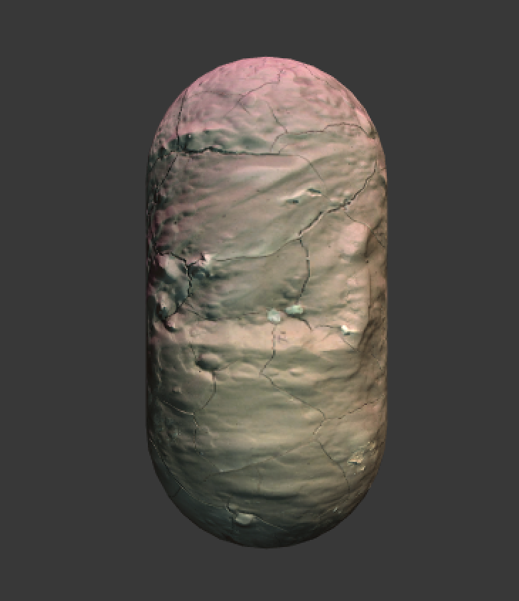

**表面着色器（Surface Shader）**是顶点/片元着色器之上又添加了一层抽象。

# 表面着色器的一个例子

1. 在Unity场景中新建一个场景，默认情况下场景包含一个摄像机和一个平行光，并且使用了内置的天空盒子。在`Window->Lighting->Skybox`中去掉场景中的天空盒子。
2. 新建一个材质，`BumpedSpecularMat`。
3. 新建一个Unity Shader，`BumpedDiffuse`，把新的Unity Shader赋给第2步中创建的材质。
4. 在场景中创建一个胶囊体，并把第2步中的材质赋给该胶囊体。
5. 保存场景。

使用**表面着色器**实现一个使用了法线纹理的漫反射效果。

打开`BumpedDiffuse`：

```c++
Shader "Unity Shaders Book/Chapter 17/Bumped Diffuse" {
	Properties {
		_Color ("Main Color", Color) = (1,1,1,1)
		_MainTex ("Base (RGB)", 2D) = "white" {}
		_BumpMap ("Normalmap", 2D) = "bump" {}
	}
	SubShader {
		Tags { "RenderType"="Opaque" }
		LOD 300
		
		CGPROGRAM
		#pragma surface surf Lambert
		#pragma target 3.0

		sampler2D _MainTex;
		sampler2D _BumpMap;
		fixed4 _Color;

		struct Input {
			float2 uv_MainTex;
			float2 uv_BumpMap;
		};

		void surf (Input IN, inout SurfaceOutput o) {
			fixed4 tex = tex2D(_MainTex, IN.uv_MainTex);
			o.Albedo = tex.rgb * _Color.rgb;
			o.Alpha = tex.a * _Color.a;
			o.Normal = UnpackNormal(tex2D(_BumpMap, IN.uv_BumpMap));
		}
		
		ENDCG
	} 
	
	FallBack "Legacy Shaders/Diffuse"
}
```

在`BumpedDiffuseMat`面板上，把`Mud_Diffuse.tif`和`Mud_Normal.tif`分别拖曳到`_MainTex`和`_BumpMap`属性上，得到如下效果。



可以向该场景中添加一些点光源和聚光灯，并改变它们的颜色。（这个过程中，不需要对代码做任何改动）

从上面的例子中可以看出，相比之前的顶点/片元着色器技术（150多行），表面着色器的代码很少（只有30多行）。同时，可以**非常轻松地实现常见的光照模型**，甚至不需要和任何光照变量打交道，Unity就帮我们处理好了每个光源的光照结果。

和顶点/片元着色器需要包含到一个特定的Pass块中不同，**表面着色器的CG代码是直接而且也必须写在SubShader**块中的，Unity会在背后生成多个Pass。可以在SubShader一开始处使用**Tags**来设置该表面着色器使用的标签。

一个表面着色器中最重要的部分是**两个结构体**（不同函数之间信息传递的桥梁）以及它的**编译指令**（程序员与Unity沟通的重要手段）。


# 编译指令

编译指令是**程序员和Unity沟通**的重要方式，通过它可以**告诉Unity一些事宜**（用这个表面函数设置表面属性、用这个光照模型模拟光照，不要阴影和环境光，不要雾效）。

编译指令最重要的作用是指明该表面着色器使用**表面函数**和**光照函数**，并设置一些可选参数。

表面着色器的CG块中的**第一句代码**往往就是它的编译指令，一般格式如下：

```c++
#pragma surface surfaceFunction lightModel [optionalparams]
```

其中，`#pragma surface`用于指明该编译指令是用于定义表面着色器的，在它后面需要指明使用的**表面函数（surfaceFunction）**和**光照模型（lightModel）**，同时可以使用一些可选参数来控制表面着色器的一些行为。

## 表面函数

**表面着色器的优点**在于抽象除了“表面”这一概念。

与**顶点/片元抽象层**不同，一个对象的表面属性定义了它的**反射率、光滑度、透明度**等值。

编译指令中的**surfaceFunction**（通常是名为surf的函数）用于定义这些表面属性，函数格式是固定的：

```c++
void surf (Input IN, inout SurfaceOutput o)
void surf (Input IN, inout SurfaceOutputStandard o)
void surf (Input IN, inout SurfaceOutputStandardSpecular o)
```

其中，后两个是**基于物理的渲染而新添加的两种结构体**。

`SurfaceOutput`、`SurfaceOutputStandard`、`SurfaceOutputStandardSpecular`都是Unity内置的结构体，它们需要**配合不同的光照模型**使用。

表面函数中，使用输入结构体`Input IN`设置各种表面属性，并把这些属性存储在输出结构体`SurfaceOutput`、`SurfaceOutputStandard`、`SurfaceOutputStandardSpecular`中，再传递给光照函数计算光照结果。

## 光照函数

光照函数**使用表面函数中设置的各种表面属性**，来应用某些光照模型，进而模拟物体表面的光照效果。

Unity内置**基于物理的光照模型函数**`Standard`和`StandardSpecular`（在`UnityPBSLighting.cginc`文件中被定义），以及简单的**非基于物理的光照模型函数**`Lambert`和`BlinnPhong`（在`Lighting.cginc`文件中被定义）。

当然也可以**自定义光照函数**，使用下面的函数来定义用于**前向渲染中的光照函数**：

```c++
// 用于不依赖视角的光照模型，例如漫反射
half4 Lighting<Name> (SurfaceOutput s, half3 lightDir, half atten);
// 用于依赖视角的光照模型，例如高光反射
half4 Lighting<Name> (SurfaceOutput s, half3 lightDir, half3 viewDir, half atten);
```

Unity手册的**表面着色器中的自定义光照模型**：

http://docs.unity3d.com/Manual/SL-SurfaceShaderLighting.html

Unity手册的**表面着色器中的光照例子**：

http://docs.unity3d.com/Manual/SL-SurfaceShaderLightingExamples.html

## 其他可选参数

编译指令的最后，可以设置一些**可选参数（optionalparams）**，这些可选参数包含了很多非常有用的**指令类型**（开启/设置透明度混合/透明度测试、指明自定义的顶点和颜色修改函数、控制生成的代码等）。

Unity手册的**编写表面着色器**：

http://docs.unity3d.com/Manual/SL-SurfaceShaders.html

- **自定义的修改函数**。除了**表面函数**和**光照模型**外，表面着色器还可以支持两种自定义的函数：
    - **顶点修改函数（vertex: VertexFunction）**：允许自定义一些顶点属性（把顶点颜色传递给表面函数，修改顶点位置，实现某些顶点动画）。
    - **最后的颜色修改函数（finalcolor: ColorFunction）**：在颜色绘制到屏幕前，最后一次修改颜色值（实现自定义的雾效）。
- **阴影**。通过一些指令来控制和阴影相关的代码（例如，`addshadow`参数会为表面着色器生成一个阴影投射的Pass）。
    - 通常情况下，Unity可以**直接在FallBack中找到通用的光照模式为ShadowCaster的Pass**，从而将物体正确地渲染到深度和阴影纹理中。
    - 一些进行了顶点动画、透明度测试的物体，需要对阴影的投射进行特殊处理，来为它们产生正确的阴影（`fullforwardshadows`参数可以在前向渲染路径中支持所有光源类型的阴影）。默认情况下，Unity只支持最重要的**平行光**的阴影效果。如果需要**点光源或聚光灯在前向渲染中也可以有阴影**，就可以添加这个参数。如果**不想对使用这个Shader的物体进行任何阴影计算**，就可以使用`noshadow`参数来禁用阴影。
- **透明度混合和透明度测试**。通过`alpha`和`alphatest`指令来控制**透明度混合**和**透明度测试**。
    - `alphatest: VariableName`指令会使用名为`VariableName`的变量来剔除不满足条件的片元。此外还需要`addshadow`参数来生成正确的阴影投射的Pass。
- **光照**。一些指令可以**控制光照对物体的影响**。例如：
    - `noambient`参数告诉Unity不要应用任何**环境光照**或**光照探针（light probe）**
    - `noforwardadd`会去掉所有前向渲染中的额外的Pass，即，这个Shader**只会支持一个逐像素的平行光**，其他的光源会按照**逐顶点**或**SH**的方法来计算光照影响。（这个参数通常会用于移动平台版本的表面着色器中）
    - 还有一些用于控制**光照烘焙**`nolightmap`、**雾效模拟**`nofog`的参数。
- **控制代码的生成**。一些指令可以**控制由表面着色器自动生成的代码**，默认情况下，Unity会**为一个表面着色器生成相应的前向渲染路径、延迟渲染路径**使用的Pass，这会导致生成的Shader文件比较大。如果确定该表面着色器只会在某些渲染路径中使用，就可以`exclude_path:deferred`、`exclude_path:forward`和`exclude_path:prepass`来告诉Unity不需要为某些渲染路径生成代码。

**表面着色器**支持的编译指令参数很多，为编写表面着色器提供了很大的方便。


# 两个结构体

表面着色器支持最多自定义**4种关键的函数**：

- **表面函数**：用于设置各种表面性质，如反射率、法线等。
- **光照函数**：定义表面使用的光照模型。
- **顶点修改函数**：修改或传递顶点属性。
- **最后的颜色修改函数**：对最后的颜色进行修改。

则，这些函数之间的信息传递如何实现呢？（例如把顶点颜色传递给**表面函数**，添加到**表面反射率**的计算中，如何做？）——这就涉及**两个结构体的工作**。

一个表面着色器需要使用**两个结构体**：

- **表面函数的输入结构体Input**
- **存储表面属性的结构体SurfaceOutput**

## 数据来源：Input结构体

**Input结构体**包含很多表面属性的数据来源。

**Input**支持很多内置的变量名，通过这些变量名，**告诉Unity需要使用的数据信息**。

>例如，包含了主纹理和法线纹理的采样坐标`un_MainTex`和`uv_BumpMap`，这些采样坐标必须以`uv`为前缀（也可以用`uv2`为前缀，表明使用次纹理坐标集合），后面紧跟纹理名称。
>
>以主纹理`_MainTex`为例，如果需要使用它的采样坐标，需要在Input结构体中声明`float2 uv_MainTex`来对应它的采样坐标。

下表列出了Input结构体中内置的其他变量：


**注意：**并**不需要自己计算上述的各个变量**，只需要在Input结构体中按上述名称严格声明这些变量即可，Unity会在背后准备好这些数据，之后在表面函数中直接使用它们即可。

**例外：**自定义顶点修改函数，并需要向表面函数中传递一些自定义的数据。

> 为了自定义**雾效**，需要在**顶点修改函数**中根据顶点**在视角空间下的位置信息计算雾效混合系数**，这样就可以在Input结构体中定义一个名为`half fog`的变量，把计算结果存储在该变量后进行输出。

## 表面属性：SurfaceOutput结构体

有了**Input结构体**提供所需要的数据后，可以据此计算各种表面属性。

因此，另外一个结构体就是**用于存储这些表面属性的结构体**，即，`SurfaceOutput`、`SurfaceOutputStandard`和`SurfaceOutputStandardSpecular`，它会**作为表面函数的输出**，随后会**作为光照函数的输入**来进行各种光照计算。

相比于**Input结构体的自由性**，这个结构体中的变量是提前就声明好的，**不可以增加也不会减少**（如果没有对某些变量赋值，就会使用默认值）。

`SurfaceOutput`的声明可以在`Lighting.cginc`文件中找到：

```c++
struct SurfaceOutput{
  	fixed3 Albedo;
  	fixed3 Normal;
  	fixed3 Emission;
    half Specular;
  	fixed Gloss;
  	fixed Alpha;
};
```

而`SurfaceOutputStandard`和`SurfaceOutputStandardSpecular`的声明可以在`UnityPBSLighting.cginc`中找到：

```c++
struct SurfaceOutputStandard{
  	fixed3 Albedo;		// base (diffuse or specular) color
  	fixed3 Normal;	  // tangent space normal, if written
  	half3 Emission;
    half Metallic;    // 0=non-metal, 1=metal
    half Smoothness;  // 0=rough, 1=smooth
    half Occlusion;   // occlusion (default 1)
  	fixed Alpha;      // alpha for transparencies
};
```

```c++
struct SurfaceOutputStandardSpecular{
  	fixed3 Albedo;		// diffuse color
    fixed3 Specular;  // specular color
  	fixed3 Normal;	  // tangent space normal, if written
  	half3 Emission;
    half Smoothness;  // 0=rough, 1=smooth
    half Occlusion;   // occlusion (default 1)
  	fixed Alpha;      // alpha for transparencies
};
```

一个**表面着色器**中，只需要选择上述三者中的其一即可，**这取决于选择使用的光照模型**。

Unity内置的光照模型有**两种**：

- 简单的、非基于物理的光照模型，包括了`Lambert`和`BlinnPhong`。
- 基于物理的光照模型，包括`Standard`和`StandardSpecular`，更加符合物理规律，但计算也会复杂很多。

如果使用了**非基于物理的光照模型**，通常使用`SurfaceOutput`结构体。

如果使用了**基于物理的光照模型**`Standard`和`StandardSpecular`，会分别使用`SurfaceOutputStandard`或`SurfaceOutputStandardSpecular`结构体。

- `SurfaceOutputStandard`结构体用于默认的**金属工作流程（Metallic Workflow）**，对应`Standard`光照函数。
- `SurfaceOutputStandardSpecular`结构体用于**高光工作流程（Specular Workflow）**，对应`StandardSpecular`光照函数。

`SurfaceOutput`结构体中的**变量和含义**。在表面函数中，需要根据**Input结构体**传递的各个变量计算表面属性，在`SurfaceOutput`结构体，这些表面属性包括：

- `fixed3 Albedo`：对光源的反射率。通常由纹理采样和颜色属性的乘积计算而得。
- `fixed3 Normal`：表面法线方向。
- `fixed3 Emission`：自发光。Unity通常会在片元着色器最后输出前（并在最后的顶点函数被调用前，如果定义的话），使用类似下面的语句进行简单的颜色叠加。
    - `c.rgb += o.Emission;`
- `half Specular`：高光反射中的指数部分的系数，影响高光反射的计算。如果使用了内置的`BlinnPhong`光照函数，会使用如下语句计算高光反射的强度：
    - `float spec = pow(nh, s.Specular * 128.0) * s.Gloss;`
- `fixed Gloss`：高光反射中的强度系数。与`Specular`类似，一般包含高光反射的光照模型里使用。
- `fixed Alpha`：透明通道。如果开启了透明度的话，会使用该值进行颜色混合。

表面着色器可以极大减少工作量，但其会带来一个问题——**经常不知道为什么会得到这样的渲染结果**。

想要更加得心应手地使用表面着色器，需要学习它的**工作流水线**，并了解Unity是**如何为一个表面着色器生成对应的顶点/片元着色器的**。（表面着色器本质上就是**包含了很多Pass的顶点/片元着色器**）


# Unity背后做了什么

Unity在背后会根据**表面着色器**生成一个**包含了很多Pass的顶点/片元着色器**。

- 有些Pass是为了**针对不同的渲染路径**（默认情况下Unity会为**前向渲染路径**生成`LightMode`为`ForwardBase`和`ForwardAdd`的Pass，为**延迟渲染路径**生成`LightMode`为`Deferred`的Pass）。
- 有些Pass**用于产生额外的信息**（为了给**光照映射**和**动态全局光照**提取表面信息，Unity会生成一个`LightMode`为`Meta`的Pass）

有些表面着色器由于**修改了顶点位置**，可以利用`addshadow`编译指令为它生成相应的`LightMode`为`ShadowCaster`的阴影投射Pass。这些Pass的生成都是基于在表面着色器中的**编译指令**和**自定义的函数**。

在每个编译完成的表面着色器的面板上，都有一个`Show generated code`的按钮，只需要单击一下就可以看到Unity为这个表面着色器生成的所有**顶点/片元着色器**。


通过查看这些代码，可以**了解到Unity到底是如何根据表面着色器生成各个Pass的**。

以Unity生成的`LightMode`为`ForwardBase`的Pass（用于前向渲染）为例，它的渲染计算流水线如下图所示：


从图中可以看出，4个允许自定义的函数在流水线中的位置。

Unity对该Pass的自动生成过程大致如下：

（1）直接将表面着色器中`CGPROGRAM`和`ENGCG`之间的代码复制过来，这些代码包括对**Input结构体**、**表面函数**、**光照函数**（如果自定义）等变量和函数的定义。这些**函数和变量**会在之后的处理过程中**被当成正常的结构体和函数**进行调用。

（2）Unity会分析上述代码，并据此**生成顶点着色器的输出**（`v2f_surf`结构体），用于在顶点着色器和片元着色器之间进行数据传递。Unity会分析在自定义函数中所使用的变量（纹理坐标、视角方向、反射方向等）。如果需要，它会在`v2f_surf`中生成相应的变量。即便有时在Input中定义了某些变量（某些纹理坐标），但Unity在分析后续代码时发现并没有使用这些变量，则这些变量实际上不会在`v2f_surf`中生成的。即，Unity在这里做了一些优化。`v2f_surf`中还包含一些其他需要的变量，例如**阴影纹理坐标**、**光照纹理坐标**、**逐顶点光照**等。

（3）生成顶点着色器：

1. 如果自定义了**顶点修改函数**，Unity会首先**调用顶点修改函数**来修改顶点数据，或**填充自定义的Input结构体中的变量**。之后，Unity会分析顶点修改函数中修改的数据，在需要时通过Input结构体将修改结果存储到`v2f_surf`相应的变量中。
2. 计算`v2f_surf`中其他生成的变量值。主要包括顶点位置、纹理坐标、法线方向、逐顶点光照、光照纹理的采样坐标等。（可以通过**编译指令**来控制某些变量是否需要计算）
3. 将`v2f_surf`传递给接下来的片元着色器。

（4）生成片元着色器

1. 使用`v2f_surf`中的对应变量填充**Input结构体**（纹理坐标、视角方向等）。
2. 调用自定义的**表面函数**填充`SurfaceOutput`结构体。
3. 调用**光照函数**得到初始的颜色值，如果使用的是内置的`Lambert`或`BlinnPhong`光照函数，Unity还会计算动态全局光光照，并添加到光照模型的计算中。
4. 进行其他的**颜色叠加**，如果没有使用光照烘焙，还会添加逐顶点光照的影响。
5. 如果自定义**最后的颜色修改函数**，Unity就会调用它进行最后的颜色修改。


# 表面着色器实例分析

实现**对模型进行膨胀**。

**原理：**在顶点修改函数中沿着顶点法线方向扩张顶点位置。

为了分析**表面着色器**中4个可自定义函数（顶点修改函数、表面函数、光照函数和最后的颜色修改函数）的原理，本例中对这4个函数全部采用自定义的实现。

```c++
Shader "Unity Shaders Book/Chapter 17/Normal Extrusion" {
	Properties {
		_ColorTint ("Color Tint", Color) = (1,1,1,1)
		_MainTex ("Base (RGB)", 2D) = "white" {}
		_BumpMap ("Normalmap", 2D) = "bump" {}
		_Amount ("Extrusion Amount", Range(-0.5, 0.5)) = 0.1
	}
	SubShader {
		Tags { "RenderType"="Opaque" }
		LOD 300
		
		CGPROGRAM
		
		// surf - which surface function.
		// CustomLambert - which lighting model to use.
		// vertex:myvert - use custom vertex modification function.
		// finalcolor:mycolor - use custom final color modification function.
		// addshadow - generate a shadow caster pass. Because we modify the vertex position, the shder needs special shadows handling.
		// exclude_path:deferred/exclude_path:prepas - do not generate passes for deferred/legacy deferred rendering path.
		// nometa - do not generate a “meta” pass (that’s used by lightmapping & dynamic global illumination to extract surface information).
		// 在pragma surface的编译指令一行中指定了一些额外的参数
		// 由于修改了顶点位置,因此要对其他物体产生正确的阴影效果并不能直接依赖Fallback中找到的阴影投射Pass
		// addshadow参数告诉Unity要生成一个该表面着色器对应的阴影投射Pass
		// 默认情况下,Unity会为所有支持的渲染路径生成相应的Pass,为了缩小自动生成的代码量,使用exclude_path:deferred exclude_path:prepass来告诉Unity不要为延迟渲染路径生成相应的Pass
		// 最后使用nometa参数取消对提取元数据的Pass生成
		#pragma surface surf CustomLambert vertex:myvert finalcolor:mycolor addshadow exclude_path:deferred exclude_path:prepass nometa
		#pragma target 3.0
		
		fixed4 _ColorTint;
		sampler2D _MainTex;
		sampler2D _BumpMap;
		half _Amount;
		
		struct Input {
			float2 uv_MainTex;
			float2 uv_BumpMap;
		};
		
		// 顶点修改函数中,使用顶点法线对顶点位置进行膨胀
		void myvert (inout appdata_full v) {
			v.vertex.xyz += v.normal * _Amount;
		}
		
		// 表面函数使用主纹理设置了表面属性中的反射率
		void surf (Input IN, inout SurfaceOutput o) {
			fixed4 tex = tex2D(_MainTex, IN.uv_MainTex);
			o.Albedo = tex.rgb;
			o.Alpha = tex.a;
			// 使用法线纹理设置了表面法线的方向
			o.Normal = UnpackNormal(tex2D(_BumpMap, IN.uv_BumpMap));
		}
		
		// 光照函数实现了简单的Lambert反射光照模型
		half4 LightingCustomLambert (SurfaceOutput s, half3 lightDir, half atten) {
			half NdotL = dot(s.Normal, lightDir);
			half4 c;
			c.rgb = s.Albedo * _LightColor0.rgb * (NdotL * atten);
			c.a = s.Alpha;
			return c;
		}
		
		// 最后的颜色修改函数中,使用颜色参数对输出颜色进行调整
		void mycolor (Input IN, SurfaceOutput o, inout fixed4 color) {
			color *= _ColorTint;
		}
		
		ENDCG
	}
	FallBack "Legacy Shaders/Diffuse"
}
```

在该**表面着色器**的导入面板中单击`Show generated code`按钮后，可以看到Unity生成的顶点/片元着色器。

在将近600行代码的文件中，Unity一共为该**表面着色器**生成了3个Pass，他们的`LightMode`分别是`ForwardBase`、`ForwardAdd`和`ShadowCaster`，分别对应了**前向渲染路径中的处理逐像素平行光的Pass**、**处理其他逐像素光的Pass**、**处理阴影投射的Pass**。

这些代码中有大量的`#ifdef`和`#if`语句，用于判断一些**渲染条件**（是否使用了动态光照纹理、是否使用了逐顶点光照、是否使用了屏幕空间的阴影等），Unity会**根据这些条件来进行不同的光照计算**。


# Surface Shader的缺点

**任何在表面着色器中完成的事情，都可以在顶点/片元着色器中重现。但反之不成立。**

表面着色器虽然可以快速实现各种光照效果，但同时也**失去了对各种优化和各种特效实现的控制**。

使用表面着色器往往会对性能造成一定的影响，而内置的Shader（例如`Diffuse`、`Bbumped Specular`等）都是使用表面着色器编写的。尽管Unity提供移动平台的相应版本（例如`Mobile/Diffuse`、`Mobile/Bumped Specular`等），但这些版本的Shader往往只是去掉了**额外的逐像素Pass**、**不计算全局光照**和其他一些**光照计算上的优化**。但如果想要更多深层的优化，表面着色器就无法满足需求了。

除了性能比较差之外，表面着色器还无法完成一些**自定义的渲染效果**（例如**透明玻璃的效果**）。

**表面着色器的这些缺点**让很多人更愿意使用**自由的顶点/片元着色器**来实现各种效果，尽管处理光照时这可能难度更大些。

**一些建议：**

- 如果需要**和各种光源打交道**，尤其是想要使用Unity中的全局光照的话，可以考虑**表面着色器**，但需要时刻小心它的性能。
- 如果需要**处理光源数目非常少**（例如只有一个平行光），则使用**顶点/片元着色器**。
- 如果有**很多自定义的渲染效果**，则选择**顶点/片元着色器**。
