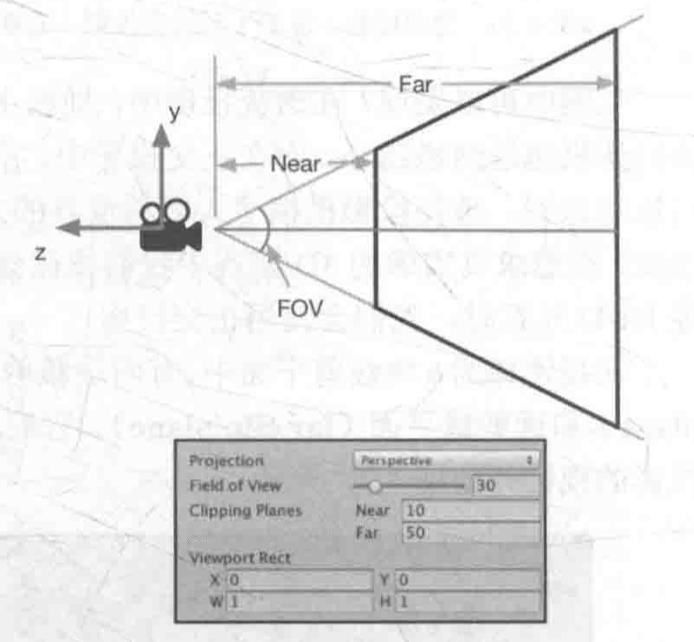

# 笛卡尔坐标系

使用数学绝大部分都是为了计算位置、距离和角度等变量，这些计算都是在**笛卡尔坐标系（Cartesian Coordinate System）**下进行的，该名字来源于**法国**伟大的哲学家、物理学家、心理学家、数学家**笛卡尔**。

>笛卡尔从小体弱多病，所以他所在的寄宿学校的老师允许他可以一直留在床上直到中午。
>
>（笛卡尔的一生中，每天的上午时光几乎都是在床上度过的。）
>
>笛卡尔没有把这段时间用在睡懒觉上，而是思考了很多关于数学和哲学上的问题。
>
>一天笛卡尔发现一只苍蝇在天花板上飞来飞去，观察了很长一段时间。
>
>笛卡尔想：我要如何描述这只苍蝇的运动轨迹呢？
>
>最后，笛卡尔意识到，可以使用这只苍蝇距离房间内的不同墙面的位置来描述。
>
>这个坐标平面后来逐渐发展，就形成了坐标系系统。


## 二维笛卡尔坐标系

一个二维笛卡尔坐标系包含两个部分信息：

- 一个特殊的位置，即原点，整个坐标系的中心。
- 两天过原点的互相垂直的矢量，即x轴和y轴。这些坐标轴也被称为是该坐标系的基矢量。

OpenGL和DirectX使用了不同的二维笛卡尔坐标系：


## 三维笛卡尔坐标系

三维笛卡尔坐标系中，需要定义3个坐标轴和1个原点。

3个坐标轴也被称为是该坐标系的**基矢量（basis vector）**。

- 通常情况下，这3个坐标轴之间是相互垂直的，且长度为1，这样的基矢量被称为**标准正交基（orthonormal basis）**。
- 在一些坐标系中坐标轴之间相互垂直但长度不为1，这样的基矢量被称为**正交基（orthogonal basis）**。

## 左手坐标系和右手坐标系

所有的二维笛卡尔坐标系都是等价的，而三维笛卡尔坐标系不一定是等价的。

- 如果两个坐标系具有相同的**旋向性（handedness）**，则我们就可以通过旋转的方法来让它们的坐标轴指向重合。但是，如果它们具有不同的旋向性（例如A属于左手，B属于右手），则无法达到重合的目的。

判断左右手坐标系：

1. 举起左手，用食指和大拇指摆出一个“L”的手势，并且让你的食指指向上，大拇指指向右。
2. 伸出中指，它应该指向前方。
3. 大拇指、食指和中指分别对应了+x、+y和+z轴的方向。


左手坐标系和右手坐标系无法通过旋转来同时使它们的3个坐标轴指向重合，如果想要进行相互转换，最简单的方法就是把其中一个轴反转，并保持其他两个轴不变。

**旋转正方向**：左手坐标系用左手法则定义，右手坐标系用右手法则定义。

**左手法则：**举起左手，握拳，伸出大拇指让它指向旋转轴的正方向，则旋转的正方向就是剩下4个手指的弯曲方向。

## Unit使用的坐标系

- 对于**模型空间**和**世界空间**，Unity使用的是**左手坐标系**。
    - 这意味着，在模型的空间中，一个物体的**右侧（right）、上侧（up）和前侧（forward）分别对应了x轴、y轴和z轴的正方向**。
- 对于**观察空间（以摄像机为原点的坐标系）**来说，Unity使用的是**右手坐标系**，摄像机的前向是z轴的负方向（z轴坐标的减少意味着场景深度的增加）。


# 点和矢量

**点（point）**是n维空间（游戏中主要使用二维和三维空间）中的一个位置，它没有大小、宽度这类概念。

笛卡尔坐标系中，可以使用2个或3个实数来表示一个点的坐标：

- $P=(P_x,P_y)$表示二维空间的点
- $P=(P_x,P_y,P_z)$表示三维空间的点

**矢量（vector，又称向量）**是一串数字，与**标量（scalar）**区分，指n维空间中一种包含了**模（magnitude）**和**方向（direction）**的**有向线段**。

- **矢量的模：**指的是这个矢量的长度，可以是任意的非负数。
- **矢量的方向：**描述这个矢量在空间中的指向。

矢量的表示方法和点类似，可是**使用$v=(x,y)$来表示二维矢量**，**用$v=(x,y,z)$来表示三维矢量**。

一个矢量通常由一个箭头来表示，**矢量的头指的是它的箭头所在的端点处**，而**尾指的是另一个端点处**。

矢量被用于表示相对于某个点的**偏移（displacement）**，即它是一个相对量。

只要**矢量的模和方向**保持不变，无论放在哪里，都是同一个矢量。

## 点和矢量的区别

- 点是一个没有大小之分的空间中的位置。
- 而矢量是一个有模和方向但没有位置的量。

点和矢量具有不同的意义，但是，从表示方法上两者非常相似。

矢量通常用于描述偏移量，因此，它们可以用于描述相对位置，即相对于另一个点的位置，此时，矢量的尾是一个可以用于指定空间中的一个位置（即相对于原点的位置）。

如果吧矢量的尾固定在坐标系原点，则这个矢量的表示就和点的表示重合了。

**任何一个点都可以表示成一个从原点出发的矢量。**

## 矢量运算

### 矢量和标量的乘法/除法

- $kv=(kv_x,kv_y,kv_z)$
- $\frac{v}{k}=\frac{(x,y,z)}{k}=\frac{1}{k}(x,y,z)=(\frac{x}{k},\frac{y}{k},\frac{z}{k}),k\ne 0$

对于乘法，矢量和标量的位置可以互换。

对于除法，只能是矢量被标量除，而不能是标量被矢量除。

从几何意义上，把一个矢量$v$和一个标量$k$相乘，意味着对矢量$v$进行一个大小为$|k|$的缩放。

当$k<0$时，矢量的方向也会取反。

### 矢量的加法和减法

- $a+b=(a_x+b_x,a_y+b_y,a_z+b_z)$
- $a-b=(a_x-b_x,a_y-b_y,a_z-b_z)$

一个矢量不可以和一个标量相加或相减。

一个矢量只能和同一维度的矢量进行加减运算。

矢量加法遵守**三角形定则（triangle rule）**。

### 矢量的模

矢量是有模和方向的，矢量的模是一个标量，可以理解为矢量在空间中的长度。

矢量的模的**表示符号**通常是在矢量两旁分别加上一条垂直线$|v|=\sqrt{v_x^2,v_y^2,v_z^2}$。

### 单位矢量

只关心矢量的**方向**而不是模。

单位矢量指的**是那些模为1的矢量**。

单位矢量也被称为**被归一化的矢量（normalized vector）**。

对任何给定的非零矢量，把它转换成单位矢量的过程就被称为**归一化（Normalization）**。

在一个矢量的头上添加一个戴帽符号来表示单位矢量，例如$\hat{v}$。

对矢量进行归一化，可以使用矢量的模除以该矢量来得到：$\hat{v}=\frac{v}{|v|}$。

**零矢量：**矢量的每个分量值都为0，如$v=(0,0,0)$是不可以被归一化的。

### 矢量点积/叉积

- 点积（dot product，也被称为内积，inner product）
    - $a\cdot{b}=(a_x,a_y,a_z)\cdot(b_x,b_y,b_z)=a_xb_x+a_yb_y+a_zb_z$
    - 点积满足交换律：$a\cdot{b}=b\cdot{a}$
    - **投影（projection）**：一个光源，它发出的关线是垂直于$\hat{a}$方向的，则$b$在$\hat{a}$方向上的投影就是$b$在$\hat{a}$方向上的影子。
        - 投影结果的正负号与$\hat{a}$和$b$的方向有关，可以是负值。
    - 任何两个矢量的点积$a\cdot{b}$等同于$b$在$a$方向上的投影值，再乘以$a$的长度。
    - 点积的符号可以知道两个矢量的方向关系。
    - 点积可结合标量乘法
        - $(ka)\cdot{b}=a\cdot(kb)=k(a\cdot{b})$
    - 点积可结合矢量加法和减法
        - $a\cdot{(b+c)}=a\cdot{b}+a\cdot{c}$
    - 一个矢量和本身进行点积的结果
        - $v\cdot{v}=v_xv_x+v_yv_y+v_zv_z=|v|^2$
        - 可以直接用点积来求矢量的模，而不需要使用模的计算公式。
    - $a\cdot{b}=|a||b|\cos{\theta}$
    - $\theta=\arccos{(\hat{a}\cdot{b})}$
- 叉积（cross product，也被称为外积，outer product）
    - $a\times{b}=(a_x,a_y,a_z)\times(b_x,b_y,b_z)=(a_yb_z-a_zb_y,a_zb_x-a_xb_z,a_xb_y-a_yb_x)$
    - 叉积的结果仍然是**矢量**，而非标量。
    - 叉积**不满足**交换律，即：$a\times{b}\ne b\times{a}$
    - 叉积**满足反交换律**，即：$a\times{b}=-(b\times{a}）$
    - 叉积**不满足结合律**，即：$(a\times{b})\times{c}\ne a\times{(b\times{c})}$
    - 对于两个矢量进行叉积的结果会得到一个**同时垂直于这两个矢量的新矢量**。
    - $|a\times{b}|=|a||b|\sin{\theta}$
    - $a\times{b}$的方向：
        - 右手坐标系用**右手法则**：四指方向与$a$一致，再朝$b$弯曲，则大拇指的方向为$a\times{b}$的方向。
        - 左手坐标系用**左手法则**：四指方向与$a$一致，再朝$b$弯曲，则大拇指的方向为$a\times{b}$的方向。
        - 无论使用**左手或右手坐标系**，所有点和矢量的表达和计算方式都会保持不变，只是呈现到屏幕上时，可能会发现图像反过来了。
    - 应用：
        - 计算垂直于一个平面、三角形的矢量。
        - 判断三角面片的朝向。


# 矩阵

## 定义

由$m\times{n}$个标量组成的长方形数组。

行（row）和列（column），$m_{ij}$表明了这个元素在矩阵$M$的第$i$行第$j$列。

矢量可以看成是$n\times{1}$的列矩阵（column matrix）或$1\times{n}$的行矩阵（row matrix），其中$n$对应矢量的维度。

## 矩阵运算

### 矩阵和标量的乘法

矩阵和标量相乘，结果仍然是一个相同维度的矩阵。

矩阵每个元素和该标量相乘。

### 矩阵和矩阵的乘法

$A_{r\times{n}}\times{B_{n\times{c}}}=C_{r\times{c}}$

$c_{ij}=a_{i1}b_{1j}+a_{i2}b_{2j}+...a_{in}b_{nj}=\sum_{k=1}^na_{ik}b_{kj}$

- 矩阵乘法不满足交换律：$AB\ne BA$
- 矩阵乘法满足结合律：$(AB)C=A(BC)$
- 特殊的矩阵：
    - **方块矩阵（square matrix）：**方阵，指行的列数目相等的矩阵。
        - **对角元素（diagonal elements）**：行号和列号相等的元素，$m_{11},m_{22},m_{33}$。
        - **对角矩阵（diagonal matrix）**：矩阵除了对角元素外的所有元素都为0。
    - **单位矩阵（identity matrix）**
        - 任何矩阵和它相乘的结果还是原来的矩阵。
        - $MI=IM=M$
        - 与标量中的1一样。
    - **转置矩阵（transposed matrix）**
        - 对原矩阵进行**转置**运算。
        - 给定一个$r\times{c}$的矩阵$M$，它的转置可以表示成$c\times{r}$的$M^T$。
        - 转置是把原矩阵翻转一下即可，原矩阵的第$i$行第$j$列，变成了第$j$行第$i$列。
        - 矩阵转置的转置等于原矩阵：$(M^T)^T=M$
        - 矩阵串接的转置，等于反向串接各个矩阵的转置：$(AB)^T=B^TA^T$。
    - **逆矩阵（inverse matrix）**
        - 不是所有的矩阵都有逆矩阵，一个明显的例子就是所有元素都为0。
        - 逆矩阵的前提是该矩阵必须是一个方阵。
        - 给定一个方阵$M$，它的逆矩阵用$M^{-1}$来表示。
        - $MM^{-1}=M^{-1}M=I$
        - 如果一个矩阵有对于的逆矩阵，我们就说这个矩阵是**可逆（invertible）**的或**非奇异的（nonsingular）**。
        - 如果一个矩阵的**行列式（determinant）**不为0，则它就是可逆的。
        - 逆矩阵的逆矩阵是原矩阵的本身：$(M^{-1})^{-1}=M$
        - 单位矩阵的逆矩阵是其本身：$I^{-1}=I$
        - 转置矩阵的逆矩阵是逆矩阵的转置矩阵：$(M^T)^{-1}=(M^{-1})^T$
        - 矩阵串接相乘后的逆矩阵等于反向串接各个矩阵的逆矩阵：$(AB)^{-1}=B^{-1}A^{-1}$
        - 逆矩阵可以还原变换：$M^{-1}(Mv)=(M^{-1}M)v=Iv=v$
    - **正交矩阵（orthogonal matrix）**
        - 方阵$M$和它的转置矩阵的乘积是单位矩阵，这个矩阵是**正交**的：$MM^T=M^TM=I$
        - 正交矩阵的转置矩阵和逆矩阵是一样的：$M^T=M^{-1}$
        - 正交矩阵：每一行每一列都构成**标准正交基（orthonormal basis）**。


# 矩阵的几何意义：变换

## 变换（transform）

把一些数据，如点、方向矢量甚至是颜色等，通过**某种方式**进行转换的过程。

**线性变换（linear transform）**

- 线性变换指的是那些可以保留矢量加和标量乘的变化。
    - $f(x)+f(y)=f(x+y)$
    - $kf(x)=f(kx)$
- **缩放（scale）**：$f(x)=2x$，经过变换后矢量$x$的模放大两倍。
- **旋转（rotation）**
- **错切（shear）**
- **镜像（mirroring，reflection）**
- **正交投影（orthographic projection）**

**平移变换**：$f(x)=x+(1,2,3)$

**仿射变换（affine transform）：**线性变换+平移变换

- 仿射变换使用一个$4\times 4$的矩阵来表示，因此需要将矢量扩展到四维空间下，需要**齐次坐标空间（homogeneous space）**

|        变换名称        | 线性变换 | 仿射变换 | 可逆矩阵 | 正交矩阵 |
| :--------------------: | :------: | :------: | :------: | :------: |
|        平移矩阵        |    N     |    Y     |    Y     |    N     |
| 绕坐标轴旋转的旋转矩阵 |    Y     |    Y     |    Y     |    Y     |
| 绕任意轴旋转的旋转矩阵 |    Y     |    Y     |    Y     |    Y     |
| 绕坐标轴缩放的缩放矩阵 |    Y     |    Y     |    Y     |    N     |
|        错切矩阵        |    Y     |    Y     |    Y     |    N     |
|        镜像矩阵        |    Y     |    Y     |    Y     |    Y     |
|      正交投影矩阵      |    Y     |    Y     |    N     |    N     |
|      透视投影矩阵      |    N     |    N     |    N     |    N     |

## 齐次坐标

- 对于一个点，从三维坐标转换成齐次坐标是把其$w$分量设为1。
- 对于方向矢量来说，需要把其$w$设为0。

当用一个$4\times 4$矩阵对一个点进行变换时，平移、旋转、缩放都会施加于该点。

但是如果是用于变换一个方向矢量，平移的效果就会被忽略。

**变换顺序：**先缩放，再旋转，后平移。$P_{new}=M_{translation}M_{rolation}M_{scale}P_{old}$

**旋转顺序：**Unity中旋转顺序为zxy

给定一个旋转顺序（例如zxy），以及它们对应的旋转角度$(\theta_x,\theta_y,\theta_z)$，有两种坐标系可以选择：

- 绕坐标系$E$下的$z$轴旋转$\theta_z$，绕坐标系$E$下的$y$轴旋转$\theta_y$，绕坐标系$E$下的$x$轴旋转$\theta_x$，即进行一次旋转时不一起旋转当前坐标系。
- 绕坐标系$E$下的$z$轴旋转$\theta_z$，在坐标系$E$下再绕$z$轴旋转$\theta_z$后的新坐标系$E'$下的$y$轴旋转$\theta_y$，在坐标系$E'$下再绕$y$轴旋转$\theta_y$后的新坐标系$E''$下的$x$轴旋转$\theta_x$，即在旋转时，把坐标系一起转动。

容易得，这两种旋转的结果是不一样的，但如果**把它们的旋转顺序颠倒一下，得到的结果是一致的。**

即，**第一种情况下按zxy顺序旋转**，和，**在第二种情况下按yxz顺序旋转**，是一样的。

Unity中旋转的顺序是在**第一种情况**下的顺序。


# 坐标空间

如何使用矩阵来对坐标空间进行变换。

顶点着色器流水线阶段时，顶点着色器最基本的功能就是**把模型的顶点坐标从模型空间转换到齐次裁剪坐标空间中**。

坐标空间是一个层次结构——每个坐标空间都是另一个坐标空间的子空间，反过来说，每个空间都有一个父（parent）坐标空间。（**对坐标空间的变换实际上就是在父空间和子空间之间对点和矢量进行变换**）

假设，有**父坐标空间**$P$及**子坐标空间**$C$，已知父坐标空间中子坐标空间的**原点位置**以及**3个单位坐标轴**。

两种需求：

- 把子坐标空间下表示的点或矢量$A_c$转换到父坐标空间下的表示$A_p$：$A_p=M_{cp}A_c$
- 把父坐标空间下表示的点或矢量$B_p$转换到子坐标空间下的表示$B_c$：$B_c=M_{pc}B_p$

已知子坐标空间$C$的3个坐标轴在父坐标空间$P$下的表示$x_c$，$y_c$，$z_c$，以及原点位置$O_c$。

当给定一个子坐标空间中的一点$A_c=(a,b,c)$，可以通过如下四个步骤来确定其在父坐标空间下的位置$A_p$。

1. **从坐标空间的原点开始**

    我们已经知道子坐标空间的原点位置$O_c$

2. **向x轴方向移动a个单位**

    $O_c+ax_c$

3. **向y轴方向移动b个单位**

    $O_c+ax_c+by_c$

4. **向z轴方向移动c个单位**

    $O_c+ax_c+by_c+cz_c$

则：$A_p=O_c+ax_c+by_c+cz_c$

变换矩阵$M_{c\rightarrow p}$实际上可以通过坐标空间$C$在坐标空间$P$中的原点和坐标轴的矢量表示来构建出来：把3个坐标轴依次放入矩阵的前3列，把原点矢量放到最后一列，再用0和1填充最后一行即可。
$$
M_{c\rightarrow p}=
\begin{equation}       %开始数学环境
\left[                %左括号
  \begin{array}{ccc}   %该矩阵一共3列，每一列都居中放置
    | & | & | & |\\  %第一行元素
    x_c & y_c & z_c & O_c\\  %第二行元素
    | & | & | & |\\  %第三行元素
    0 & 0 & 0 & 1\\  %第四行元素
  \end{array}
\right]                 %右括号
\end{equation}
\tag{1}
$$
**注意：**此处没有要求3个坐标轴$x_c$，$y_c$，$z_c$是单位矢量。

此处可以用逆向思维，从这个变换矩阵反推获取**子坐标空间**的**原点**和**坐标轴方向**。

>由于矢量没有位置，因此坐标空间的原点变换是可以忽略的，即仅仅平移坐标系的原点是不会对矢量造成任何影响的。
>
>则，对矢量的坐标空间变换就可以使用$3\times 3$的矩阵来表示。
>
>在Shader中，常常会看到截取变换矩阵的前3行前3列来对法线方向、光照方向来进行空间变换，正是原因所在。

### 顶点的坐标空间变换过程

一个顶点最初在**模型空间**定义，最后变换到**屏幕空间**中，得到真正的**屏幕像素坐标**。

#### 模型空间（model space）

模型空间又称**对象空间（object space）**或**局部空间（local space）**

每个模型都有自己独立的坐标空间，当它移动或者旋转的时候，模块空间也会跟着它移动和旋转。

Unity中模型空间采用**左手坐标系**，可以在Hierarchy视图中单击任意对象就可以看见它们对应的模型空间的3个坐标轴。

模型空间的原点和坐标轴通常是由美术人员在建模软件里确定好的，当导入Unity中后，**可以在顶点着色器中访问到模型的顶点信息**，其中**包含每个顶点的坐标**，这些坐标都是**相对于模型空间中的原点（通常位于模型的重心）定义的**。

#### 世界空间（world space）

建立我们所关心的最外层最大的空间。

世界空间可以被用于描述绝对位置，即**在世界坐标系中的位置**。

通常会把**世界空间的原点**放在**游戏空间的中心**。

Unity中世界空间采用**左手坐标系**，但它的3个坐标轴是固定不变的。

在Unity中，可以通过调整**Transform组件中的Position属性**来改变模型的位置，此处位置值是相对于该Transform的父节点模型坐标空间中的原点定义的。（如果一个Transform没有任何父节点，则这个位置就是世界坐标系中的位置），Transform组件中的**Rotation**和**Scale**也是同样的道理。

顶点变化的第一步，就是将顶点坐标从模型空间变换到世界空间中，这个变换通常叫做**模型变换**（Model Transform）。


#### 观察空间（view space）

观察空间又称**摄像机空间（camera space）**，观察空间可以认为是**模型空间的一个特例**。

摄像机决定了渲染游戏所使用的视角，在观察空间中，摄像机位于原点。

Unity中观察空间采用**右手坐标系**，这是符合OpenGL传统的。

>这种左右手之间的差异很少会对我们在Unity中的编程产生影响，因为Unity为我们做了很多渲染的底层工作，包括很多坐标空间的转换。
>
>但是如果要调用Camera.cameraToWorldMatrix、Camera.worldToCameraMatrix等接口自行计算某模型在观察空间中的位置，就要小心这样的差异。

观察空间与屏幕空间是不同的：

- 观察空间是一个三维空间。
- 屏幕空间是一个二维空间。

从观察空间到屏幕空间的转换需要经过一个**投影操作（projection）**。

顶点变化的第二步，就是将顶点坐标**从世界空间变换到观察空间中**，这个变换通常称为**视图变换**（View Transform）。

**视图变换两种方法（两种方法得到的变换矩阵是一样的，只是思考方式不同）：**

- 计算**观察空间**的3个坐标轴在**世界空间**下的表示，构建出从**观察空间**变换到**世界空间**的变换矩阵，再对该**矩阵求逆**来得到从世界空间变换到观察空间的变换矩阵。
- 想象**平移整个观察空间**，让摄像机原点位于世界坐标的原点，坐标轴与世界空间中的坐标轴重合即可。


#### 裁剪空间（clip space）

裁剪空间又称**齐次裁剪空间**，用于变换的矩阵叫做**裁剪矩阵（clip matrix）**或**投影矩阵（projection matrix）**。

裁剪空间的目标是能够方便地对渲染图元进行裁剪：

- 完全位于这块空间内部的图元将会被保留；
- 完全位于这块空间外部的图元将会被剔除；
- 与这块空间边界相交的图元就会被裁剪。

**视锥体（view frustum）**

空间中的一块区域，决定了摄像机可以看到的空间。

视锥体的意义在于定义了场景中的一块三维空间，所有在这块空间内的物体都会被渲染，否则就会被剔除或裁剪。

视锥体由六个**裁剪平面（clip planes）**包围而成，有两种类型：

- **正交投影（orthographic projection）**：模拟人眼看世界的方式。
- **透视投影（perspective projection）**：完全保留物体的距离和角度。

在追求真实感的3D游戏中，往往使用**透视投影**，在2D游戏或渲染小地图等其他HUD元素时，使用**正交投影**。

视锥体的6块裁剪平面中，有两块裁剪平面比较特殊，分别是**近裁剪平面（near clip plane）**和**远裁剪平面（far clip plane）**，它们决定了摄像机可以看到的深度范围。


- **透视投影**的视锥体是一个金字塔形，侧面4个裁剪平面将会在摄像机处相交。
- **正交投影**的视锥体是一个长方体。

**投影矩阵**目的：

- **为投影做准备。**真正的投影发生在后面的**齐次除法（homogeneous division）**过程中。经过投影矩阵的变换后，顶点的$w$分量将会具有特殊的意义。
- **对$x$，$y$，$z$分量进行缩放。**由于直接使用视锥体的6个裁剪平面来进行裁剪会比较麻烦，而经过投影矩阵的缩放后，可以直接使用$w$分量作为一个范围值，如果$x$，$y$，$z$分量都位于这个范围内，就说明该顶点位于裁剪空间内。

在裁剪空间之前，虽然使用齐次坐标来表示点和矢量，但它们的第四个分量都是固定的：

- 点的$w$分量是1
- 方向矢量的$w$分量是0

经过投影矩阵的变换后，可以赋予齐次坐标的第4个坐标更加丰富的含义。

##### 透视投影

Unity中，6个裁剪平面由**Camera组件中的参数**和**Game视图的横纵比**共同决定。



可以通过Camera组件的**Field of View（FOV）**属性来改变视锥体竖直方向的张开角度。

**Near和Far参数**可以控制视锥体的近裁剪平面和远裁剪平面距离摄像机的远近。

因此，可以求出视锥体**近裁剪平面**和**远裁剪平面**的高度：
$$
nearClipPlaneHeight=2\cdot Near \cdot \tan\frac{FOV}{2}\\
FarClipPlaneHeight=2\cdot Far \cdot \tan\frac{FOV}{2}
\tag{2}
$$
通过**摄像机的横纵比**，可以得到横向信息。

Unity中，一个**摄像机的横纵比**由**Game视图的横纵比**和**Viewport Rect中的W和H属性**共同决定。

假设横纵比为Aspect，则：
$$
Aspect=\frac{nearClipPlaneWidth}{nearClipPlaneHeight} \\
Aspect=\frac{farClipPlaneWidth}{farClipPlaneHeight} 
\tag{3}
$$
可以根据已知的Near，Far，FOV，Aspect的值来确定透视投影的投影矩阵：


**注意：**此处投影矩阵是建立在Unity对坐标系的假定上面的，即针对观察空间是**右手坐标系**，使用列矩阵在矩阵右侧进行相乘，且变换后$z$分量范围将在$[-w,w]$之间的情况。

（如果是DirectX这样的图形接口中，希望变换后的$z$分量范围将在$[0,w]$之间，需要做一些相应的修改。）

一个顶点与上述投影矩阵相乘后，可以由观察空间变换到裁剪空间中：


从结果来看，这个投影矩阵本质就是对$x$，$y$，$z$分量进行了不同程度的缩放（同时$z$分量还做了一个平移），缩放的目的是为了方便裁剪。

注意此时顶点的$w$分量不再是1，而是原先$z$分量的取反结果。

> 如果一个**变换后的顶点在视锥内**，则变换后的坐标需同时以下满足：
>
> $-w\le x\le w$，$-w\le y\le w$，$-w\le z\le w$
>
> 任何不满足以上条件的图元都会被**剔除或裁剪**。

下图显示了经过上述投影矩阵后，视锥体的变化：


从上图可以看出，裁剪矩阵也会**改变空间的旋向性**（空间从右手坐标系变换到了左手坐标系）。

即，离摄像机越远，$z$值越大。

##### 正交投影

Unity中，正交投影也是由Camera组件中的参数和Game视图的横纵比共同决定。


正交投影的视锥体是一个长方体，因此在计算上相比透视投影来说更加简单。

可以通过Camera组件的**size属性**来改变视锥体**竖直方向**上高度的一半，而**Clipping Planes中的Near和Far参数**可以控制视锥体的**近裁剪平面**和**远裁剪平面**距离摄像机的远近。
$$
nearClipPlaneHeight = 2 \cdot size \\
farClipPlaneHeight = nearClipPlaneHeight
\tag{4}
$$
通过摄像机的恒总比得到横向信息，设摄像机的横纵比为Aspect：
$$
nearClipPlaneWidth=Aspect\cdot nearClipPlaneHeight \\
farClipPlaneWidth = nearClipPlaneWidth
\tag{5}
$$
之后可以根据已知的Near、Far、Size和Aspect的值来确定正交投影的裁剪矩阵：


与透视投影不同的是，正交投影的投影矩阵对顶点进行变换后，其$w$分量仍然为1。

- 透视投影的投影矩阵的最后一行是$[0,0,-1,0]$
- 正交投影的投影矩阵的最后一行是$[0,0,0,1]$

这样的选择是有原因的，为了**齐次除法**做准备。

>如果一个**变换后的顶点在视锥内**，则变换后的坐标需同时以下满足：
>
>$-w\le x\le w$，$-w\le y\le w$，$-w\le z\le w$
>
>任何不满足以上条件的图元都会被**剔除或裁剪**。


同样，裁剪矩阵改变了空间的旋向性，**经过正交投影变换后的顶点实际上已经位于一个立方体内了**。

##### 求裁剪空间位置

观察空间位置$(9,8.84,-27.31)$

摄像机为透视摄像机。


#### 屏幕空间（screen space）

当完成了所有的裁剪工作后， 需要进行真正的投影了，即：把**视锥体投影到屏幕空间**。

经过这一步的变换，可以**得到真正的像素位置**，而不是虚拟的三维坐标。

屏幕空间是一个二维空间，需要把顶点从裁剪空间投影到屏幕空间中，以**生成对应的2D坐标**：

1. **标准齐次除法（homogeneous division）/ 透视除法（perspective division）**

    用齐次坐标系的$w$分量去除以$x,y,z$分量。

    在OpenGL中，把这一步得到的坐标叫做**归一化的设备坐标**（Normalized Device Coordinates，NDC）。

    经过透视投影变换后的裁剪空间，经过齐次除法后会变换到一个立方体内。

    - 在OpenGL中，这个立方体的$x,y,z$分量的范围都是$[-1,1]$。
    - 在DirectX中，这个立方体的$z$分量的范围是$[0,1]$，其他两个分量为$[-1,1]$。

    **Unity采用OpenGL的齐次裁剪空间。**

    对于正交投影来说，它的裁剪空间已经是一个立方体了，因此不需要做齐次除法。

2. **根据变换后的$x$和$y$坐标**来映射输出窗口的对应像素坐标。

    Unity中，屏幕左下角的像素坐标$(0,0)$，右上角的像素坐标$(pixelWidth,pixelHeight)$。

    齐次除法和屏幕映射的过程可以使用以下公式：

    $screen_x=\frac{clip_x\cdot{pixelWidth}}{2\cdot{clip_w}}+\frac{pixelWidth}{2}$，$screen_y=\frac{clip_y\cdot{pixelHeight}}{2\cdot{clip_w}}+\frac{pixelHeight}{2}$

    以上式子对$x,y$分量进行了处理，通常$z$分量会被用于深度缓冲，传统的方法是把$\frac{clip_z}{clip_w}$的值直接存进深度缓冲中，但这不是必需的。（驱动生产商会根据硬件来选择最好的存储格式）

进行了上述两个步骤后，$clip_w$也并不会被抛弃，仍然会在后续一些工作中起到重要的作用，例如进行**透视校正插值**。

Unity中，从**裁剪空间到屏幕空间的转换由Unity完成**，顶点着色器只需要把顶点转换到裁剪空间即可。


### 总结


- 顶点着色器的最基本任务就是**把顶点坐标从模型空间转换到裁剪空间中**（对于上图前三个顶点变换过程）。
- 片元着色器中，通常得到**该片元在屏幕空间的像素位置**。

在Unity中，坐标系的**旋向性**也随着变换发生改变（只有在观察空间Unity使用了右手坐标系）。


# 法线变换

**法线**（normal），又称**法矢量**（normal vector）。

在游戏中，模型的一个顶点往往会携带额外信息，而**顶点法线**就是其中一种信息。

当变换一个模型的时候，不仅需要变换它的顶点，还需要变换**顶点法线**，以便在后续处理（片元着色器）中计算光照。

通常，点和绝大部分方向矢量都可以使用同一个$4\times 4$或$3\times 3$的变换矩阵$M_{A\rightarrow B}$把其从坐标空间$A$

变换到坐标空间$B$中，但在变换法线的时候，如果使用同一个变换矩阵，可能就**无法确保维持法线的垂直性**。

## 解释为何会出现法线不垂直

另一种方向矢量：**切线（tangent）**，又称**切矢量（tangent vector）**

与法线类似，**切线往往也是模型顶点携带的一种信息**，它通常与纹理空间对齐，而且与法线方向垂直。

由于**切线是两个顶点之间的差值**计算得到的，因此可以直接使用用于**变换顶点的变换矩阵来变换切线**。

假设使用$3\times 3$的变换矩阵$M_{A\rightarrow B}$来变换顶点（由于是方向矢量，因此不考虑平移），可以直接由下面的式子得到变换后的切线：$T_B=M_{A\rightarrow B}T_A$

其中，$T_A$和$T_B$分别表示在坐标空间$A$下和坐标空间$B$下的切线方向。

但是如果直接使用$M_{A\rightarrow{B}}$来变换法线，得到的**新法线方向可能就不会与表面垂直了**。


可以通过数学约束条件来推出**变换法线的矩阵**。

同一个顶点的切线$T_A$和法线$N_A$必须满足垂直条件，即：$T_A\cdot N_A=0$，给定变换矩阵$M_{A\rightarrow B}$，已知$T_B=M_{A\rightarrow B}T_A$，想要找一个矩阵$G$来变换法线$N_A$，使得变换后的法线仍然与切线垂直，即：

$T_B\cdot N_B=(M_{A\rightarrow B}T_A)\cdot (GN_A)=0$

对上式进行一些推导：

$(M_{A\rightarrow B}T_A)\cdot(GN_A)=(M_{A\rightarrow B}T_A)^T(GN_A)=T_A^TM_{A\rightarrow B}^TGN_A=T_A^T(M_{A\rightarrow B}^TG)N_A=0$

由于$T_A\cdot N_A=0$，因此如果$M_{A\rightarrow B}^TG=I$，则上式即可成立，$G=(M_{A\rightarrow B}^T)^{-1}=(M_{A\rightarrow B}^{-1})^{T}$

即使用**原变换矩阵**的**逆转置矩阵**来变换法线就可以得到正确结果。

注意：如果变换矩阵$M_{A\rightarrow B}$是正交矩阵，则$M_{A\rightarrow B}^{-1}=M_{A\rightarrow B}^T$，因此$(M^T_{A\rightarrow B})^{-1}=M_{A\rightarrow B}$

即**可以用变换顶点的变换矩阵来直接变换法线**。

- 如果变换**只包括旋转变换**，则这个变换矩阵就是**正交矩阵**
- 如果变换只包含**旋转和统一缩放**，而**不包含非统一缩放**，可以利用统一缩放系数$k$来得到变换矩阵$M_{A\rightarrow B}$的逆转置矩阵$(M_{A\rightarrow B}^T)^{-1}=\frac{1}{k}M_{A\rightarrow B}$，这样可以避免计算逆矩阵的过程。
- 如果变换中包含**非同一缩放**，则必须要求解逆矩阵来得到变换法线的矩阵。


# Unity Shader的内置变量（数学篇）

Unity Shader提供很多内置参数，这使得不再需要自己手动计算一些值。

以下给出Unity内置的**用于空间变换和摄像机以及屏幕参数**的内置变量。（这些内置变量可以在UnityShaderVariables.cginc文件中找到定义和说明）

## 变换矩阵

下表给出的所有矩阵都是**float4x4**类型的的。


其中一个矩阵比较特殊，即**UNITY_MATRIX_T_MV**矩阵，

对于正交矩阵，它的**逆矩阵就是转置矩阵**，因此，如果**UNITY_MATRIX_MV**是一个正交矩阵的话，那么**UNITY_MATRIX_T_MV**就是它的逆矩阵，即，可以使用**UNITY_MATRIX_T_MV**把顶点和方向矢量从观察空间变换到模型空间。

- 如果只有旋转变换，则**UNITY_MATRIX_MV**是一个正交矩阵。
- 如果只有**旋转和统一缩放（缩放系数为k）**变换，则**UNITY_MATRIX_MV**几乎是一个正交矩阵（统一缩放可能会导致每一行/列的矢量长度不为1，而是k，不符合正交矩阵的特性，但可以通过除以这个统一缩放系数，来把它变成正交矩阵，这情况下，**UNITY_MATRIX_MV**的逆矩阵就是$\frac{1}{k}$**UNITY_MATRIX_T_MV**）。

还有一个矩阵**UNITY_MATRIX_IT_MV**，法线的变换需要使用原变换矩阵的**逆转置矩阵**。

因此**UNITY_MATRIX_IT_MV**可以把法线**从模型空间变换到观察空间**。

可以对该矩阵进行转置操作可以得到**UNITY_MATRIX_MV**的逆矩阵。

因此，为了把顶点或方向矢量从观察空间变换到模型空间，可以使用类似下面的代码：

```c++
// 方法一：使用transpose函数对UNITY_MATRIX_IT_MV进行转置
// 得到UNITY_MATRIX_MV的逆矩阵，然后进行列矩阵乘法
// 把观察空间中的点或方向矢量变换到模型空间中
float4 modelPos = mul(transpose(UNITY_MATRIX_IT_MV), viewPos)
  
// 方法二：不直接使用转置函数transpose, 而是交换mul参数的位置，使用行矩阵乘法
// 本质和方法一是完全一样的
float4 modelPos = mul(viewPos, UNITY_MATRIX_IT_MV)
```

## 摄像机和屏幕参数

Unity提供了一些内置变量来访问当前正在渲染的摄像机的参数信息，这些参数对应了摄像机上的Camera组件中的属性值。


