# 一个最简单的顶点/片元着色器

## 顶点/片元着色器的结构

```c++
Shader  "MyShaderName" {
    Properties {
        // 属性
    }
    SubShader {
        // 针对显卡A的SubShader
        Pass {
            // 设置渲染状态和标签
            
            // 开始CG代码片段
            CGPROGRAM
            // 该代码片段的编译指令,例如:
            #pragma vertex vert
            #pragma fragment frag
            
            // CG代码写在这里
            
            ENDCG
            
            // 其他设置
        }
        // 其他需要的Pass
    }
    SubShader {
        // 针对显卡B的SubShader
    }
    // 上述SubShader都失败后用于回调的Unity Shader
    Fallback "VertexLit"
}
```

其中，最重要的是Pass语义块，绝大部分代码写在这个语义块里面。

创建一个最简单的顶点/片元着色器。

1. 新建一个场景，去掉天空盒（Window->Lighting->Skybox）。
2. 新建一个Unity Shader。
3. 新建一个材质，把第2步新建的Unity Shader赋给它。
4. 新建一个球体，拖曳它的位置以便可以在Game视图中显示，把第3步的新建材质拖曳给它。

5. 打开第二步创建的Unity Shader，删除里面所有代码，然后粘贴如下代码：

```c++
// Upgrade NOTE: replaced 'mul(UNITY_MATRIX_MVP,*)' with 'UnityObjectToClipPos(*)'
// 代码第一行通过Shader语义定义这个Unity Shader的名字"Unity Shaders Simple Shader"
// 保持良好的命名习惯有助于快速找到Shader
Shader "Unity Shaders Simple Shader" {
	// 此处没有用到Properties语义块, 它并不是必须的, 可以选择不声明任何材质属性
  // 声明SubShader和Pass语义块
  SubShader {
    // 不需要进行任何渲染设置和标签设置（采用默认设置）
		Pass {
      // CG代码片段
			CGPROGRAM
			
      // 告诉unity, 哪个函数包含顶点/片元着色器的代码
			#pragma vertex vert
			#pragma fragment frag

      // 顶点着色器代码, 逐顶点执行
      // 输入v包含顶点位置, 通过POSITION语义指定
      // 函数返回值是float4类型变量, 为该顶点在裁剪空间的位置
      // POSITION和SV_POSITION都是CG/HLSL中的语义, 不能省略, 定义输入输出值
      // POSITION: 把模型顶点坐标填充到输入参数v中
      // SV_POSITION: 输出是裁剪空间中的顶点坐标
      // 如果没有这些语义来限定输入和输出参数的话, 渲染器就无法知道用户的行为
      // 下面函数的功能: 把顶点坐标从模型空间转换到裁剪空间
			float4 vert(float4 v : POSITION) : SV_POSITION {
				return UnityObjectToClipPos (v);
			}
      
      // flag函数没有输入, 输出是一个fixed4类型的变量, 使用SV_Target限定
      // SV_Target是HLSL中的一个系统语义, 告诉渲染器, 将用户输出颜色存储到一个渲染目标中
      // 此处将输出到默认的帧缓存中
      // 该函数返回一个表示白色的fixed4类型的变量
      // 片元着色器输出的颜色的每个分量范围在[0,1], 其中[0,0,0]表示黑色, [1,1,1]表示白色
			fixed4 frag() : SV_Target {
				return fixed4(1.0, 1.0, 1.0, 1.0);
			}

			ENDCG
		}
	}
}
```

保存并返回Unity查看结果。

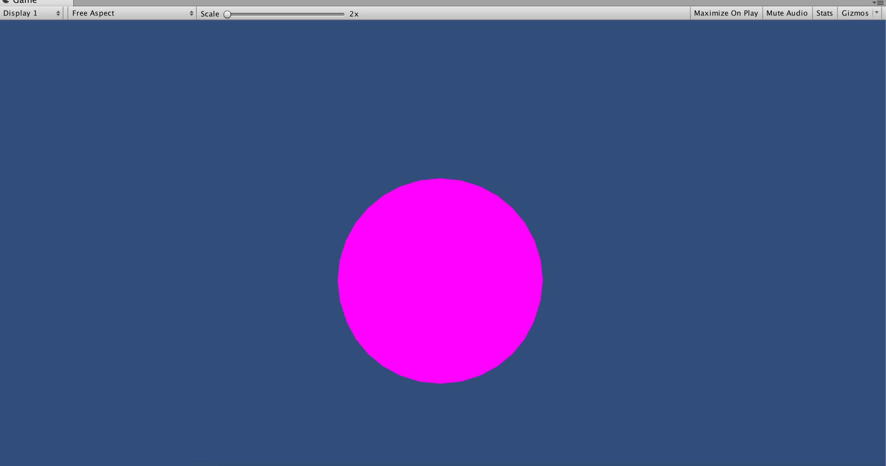

## 模型数据从哪里来

获取模型上每个顶点的纹理坐标和法线方向。

需要为顶点着色器定义一个新的输入参数，这个参数是一个结构体。

```c++
// Upgrade NOTE: replaced 'mul(UNITY_MATRIX_MVP,*)' with 'UnityObjectToClipPos(*)'

// Upgrade NOTE: replaced 'mul(UNITY_MATRIX_MVP,*)' with 'UnityObjectToClipPos(*)'
// 代码第一行通过Shader语义定义这个Unity Shader的名字"Unity Shaders Simple Shader"
// 保持良好的命名习惯有助于快速找到Shader
Shader "Unity Shaders Simple Shader" {
	// 此处没有用到Properties语义块, 它并不是必须的, 可以选择不声明任何材质属性
  	// 声明SubShader和Pass语义块
  	SubShader {
    // 不需要进行任何渲染设置和标签设置（采用默认设置）
		Pass {
      		// CG代码片段
			CGPROGRAM
			
      		// 告诉unity, 哪个函数包含顶点/片元着色器的代码
			#pragma vertex vert
			#pragma fragment frag
			
			// a表示应用(application), v表示顶点着色器(vertex shader)
			// a2v的意思就是把数据从应用阶段传递到顶点着色器中
			struct a2v {
				// POSITION语义告诉Unity,用模型空间的顶点坐标填充vertex变量
				float4 vertex : POSITION;
				// NORMAL语义告诉Unity,用模型空间的法线方向填充normal变量
				float3 normal : NORMAL;
				// TEXCOORD0语义告诉Unity,用模型的第一套纹理坐标填充texcoord变量
				float4 texcoord : TEXCOORD0;

				// 对于顶点着色器的输出,Unity支持的语义有:
				// POSITION, TANGENT, NORMAL, TEXCOORD0/1/2/3, COLOR
				// Unity中,它们是由使用该材质的Mesh Render组件提供的.
				// 在每帧调用Draw Call的时候, Mesh Render组件会把它负责渲染的模型数据发送给Unity Shader
				// 一个模型通常包含一组三角面片,每个三角面片由3个顶点构成,每个顶点又包含了一些数据(顶点位置/法线/切线/纹理坐标)
				// 通过上述方法,可以在顶点着色器中访问顶点的这些模型数据
			}
      		// 顶点着色器代码, 逐顶点执行
			// 输入v包含顶点位置, 通过POSITION语义指定
			// 函数返回值是float4类型变量, 为该顶点在裁剪空间的位置
			// POSITION和SV_POSITION都是CG/HLSL中的语义, 不能省略, 定义输入输出值
			// POSITION: 把模型顶点坐标填充到输入参数v中
			// SV_POSITION: 输出是裁剪空间中的顶点坐标
			// 如果没有这些语义来限定输入和输出参数的话, 渲染器就无法知道用户的行为
			// 下面函数的功能: 把顶点坐标从模型空间转换到裁剪空间
			// float4 vert(float4 v : POSITION) : SV_POSITION {
			// 	return UnityObjectToClipPos (v);
			// }
			// 这里修改了vert函数的输入参数类型,将其设置为新定义的结构体a2v
			// 通过这种自定义结构体的方式, 可以在顶点着色器中访问模型数据
			float4 vert(a2v v) : SV_POSITION {
				// 使用v.vertex来访问模型空间的顶点坐标
				return mul(UNITY_MATRIX_MVP, v.vertex);
			}
			
			// flag函数没有输入, 输出是一个fixed4类型的变量, 使用SV_Target限定
			// SV_Target是HLSL中的一个系统语义, 告诉渲染器, 将用户输出颜色存储到一个渲染目标中
			// 此处将输出到默认的帧缓存中
			// 该函数返回一个表示白色的fixed4类型的变量
			// 片元着色器输出的颜色的每个分量范围在[0,1], 其中[0,0,0]表示黑色, [1,1,1]表示白色
			fixed4 frag() : SV_Target {
				return fixed4(1.0, 1.0, 1.0, 1.0);
			}

			ENDCG
		}
	}
}
```

## 顶点着色器与片元着色器之间通信

实践中，往往希望从顶点着色器输出一些数据，例如把模型的法线、纹理坐标等传递给片元着色器，这期间涉及顶点着色器和片元着色器之间的通信。

为此定义一个新的结构体：

```c++
// Upgrade NOTE: replaced 'mul(UNITY_MATRIX_MVP,*)' with 'UnityObjectToClipPos(*)'

// Upgrade NOTE: replaced 'mul(UNITY_MATRIX_MVP,*)' with 'UnityObjectToClipPos(*)'
// 代码第一行通过Shader语义定义这个Unity Shader的名字"Unity Shaders Simple Shader"
// 保持良好的命名习惯有助于快速找到Shader
Shader "Unity Shaders Simple Shader" {
	// 此处没有用到Properties语义块, 它并不是必须的, 可以选择不声明任何材质属性
  	// 声明SubShader和Pass语义块
  	SubShader {
    	// 不需要进行任何渲染设置和标签设置（采用默认设置）
		Pass {
      		// CG代码片段
			CGPROGRAM
			
      		// 告诉unity, 哪个函数包含顶点/片元着色器的代码
			// 顶点着色器是逐顶点调用的
			// 片元着色器是逐片元调用的
			// 片元着色器中的输入实际上是把顶点着色器的输出进行插值后得到的结果
			#pragma vertex vert
			#pragma fragment frag
			
			// a表示应用(application), v表示顶点着色器(vertex shader)
			// a2v的意思就是把数据从应用阶段传递到顶点着色器中
			struct a2v {
				// POSITION语义告诉Unity,用模型空间的顶点坐标填充vertex变量
				float4 vertex : POSITION;
				// NORMAL语义告诉Unity,用模型空间的法线方向填充normal变量
				float3 normal : NORMAL;
				// TEXCOORD0语义告诉Unity,用模型的第一套纹理坐标填充texcoord变量
				float4 texcoord : TEXCOORD0;

				// 对于顶点着色器的输出,Unity支持的语义有:
				// POSITION, TANGENT, NORMAL, TEXCOORD0/1/2/3, COLOR
				// Unity中,它们是由使用该材质的Mesh Render组件提供的.
				// 在每帧调用Draw Call的时候, Mesh Render组件会把它负责渲染的模型数据发送给Unity Shader
				// 一个模型通常包含一组三角面片,每个三角面片由3个顶点构成,每个顶点又包含了一些数据(顶点位置/法线/切线/纹理坐标)
				// 通过上述方法,可以在顶点着色器中访问顶点的这些模型数据
			}

			// 使用一个结构体来定义顶点着色器的输出, 用于顶点/片元着色器之间传递信息
			// 
			struct v2f {
				// SV_POSITION语义告诉Unity,Pos里包含了顶点在裁剪空间中的位置信息
				// 它的语义必须是SV_POSITION, 否则渲染器无法得到裁剪空间中的顶点坐标
				float4 pos : SV_POSITION;
				// COLOR0语义可以用于存储颜色信息
				// COLOR0语义中的数据则可以由用户自行定义, 但一般都是存储颜色
				// 逐顶点的漫反射颜色/高光反射颜色
				fixed3 color : COLOR0;
			}


      		// 顶点着色器代码, 逐顶点执行
			// 输入v包含顶点位置, 通过POSITION语义指定
			// 函数返回值是float4类型变量, 为该顶点在裁剪空间的位置
			// POSITION和SV_POSITION都是CG/HLSL中的语义, 不能省略, 定义输入输出值
			// POSITION: 把模型顶点坐标填充到输入参数v中
			// SV_POSITION: 输出是裁剪空间中的顶点坐标
			// 如果没有这些语义来限定输入和输出参数的话, 渲染器就无法知道用户的行为
			// 下面函数的功能: 把顶点坐标从模型空间转换到裁剪空间
			// float4 vert(float4 v : POSITION) : SV_POSITION {
			// 	return UnityObjectToClipPos (v);
			// }
			// 这里修改了vert函数的输入参数类型,将其设置为新定义的结构体a2v
			// 通过这种自定义结构体的方式, 可以在顶点着色器中访问模型数据
			// float4 vert(a2v v) : SV_POSITION {
			// 	// 使用v.vertex来访问模型空间的顶点坐标
			// 	return mul(UNITY_MATRIX_MVP, v.vertex);
			// }
			float4 vert(a2v v) : SV_POSITION {
				// 声明输出结构
				v2f o;
				o.pos = mul(UNITY_MATRIX_MVP, v.vertex);
				// v.normal包含了顶点的法线方向, 其分量范围在[-1.0, 1.0]
				// 下面代码把分量范围映射到了[0.0, 1.0]
				// 存储到o.color中传递给片元着色器
				o.color = v.normal * 0.5 + fixed3(0.5, 0.5, 0.5);
				return o;
			}

			// flag函数没有输入, 输出是一个fixed4类型的变量, 使用SV_Target限定
			// SV_Target是HLSL中的一个系统语义, 告诉渲染器, 将用户输出颜色存储到一个渲染目标中
			// 此处将输出到默认的帧缓存中
			// 该函数返回一个表示白色的fixed4类型的变量
			// 片元着色器输出的颜色的每个分量范围在[0,1], 其中[0,0,0]表示黑色, [1,1,1]表示白色
			// fixed4 frag() : SV_Target {
			// 	return fixed4(1.0, 1.0, 1.0, 1.0);
			// }
			fixed4 frag(v2f i) : SV_Target {
				// 将插值后的i.color显示到屏幕上
				return fixed4(i.color, 1.0);
			}

			ENDCG
		}
	}
}
```

## 如何使用属性

材质提供给我们一个可以方便调节Unity Shader中参数的方式，通过这些参数，可以随时调整材质的效果。

这些参数需要写在Properties语义块中。

**新需求**：在材质面板显示一个**颜色拾取器**，从而可以直接控制模型在屏幕上显示的颜色。

```c++
// Upgrade NOTE: replaced 'mul(UNITY_MATRIX_MVP,*)' with 'UnityObjectToClipPos(*)'

// Upgrade NOTE: replaced 'mul(UNITY_MATRIX_MVP,*)' with 'UnityObjectToClipPos(*)'
// 代码第一行通过Shader语义定义这个Unity Shader的名字"Unity Shaders Simple Shader"
// 保持良好的命名习惯有助于快速找到Shader
Shader "Unity Shaders Simple Shader" {
	// 此处没有用到Properties语义块, 它并不是必须的, 可以选择不声明任何材质属性
	Properties {
		// 声明一个Color类型的属性_Color, 初始值(1.0, 1.0, 1.0, 1.0), 对应白色
		_Color ("Color Tint", Color) = (1.0, 1.0, 1.0, 1.0)
	}
	
	// 声明SubShader和Pass语义块
  	SubShader {
    	// 不需要进行任何渲染设置和标签设置（采用默认设置）
		Pass {
      		// CG代码片段
			CGPROGRAM
			
      		// 告诉unity, 哪个函数包含顶点/片元着色器的代码
			// 顶点着色器是逐顶点调用的
			// 片元着色器是逐片元调用的
			// 片元着色器中的输入实际上是把顶点着色器的输出进行插值后得到的结果
			#pragma vertex vert
			#pragma fragment frag
			
			// CG代码中,需要定义一个与属性名称和类型都匹配的变量
			fixed4 _Color;

			// a表示应用(application), v表示顶点着色器(vertex shader)
			// a2v的意思就是把数据从应用阶段传递到顶点着色器中
			struct a2v {
				// POSITION语义告诉Unity,用模型空间的顶点坐标填充vertex变量
				float4 vertex : POSITION;
				// NORMAL语义告诉Unity,用模型空间的法线方向填充normal变量
				float3 normal : NORMAL;
				// TEXCOORD0语义告诉Unity,用模型的第一套纹理坐标填充texcoord变量
				float4 texcoord : TEXCOORD0;

				// 对于顶点着色器的输出,Unity支持的语义有:
				// POSITION, TANGENT, NORMAL, TEXCOORD0/1/2/3, COLOR
				// Unity中,它们是由使用该材质的Mesh Render组件提供的.
				// 在每帧调用Draw Call的时候, Mesh Render组件会把它负责渲染的模型数据发送给Unity Shader
				// 一个模型通常包含一组三角面片,每个三角面片由3个顶点构成,每个顶点又包含了一些数据(顶点位置/法线/切线/纹理坐标)
				// 通过上述方法,可以在顶点着色器中访问顶点的这些模型数据
			}

			// 使用一个结构体来定义顶点着色器的输出, 用于顶点/片元着色器之间传递信息
			// 
			struct v2f {
				// SV_POSITION语义告诉Unity,Pos里包含了顶点在裁剪空间中的位置信息
				// 它的语义必须是SV_POSITION, 否则渲染器无法得到裁剪空间中的顶点坐标
				float4 pos : SV_POSITION;
				// COLOR0语义可以用于存储颜色信息
				// COLOR0语义中的数据则可以由用户自行定义, 但一般都是存储颜色
				// 逐顶点的漫反射颜色/高光反射颜色
				fixed3 color : COLOR0;
			}


      // 顶点着色器代码, 逐顶点执行
			// 输入v包含顶点位置, 通过POSITION语义指定
			// 函数返回值是float4类型变量, 为该顶点在裁剪空间的位置
			// POSITION和SV_POSITION都是CG/HLSL中的语义, 不能省略, 定义输入输出值
			// POSITION: 把模型顶点坐标填充到输入参数v中
			// SV_POSITION: 输出是裁剪空间中的顶点坐标
			// 如果没有这些语义来限定输入和输出参数的话, 渲染器就无法知道用户的行为
			// 下面函数的功能: 把顶点坐标从模型空间转换到裁剪空间
			// float4 vert(float4 v : POSITION) : SV_POSITION {
			// 	return UnityObjectToClipPos (v);
			// }
			// 这里修改了vert函数的输入参数类型,将其设置为新定义的结构体a2v
			// 通过这种自定义结构体的方式, 可以在顶点着色器中访问模型数据
			// float4 vert(a2v v) : SV_POSITION {
			// 	// 使用v.vertex来访问模型空间的顶点坐标
			// 	return mul(UNITY_MATRIX_MVP, v.vertex);
			// }
			float4 vert(a2v v) : SV_POSITION {
				// 声明输出结构
				v2f o;
				o.pos = mul(UNITY_MATRIX_MVP, v.vertex);
				// v.normal包含了顶点的法线方向, 其分量范围在[-1.0, 1.0]
				// 下面代码把分量范围映射到了[0.0, 1.0]
				// 存储到o.color中传递给片元着色器
				o.color = v.normal * 0.5 + fixed3(0.5, 0.5, 0.5);
				return o;
			}

			// flag函数没有输入, 输出是一个fixed4类型的变量, 使用SV_Target限定
			// SV_Target是HLSL中的一个系统语义, 告诉渲染器, 将用户输出颜色存储到一个渲染目标中
			// 此处将输出到默认的帧缓存中
			// 该函数返回一个表示白色的fixed4类型的变量
			// 片元着色器输出的颜色的每个分量范围在[0,1], 其中[0,0,0]表示黑色, [1,1,1]表示白色
			// fixed4 frag() : SV_Target {
			// 	return fixed4(1.0, 1.0, 1.0, 1.0);
			// }
			fixed4 frag(v2f i) : SV_Target {
				// 将插值后的i.color显示到屏幕上
				return fixed4(i.color, 1.0);
			}

			ENDCG
		}
	}
}
```

ShaderLab中属性的类型和CG中变量的类型之间的匹配关系如下所示：

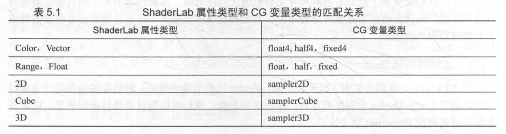

CG变量前可能有一个`uniform`关键词，例如：

```c++
uniform fixed4 _Color;
```

`Uniform`关键词是CG中修饰变量和参数的一种修饰词，它仅用于提供一些关于该变量的初始值是如何指定和存储的相关信息（与其他图像API中的`uniform`关键词的作用不太一样。）

Unity Shader中，uniform关键词是可以省略的。


# Unity提供的内置文件和变量

顶点/片元着色器的复杂之处在于，很多事情**都需要自己做**。

例如：转换法线方向、处理光照/阴影等。

为了方便开发者的编码过程，Unity提供了很多内置文件，包括提前定义的函数、变量和宏等。

**注意**：若在看他人编写的Unity Shader代码时，遇到了一些从未见过的变量、函数，而又无法找到对应的声明和定义，则很有可能这些代码使用了Unity内置文件提供的函数和变量。

## 内置的包含文件

**包含文件（include file）**，类似于C++中头文件的一种文件，Unity中其后缀为`.cginc`。

编写Shader时，可以使用`#include指令`把这些文件包含进来。

```c++
CGPROGRAM
// ....
#include "UnityCG.cginc"
// ....
ENDCG
```

这些包含文件可以在官方网址（http://unity3d.com/cn/get-unity/download/archive）下载。

一般来说，下载了Unity，就附带下载**包含文件**。

- Mac：/Applications/Unity/Unity.app/Contents/CGIncludes
- Windows：Unity安装路径/Data/CGIncludes

下表给出了CGIncludes中主要的包含文件以及它们的主要用处：

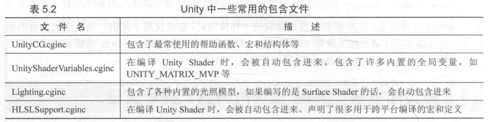

可以看出，有一些文件是即便没有使用`#include`指令，它们也是会被自动包含进来的，例如：`UnityShaderVariables.cginc`。

`UnityCG.cginc`是最常接触的一个包含文件，提供诸多结构体和函数，如下所示：

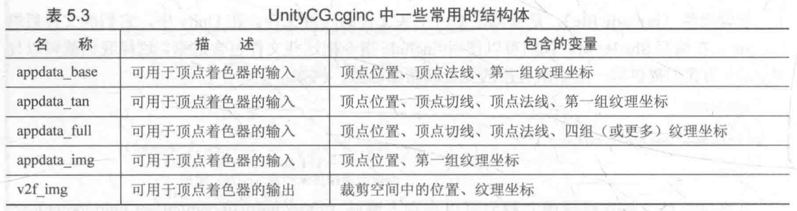

除了结构体外，`UnityCG.cginc`也提供一些常用的帮助函数，如下所示：

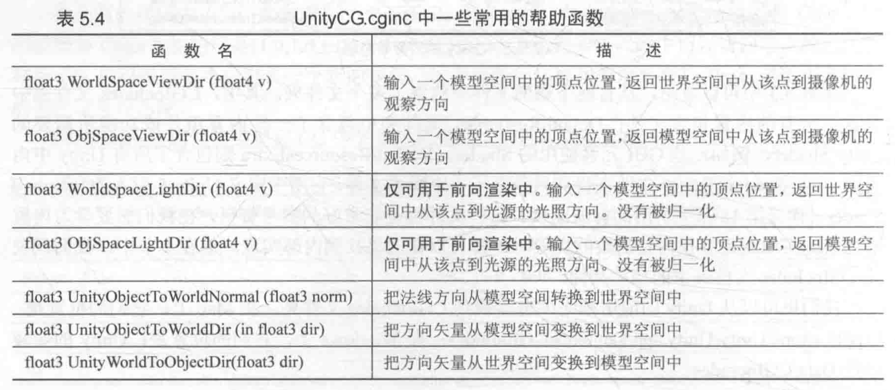

## 内置的变量

Unity提供访问时间、光照、雾效和环境光等目的的变量，这些内置变量大多位于`UnityShaderVariables.cginc`中，与光照有关的内置变量位于`Lighting.cginc`、`AutoLight.cginc`文件中。


# Unity提供的CG/HLSL语义

语义：`SV_POSITION`、`POSITION`、`COLOR0`

## 语义(semantics)

语义是一个赋给Shader输入和输出（输入输出变量不需要特别的意义，可以自行决定这些变量的用途）的字符串，这个字符串表达了这个参数的含义。

通俗地讲，这些语义可以让Shader知道从哪里读取数据，并把数据输出到哪里。

这些数据在CG/HLSL的Shader流水线中是不可或缺的。

**注意：**Unity并没有支持所有的语义。

Unity为了**方便对模型数据的传输**，对一些语义进行了特别的含义规定。

> 例如：在顶点着色器的输入结构体a2f用`TEXCOORD0`来描述texcoord，Unity会识别`TEXCOORD0`语义，以把模型的第一组纹理坐标填充到texcoord中。

注意：即使语义的名称一样，如果出现的位置不同，含义也不同。

> 例如：`TEXCOORD0`既可以用于描述顶点的着色器的输入结构体**a2f**，也可以用于描述输出结构体**v2f**。但在输入结构体**a2f**中，`TEXCOORD0`有特别的含义，即把模型的第一组纹理坐标存储在该变量中，而在输出结构体**v2f**中，`TEXCOORD0`修饰的变量含义就可以由我们来决定。

**系统数值语义（system-value semantics）**以SV开头（system-value），这些语义在渲染流水线中有特殊的含义。

> 例如：使用SV_POSITION语义去修饰顶点着色器的输出变量pos，则就表示pos包含了可用于光栅化的变换后的顶点坐标（齐次裁剪空间中的坐标）。

**使用SV语义描述的变量是不可以随便赋值的**，因为流水线需要使用它们来完成特定的目的，例如渲染引擎会把用SV_POSITION修饰的变量经过光栅化后显示在屏幕上。

注意：**一个变量在不同的Shader里使用了不同的语义修饰**。

（一些Shader会使用POSITION而非SV_POSITION来修饰顶点着色器的输出）

绝大多数平台上，SV_POSITION与POSITION语义是等价的，但在某些平台（例如索尼PS4）上必须使用SV_POSITION来修饰顶点着色器的输出，否则无法让Shader正常工作。

为了让Shader具有更好的跨平台性，对于这些有特殊含义的变量，最好使用以SV开头的语义进行修饰。

## Unity支持的语义

下表总结了**从应用阶段传递模型数据给顶点着色器时**Unity使用的常用语义，这些语义虽然没有使用SV开头，但Unity内部赋予了它们特殊的含义。

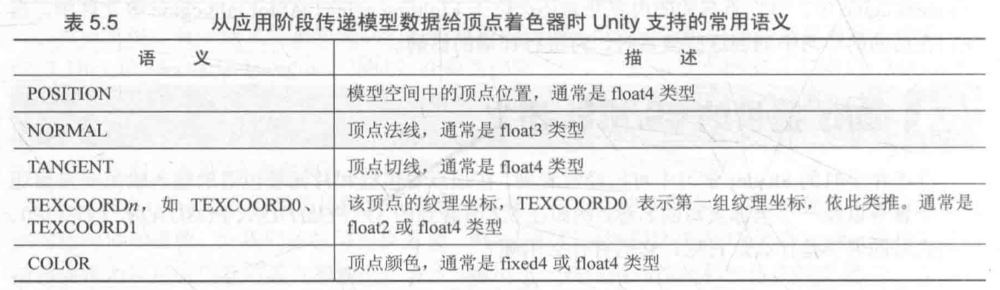

其中`TEXCOORDn`中n的数目是和Shader Model有关的，一般在Shader Model2和Shader Model3中，n等于8，而在Shader Model4和Shader Model5中，n等于16。

通常情况下，一个模型的纹理坐标组数一般不超过2（即往往只使用`TEXCOORD0`和`TEXCOORD1`）。

在Unity内置的数据结构体`appdata_full`中，它最多使用6个坐标纹理组。

下表总结了**从顶点着色器阶段到片元着色器阶段**Unity支持的常用语义。

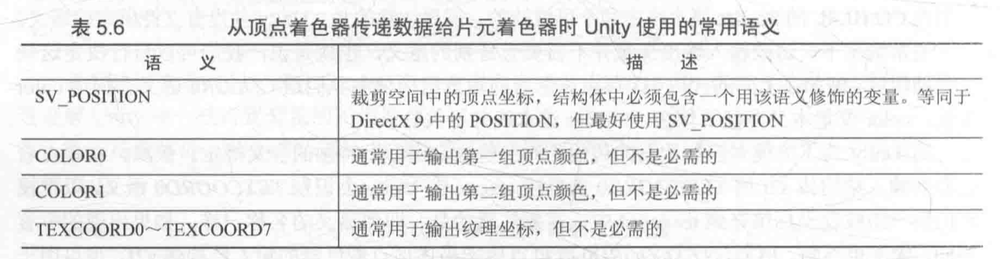

上面的语义中，除了`SV_POSITION`是有特别的含义外，其他语义对变量的含义没有明确要求（即，我们可以存储任意值到这些语义描述变量中）。

通常，如果我们需要把一些自定义的数据从顶点着色器传给片元着色器，一般选用`TEXCOORD0`等。

下表给出了**Unity中支持的片元着色器的输出语义**。

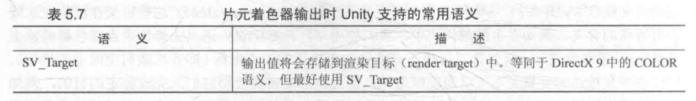

## 如何定义复杂的变量类型

上述提到的语义绝大部分用于描述标量或矢量类型的变量，例如fixed2，float，float4，fixed4等。

下面的代码给出了一个使用语义来修饰不同类型变量的例子：

```c++
struct v2f {
  float4 pos : SV_POSITION;
  fixed3 color0 : COLOR0;
  fixed4 color1 : COLOR1;
  half value0 : TEXCOORD0;
  float2 value1 : TEXCOORD1;
}
```

**注意：**一个语义可以使用的寄存器只能处理4个浮点值（float）。因此，如果想要定义矩阵类型，如float3x4，float4x4等变量就需要使用更多的空间。

一种方法是，把这些变量拆分成多个变量，例如对于float4x4的矩阵类型，可以拆分成4个float4类型的变量，每个变量存储了矩阵中的一行数据。


# Debug

**Shader难写的原因**：Shader中可以选择的调试方法非常有限，甚至连最简单的输出都不行。

介绍两种Unity中对Unity Shader调试的方法。

## 使用假彩色图像

**假彩色图像（false-color image）**指用假彩色技术生成的一种图像。

与假彩色图像对应的是照片这种**真彩色图像（true-color image）**。

一张假彩色图像可以用于可视化一些数据，那么如何用它来对Shader进行调试呢？

**思想：**把需要调试的变量映射到[0,1]之间（需要小心处理调试的变量的范围），把它们作为颜色输出到屏幕上，然后通过屏幕上显示的像素颜色来判断这个值是否正确。

如果已知调试变量的值域范围，可以先把它映射到[0,1]之间再进行输出，如果不知道一个变量的范围（往往说明对这个Shader中的运算并不了解），则只能不停地实验。

**注意**：颜色分类中任何大于1的数值将会被设置为1，任何小于0的数值会被设置为0。

因此可以尝试使用不同的映射，直到发现颜色发生了变化。（意味着得到了0~1的值。）

- 如果要调试的数据是一个一维数据，则可以选择一个单独的颜色分量（如R分量）进行输出，而把其他颜色分量置为0。
- 如果是多维数据，可以选择对它的每一个分量单独测试，或者选择多个颜色分量进行输出。

作为实例，下面代码使用假彩色图像的方式来可视化一些模型数据，如法线、切线、纹理坐标、顶点颜色，以及它们之间的运算结果等。

```c++
Shader "Unity Shaders Simple Shader" {
	Properties {
		_Color ("Color Tint", Color) = (1, 1, 1, 1)
	}
	SubShader {
        Pass {
            CGPROGRAM

            #pragma vertex vert
            #pragma fragment frag
            
            uniform fixed4 _Color;
			#include "UnityCG.cginc"
            
            struct v2f {
                float4 pos : SV_POSITION;
                fixed3 color : COLOR0;
            };
            
            v2f vert(appdata_full v) {
            	v2f o;
            	o.pos = UnityObjectToClipPos(v.vertex);
            	
				// o.color = v.normal * 0.5 + fixed3(0.5, 0.5, 0.5);
				
				// o.color = v.vertex * 0.5 + fixed3(0.5, 0.5, 0.5);
				
				// o.color = v.tangent * 0.5 + fixed3(0.5, 0.5, 0.5);
				
				// fixed3 binormal = cross(v.normal, v.tangent.xyz) * v.tangent.w;
				// o.color = binormal * 0.5 + fixed3(0.5, 0.5, 0.5);

				// o.color = fixed4(v.texcoord.xy, 0.0, 1.0);

				o.color = fixed4(v.texcoord1.xy, 0.0, 1.0);
				
                return o;
            }

            fixed4 frag(v2f i) : SV_Target {
            	fixed3 c = i.color;
            	c *= _Color.rgb;
                return fixed4(c, 1.0);
            }

            ENDCG
        }
    }
}
```

上述代码中，使用了Unity内置的一个结构体`appdata_full`，它的定义如下，可以看出，`appdata_full`几乎包含了所有的模型数据。

```c++
struct appdata_full {
  float4 vertex : POSITION;
  float4 tangent : TANGENT;
  float3 normal : NORMAL;
  float4 texcoord : TEXCOORD0;
  float4 texcoord1 : TEXCOORD1;
  float4 texcoord2 : TEXCOORD2;
  float4 texcoord3 : TEXCOORD3;
#if defined(SHADER_API_XBOX360)
  half4 texcoord4 : TEXCOORD4;
  half4 texcoord5 : TEXCOORD5;
#endif
  fixed4 color : COLOR;
}
```

## Visual Studio

**Visual Studio 2012**版本中提供了对Unity Shader的调试功能——**Graphics Debugger**。

通过Graphics Debugger，可以查看每个像素的最终颜色、位置等信息，还可以对顶点着色器和片元着色器进行单步调试。

## 帧调试器（Frame Debugger）

针对渲染的调试器——帧调试器。

与其他调试工具的复杂性相比，Unity原生的帧调试器非常简单快捷，可以使用它来看到游戏图像的某一帧是如何一步步渲染出来的。

要使用帧调试器，需要首先在Window->Frame Debugger中打开帧调试器窗口。

帧调试器可以用于查看渲染该帧时进行的各种**渲染事件（event）**，这些事件包含了**Draw Call序列**，也包括类似清空帧缓存等操作。

帧调试器窗口大致可分为3个部分：

- 最上面的区域可以开启/关闭（单击Enable按钮）帧调试功能，当开启了帧调试时，通过移动窗口最上方的滑动条（或单击前进和后退按钮），可以重放这些渲染事件。
- 左侧区域显示了所有事件的树状图，图中每个叶子节点就是一个事件，而每个父节点的右侧显示了该节点下的事件数目。（可以从事件的名字了解这个事件的操作，例如以Draw开头的事件通常就是一个Draw Call）
- 当单机某个事件时，在右侧的窗口中就会显示出该事件的细节，例如几何图形的细节以及使用了哪个Shader等，同时在Game视图中可以看到它的效果。如果该事件是一个Draw Call并且对应了场景中的一个GameObject，则这个GameObject也会在Hierarchy视图中被高亮显示出来

如果被选中的Draw Call是对一个渲染纹理（RenderTexture）的渲染操作，则该渲染纹理就会显示在Game视图中，同时右侧面板上方的工具栏中也会出现更多的选项（例如在Game视图中单独显示R、G、B、A通道）。

注意：帧调试器实际上并没有实现一个真正的**帧拾取（frame capture）**的功能，而是仅仅使用**停止渲染**的方法来查看渲染事件的结果。

>例如，如果想要查看第4个Draw Call的结果，则帧调试器就会在第4个Draw Call调用完毕后停止渲染。
>
>这种方法虽然简单，但得到的信息也很有限。

如果想要获取更多的信息，还需要使用外部工具，例如Intel GPA、RenderDoc、NVIDIA NSight、AMD GPU PerfStudio等。


# 平台渲染的差异

## 渲染纹理的坐标差异

**OpenGL**和**DirectX**的屏幕空间坐标的差异。

（水平方向上，两者的数值变化方向是相同的，但在竖直方向上，两者是相反的）

- OpenGL：`(0,0)`对应于屏幕的左下角。
- DirectX：`(0,0)`对应于屏幕的左上角。

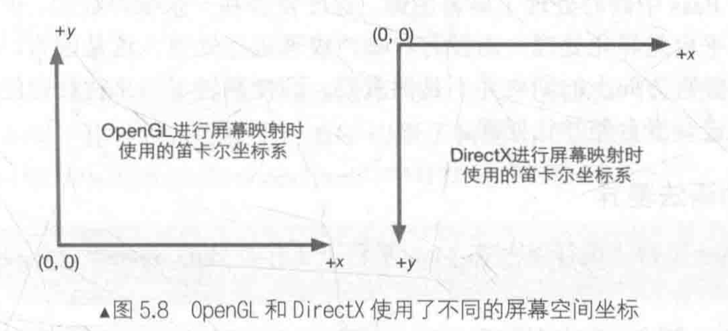

不仅可以把渲染结果输出到屏幕上，还可以输出到不同的**渲染目标（Render Target）**中，此时需要使用**渲染纹理（Render Texture）**来保存这些渲染结果。

当要使用**渲染到纹理技术**，把屏幕图像渲染到一张渲染纹理中时，如果不采取任何措施的话，就会出现纹理翻转的情况。（幸运的是，Unity在背后为我们处理了这种翻转问题——当在DirectX平台上使用**渲染到纹理技术**时，Unity会为我们**翻转屏幕图像纹理**，以便**在不同平台上达到一致性**）

**注意：**当开启了**抗锯齿**（Edit->Project Setting->Quality->Anti Aliasing）并在此时使用了**渲染到纹理技术**，在这种情况下，Unity首先**渲染得到屏幕图像**，再**由硬件进行抗锯齿处理后**，得到一张渲染纹理来供后续处理。此时，在DirectX平台下，得到的输入屏幕图像并不会被Unity翻转，即此时对屏幕图像的采样坐标是需要符合DirectX平台规定的。

- 如果屏幕特效只需处理一张渲染图像，则不需要在意纹理的翻转问题，因为在调用`Graphics.Blit`函数时，Unity已经对屏幕图像的采样坐标进行了处理，只需按正常的采样过程处理屏幕图像即可。
- 但当需要同时处理多张渲染图像（前提是开启**抗锯齿**），例如需要同时处理屏幕图像和法线纹理，这些图像在竖直方向的朝向就可能是不同的（只有在DirectX这样的平台上才有这样的问题）。此时，就需要自己在顶点着色器中翻转某些渲染纹理（例如深度纹理或其他由脚本传递过来的纹理）的纵坐标，使之都符合DirectX平台的规则。

```c++
#if UNITY_UV_STARTS_AT_TOP		// 判断当前平台是否是DirectX类型的平台
if (_MainTex_TexelSize.y < 0)
		uv.y = 1-uv.y;
#endif
```

当在这样的平台上开启了**抗锯齿**，主纹理的**纹素**大小在竖直方向上就会变成负值，以方便对主纹理进行正确的采样。

因此，可以判断`_MainTex_Texelsize.y`是否小于0来检验是否开启了**抗锯齿**，如果是，则需要对除主纹理外的其他纹理的采样坐标进行竖直方向上的翻转。


# Shader整洁之道

## float 、half还是fixed

使用**CG/HLSL**来编写Unity Shader代码，有3种精度的数值类型：**float、half和fixed**。（不同的精度决定计算结果的数值范围）。

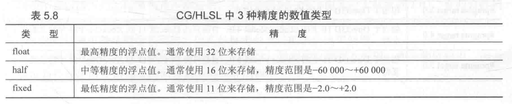

**注意：**上面的精度不是绝对正确的，尤其是在**不同平台和GPU上**，它们实际的精度可能和上面给出的范围不一致。

- **桌面GPU**：**把所有计算都按最高的浮点精度**进行计算，即float、half和fixed在这些平台上是等价的，这意味着，我们在PC上很难看出**因为half和fixed精度**而带来而不同。
- **移动平台GPU**：有不同的精度范围，而且不同精度浮点值的运算速度也会有所差异，因此，**应该确保在真正的移动平台上验证Shader**。
- **fixed精度**实际上只在一些较旧的移动平台上有用，大多数现代的GPU上，它们内部把fixed和half当成同等精度来对待。

**建议：**尽可能使用精度较低的类型，因为这可以优化Shader的性能，这一点在移动平台上尤其重要。

- **fixed类型：**存储颜色和单位矢量

如果要存储更大范围的数据可以使用half类型，最差情况下再选择使用float。

## 避免不必要的计算

如果毫无节制地在Shader（尤其是片元着色器）中进行大量计算，则很快会收到Unity错误提示：

>temporary register limit of 8 exceeded

或

>Arithmetic instruction limit of 64 exceeded; 65 arithmetic instructions needed to compile program

上述错误主要是在Shader中进行了过多的运算，使得需要的临时寄存器数目或指令数目超过了当前可支持的数目。

**注意：**不同的Shader Target、不同的着色器阶段，可使用的临时寄存器和指令数目都是不同的。

可以通过指定更高等级的Shader Target来消除这些错误。

下表给出了Unity目前支持的Shader Target。

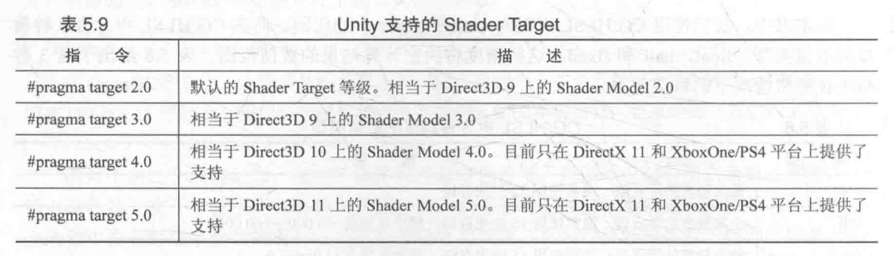

**注意：**所有类似OpenGL平台（包括移动平台）被当成是支持到Shader Model 3.0的。而WP8/WinRT平台则只支持到Shader Model 2.0。

>Shader Model：由微软提出的一套规范，决定了Shader中各个特性（feature）的能力（capability）。这些特性和能力体现在Shader能使用的运算指令数目、寄存器个数等各个方面。Shader Model等级越高，Shader能力越强。
>
>虽然更高等级的Shader Target可以使用更多的临时寄存器和运算指令，但一个更好的方法是尽可能减少Shader中的运算，或者通过预计算的方式来提供更多的数据。

## 慎用分支和循环语句

分支和循环语句在GPU上的实现和在CPU上**有很大的不同**。

GPU使用了不同于CPU的技术来实现分支语句，在最坏的情况下，**花在一个分支语句的时间相当于运行了所有分支语句的时间**。

因此不鼓励在Shader中使用流程控制语句，因为它们会降低GPU的并行处理能力。

**一个解决的办法是**：尽量把计算向流水线上端移动，例如把放在片元着色器中的计算放到顶点着色器中，或者直接在CPU中进行**预计算**，再把结果传递给Shader。

如果不可避免要使用分支语句来进行运算，则建议是：

- 分支判断语句中使用的条件变量最好是常数，即在Shader运行过程中不会发生变化；
- 每个分支中包含的操作指令尽可能少；
- 分支的嵌套层数尽可能少。

## 不要除以0

在编写Shader时可能会忽略这个问题：

```c++
fixed4 frag(v2f i) : SV_Target
{
    return fixed4(0.0/0.0, 0.0/0.0, 0.0/0.0, 1.0);
}
```

这样代码结果往往是不可预测的（崩溃、白色、黑色）。

**解决办法：**对那些除数可能为0的情况，强制截取到非0范围。

**可以用if语句来判断除数是否为0的例子。**
