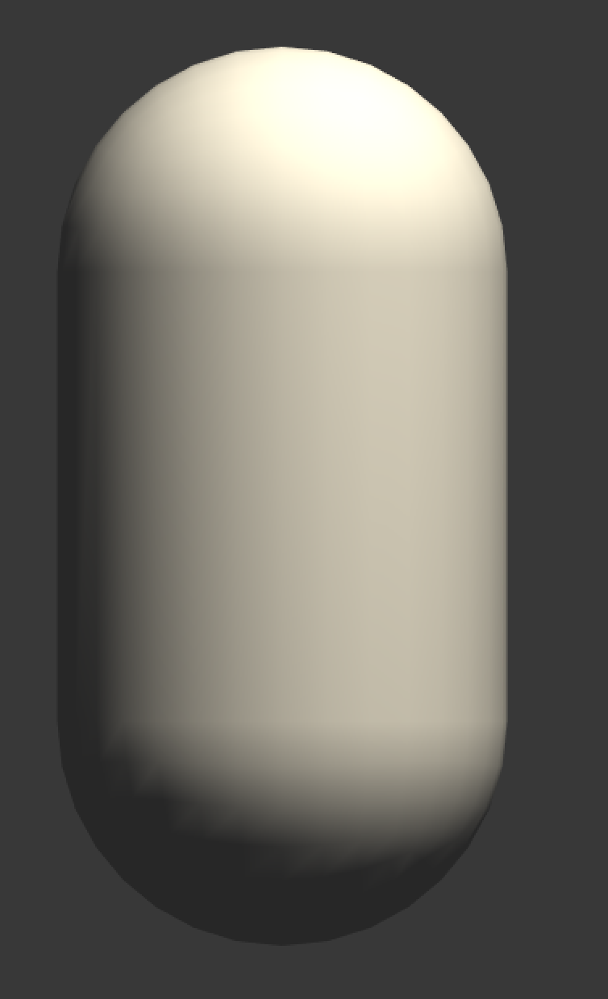
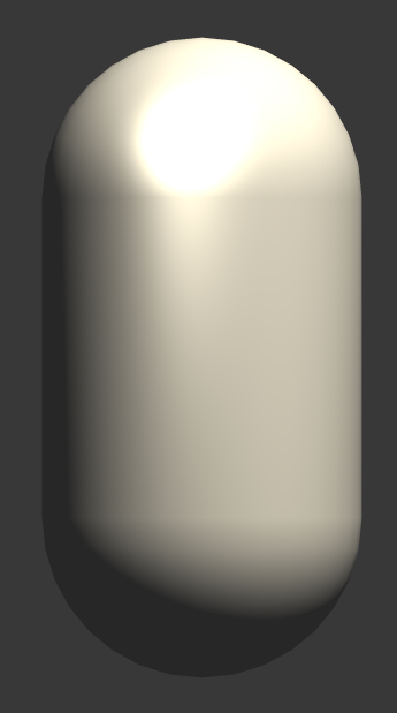

# 如何看到这个世界

渲染总是围绕一个问题：如何决定一个像素的颜色？

- 决定一个像素的可见性
- 决定这个像素的光照计算

光照模型就是用于决定在一个像素上进行怎样的光照计算。

**当描述一个物体时，实际上是因为这个物体反射了某种波长的光，而吸收了其他波长的光。**

模拟真实的光照环境来生成一张图像，需要考虑3种物理现象：

- 光线从**光源（light source）**中被发射出来；
- 光线和场景中的一些物体相交，一些光线被吸收了，另一些光线被散射到其他方向；
- 摄像机吸收了光，产生了一张图像。

## 光源

实时渲染中，通常把光源当成一个没有体积的点，用$l$表示它的方向。

如何测量一个光源发射出了多少光？使用**辐照度（irradiance）**来量化光。

对于平行光来说，它的辐照度可通过计算**在垂直于$l$的单位面积（光源方向$l$和表面法线$n$之间的夹角余弦值）上的单位时间内穿过的能量**来得到。（默认方向矢量的模都为1）


因为**辐照度和照射到物体表面时光线之间的距离$d/\cos\theta$成反比**，因此辐照度就和$\cos\theta$成正比。

$\cos\theta$可以使用光源方向$l$和表面法线$n$的点积来得到，这就是使用点积来计算辐照度的由来。

## 吸收和散射

光线由光源发射出来后，会与一些物体相交，相交的结果有两个：

- **散射（scattering）**：只改变光线的方向，但不改变光线的密度和颜色。
- **吸收（absorption）**：只改变光线的密度和颜色，但不改变光线的方向。

光线在物体表面经过散射后，有两种方向：

- **折射（refraction）**/ **透射（transmission）**：散射到物体内部。
- **反射（reflection）**：散射到物体外部。

对于不透明物体，折射进入物体内部的光线还会继续与内部的颗粒进行相交，其中一些光线最后会重新发射出物体表面（具有和入射光线**不同的方向分布和颜色**），而另一些则被物体吸收。


为区分两种不同的散射方向，在光照模型中使用不同的部分来计算：

- **高光反射（specular）**：表示物体表面是如何反射光线的。（只考虑在某一特定方向上的高光反射。）
- **漫反射（diffuse）**：表示有多少光线会被折射、吸收和散射出表面。（假设漫反射是没有方向性的，即光线在所有方向上是平均分布的。）

根据入射光线的数量和方向，可以计算出射光线的数量和方向，通常使用**出射度（exitance）**描述。

**辐射度**和**出射度**满足线性关系，它们之间的比值就是材质的漫反射和高光反射属性。

## 着色

**着色（Shading）**指根据**材质属性**（漫反射属性）、**光源信息**（光源方向、辐照度），使用**光照模型（Lighting Model）**去计算**沿某个观察方向的出射度**的过程。

不同的光照模型有不同的目的：

- 一些用于描述粗糙的物体表面。
- 一些用于描述金属表面。

## BRDF光照模型

**BRDF（Bidirectional Reflectance Distribution Function）**用于解决当光线从某个方向照射到一个表面时，有多少光线被反射。

当给定模型表面上的一个点时，**BRDF包含了对该点外观**的完整描述。

图形学中，**BRDF使用一个数学公式来表示**，并且提供了一些参数来调整**材质属性**。

当给定**入射光线的方向和辐照度**后，BRDF可以给出在某个出射方向上的光照能量分布。

本文的BRDF模型都是对真实场景进行**理想化和简化后**的模型，即它们并不能真实地反映物体和光线之间的交互，这些光照模型被称为是**经验模型**（尽管如此，这些经验模型仍然在实时渲染领域被应用了多年）。

《3D数学基础：图形与游戏开发》（英文名：《3D Math Primer For Graphics And Game Development》）

**计算机图形学第一定律**：如果它看起来是对的，则它就是对的。

如果想更加真实地模拟光和物体的交互，可以**基于物理的BRDF模型**。


# 标准光照模型

早期的游戏引擎中往往只使用一个光照模型，这个模型被称为**标准光照模型**。

1975年，著名学者**裴祥风（Bui Tuong Phone）**提出了标准光照模型背后的基本理念。

>**标准光照模型**只关心直接光照（direct light），即那些直接从光源发射出来照射到物体表面后，经过物体表面的一次反射直接进入摄像机的光线。
>
>基本方法：把进入到摄像机内的光线分成4个部分，每个部分使用一种方法来计算它的贡献度。
>
>1. **自发光（emissive）**：$C_{emissive}$表示，描述给定一个方向时，一个表面本身会向该方向发射多少辐射量。需要注意的是，如果没有使用**全局光照（global illumination）**技术，这些自发光的表面并不会真的照亮周围的物体，而是它本身看起来更亮了而已。
>2. **高光反射（specular）**：$C_{specular}$表示，描述当光线从光源照射到模型表面时，该表面会在完全镜面反射方向散射多少辐射量。
>3. **漫反射（diffuse）**：$C_{diffuse}$表示，描述当光线从光源照射到模型表面时，该表面会向每个方向散射多少辐射量。
>4. **环境光（ambient）**：$C_{ambient}$表示，用于描述其他所有的间接光照。

## 环境光

真实世界中，物体可以被**间接光照（indirect light）**所照亮。

>**间接光照：**光线通常会在多个物体之间反射，最后进入摄像机，即光线在进入摄像机之前，经过了不止一次的物体反射。
>
>例如：在红地毯上放置一个浅灰色的沙发，则沙发底部也会有红色，这些红色是由红地毯反射了一部分光线，再反弹到沙发上的。

标准光照模型中，使用一种称为**环境光的部分来近似模拟间接光照**。

**环境光**通常是一个全局变量，即场景中的所有物体都使用这个环境光。
$$
C_{ambient}=g_{ambient}	\tag{1}
$$

## 自发光

光线可以直接由光源发射进入摄像机，而不需要经过任何物体的反射。

标准光照模型使用自发光来计算这个部分的贡献度，即直接使用该材质的自发光颜色：
$$
C_{emissive} = m_{emissive} \tag{2}
$$
通常在实时渲染中，自发光的表面往往并不会照亮周围的表面，即，这个物体并不会被当成一个光源。

## 漫反射

漫反射光照是用于对那些被物体表面随机散射到各个方向的辐射度进行建模的。

漫反射中，视角位置不重要（由于反射是完全随机的），可以认为**在任何反射方向**上的分布都是一样的。

**入射光线的角度**很重要。

> 漫反射光照符合**朗伯定律(Lambert's Law)** ：
>
> 反射光线的强度与**表面法线和光源方向之间夹角的余弦值**成正比。

漫反射计算如下：
$$
C_{diffuse}=(C_{light}\cdot m_{diffuse})\cdot \max{(0, n\cdot I)} \tag{3}
$$
其中，$n$是表面法线，$I$是指向光源的单位矢量，$m_{diffuse}$是材质的漫反射颜色，$C_{light}$是光源颜色。

注意：需要**防止法线和光源方向点乘**的结果为负值（采用max函数，避免物体被从后面来的光源照亮）。

## 高光反射

此处的高光反射是一种经验模型，即它**并不完全符合真实世界中的高光反射**。

它可以计算那些**沿着完全镜面反射方向被反射**的光线，可以让物体看起来是**有光泽**的（例如金属材质）。

计算高光反射需要知道：**表面法线、视角方向，光源方向，反射方向**。（均为单位矢量）

反射方向可以通过其他信息知道：$r=2(n\cdot I)\cdot n - I$


这样可以利用**Phong模型**来计算高光反射的部分：
$$
C_{specular}=(C_{light}\cdot m_{specular})\cdot\max(0,v\cdot r)^{m_{gloss}} \tag{4}
$$
其中：

- $m_{gloss}$是材质的**光泽度（gloss）/ 反光度（shininess）**，用于控制高光区域的**亮点宽度**（$m_{gloss}$越大，亮点越小）。
- $m_{specular}$是材质的高光反射颜色，用于控制该材质对于高光反射的强度和颜色。
- $C_{light}$则是光源的颜色和强度

注意：此处也要防止$v\cdot r$的结果为负数。

**Blinn-Phong模型**可以避免计算反射方向$r$，为此引入一个新的矢量$h$，通过对$v$和$I$的取平均后再归一化得到。
$$
h=\frac{v+I}{|v+I|}	\tag{5}
$$
然后，使用$n$和$h$之间的夹角公式进行计算，而非$v$和$r$之间的夹角。

**Blinn-Phong模型**的计算公式如下：
$$
C_{specular}=(C_{light}\cdot m_{specular})\cdot\max(0,n\cdot h)^{m_{gloss}} \tag{6}
$$


在硬件实现时，如果**摄像机和光源距离模型足够远**的话，**Blinn模型会快于Phong模型**（认为此时$v$和$I$都是定值，因而$h$是一个常量）。但是当$v$或者$I$不是定值时，**Phong模型可能反而更快一些**。

注意：两种光照模型都是经验模型，即**不应该认为Blinn-Phong模型是对“正确的”Phong模型的近似**。

实际上，在一些情况下，**Blinn-Phong模型更符合实验结果**。

有很多重要的物理现象无法用**Blinn-Phong模型表现出来**，例如**菲涅尔反射（Fresnel Reflection）**。

**Blinn-Phong模型**是**各向同性（isotropic）**的，即，当固定视角和光源方向旋转这个表面时，反射不会发生任何改变。

但有些表面具有**各向异性（anisotropic）**反射性质的，例如拉丝金属、毛发等。

## 逐像素还是逐顶点

- **片元着色器**：逐像素光照（per-pixel lighting）
- **顶点着色器**：逐顶点光照（per-vertex lighting）

**逐像素光照**：以每个像素为基础，得到它的法线（可以是对顶点法线插值得到，也可以是从法线纹理中采样得到），然后进行光照模型的计算。这种在面片之间对顶点法线进行插值的技术被称为**Phong着色（Phong Shading）**，也被称为**Phong插值**或**法线插值着色技术**。

**逐顶点光照 / 高洛德着色（Gouraud Shading）**：在每个顶点上计算光照，在渲染图元内部进行线性插值，最后输出像素颜色。

由于顶点数目远远小于像素数目，因此**逐顶点光照的计算量往往要小于逐像素光照**。

注意：由于**逐顶点光照依赖于线性插值来得到像素光照**，因此，当光照模型中有**非线性的计算**（例如计算高光反射）时，逐顶点光照就会出问题。

同时，由于**逐顶点光照会在渲染图元内部对顶点颜色进行插值**，导致**渲染图元内部的颜色总是暗于顶点处的最高颜色值**，这在某些情况下会产生明显的棱角现象。


# Unity中的环境光和自发光

标准光照模型中，环境光和自发光的计算是最简单的。

Unity中，场景中的环境光可以在：`Windows->Lighting->Settings->Ambient Source/Ambient Color/Ambient Mode`中控制。


在Shader中，只需通过Unity的内置变量`UNITY_LIGHTMODEL_AMBIENT`就可以得到环境光的颜色和强度信息。

**注意**：由于绝大多数物体没有自发光特性，因此绝大部分Shader中都没有计算自发光部分。如果要计算自发光，只需要在片元着色器输出最后的颜色之前，**把材质的自发光颜色添加到输出颜色上即可。**


# Unity Shader中实现漫反射光照模型

基本光照模型中漫反射的计算公式：
$$
C_{diffuse}=(C_{light}\cdot m_{diffuse})\cdot \max{(0, n\cdot I)} \tag{3}
$$
计算漫反射需要知道4个参数：

1. 入射光线的颜色和强度$C_{light}$
2. 材质的漫反射系数$m_{diffuse}$
3. 表面法线$n$
4. 光源方向$I$

为了防止点积的结果为负值，需要使用max操作，CG提供了这样的函数。

本例使用`saturate`函数来达到同样的目的。

>函数：saturate(x)
>
>参数：x：为用于操作的标量或矢量，可以是float、float2、float3等类型
>
>描述：把x截取在[0,1]范围内，如果x是一个矢量，则对它的每一个分量进行这样的操作。

## 逐顶点光照

实现一个逐顶点的漫反射光照效果。

1. 在Unity中新建一个场景，默认情况下场景包含**一个摄像机和一个平行光**，并且使用了**内置的天空盒子**。`Window->Lighting->Setting`中去掉场景中的天空盒子

2. 新建一个材质，材质名：`DiffuseVertexLevelMat`
3. 新建一个Unity Shader，名称为`DiffuseVertexLevel`，将其赋给第2步的材质
4. 场景中创建一个胶囊体，并把第2步中的材质赋给该胶囊体
5. 保存场景

打开第3步的Shader文件，输入以下代码：

```c++
// Upgrade NOTE: replaced '_World2Object' with 'unity_WorldToObject'
// Upgrade NOTE: replaced 'mul(UNITY_MATRIX_MVP,*)' with 'UnityObjectToClipPos(*)'

Shader "Unity Shaders Book/Chapter 6/Diffuse Vertex-Level" {
	// 为了得到并且控制材质的漫反射颜色,在Properties语义块中声明一个Color类型的属性
	// 初始值设为白色
	Properties {
		_Diffuse ("Diffuse", Color) = (1, 1, 1, 1)
	}
	SubShader {
		// 定义一个Pass块: 顶点/片元着色器的代码需要写在Pass语义块中,而非SubShader语义块中
		Pass { 
			// 指明光照模式
			// LightMode标签是Pass标签中的一种,用于定义该Pass在Unity的光照流水线中的角色
			// 只有定义了正确的LightMode,才能得到一些Unity的内置光照变量
			Tags { "LightMode"="ForwardBase" }

			// 使用CGPROGRAM和ENDCG包围CG代码片
			// 定义重要的顶点/片元着色器代码
			CGPROGRAM
			
			// 使用#pragma指令告诉Unity,定义的顶点/片元着色器名称
			#pragma vertex vert
			#pragma fragment frag
			
			// 为了使用Unity内置的一些变量,需要包含Unity的内置文件Lighting.cginc
			#include "Lighting.cginc"
			
			// 为了在Shader中使用Properties语义块中的声明,需要定义一个和该属性类型相匹配的变量
			// 通过这样的方式,可以得到漫反射公式中需要的参数(材质的漫反射属性)
			// 由于颜色属性的范围在[0,1],因此可以使用fixed精度的变量来存储它
			fixed4 _Diffuse;
			
			// 定义顶点着色器的输入和输出结构体(输出结构体同时也是片元着色器的输入结构体)
			struct a2v {
				float4 vertex : POSITION;
				// 为了访问顶点的法线,定义normal变量
				// 并通过NORMAL语义告诉Unity要把模型顶点的法线信息存储到normal变量中
				float3 normal : NORMAL;
			};
			
			struct v2f {
				float4 pos : SV_POSITION;
				// 为了把顶点着色器中计算得到的光照颜色传递给片元着色器
				// 定义一个color变量,使用COLOR语义,也可以用TEXCOORD0语义
				fixed3 color : COLOR;
			};
			
			// 实现一个逐顶点的漫反射光照模型
			v2f vert(a2v v) {
				// 定义返回值o,顶点着色器最基本任务就是把顶点位置从模型空间转换到裁剪空间
				v2f o;
				// Transform the vertex from object space to projection space
				// 需要使用Unity内置的模型*世界*投影矩阵UNITY_MATRIX_MVP完成坐标变换
				o.pos = UnityObjectToClipPos(v.vertex);
				
				// Get ambient term
				// 通过Unity内置变量UNITY_LIGHTMODEL_AMBIENT得到环境光部分
				fixed3 ambient = UNITY_LIGHTMODEL_AMBIENT.xyz;
				
				// Transform the normal from object space to world space
				// 计算法线光源方向之间的点积时,需要选择它们所在的坐标系,只有两者处于同一坐标空间下,点积才有意义
				// 因此需要把法线转换到世界空间中
				// 可以使用顶点变换矩阵的逆转置矩阵对法线进行相同的变换
				// 因此首先得到模型空间到世界空间的变换矩阵的逆矩阵unity_WorldToObject
				// 然后通过调换它在mul函数中的位置,得到和转置矩阵相同的矩阵乘法
				// 由于法线是一个三维矢量,因此只需截取unity_WorldToObject的前三行和前三列即可
				fixed3 worldNormal = normalize(mul(v.normal, (float3x3)unity_WorldToObject));
				// Get the light direction in world space
				// 光源的方向可以由_WorldSpaceLightPos0得到
				// 注意此处对光源方向的计算并不具有通用性
				// (如果场景中使用多个光源或者类型为点光源等其他类型,则无法得到正确结果)
				fixed3 worldLight = normalize(_WorldSpaceLightPos0.xyz);
				// 得到世界空间中的法线和光源方向后,需要对其进行归一化操作
				// Compute diffuse term
				// Unity提供一个内置变量_LightColor0来访问该Pass处理的光源的颜色和强度信息
				// 如果想要得到正确的值需要定义合适的LightMode标签
				// 得到点积结果后,使用saturate函数把参数截取到[0,1]范围内,防止结果为负值
				// 最后再与光源的颜色和强度以及材质的漫反射颜色相乘即可得到最终的漫反射光照部分
				fixed3 diffuse = _LightColor0.rgb * _Diffuse.rgb * saturate(dot(worldNormal, worldLight));

				// 对环境光和漫反射光部分相加,得到最终的光照结果
				o.color = ambient + diffuse;
				
				return o;
			}
			
			// 由于所有的计算都在顶点着色器中已经完成,因此片元着色器的代码很简单,只需要直接输出顶点颜色即可
			fixed4 frag(v2f i) : SV_Target {
				return fixed4(i.color, 1.0);
			}
			
			ENDCG
		}
	}
	// 需要把这个Unity Shader的回调shader设置为内置的Diffuse
	FallBack "Diffuse"
}
```

对于细分程度较高的模型，**逐顶点光照已经可以得到比较好的光照效果**了。

但对于一些细分程度较低的模型，逐顶点光照会出现一些视觉问题，例如可以在下图中看到胶囊体的背光面与向光面交界处有一些锯齿。



## 逐像素光照

只需要对逐顶点光照的Shader进行一些更改就可以实现**逐像素的漫反射**效果。

1. 在Unity中新建一个场景，默认情况下场景包含**一个摄像机和一个平行光**，并且使用了**内置的天空盒子**。`Window->Lighting->Setting`中去掉场景中的天空盒子

2. 新建一个材质，材质名：`DiffusePixelLevelMat`
3. 新建一个Unity Shader，名称为`DiffusePixelLevel`，将其赋给第2步的材质
4. 场景中创建一个胶囊体，并把第2步中的材质赋给该胶囊体
5. 保存场景

打开第3步的Shader，输入以下代码：

```c++
// Upgrade NOTE: replaced '_World2Object' with 'unity_WorldToObject'
// Upgrade NOTE: replaced 'mul(UNITY_MATRIX_MVP,*)' with 'UnityObjectToClipPos(*)'

Shader "Unity Shaders Book/Chapter 6/Diffuse Pixel-Level" {
	Properties {
		_Diffuse ("Diffuse", Color) = (1, 1, 1, 1)
	}
	SubShader {
		Pass { 
			Tags { "LightMode"="ForwardBase" }
		
			CGPROGRAM
			
			#pragma vertex vert
			#pragma fragment frag
			
			#include "Lighting.cginc"
			
			fixed4 _Diffuse;
			
			struct a2v {
				float4 vertex : POSITION;
				float3 normal : NORMAL;
			};
			
			// 修改顶点着色器的输出结构体v2f
			struct v2f {
				float4 pos : SV_POSITION;
				float3 worldNormal : TEXCOORD0;
			};
			
			// 顶点着色器不需要计算光照模型,只需要把世界空间下的法线传递给片元着色器即可
			v2f vert(a2v v) {
				v2f o;
				// Transform the vertex from object space to projection space
				o.pos = UnityObjectToClipPos(v.vertex);

				// Transform the normal from object space to world space
				o.worldNormal = mul(v.normal, (float3x3)unity_WorldToObject);

				return o;
			}
			
			// 片元着色器需要计算漫反射光照模型
			fixed4 frag(v2f i) : SV_Target {
				// Get ambient term
				fixed3 ambient = UNITY_LIGHTMODEL_AMBIENT.xyz;
				
				// Get the normal in world space
				fixed3 worldNormal = normalize(i.worldNormal);
				// Get the light direction in world space
				fixed3 worldLightDir = normalize(_WorldSpaceLightPos0.xyz);
				
				// Compute diffuse term
				fixed3 diffuse = _LightColor0.rgb * _Diffuse.rgb * saturate(dot(worldNormal, worldLightDir));
				
				fixed3 color = ambient + diffuse;
				
				return fixed4(color, 1.0);
			}
			
			ENDCG
		}
	} 
	FallBack "Diffuse"
}
```

逐像素光照可以得到**更加平滑的光照效果**，但是即便使用了逐像素漫反射光照，一个问题仍然存在，**在光照无法达到的区域，模型的外观通常是全黑的，没有任何明暗变化**，这会使模型的背光区域看起来就像一个平面一样，失去了模型细节表现。


可以通过**添加环境光来得到非全黑的效果**，但即便这样仍然无法解决背光面明暗一样的缺点。

## 半朗伯模型

为了改善**模型外观全黑无任何阴暗变化**的问题，**Valve公司**在开发游戏《半条命》时提出**半朗伯模型**。

广义的半朗伯光照模型计算公式如下：
$$
C_{diffuse}=(C_{light}\cdot m_{diffuse})\cdot(\alpha\cdot(n\cdot I)+\beta) \tag{7}
$$
原朗伯模型计算公式如下：
$$
C_{diffuse}=(C_{light}\cdot m_{diffuse})\cdot \max{(0, n\cdot I)} \tag{3}
$$
可以看出，与原朗伯模型相比，半朗伯模型没有使用max操作来防止$n$和$I$的点积为负值的情况，而是对其结果进行了**一个$\alpha$倍的缩放再加上一个$\beta$大小的偏移**。

绝大多数情况$\alpha$和$\beta$的值均为0.5，即公式：
$$
C_{diffuse}=(C_{light}\cdot m_{diffuse})\cdot(0.5\cdot(n\cdot I)+0.5) \tag{8}
$$
通过这种方式，可以将$n\cdot I$的结果范围从[-1,1]映射到[0,1]范围内。

即，对于模型的背光面，**原朗伯模型中点积结果将映射到同一值**，即0处，而**半朗伯模型中，背光面也可以有明暗变化，不同的点积结果会映射到不同的值上**。

**注意**：半朗伯模型没有任何物理依据，它仅仅是一个视觉加强技术。

1. 在Unity中新建一个场景，默认情况下场景包含**一个摄像机和一个平行光**，并且使用了**内置的天空盒子**。`Window->Lighting->Setting`中去掉场景中的天空盒子

2. 新建一个材质，材质名：`HalfLambertMat`
3. 新建一个Unity Shader，名称为`HalfLambert`，将其赋给第2步的材质
4. 场景中创建一个胶囊体，并把第2步中的材质赋给该胶囊体
5. 保存场景

打开第3步的Shader，输入以下代码：

```c++
// Upgrade NOTE: replaced '_World2Object' with 'unity_WorldToObject'
// Upgrade NOTE: replaced 'mul(UNITY_MATRIX_MVP,*)' with 'UnityObjectToClipPos(*)'

Shader "Unity Shaders Book/Chapter 6/Half Lambert" {
	Properties {
		_Diffuse ("Diffuse", Color) = (1, 1, 1, 1)
	}
	SubShader {
		Pass { 
			Tags { "LightMode"="ForwardBase" }
		
			CGPROGRAM
			
			#pragma vertex vert
			#pragma fragment frag
			
			#include "Lighting.cginc"
			
			fixed4 _Diffuse;
			
			struct a2v {
				float4 vertex : POSITION;
				float3 normal : NORMAL;
			};
			
			struct v2f {
				float4 pos : SV_POSITION;
				float3 worldNormal : TEXCOORD0;
			};
			
			v2f vert(a2v v) {
				v2f o;
				// Transform the vertex from object space to projection space
				o.pos = UnityObjectToClipPos(v.vertex);
				
				// Transform the normal from object space to world space
				o.worldNormal = mul(v.normal, (float3x3)unity_WorldToObject);
				
				return o;
			}
			
			fixed4 frag(v2f i) : SV_Target {
				// Get ambient term
				fixed3 ambient = UNITY_LIGHTMODEL_AMBIENT.xyz;
				
				// Get the normal in world space
				fixed3 worldNormal = normalize(i.worldNormal);
				// Get the light direction in world space
				fixed3 worldLightDir = normalize(_WorldSpaceLightPos0.xyz);
				
				// Compute diffuse term
				// 使用半朗伯模型公式修改片元着色器计算漫反射光照的部分
				fixed halfLambert = dot(worldNormal, worldLightDir) * 0.5 + 0.5;
				fixed3 diffuse = _LightColor0.rgb * _Diffuse.rgb * halfLambert;
				
				fixed3 color = ambient + diffuse;
				
				return fixed4(color, 1.0);
			}
			
			ENDCG
		}
	} 
	FallBack "Diffuse"
}
```


# Unity Shader中实现高光反射光照模型

基本光照模型中高光反射部分的计算公式：
$$
C_{specular}=(C_{light}\cdot m_{specular})\cdot\max(0,v\cdot r)^{m_{gloss}} \tag{4}
$$
从公式中可以看出，计算高光反射需要知道4个参数：

1. 入射光线的颜色和强度$C_{light}$
2. 材质的高光反射系数$m_{specular}$
3. 视角方向$v$
4. 反射方向$r$

其中，反射方向$r$可以由表面法线$n$和光源方向$I$计算得到：$r=2(n\cdot I)\cdot n - I$

上述公式很简单，CG提供了计算反射方向的行数reflect。

>函数：reflect(i,n)
>
>参数：i，入射方向；n，法线方向。可以是float、float2、float3等类型
>
>描述：当给定入射方向i和法线方向n时，reflect函数可以返回反射方向

## 逐顶点光照

1. 在Unity中新建一个场景，默认情况下场景包含**一个摄像机和一个平行光**，并且使用了**内置的天空盒子**。`Window->Lighting->Setting`中去掉场景中的天空盒子

2. 新建一个材质，材质名：`SpecularVertexLevelMat`
3. 新建一个Unity Shader，名称为`SpecularVertexLevel`，将其赋给第2步的材质
4. 场景中创建一个胶囊体，并把第2步中的材质赋给该胶囊体
5. 保存场景

打开第3步的Shader，输入以下代码：

```c++
// Upgrade NOTE: replaced '_Object2World' with 'unity_ObjectToWorld'
// Upgrade NOTE: replaced '_World2Object' with 'unity_WorldToObject'
// Upgrade NOTE: replaced 'mul(UNITY_MATRIX_MVP,*)' with 'UnityObjectToClipPos(*)'

Shader "Unity Shaders Book/Chapter 6/Specular Vertex-Level" {
	// 为了在材质面板中能够方便地控制高光反射属性,需要在Properties语义块中声明三个属性
	Properties {
		_Diffuse ("Diffuse", Color) = (1, 1, 1, 1)
		// _Specular用于控制材质的高光反射颜色
		_Specular ("Specular", Color) = (1, 1, 1, 1)
		// _Gloss用于控制高光区域的大小
		_Gloss ("Gloss", Range(8.0, 256)) = 20
	}
	SubShader {
		// 在SubShader语义块中定义一个Pass语义块
		// 顶点/片元着色器的代码需要写在Pass语义块中,而非SubShader中
		Pass { 
			// 声明该Pass的光照模式
			// LightMode是Pass标签的一种,用于定义该Pass在Unity的光照流水线中的角色
			// 只有定义了正确的LightMode,才能得到一些Unity的内置光照变量,例如_LightColor0
			Tags { "LightMode"="ForwardBase" }
			
			// 使用CGPROGRAM和ENDCG包围CG代码片
			CGPROGRAM
			
			#pragma vertex vert
			#pragma fragment frag
			
			#include "Lighting.cginc"
			
			// 为了在Shader中使用Properties语义块中声明的属性
			// 需要定义和这些属性类型相匹配的变量
			// 由于颜色属性的范围在[0,1]之间,因此对于_Diffuse和_Specular属性可以使用fixed精度的变量来存储它
			// 而_Gloss的范围很大,因此需要使用float精度来存储
			fixed4 _Diffuse;
			fixed4 _Specular;
			float _Gloss;
			
			struct a2v {
				float4 vertex : POSITION;
				float3 normal : NORMAL;
			};
			
			struct v2f {
				float4 pos : SV_POSITION;
				fixed3 color : COLOR;
			};
			
			// 顶点着色器中,计算包含高光反射的光照模型
			v2f vert(a2v v) {
				v2f o;
				// Transform the vertex from object space to projection space
				o.pos = UnityObjectToClipPos(v.vertex);
				
				// Get ambient term
				fixed3 ambient = UNITY_LIGHTMODEL_AMBIENT.xyz;
				
				// Transform the normal from object space to world space
				fixed3 worldNormal = normalize(mul(v.normal, (float3x3)unity_WorldToObject));
				// Get the light direction in world space
				fixed3 worldLightDir = normalize(_WorldSpaceLightPos0.xyz);
				
				// Compute diffuse term
				fixed3 diffuse = _LightColor0.rgb * _Diffuse.rgb * saturate(dot(worldNormal, worldLightDir));
				
				// Get the reflect direction in world space
				// 首先计算入射光线方向关于表面法线的反射方向reflectDir
				// 由于CG的reflect函数的入射方向要求是由光源指向交点处
				// 因此需要对worldLightDir取反后再传给reflect函数
				fixed3 reflectDir = normalize(reflect(-worldLightDir, worldNormal));
				// Get the view direction in world space
				// 通过_WorldSpaceCameraPos得到世界空间中的摄像机位置,再把顶点位置从模型空间转换到世界空间
				// 通过和_WorldSpaceCamera相减即可得到世界空间下的视角方向
				fixed3 viewDir = normalize(_WorldSpaceCameraPos.xyz - mul(unity_ObjectToWorld, v.vertex).xyz);
				
				// Compute specular term
				// 由此,得到了所有的4个参数,代入公式即可得到高光反射的光照部分
				fixed3 specular = _LightColor0.rgb * _Specular.rgb * pow(saturate(dot(reflectDir, viewDir)), _Gloss);
				
				// 再和环境光,漫反射光相加存储到最后的颜色中
				o.color = ambient + diffuse + specular;
							 	
				return o;
			}
			
			// 片元着色器直接返回顶点颜色即可
			fixed4 frag(v2f i) : SV_Target {
				return fixed4(i.color, 1.0);
			}
			
			ENDCG
		}
	} 
	// 需要设置回调Shader设置为内置Specular
	FallBack "Specular"
}
```

使用逐顶点的方法得到的高光效果有比较大的问题，从下图可以看出高光部分明显不平滑。

**原因**：高光反射部分的**计算是非线性**的，而在**顶点着色器中计算光照再进行插值的过程是线性的**，破坏了原计算的非线性关系，就会出现较大的视觉问题。


## 逐像素光照

可以使用**逐像素光照**来得到更加平滑的高光效果。

1. 在Unity中新建一个场景，默认情况下场景包含**一个摄像机和一个平行光**，并且使用了**内置的天空盒子**。`Window->Lighting->Setting`中去掉场景中的天空盒子

2. 新建一个材质，材质名：`SpecularPixelLevelMat`
3. 新建一个Unity Shader，名称为`SpecularPixelLevel`，将其赋给第2步的材质
4. 场景中创建一个胶囊体，并把第2步中的材质赋给该胶囊体
5. 保存场景

打开第3步的Shader，输入以下代码：

```c++
// Upgrade NOTE: replaced '_Object2World' with 'unity_ObjectToWorld'
// Upgrade NOTE: replaced '_World2Object' with 'unity_WorldToObject'
// Upgrade NOTE: replaced 'mul(UNITY_MATRIX_MVP,*)' with 'UnityObjectToClipPos(*)'

Shader "Unity Shaders Book/Chapter 6/Specular Pixel-Level" {
	Properties {
		_Diffuse ("Diffuse", Color) = (1, 1, 1, 1)
		_Specular ("Specular", Color) = (1, 1, 1, 1)
		_Gloss ("Gloss", Range(8.0, 256)) = 20
	}
	SubShader {
		Pass { 
			Tags { "LightMode"="ForwardBase" }
		
			CGPROGRAM
			
			#pragma vertex vert
			#pragma fragment frag

			#include "Lighting.cginc"
			
			fixed4 _Diffuse;
			fixed4 _Specular;
			float _Gloss;
			
			struct a2v {
				float4 vertex : POSITION;
				float3 normal : NORMAL;
			};
			
			// 修改顶点着色器的输出结构体
			struct v2f {
				float4 pos : SV_POSITION;
				float3 worldNormal : TEXCOORD0;
				float3 worldPos : TEXCOORD1;
			};
			
			// 顶点着色器只需要计算世界空间下的法线方向和顶点坐标,并把它们传递给片元着色器即可
			v2f vert(a2v v) {
				v2f o;
				// Transform the vertex from object space to projection space
				o.pos = UnityObjectToClipPos(v.vertex);
				
				// Transform the normal from object space to world space
				o.worldNormal = mul(v.normal, (float3x3)unity_WorldToObject);
				// Transform the vertex from object spacet to world space
				o.worldPos = mul(unity_ObjectToWorld, v.vertex).xyz;
				
				return o;
			}
			
			// 片元着色器要计算关键的光照模型
			fixed4 frag(v2f i) : SV_Target {
				// Get ambient term
				fixed3 ambient = UNITY_LIGHTMODEL_AMBIENT.xyz;
				
				fixed3 worldNormal = normalize(i.worldNormal);
				fixed3 worldLightDir = normalize(_WorldSpaceLightPos0.xyz);
				
				// Compute diffuse term
				fixed3 diffuse = _LightColor0.rgb * _Diffuse.rgb * saturate(dot(worldNormal, worldLightDir));
				
				// Get the reflect direction in world space
				fixed3 reflectDir = normalize(reflect(-worldLightDir, worldNormal));
				// Get the view direction in world space
				fixed3 viewDir = normalize(_WorldSpaceCameraPos.xyz - i.worldPos.xyz);
				// Compute specular term
				fixed3 specular = _LightColor0.rgb * _Specular.rgb * pow(saturate(dot(reflectDir, viewDir)), _Gloss);
				
				return fixed4(ambient + diffuse + specular, 1.0);
			}
			
			ENDCG
		}
	} 
	FallBack "Specular"
}
```

可以看出，按逐像素的方式处理光照可以得到更加平滑的高光效果。


至此，实现了一个完整的**Phong光照模型**。

## Blinn-Phong光照模型

Blinn-Phong光照模型没有使用反射方向，而是引入一个新的矢量$h$，它是通过对视角方向$v$和光照方向$I$相加后再归一化后得到的。
$$
h=\frac{v+I}{|v+I|}	\tag{5}
$$
而**Blinn-Phong模型**计算高光反射的公式如下：
$$
C_{specular}=(C_{light}\cdot m_{specular})\cdot\max(0,n\cdot h)^{m_{gloss}} \tag{6}
$$

1. 在Unity中新建一个场景，默认情况下场景包含**一个摄像机和一个平行光**，并且使用了**内置的天空盒子**。`Window->Lighting->Setting`中去掉场景中的天空盒子

2. 新建一个材质，材质名：`BlinnPhongMat`
3. 新建一个Unity Shader，名称为`BlinnPhong`，将其赋给第2步的材质
4. 场景中创建一个胶囊体，并把第2步中的材质赋给该胶囊体
5. 保存场景

打开第3步的Shader，输入以下代码：

```c++
// Upgrade NOTE: replaced '_Object2World' with 'unity_ObjectToWorld'
// Upgrade NOTE: replaced '_World2Object' with 'unity_WorldToObject'
// Upgrade NOTE: replaced 'mul(UNITY_MATRIX_MVP,*)' with 'UnityObjectToClipPos(*)'

Shader "Unity Shaders Book/Chapter 6/Blinn-Phong" {
	Properties {
		_Diffuse ("Diffuse", Color) = (1, 1, 1, 1)
		_Specular ("Specular", Color) = (1, 1, 1, 1)
		_Gloss ("Gloss", Range(8.0, 256)) = 20
	}
	SubShader {
		Pass { 
			Tags { "LightMode"="ForwardBase" }
		
			CGPROGRAM
			
			#pragma vertex vert
			#pragma fragment frag
			
			#include "Lighting.cginc"
			
			fixed4 _Diffuse;
			fixed4 _Specular;
			float _Gloss;
			
			struct a2v {
				float4 vertex : POSITION;
				float3 normal : NORMAL;
			};
			
			struct v2f {
				float4 pos : SV_POSITION;
				float3 worldNormal : TEXCOORD0;
				float3 worldPos : TEXCOORD1;
			};
			
			v2f vert(a2v v) {
				v2f o;
				// Transform the vertex from object space to projection space
				o.pos = UnityObjectToClipPos(v.vertex);
				
				// Transform the normal from object space to world space
				o.worldNormal = mul(v.normal, (float3x3)unity_WorldToObject);
				
				// Transform the vertex from object spacet to world space
				o.worldPos = mul(unity_ObjectToWorld, v.vertex).xyz;
				
				return o;
			}

			fixed4 frag(v2f i) : SV_Target {
				// Get ambient term
				fixed3 ambient = UNITY_LIGHTMODEL_AMBIENT.xyz;
				
				fixed3 worldNormal = normalize(i.worldNormal);
				fixed3 worldLightDir = normalize(_WorldSpaceLightPos0.xyz);
				
				// Compute diffuse term
				fixed3 diffuse = _LightColor0.rgb * _Diffuse.rgb * max(0, dot(worldNormal, worldLightDir));
				
				// Get the view direction in world space
				fixed3 viewDir = normalize(_WorldSpaceCameraPos.xyz - i.worldPos.xyz);
				// Get the half direction in world space
				fixed3 halfDir = normalize(worldLightDir + viewDir);
				// Compute specular term
				// 只需要修改片元着色器中对高光反射部分的计算代码
				fixed3 specular = _LightColor0.rgb * _Specular.rgb * pow(max(0, dot(worldNormal, halfDir)), _Gloss);
				
				return fixed4(ambient + diffuse + specular, 1.0);
			}
			
			ENDCG
		}
	} 
	FallBack "Specular"
}
```

可以看出，**Blinn-Phong模型**的高光反射部分看起来更大一些、更亮一些。

实际渲染过程中，绝大多数情况都会选择**Blinn-Phong光照模型**。

**注意**：不能认为**Blinn-Phong模型**是对“正确的”Phong模型的近似，这两种光照模型都是经验模型。




# 使用Unity内置函数

在计算光照模型时，我们往往需要得到光源方向、视角方向这两个基本信息。

上面的例子都是自己在代码中计算的，例如使用`normalize(_WorldSpaceLightPos.xyz)`来得到光源方向、使用`normalize(_WorldSpaceLightPos.xyz-i.worldPosition.xyz)`来得到视角方向。

如果需要处理更复杂的光照类型，如**点光源或聚光灯**，则计算光源方向的方法是错误的（需要在代码中先判断光源类型，再计算它的光源信息）。

Unity提供一些非常有用的帮助函数，如下：


这些帮助函数使我们**不需要跟各种变换矩阵、内置变量打交道**，也不需要考虑各种不同的情况（例如使用了哪种光源），仅仅**调用一个函数就可以得到需要的信息**。

**注意**：这些函数都**没有保证得到的方向矢量都为单位矢量，因此在使用前需要把它们归一化**。

同时，`WorldSpaceLightDir`、`UnityWorldSpaceLightDir`和`ObjSpaceLightDir`仅可用于前向渲染（只有在前向渲染中，这3个函数里使用的内置变量`_WorldSpaceLightPos0`等才会被正确赋值）。

使用内置函数修改**Blinn-Phong模型**。

1. 在Unity中新建一个场景，默认情况下场景包含**一个摄像机和一个平行光**，并且使用了**内置的天空盒子**。`Window->Lighting->Setting`中去掉场景中的天空盒子

2. 新建一个材质，材质名：`BlinnPhongUseBuildInFunctionMat`
3. 新建一个Unity Shader，名称为`BlinnPhongUseBuildInFunction`，将其赋给第2步的材质
4. 场景中创建一个胶囊体，并把第2步中的材质赋给该胶囊体
5. 保存场景

打开第3步的Shader，输入以下代码：

```c++
// Upgrade NOTE: replaced '_Object2World' with 'unity_ObjectToWorld'
// Upgrade NOTE: replaced 'mul(UNITY_MATRIX_MVP,*)' with 'UnityObjectToClipPos(*)'

Shader "Unity Shaders Book/Chapter 6/Blinn-Phong Use Built-in Functions" {
	Properties {
		_Diffuse ("Diffuse", Color) = (1, 1, 1, 1)
		_Specular ("Specular", Color) = (1, 1, 1, 1)
		_Gloss ("Gloss", Range(1.0, 500)) = 20
	}
	SubShader {
		Pass { 
			Tags { "LightMode"="ForwardBase" }
		
			CGPROGRAM
			
			#pragma vertex vert
			#pragma fragment frag
			
			#include "Lighting.cginc"
			
			fixed4 _Diffuse;
			fixed4 _Specular;
			float _Gloss;
			
			struct a2v {
				float4 vertex : POSITION;
				float3 normal : NORMAL;
			};
			
			struct v2f {
				float4 pos : SV_POSITION;
				float3 worldNormal : TEXCOORD0;
				float4 worldPos : TEXCOORD1;
			};
			
			v2f vert(a2v v) {
				v2f o;
				o.pos = UnityObjectToClipPos(v.vertex);
				
				// Use the build-in funtion to compute the normal in world space
				// 顶点着色器中使用内置的UnityObjectToWorldNormal函数来计算世界空间下的法线方向
				o.worldNormal = UnityObjectToWorldNormal(v.normal);
				
				o.worldPos = mul(unity_ObjectToWorld, v.vertex);
				
				return o;
			}
			
			fixed4 frag(v2f i) : SV_Target {
				fixed3 ambient = UNITY_LIGHTMODEL_AMBIENT.xyz;
				
				fixed3 worldNormal = normalize(i.worldNormal);
				//  Use the build-in funtion to compute the light direction in world space
				// Remember to normalize the result
				// 使用UnityWorldSpaceLightDir函数计算世界空间的光照方向
        // 需要使用normalize函数来归一化
				fixed3 worldLightDir = normalize(UnityWorldSpaceLightDir(i.worldPos));
				
				fixed3 diffuse = _LightColor0.rgb * _Diffuse.rgb * max(0, dot(worldNormal, worldLightDir));
				
				// Use the build-in funtion to compute the view direction in world space
				// Remember to normalize the result
				// 使用UnityWorldSpaceViewDir函数计算世界空间的视角方向
        // 需要使用normalize函数来归一化
				fixed3 viewDir = normalize(UnityWorldSpaceViewDir(i.worldPos));
				fixed3 halfDir = normalize(worldLightDir + viewDir);
				fixed3 specular = _LightColor0.rgb * _Specular.rgb * pow(max(0, dot(worldNormal, halfDir)), _Gloss);
				
				return fixed4(ambient + diffuse + specular, 1.0);
			}
			
			ENDCG
		}
	} 
	FallBack "Specular"
}
```
