纹理的目的是**使用一张图片来控制模型的外观**。

使用**纹理映射（texture mapping）**可以把一张图“黏”在模型表面，逐**纹素（texel）**地控制模型的颜色。

美术人员建模的时候，通常会在建模软件中利用纹理展开技术把**纹理映射坐标（texture-mapping coordinates）**存储在每个顶点上，纹理映射坐标**定义了该顶点在纹理中对应的2D坐标**。

通常，纹理映射坐标使用一个二维变量$(u,v)$表示，其中，$u$是横坐标，$v$是纵坐标，通常纹理坐标又被称为UV坐标。

纹理的大小可以是多种多样的（例如256x256或1028x1028），但顶点UV坐标的范围通常都被归一化到[0,1]的范围内（需要注意，**纹理采样时使用的纹理坐标不一定在[0,1]范围内**，实际上这种不在[0,1]范围内的纹理坐标有时会非常有用）。与之关系紧密的是**纹理的平铺模式**，它将决定渲染引擎在遇到不在[0,1]范围内的纹理坐标时如何进行纹理采样。

- OpenGL：纹理空间的原点位于左下角。
- DirectX：纹理空间的原点位于左上角。

Unity在绝大多数情况下处理了这个差异问题，即便游戏目标平台可能既有OpenGL/DirectX风格，**在Unity中使用的通常只有一种坐标系**。

Unity采用的纹理空间符合OpenGL的传统，即**纹理空间的原点位于左下角**。

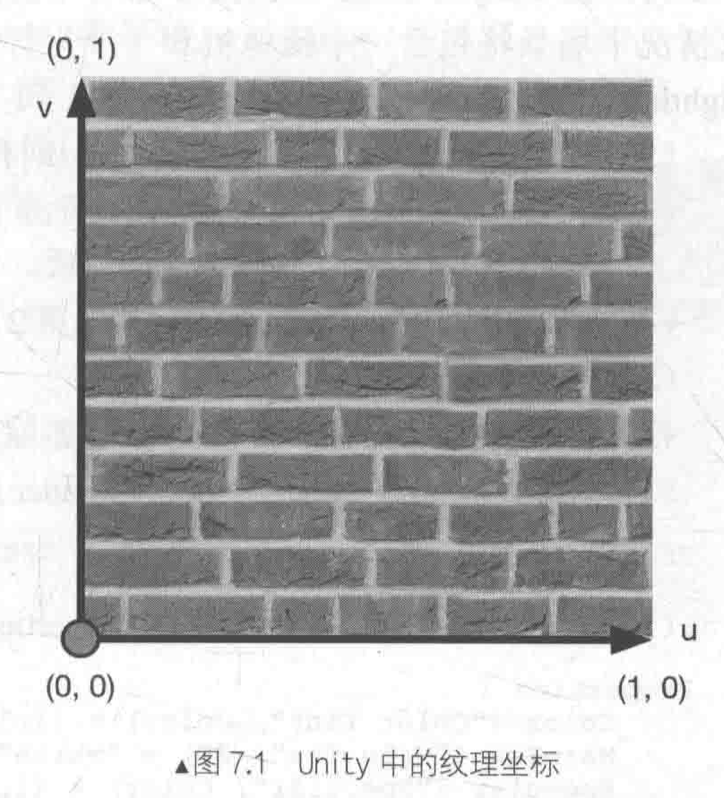

# 单张纹理

通常**使用一张纹理在代替物体的漫反射颜色**。

1. 在Unity中新建一个场景，默认情况下场景包含**一个摄像机和一个平行光**，并且使用了**内置的天空盒子**。`Window->Lighting->Setting`中去掉场景中的天空盒子

2. 新建一个材质，材质名：`SingleTextureMat`
3. 新建一个Unity Shader，名称为`SingleTexture`，将其赋给第2步的材质
4. 场景中创建一个胶囊体，并把第2步中的材质赋给该胶囊体
5. 保存场景

打开第3步的Shader，输入以下代码：

```c++
// Upgrade NOTE: replaced '_Object2World' with 'unity_ObjectToWorld'
// Upgrade NOTE: replaced 'mul(UNITY_MATRIX_MVP,*)' with 'UnityObjectToClipPos(*)'

Shader "Unity Shaders Book/Chapter 7/Single Texture" {
	Properties {
		// 为了控制物体的整体色调,声明一个_Color属性
		_Color ("Color Tint", Color) = (1, 1, 1, 1)
		// 为了使用纹理,需要添加一个纹理属性
		// 声明了一个_MainTex纹理, 2D是纹理属性的声明方式
		// 一个字符串后跟一个花括号作为它的初始值, white是内置纹理的名字, 即一个全白的纹理
		_MainTex ("Main Tex", 2D) = "white" {}
		_Specular ("Specular", Color) = (1, 1, 1, 1)
		_Gloss ("Gloss", Range(8.0, 256)) = 20
	}
	SubShader {		
		Pass { 
			Tags { "LightMode"="ForwardBase" }
		
			CGPROGRAM
			
			#pragma vertex vert
			#pragma fragment frag

			#include "Lighting.cginc"
			
			// 需要在CG代码片中声明和上述属性类型相匹配的变量,以便和材质面板中的属性建立联系
			fixed4 _Color;
			sampler2D _MainTex;
			// 需要为纹理类型的属性声明一个float4类型的变量_MainTex_ST
			// 这个名字不是随意起的,Unity中,需要使用"纹理名_ST"来声明某个纹理的属性
			// ST:缩放(Scale)和平移(Translation)
			// _MainTex_ST可以得到该纹理的缩放和偏移值, _MainTex_ST.xy存放缩放值, _MainTex_ST.zw存放偏移值
			// 这些值可以在材质面板的纹理属性中调节
			float4 _MainTex_ST;
			fixed4 _Specular;
			float _Gloss;
			
			struct a2v {
				float4 vertex : POSITION;
				float3 normal : NORMAL;
				// 使用TEXCOORD0语义声明一个新的变量texcoord
				// 这样Unity就会将模型的第一组纹理坐标存储到该变量中
				float4 texcoord : TEXCOORD0;
			};
			
			struct v2f {
				float4 pos : SV_POSITION;
				float3 worldNormal : TEXCOORD0;
				float3 worldPos : TEXCOORD1;
				// 添加用于存储纹理坐标的变量uv,以便在片元着色器中使用该坐标进行纹理采样
				float2 uv : TEXCOORD2;
			};
			
			v2f vert(a2v v) {
				v2f o;
				o.pos = UnityObjectToClipPos(v.vertex);
				
				o.worldNormal = UnityObjectToWorldNormal(v.normal);
				
				o.worldPos = mul(unity_ObjectToWorld, v.vertex).xyz;
				
				// 使用纹理属性值_MainTex_ST对顶点纹理坐标进行变换,得到最终的纹理坐标
				o.uv = v.texcoord.xy * _MainTex_ST.xy + _MainTex_ST.zw;
				// Or just call the built-in function
				// UNity提供一个内置宏TRANSFORM_TEX来帮助计算上述过程
				// 它接受两个参数,第一个参数是顶点纹理坐标,第二个参数是纹理名
//				o.uv = TRANSFORM_TEX(v.texcoord, _MainTex);
				
				return o;
			}
			
			// 实现片元着色器,并在计算漫反射时使用纹理中的纹素值
			fixed4 frag(v2f i) : SV_Target {
				// 首先计算世界空间下的法线方向和光照方向
				fixed3 worldNormal = normalize(i.worldNormal);
				fixed3 worldLightDir = normalize(UnityWorldSpaceLightDir(i.worldPos));
				
				// Use the texture to sample the diffuse color
				// 使用CG的tex2D函数对纹理进行采样
				// 第一个参数是需要被采样的纹理,第二个参数是一个float2类型的纹理坐标,返回计算得到的纹素值
				// 使用采样结果和颜色属性_Color的乘积来作为材质的反射率albedo
				fixed3 albedo = tex2D(_MainTex, i.uv).rgb * _Color.rgb;
				
				// 将albedo与环境光相乘得到环境光部分
				fixed3 ambient = UNITY_LIGHTMODEL_AMBIENT.xyz * albedo;
				
				// 随后albedo计算漫反射光照的结果,并和环境光照,高光反射光照相机后返回
				fixed3 diffuse = _LightColor0.rgb * albedo * max(0, dot(worldNormal, worldLightDir));
				
				fixed3 viewDir = normalize(UnityWorldSpaceViewDir(i.worldPos));
				fixed3 halfDir = normalize(worldLightDir + viewDir);
				fixed3 specular = _LightColor0.rgb * _Specular.rgb * pow(max(0, dot(worldNormal, halfDir)), _Gloss);
				
				return fixed4(ambient + diffuse + specular, 1.0);
			}
			
			ENDCG
		}
	} 
	// 为该Shader设置合适的Fallback
	FallBack "Specular"
}
```

在`SingleTextureMat`面板上，使用`Brick_Diffuse.jpg`纹理对`Main Tex`属性进行赋值。

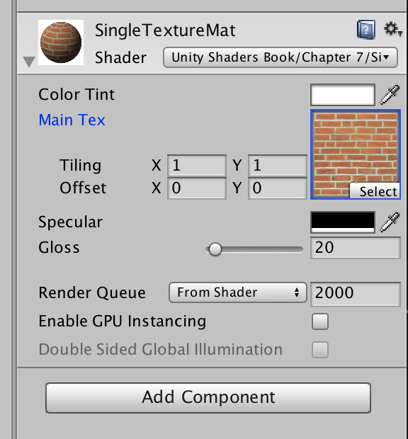

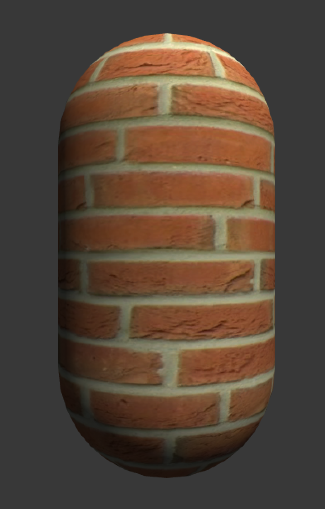

## 纹理的属性

**Unity纹理映射**：声明一个纹理变量，再使用`tex2D`函数采样。（实际渲染流水线中，纹理映射的实现非常复杂。）

向Unity中导入一张纹理资源后，可以在它的材质面板上调整其属性，如下图所示。

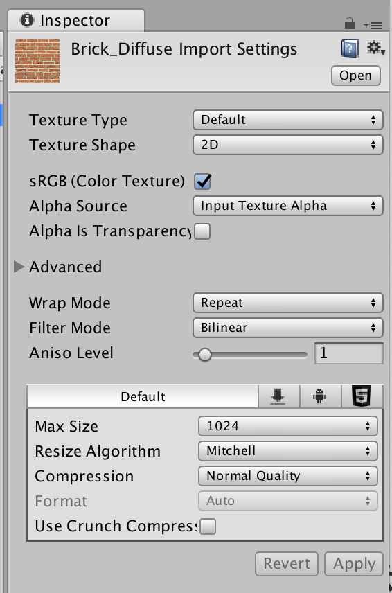

纹理面板中的第一个属性是**纹理类型**（Texture、Normal map、Cubemap等），之所以要为导入的纹理选择合适的类型，是因为只有这样才能**让Unity知道意图**，**为Unity Shader传递正确的纹理**，并在一些情况下可以**让Unity对该纹理进行优化**。

第二个属性**Wrap Mode**，它决定了当纹理坐标超过[0,1]范围后将会如何被平铺。可以在材质面板中调整纹理的偏移量。它有五种模式：

1. **Repeat**：该模式下，如果纹理坐标超过了1，则它的整数部分将会被舍弃，而直接使用小数部分进行采样，这样的结果是纹理将会不断重复。

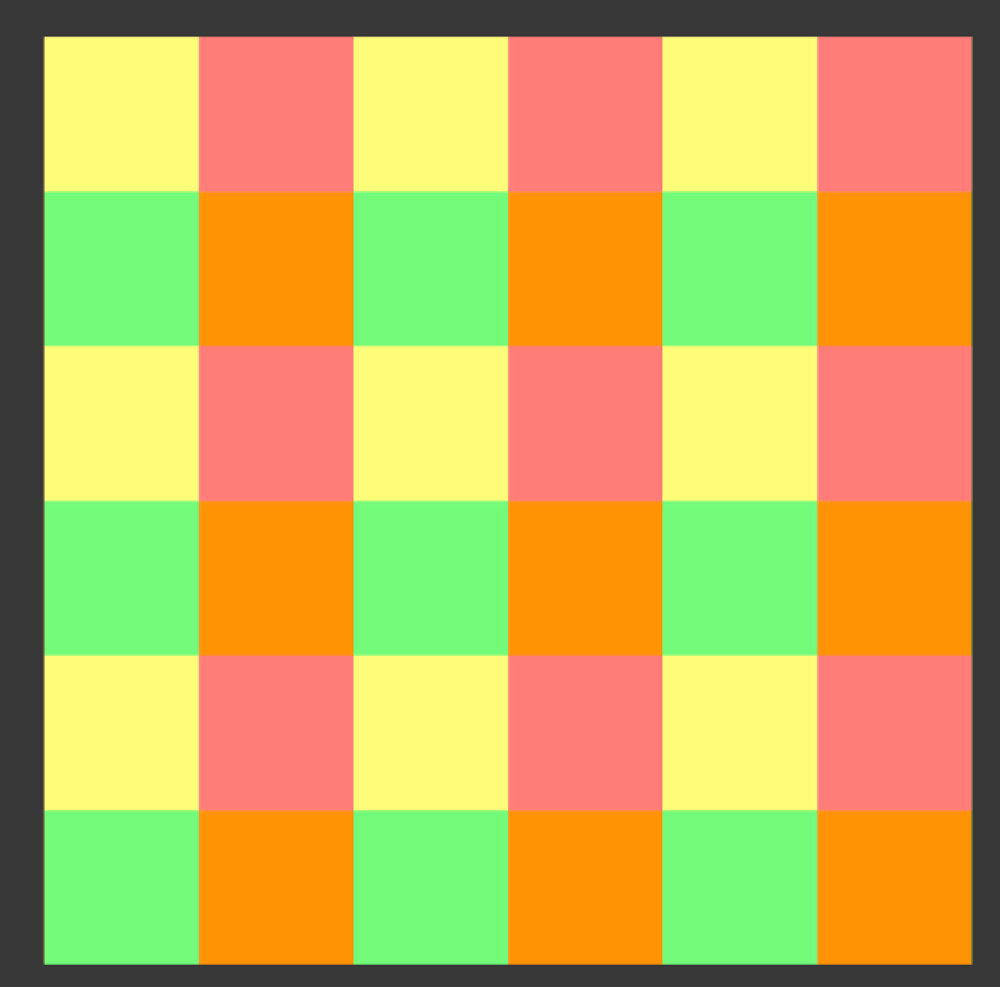

2. **Clamp**：该模式下，如果纹理的坐标超过1，则会截取到1，如果小于0，则会截取到0。形成一个条形结构。

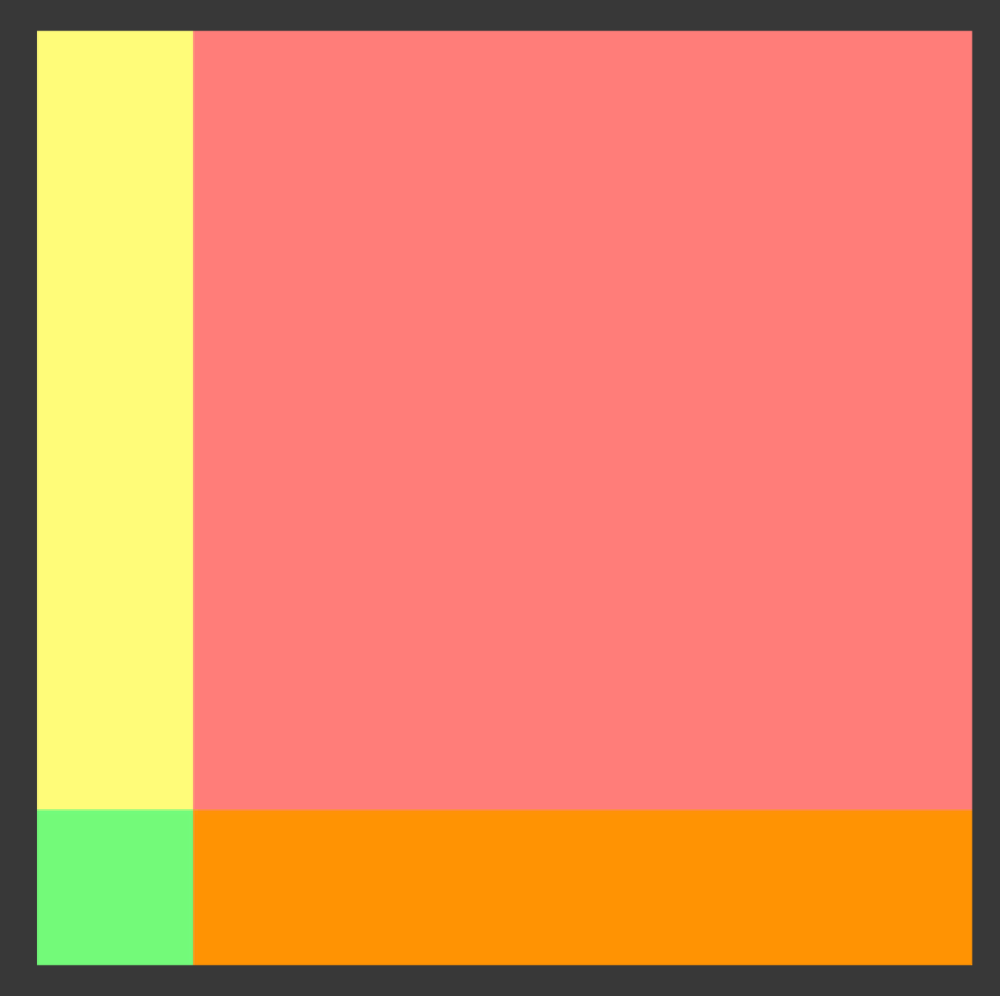

**注意**：如果想要让纹理得到这样的效果，必须使用纹理的属性（例如`_MainTex_ST`变量）在Unity Shader中对顶点纹理坐标进行相应的变换。

即，代码中需要包含类似下面的代码：

```c++
o.uv = v.texcoord.xy * _MainTex_ST.xy + _MainTex_ST.zw;
// o.uv = TRANSFORM_TEX(v.texcoord, _MainTex);
```

第三个属性是**Filter Mode**，它决定了**当纹理由于变换而产生拉伸时将会采用哪种滤波模式**。支持3种模式：

1. **Point**：使用**最近邻（nearest neighbor）滤波**，在放大或缩小时，它的**采样像素数目**通常只有一个，因此图像看起来有种像素风格的效果。有时不希望纹理看起来是模糊的，例如对于一些类似棋盘的纹理，希望它就是**像素风**的，这时**可能会选择Point模式**。
2. **Bilinear**：使用**线性滤波**，对于每个目标像素，会找到4个邻近像素，然后对它们进行线性插值混合后得到最终像素，因此图像看起来像被模糊了。通常选择Bilinear滤波模式。
3. **Trilinear**：和Bilinear几乎一样，只是Trilinear还会在多级渐远纹理之间进行混合，如果一张纹理没有使用**多级渐远纹理技术**，则Trilinear得到的结果和Bilinear是一样的。

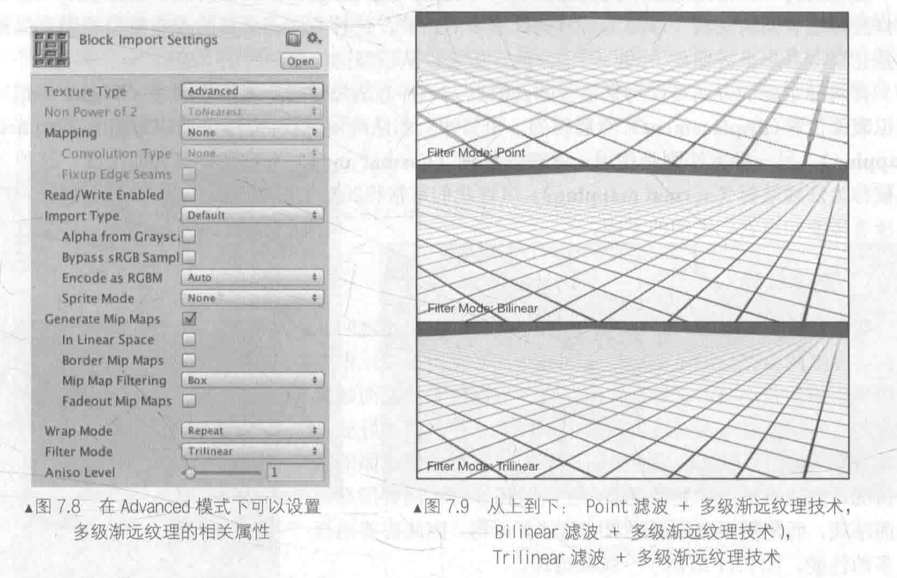

它们得到的滤波效果依次提升，但需要耗费的性能也依次增大。纹理滤波会影响放大或缩小纹理时得到的图片质量。

例如，当把一张64x64大小的纹理贴在一个512x512大小的平面上时，就需要放大纹理。

下图给出了3中滤波模式下的放大效果。

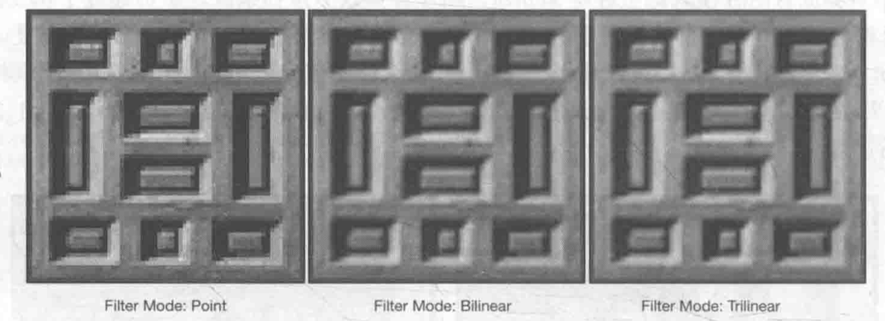

纹理的缩小过程比放大更加复杂一些，此时原纹理中的多个像素会对应一个目标像素。

纹理缩放更加复杂的原因在于往往需要处理抗锯齿问题，一个最常用的方法就是使用**多级渐远纹理（mipmapping）**技术，其中“**mip**”是拉丁文“**multum in parvo**”的缩写，意思是“在一个小空间中有许多东西”。

>**多级渐远纹理技术**将原纹理提前用滤波处理来得到很多更小的图像，形成一个像素金字塔，每一层都是对上一层图像降采样的结果。
>
>这样在实时运行时，就可以**快速得到结果像素**，例如当物体远离摄像机时，可以直接使用较小的纹理。但缺点是需要使用一定的空间用于存储这些**多级渐远纹理**，通常会多占用33%的内存空间。
>
>这是一种典型的**用空间换取时间**的方法。

在Unity中，可以**在纹理导入面板中**，首先将**纹理类型（Texture Type）**选择成**Advanced**，再勾选**Generate Mip Maps**即可开启**多级渐远纹理技术**。同时还可以选择生成多级渐远纹理时**是否使用线性空间以及采用的滤波器**等。

下图给出了一个倾斜角度观察一个网格结构的地板时，使用不同**Filter Mode**（同时采用多级渐远纹理技术）得到的效果。

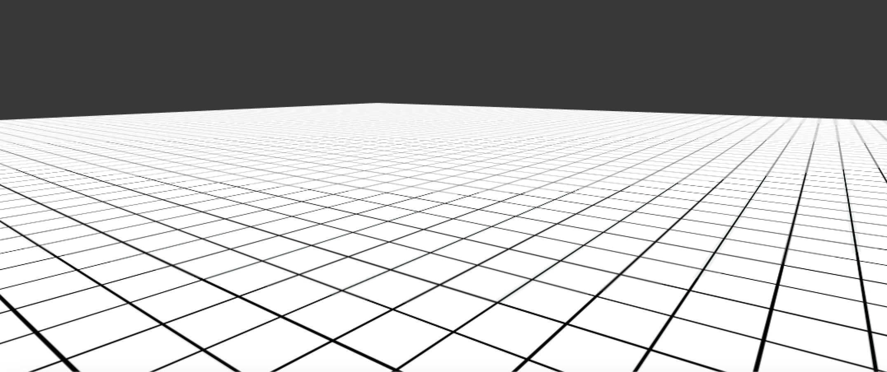

纹理的最大尺寸和纹理模式，当为不同平台发布游戏时，需要**考虑目标平台的纹理尺寸和质量问题**。

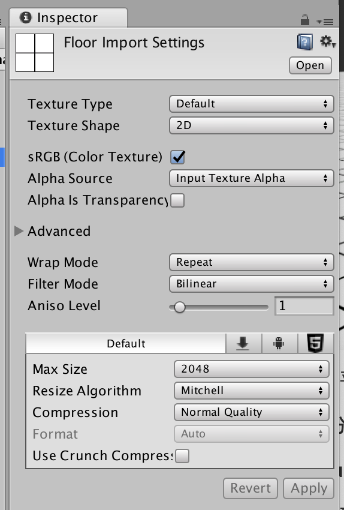

Unity**允许为不同目标平台选择不同的分辨率**。

如果导入的纹理大小超过了**Max Texture Size**中设置值，则Unity将会把该纹理缩放为这个**最大分辨率**。

理想情况下，导入的纹理可以是非正方形的，但**长宽的大小应该是2的幂（2，4，8，16等）**。如果使用了非2的幂大小（Non Power of Two，NPOT）的纹理，则**这些纹理往往会占用更多的内存空间**，而且**GPU读取该纹理的速度也会有所下降**。一些平台甚至不支持这种NPOT纹理，此时Unity在内部会把它**缩放成最近的2的幂大小**。

**Format**决定了Unity内部使用哪种格式来存储该纹理，如果将**Texture Type**设置为**Advanced**，则会有更多的Format可供选择。需要注意的是，使用的纹理格式精度越高（例如Truecolor），占用的内存空间越大，但得到的效果也越好。

可以**从纹理导入面板的最下方看到存储该纹理需要占用的内存空间**（如果开启了多级渐远纹理技术，也会增加纹理的内存占用）。当游戏使用了大量Truecolor类型的纹理时，内存可能会迅速增加，因此对于一些不需要使用很高精度的纹理（例如用于漫反射颜色的纹理），尽可能使用压缩格式。


# 凹凸映射

纹理的另一种常见应用就是**凹凸映射（bump mapping）**，其目的是**使用一张纹理来修改模型表面的法线**，以便**为模型提供更多的细节**。

这种方法不会真的改变模型的顶点位置，只是让模型**看起来好像是凹凸不平的**，但可以**从模型的轮廓处看出破绽**。

两种方法用来进行凹凸映射：

- **高度纹理（height map）**：模拟**表面位移（displacement）**，得到一个修改后的法线值。
- **法线纹理（normal map）**：直接存储表面法线。

## 高度纹理

使用**一张高度图来实现凹凸映射**。

高度图中存储的是强度值（intensity），用于**表示模型表面局部的海拔高度**。

颜色越**浅表明该位置的表面越向外凸起**，而颜色越**深表明该位置越向里凹**。

这种方法的好处是**非常直观**，可以**从高度图中明确地知道一个模型表面的凹凸情况**，但**缺点是计算更加复杂**，实时计算时**不能得到表面法线**，而是需要由像素的灰度值计算得到，需要消耗更多的性能。

高度图通常会和**法线纹理一起使用**，用于给出表面凹凸的额外信息，即**通常使用法线纹理来修改光照**。

## 法线纹理

法线纹理中存储的是表面的法线方向，由于法线方向的分量范围在[-1,1]，而像素的分量范围为[0,1]，因此需要做一个映射，通常使用的映射是：
$$
pixel = \frac{normal+1}{2}	\tag{1}
$$
在Shader中对法线纹理进行纹理采样后，需要**对结果进行一次反映射的过程**，以得到原先的法线方向。

反映射的过程实际上就是上面映射函数的逆函数：
$$
normal = pixel \times 2 - 1		\tag{2}
$$
由于**方向是相对于坐标空间来说的**，则法线纹理中存储的法线方向在哪个坐标空间中呢？

由于**模型顶点自带法线**，它们是**定义在模型空间中的**，因此一种直接的想法就是将修改后的模型空间中的表面法线存储在一张纹理中，这种纹理被称为是**模型空间的法线纹理（object-space normal map）**。

实际制作过程中，往往会采用另一种坐标空间，即**模型顶点的切线空间（tangent space）**来存储法线。对于模型的每个顶点，它都有**一个属于自己的切线空间**，这个**切线空间的原点就是该点本身**，而**z轴是顶点的法线方向（n）**，**x轴是顶点的切线方向（t）**，**y轴可由法线和切线叉积得到**，也被**称为是副切线（bitangent，b）或副法线**。

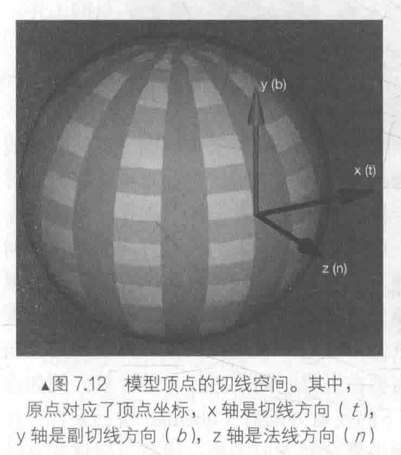

这种纹理被称为是**切线空间的法线纹理（tangent-space normal map）**。

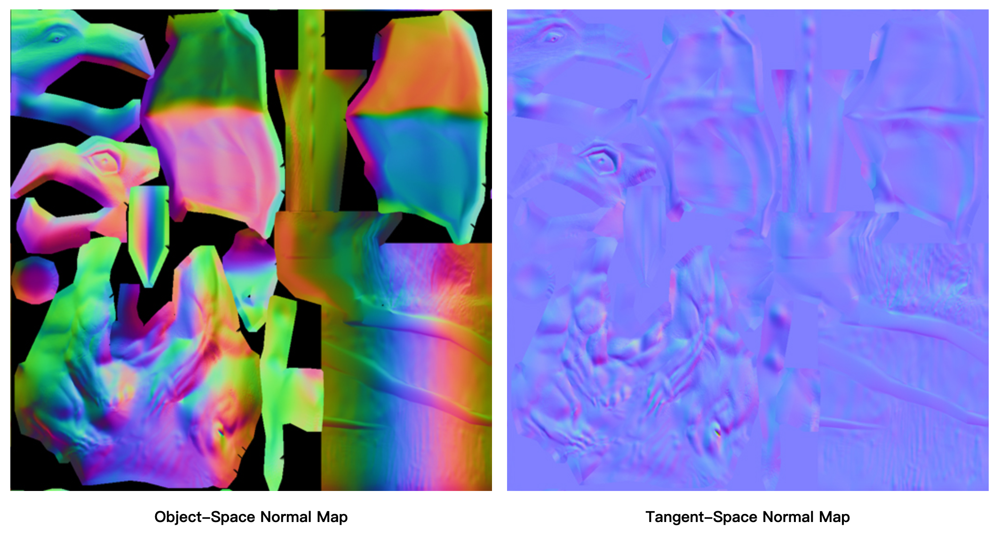

从上图可以看出，模型空间下的法线纹理看起来是“五颜六色”的，这是因为**所有法线所在的坐标空间都是同一个坐标空间，即模型空间**，而每个点存储的发现方向是各异的，有的是(0,1,0)经过映射后存储到纹理中就对应RGB(0.5,1,0.5)浅绿色，有的是(0,-1,0)经过映射后存储到纹理中就对应RGB(0.5,0,0.5)紫色。

而切线空间下的法线纹理看起来几乎全部都是浅蓝色的，这是因为**每个法线方向所在的坐标空间是不一样的（表面每点各自的切线空间）**。这种法线纹理其实就是**存储了每个点在各自的切线空间中的法线扰动方向**。即，如果一个点的法线方向不变，则在它的切线空间中，新的法线方向就是z轴方向，即值为(0,0,1)，经过映射后存储在纹理中对应RGB(0.5,0.5,1)浅蓝色，这个颜色就是法线纹理中大片的蓝色。**这些蓝色说明顶点的大部分法线是和模型本身法线一样的，不需要改变**。

总体来说，**模型空间下的法线纹理更符合人类的直观认识**，而且法线纹理本身也很直观，容易调整，**不同的法线方向就代表了不同的颜色**。

使用**模型空间存储法线**的优点：

- **实现简单，直观**。不需要模型原始的法线和切线等信息，即计算更少，生成也非常简单，而如果要生成切线空间下的法线纹理，由于模型的切线一般是和UV方向相同，因此想要得到效果比较好的法线映射就要求纹理映射也是连续的。
- **纹理坐标的缝合处和尖锐的边角部分，可见的突变（缝隙）较少**，即可以提供**平滑的边界**。因为模型空间下的法线纹理存储的是同一坐标系下的法线信息，因此**在边界处通过插值得到的法线可以平滑变换**。而切线空间下的法线纹理中的法线信息是依靠纹理坐标的方向得到的结果，可能会在边缘处或尖锐的部分造成更多可见的缝合迹象。

但美术人员往往偏向于使用**切线空间下的法线纹理**，这是因为并不是单纯地想要得到法线，**后续的光照计算才是目的**，**选择哪个坐标系意味着需要把不同信息转换到相应的坐标系中**。例如选择切线空间，需要把从法线纹理中得到的法线方向**从切线空间转换到世界空间（或其他空间）中。**

- **自由度很高**。模型空间下的法线纹理记录的是**绝对法线信息**，仅可用于创建它时的那个模型，而应用到其他模型上效果就完全错误了。而切线空间下的法线纹理记录的是**相对法线信息**，即使把纹理应用到一个完全不同的网格上，也可以得到一个合理的结果。
- **可进行UV动画**。移动一个纹理的UV坐标来实现一个凹凸移动的效果，但使用模型空间下的法线会得到完全错误的结果（因为它是**绝对法线信息**）。这种UV动画在水或者火山熔岩这种类型的物体上经常用到。
- **可重用法线纹理**。一个砖块，**仅使用一张法线纹理就可以用到所有的6个面上**。
- **可压缩**。由于切线空间下的法线纹理中法线的z轴总是正方向，因此可以**仅存储XY轴，而推导得到z轴**。而模型空间下的法线纹理由于各个方向都是可能的，因此必须存储3个方向的值，不可压缩。

**切线空间在很多情况下都优于模型空间**，而且可以节省美术人员的工作。

## 实践

计算光照模型中**统一各个方向矢量所在的坐标空间**。

由于**法线纹理中存储的法线是切线空间下的方向**，因此通常有两种选择：

- **在切线空间下进行光照计算**，此时需要把光照方向、视角方向变换到切线空间下。
- **在世界空间下进行光照计算**，此时需要把采样得到的法线方向变换到世界空间下，再和世界空间下的光照方向和视角方向进行计算。

效率上来说，**第一种方法往往优于第二种方法**，因为可以**在顶点着色器中就完成对光照方向和视角方向的变换**，而**第二种方法由于要先对法线纹理进行采样，所以变换过程必须在片元着色器中完成（这意味着需要在片元着色器中进行一次矩阵操作）**。

但**从通用性上讲，第二种方法要由于第一种方法**，因为经常需要在世界空间下进行一些计算，例如使用Cubemap进行环境映射时，需要使用世界空间下的反射方向对Cubemap进行采样。**如果同时需要进行法线映射时，就需要把法线方向变换到世界空间下**。

**切线空间和世界空间**是最为常用的两种空间。

### 切线空间下的计算

**基本思路**：片元着色器中**通过纹理采样得到切线空间下的法线**，然后再与切线空间下的视角方向、光照方向等进行计算，得到最终的光照结果。

**在顶点着色器中把视角方向和光照方向从模型空间变换到切线空间中**，需要知道从模型空间到切线空间的**变换矩阵**，这个**变换矩阵的逆矩阵**（从切线空间到模型空间的变换矩阵非常容易求得），在顶点着色器中按切线（x轴）、副切线（y轴）、法线（z轴）的**顺序按列排列即可得到**。

如果一个变换中仅存在平移和旋转变换，则**这个变换的逆矩阵就等于它的转置矩阵**，而从切线空间得到模型空间的变换正是符合这样的变换要求。

因此，**从模型空间到切线空间的变换矩阵就是从切线空间到模型空间的变换矩阵的转置矩阵**，把切线（x轴）、副切线（y轴）、法线（z轴）**按行排列即可得到**。

1. 在Unity中新建一个场景，默认情况下场景包含**一个摄像机和一个平行光**，并且使用了**内置的天空盒子**。`Window->Lighting->Setting`中去掉场景中的天空盒子

2. 新建一个材质，材质名：`NormalMapTangentSpaceMat`
3. 新建一个Unity Shader，名称为`NormalMapTangentSpace`，将其赋给第2步的材质
4. 场景中创建一个胶囊体，并把第2步中的材质赋给该胶囊体
5. 保存场景

打开第3步的Shader，输入以下代码：

```c++
// Upgrade NOTE: replaced 'mul(UNITY_MATRIX_MVP,*)' with 'UnityObjectToClipPos(*)'

Shader "Unity Shaders Book/Chapter 7/Normal Map In Tangent Space" {
	Properties {
		// 在Properties语义块中添加法线纹理属性,以及用于控制凹凸程度的属性
		_Color ("Color Tint", Color) = (1, 1, 1, 1)
		_MainTex ("Main Tex", 2D) = "white" {}
		// 对于法线纹理_BumpMap,使用bump作为默认值
		// bump是Unity内置法线纹理,当没有提供任何法线纹理时,bump就对应模型自带的法线信息
		_BumpMap ("Normal Map", 2D) = "bump" {}
		// _BumpScale用于控制凹凸程度,当它为0时,意味着该法线纹理不会对光照产生任何影响
		_BumpScale ("Bump Scale", Float) = 1.0
		_Specular ("Specular", Color) = (1, 1, 1, 1)
		_Gloss ("Gloss", Range(8.0, 256)) = 20
	}
	SubShader {
		Pass { 
			Tags { "LightMode"="ForwardBase" }
		
			CGPROGRAM
			
			#pragma vertex vert
			#pragma fragment frag
			
			#include "Lighting.cginc"
			
			fixed4 _Color;
			sampler2D _MainTex;
			float4 _MainTex_ST;
			// 为了得到纹理属性(平铺和偏移系数),为_MainTex和_BumpMap定义_MainTex_ST和_BumpMap_ST变量
			sampler2D _BumpMap;
			float4 _BumpMap_ST;
			float _BumpScale;
			fixed4 _Specular;
			float _Gloss;
			
			// 切线空间由顶点法线和切线构建出的一个坐标空间,因此需要得到顶点的切线信息
			// 为此,需要修改顶点着色器的输入结构体a2v
			struct a2v {
				float4 vertex : POSITION;
				float3 normal : NORMAL;
				// 使用TANGENT语义描述float4类型的tangent变量,以告诉Unity把顶点的切线方向填充到tangent变量中
				// 与法线方向normal不同,tangent的类型是float4,而非float3
				// 因为需要使用tangent.w分量来决定切线空间中的第三个坐标轴:副切线的方向性
				float4 tangent : TANGENT;
				float4 texcoord : TEXCOORD0;
			};
			
			// 需要在顶点着色器中计算切线空间下的光照和视角方向
			// 在v2f结构体中添加两个变量来存储变换后的光照和视角方向
			struct v2f {
				float4 pos : SV_POSITION;
				// 由于使用了两张纹理,因此需要存储两个纹理坐标
				// 为此,把uv变量的类型定义为float4类型
				// xy分量存储_MainTex纹理坐标,zw分量存储_BumpMap纹理坐标
				// 实际上,_MainTex和_BumpMap通常使用同一组纹理坐标
				// 出于减少插值寄存器的使用数目的目的,往往只计算和存储一个纹理坐标即可
				float4 uv : TEXCOORD0;
				float3 lightDir: TEXCOORD1;
				float3 viewDir : TEXCOORD2;
			};

			// Unity doesn't support the 'inverse' function in native shader
			// so we write one by our own
			// Note: this function is just a demonstration, not too confident on the math or the speed
			// Reference: http://answers.unity3d.com/questions/218333/shader-inversefloat4x4-function.html
			float4x4 inverse(float4x4 input) {
				#define minor(a,b,c) determinant(float3x3(input.a, input.b, input.c))
				
				float4x4 cofactors = float4x4(
				     minor(_22_23_24, _32_33_34, _42_43_44), 
				    -minor(_21_23_24, _31_33_34, _41_43_44),
				     minor(_21_22_24, _31_32_34, _41_42_44),
				    -minor(_21_22_23, _31_32_33, _41_42_43),
				    
				    -minor(_12_13_14, _32_33_34, _42_43_44),
				     minor(_11_13_14, _31_33_34, _41_43_44),
				    -minor(_11_12_14, _31_32_34, _41_42_44),
				     minor(_11_12_13, _31_32_33, _41_42_43),
				    
				     minor(_12_13_14, _22_23_24, _42_43_44),
				    -minor(_11_13_14, _21_23_24, _41_43_44),
				     minor(_11_12_14, _21_22_24, _41_42_44),
				    -minor(_11_12_13, _21_22_23, _41_42_43),
				    
				    -minor(_12_13_14, _22_23_24, _32_33_34),
				     minor(_11_13_14, _21_23_24, _31_33_34),
				    -minor(_11_12_14, _21_22_24, _31_32_34),
				     minor(_11_12_13, _21_22_23, _31_32_33)
				);
				#undef minor
				return transpose(cofactors) / determinant(input);
			}


			// 定义顶点着色器
			v2f vert(a2v v) {
				v2f o;
				o.pos = UnityObjectToClipPos(v.vertex);
				
				o.uv.xy = v.texcoord.xy * _MainTex_ST.xy + _MainTex_ST.zw;
				o.uv.zw = v.texcoord.xy * _BumpMap_ST.xy + _BumpMap_ST.zw;

				///
				/// Note that the code below can handle both uniform and non-uniform scales
				///

				// Construct a matrix that transforms a point/vector from tangent space to world space
				// 把模型空间下切线方向,副切线方向和法线方向按行排列来得到从模型空间到切线空间的变换矩阵
				fixed3 worldNormal = UnityObjectToWorldNormal(v.normal);  
				fixed3 worldTangent = UnityObjectToWorldDir(v.tangent.xyz);  
				// 计算副切线时使用v.tangent.w和叉积结果相乘,这是因为和切线与法线方向都垂直的方向有两个,w决定了方向
				fixed3 worldBinormal = cross(worldNormal, worldTangent) * v.tangent.w; 

				/*
				float4x4 tangentToWorld = float4x4(worldTangent.x, worldBinormal.x, worldNormal.x, 0.0,
												   worldTangent.y, worldBinormal.y, worldNormal.y, 0.0,
												   worldTangent.z, worldBinormal.z, worldNormal.z, 0.0,
												   0.0, 0.0, 0.0, 1.0);
				// The matrix that transforms from world space to tangent space is inverse of tangentToWorld
				float3x3 worldToTangent = inverse(tangentToWorld);
				*/
				
				//wToT = the inverse of tToW = the transpose of tToW as long as tToW is an orthogonal matrix.
				// Unity提供一个内置宏TANGENT_SPACE_ROTATION直接计算得到rotation变换矩阵
				float3x3 worldToTangent = float3x3(worldTangent, worldBinormal, worldNormal);

				// Transform the light and view dir from world space to tangent space
				// 获取模型空间下的光照和视角方向,再利用变换矩阵rotation把它们从模型空间变换到切线空间
				o.lightDir = mul(worldToTangent, WorldSpaceLightDir(v.vertex));
				o.viewDir = mul(worldToTangent, WorldSpaceViewDir(v.vertex));

				///
				/// Note that the code below can only handle uniform scales, not including non-uniform scales
				/// 

				// Compute the binormal
//				float3 binormal = cross( normalize(v.normal), normalize(v.tangent.xyz) ) * v.tangent.w;
//				// Construct a matrix which transform vectors from object space to tangent space
//				float3x3 rotation = float3x3(v.tangent.xyz, binormal, v.normal);
				// Or just use the built-in macro
//				TANGENT_SPACE_ROTATION;
//				
//				// Transform the light direction from object space to tangent space
//				o.lightDir = mul(rotation, normalize(ObjSpaceLightDir(v.vertex))).xyz;
//				// Transform the view direction from object space to tangent space
//				o.viewDir = mul(rotation, normalize(ObjSpaceViewDir(v.vertex))).xyz;
				
				return o;
			}
			
			// 由于在顶点空间中完成了大部分工作,因此片元着色器中只需要采样得到切线空间下的法线方向,再在切线空间下进行光照计算即可
			fixed4 frag(v2f i) : SV_Target {				
				fixed3 tangentLightDir = normalize(i.lightDir);
				fixed3 tangentViewDir = normalize(i.viewDir);
				
				// Get the texel in the normal map
				// 利用tex2D对法线纹理_BumpMap进行采样
				// 法线纹理中存储的是把法线经过映射后得到的像素值,因此需要把它们反映射回来
				fixed4 packedNormal = tex2D(_BumpMap, i.uv.zw);
				fixed3 tangentNormal;
				// If the texture is not marked as "Normal map"
				// 如果没有在Unity中把该法线纹理的类型设置成Normal Map,就需要在代码中手动进行这个过程
//				tangentNormal.xy = (packedNormal.xy * 2 - 1) * _BumpScale;
//				tangentNormal.z = sqrt(1.0 - saturate(dot(tangentNormal.xy, tangentNormal.xy)));
				
				// Or mark the texture as "Normal map", and use the built-in funciton
				// 首先把packedNormal的xy分量按公式映射回法线方向
				// 为了方便Unity对法线纹理的存储进行优化,通常会把法线纹理的纹理类型标识成Normal map,Unity会根据不同的平台选择不同压缩方法
				// 此时,如果再使用上面的方法来计算就会得到错误的结果,因为此时_BumpMap的rgb分量并不是切线空间下法线方向的xyz值了
				// 这种情况下,可以使用Unity的内置函数UnpackNormal来得到正确的法线方向
				tangentNormal = UnpackNormal(packedNormal);
				// 然后乘以_BumpScale(控制凹凸程度)来得到tangentNormal的xy分量
				tangentNormal.xy *= _BumpScale;
				// 由于法线都是单位矢量,因此tangentNormal.z分量可以由tangentNormal.xy计算得到
				// 由于使用的切线空间下的法线纹理,因此可以保证法线方向的z分量为正
				tangentNormal.z = sqrt(1.0 - saturate(dot(tangentNormal.xy, tangentNormal.xy)));
				
				fixed3 albedo = tex2D(_MainTex, i.uv).rgb * _Color.rgb;
				
				fixed3 ambient = UNITY_LIGHTMODEL_AMBIENT.xyz * albedo;
				
				fixed3 diffuse = _LightColor0.rgb * albedo * max(0, dot(tangentNormal, tangentLightDir));

				fixed3 halfDir = normalize(tangentLightDir + tangentViewDir);
				fixed3 specular = _LightColor0.rgb * _Specular.rgb * pow(max(0, dot(tangentNormal, halfDir)), _Gloss);
				
				return fixed4(ambient + diffuse + specular, 1.0);
			}
			
			ENDCG
		}
	} 
	// 设置合适的Fallback
	FallBack "Specular"
}
```

在`NormalMapTangentSpaceMat`的面板上，使用`Brick_Diffuse.jpg`和`Brick_Normal.jpg`纹理对其赋值。

可以调整材质面板中的`Bump Scale`属性来**改变模型的凹凸程度**。

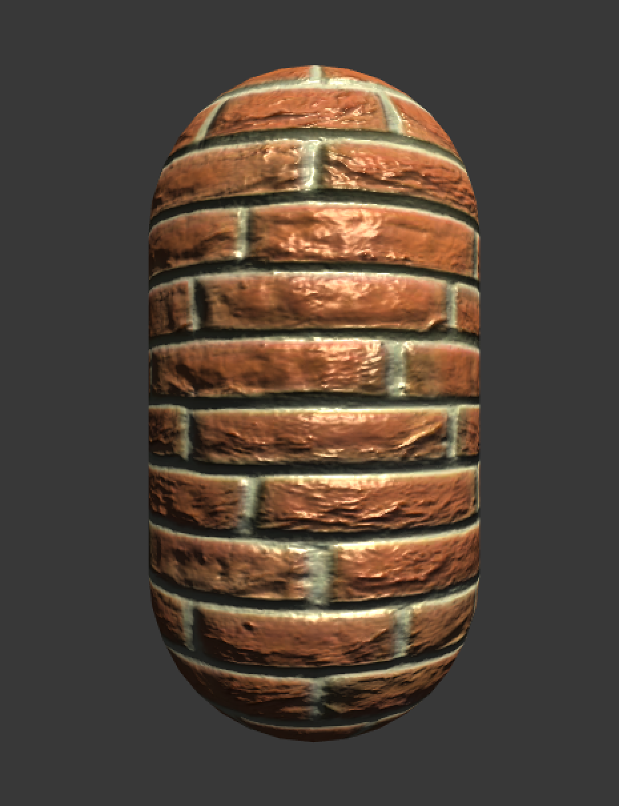

### 世界空间下的计算

在片元着色器**把法线方向从切线空间变换到世界空间**下。

**基本思想**：在**顶点着色器中计算从切线空间到世界空间的变换矩阵**（由顶点的切线、副切线和法线在世界空间下的表示来得到），并把它传递给片元着色器。最后，在片元着色器中**把法线纹理中的法线方向从切线空间变换到世界空间**下即可。

尽管这种方法需要更多的计算，但在**需要使用Cubemap进行环境映射等情况下**，需要使用这种方法。

1. 在Unity中新建一个场景，默认情况下场景包含**一个摄像机和一个平行光**，并且使用了**内置的天空盒子**。`Window->Lighting->Setting`中去掉场景中的天空盒子

2. 新建一个材质，材质名：`NormalMapWorldSpaceMat`
3. 新建一个Unity Shader，名称为`NormalMapWorldSpace`，将其赋给第2步的材质
4. 场景中创建一个胶囊体，并把第2步中的材质赋给该胶囊体
5. 保存场景

打开第3步的Shader，输入以下代码：

```c++
// Upgrade NOTE: replaced '_Object2World' with 'unity_ObjectToWorld'
// Upgrade NOTE: replaced 'mul(UNITY_MATRIX_MVP,*)' with 'UnityObjectToClipPos(*)'

Shader "Unity Shaders Book/Chapter 7/Normal Map In World Space" {
	Properties {
		_Color ("Color Tint", Color) = (1, 1, 1, 1)
		_MainTex ("Main Tex", 2D) = "white" {}
		_BumpMap ("Normal Map", 2D) = "bump" {}
		_BumpScale ("Bump Scale", Float) = 1.0
		_Specular ("Specular", Color) = (1, 1, 1, 1)
		_Gloss ("Gloss", Range(8.0, 256)) = 20
	}
	SubShader {
		Pass { 
			Tags { "LightMode"="ForwardBase" }
		
			CGPROGRAM
			
			#pragma vertex vert
			#pragma fragment frag
			
			#include "Lighting.cginc"
			
			fixed4 _Color;
			sampler2D _MainTex;
			float4 _MainTex_ST;
			sampler2D _BumpMap;
			float4 _BumpMap_ST;
			float _BumpScale;
			fixed4 _Specular;
			float _Gloss;
			
			struct a2v {
				float4 vertex : POSITION;
				float3 normal : NORMAL;
				float4 tangent : TANGENT;
				float4 texcoord : TEXCOORD0;
			};
			
			// 修改顶点着色器的输出结构体v2f,使其包含从切线空间到世界空间的变换矩阵
			struct v2f {
				float4 pos : SV_POSITION;
				float4 uv : TEXCOORD0;
				// 一个插值寄存器最多只能存储float4大小的变量,对于矩阵这样的变量,可以把它按行拆成多个变量再进行存储
				// 此处TtoW0,TtoW1,TtoW2存储从切线空间到世界空间的变换矩阵的每一行
				// 实际上,对方向矢量的变换只需要使用3x3大小的矩阵,每一行只需要使用float3类型的变量即可
				// 但为了充分利用插值寄存器的存储空间,把世界空间下的顶点位置存储在这些变量的w分量中
				float4 TtoW0 : TEXCOORD1;  
				float4 TtoW1 : TEXCOORD2;  
				float4 TtoW2 : TEXCOORD3; 
			};
			
			// 修改顶点着色器,计算从切线空间到世界空间的变换矩阵
			v2f vert(a2v v) {
				v2f o;
				o.pos = UnityObjectToClipPos(v.vertex);
				
				o.uv.xy = v.texcoord.xy * _MainTex_ST.xy + _MainTex_ST.zw;
				o.uv.zw = v.texcoord.xy * _BumpMap_ST.xy + _BumpMap_ST.zw;
				
				float3 worldPos = mul(unity_ObjectToWorld, v.vertex).xyz;  
				// 计算世界空间下的顶点切线,副切线和法线的矢量表示,并把它们按列摆放得到从切线空间到世界空间的变换矩阵
				fixed3 worldNormal = UnityObjectToWorldNormal(v.normal);  
				fixed3 worldTangent = UnityObjectToWorldDir(v.tangent.xyz);  
				fixed3 worldBinormal = cross(worldNormal, worldTangent) * v.tangent.w; 
				
				// Compute the matrix that transform directions from tangent space to world space
				// Put the world position in w component for optimization
				// 把该矩阵的每一行分别存储在TtoW0,TtoW1,TtoW2中,并把世界空间下的顶点位置的xyz分量分别存储在这些变量的w分量中
				o.TtoW0 = float4(worldTangent.x, worldBinormal.x, worldNormal.x, worldPos.x);
				o.TtoW1 = float4(worldTangent.y, worldBinormal.y, worldNormal.y, worldPos.y);
				o.TtoW2 = float4(worldTangent.z, worldBinormal.z, worldNormal.z, worldPos.z);
				
				return o;
			}
			
			// 修改片元着色器,在世界空间下进行光照的计算
			fixed4 frag(v2f i) : SV_Target {
				// Get the position in world space	
				// 从TtoW0,TtoW1,TtoW2的w分量中构建世界空间下的坐标
				float3 worldPos = float3(i.TtoW0.w, i.TtoW1.w, i.TtoW2.w);
				// Compute the light and view dir in world space
				// 使用内置的UnityWorldSpaceLightDir和UnityWorldSpaceViewDir得到世界空间下的光照和视角方向
				fixed3 lightDir = normalize(UnityWorldSpaceLightDir(worldPos));
				fixed3 viewDir = normalize(UnityWorldSpaceViewDir(worldPos));
				
				// Get the normal in tangent space
				// 使用内置的UnpackNormal函数对法线纹理进行采样和解码(需要把法线纹理的格式标识成Normal map)
				fixed3 bump = UnpackNormal(tex2D(_BumpMap, i.uv.zw));
				// 使用_BumpScale对其进行缩放
				bump.xy *= _BumpScale;
				bump.z = sqrt(1.0 - saturate(dot(bump.xy, bump.xy)));
				// 使用TtoW0,TtoW1,TtoW2存储的变换矩阵把发现变换到世界空间下,通过使用点乘操作来实现矩阵的每一行和法线相乘来得到的
				// Transform the narmal from tangent space to world space
				bump = normalize(half3(dot(i.TtoW0.xyz, bump), dot(i.TtoW1.xyz, bump), dot(i.TtoW2.xyz, bump)));
				
				fixed3 albedo = tex2D(_MainTex, i.uv).rgb * _Color.rgb;
				
				fixed3 ambient = UNITY_LIGHTMODEL_AMBIENT.xyz * albedo;
				
				fixed3 diffuse = _LightColor0.rgb * albedo * max(0, dot(bump, lightDir));

				fixed3 halfDir = normalize(lightDir + viewDir);
				fixed3 specular = _LightColor0.rgb * _Specular.rgb * pow(max(0, dot(bump, halfDir)), _Gloss);
				
				return fixed4(ambient + diffuse + specular, 1.0);
			}
			
			ENDCG
		}
	} 
	FallBack "Specular"
}
```

从视觉表现上，**在切线空间下和世界空间下计算光照几乎没有任何差别**。


## Unity中法线纹理类型

当把法线纹理的纹理类型标识成Normal map时，可以使用Unity的内置函数UnpackNorma来得到正确的法线方向。

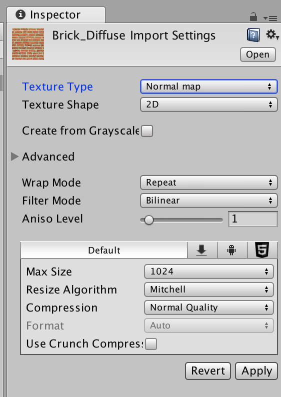

但需要使用那些包含法线映射的内置Unity Shader时，**必须把使用的法线纹理标识成Normal map才能得到正确结果**（即使忘记，Unity也会在材质面板提醒），因为这些Unity Shader都**使用内置的UnpackNorma函数来采样法线方向**。

当**把纹理类型设置成Normal map**，Unity会根据不同平台对纹理进行压缩（例如使用DXT5nm格式），再通过UnpackNormal函数来针对不同的压缩格式对法线纹理进行正确的采样。

UnpackNormal函数的内部实现：

```c++
inline fixed3 UnpackNormalDXT5nm(fixed4 packednormal)
{
		fixed3 normal;
		normal.xy = packednormal.wy * 2 - 1;
		normal.z = sqrt(1 - saturate(dot(normal.xy, normal.xy)));
		return normal;
}

inline fixed3 UnpackNormal(fixed4 packednormal)
{
#if defined(UNITY_NO_DXT5nm)
		return packednormal.xyz * 2 - 1;
#else
		return UnpackNormalDXT5nm(packednormal);
#endif
}
```

从代码中可以看出，**某些平台由于使用DXT5nm的压缩格式，因此需要针对这种格式对法线进行解码**。

在DXT5nm格式的法线纹理中：

- 纹素a通道（w分量）对应了法线的x分量
- 纹素g通道对应了法线的y分量
- 纹素r和b通道则会被舍弃

法线的z分量可以由xy分量推导而得。

>为什么普通纹理不能按这种方式压缩，而法线就需要使用**DXT5nm**格式来进行压缩呢？
>
>因为，按之前的处理方式，法线纹理被当成一个和普通纹理无异的图，但实际上，**它只有两个通道是真正必不可少的**，第三个通道的值可以用另外两个推导出来（法线是单位向量，并且切线空间下的法线方向的z分量始终为正）使用这种压缩方法**可以减少法线纹理占用的内存空间**。

当把纹理类型设置成Normal map后，还有一个复选框是**Create from Grayscale**，这个复选框是用于从**高度图**中生成法线纹理的。

>高度图本身记录的是**相对高度**，是一张**灰度图**，白色表示相对更高，黑色表示相对更低。

当把一张高度图导入Unity后，除了需要把它的纹理类型设置成Normal map，还需要勾选**Create form Grayscale**，这样就可以得到下图结果，然后就可以把它和切线空间下的法线纹理同等对待了。

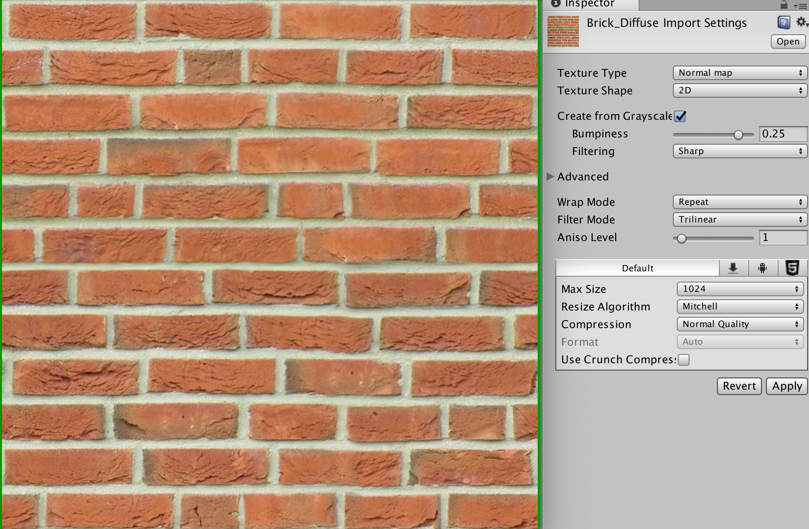

当勾选了**Create from Grayscale**后，还多出两个选项——**Bumpiness**和**Filtering**：

- **Bumpiness**：控制凹凸程度

- **Filtering**：决定使用哪种方式计算凹凸程度，一种是smooth（使得生成后的法线纹理比较平滑），另一种是Sharp（使用Sobel滤波：一种边缘检测时使用的滤波器，来生成法线）

    Sobel滤波实现非常简单，只需在一个**3x3的滤波器中计算x和y方向上的导数，然后从中得到法线即可**。（具体方法：**对于高度图中的每个像素**，考虑**它与水平方向和竖直方向上的像素差**，把它们的差当成该点对应的法线在x和y方向上的位移，然后**使用之前提到的映射函数存储成到法线纹理r和g分量即**可。）


# 渐变纹理

最初在渲染中使用纹理是为了定义一个物体的颜色，但其实**纹理可以用于存储任何表面属性**。

一种常见的用法就是**使用渐变纹理来控制漫反射光照的结果**。

之前计算漫反射光照时，使用**表面法线和光照方向的点积结果**与**材质的反射率**相乘来得到表面的漫反射光照。但有时需要更加灵活地控制光照结果。

>**渐变纹理技术**在游戏《军团要塞2》（《Team Fortress 2》）中流行起来，也是由Valve公司（提出半郎伯光照技术）提出来的，他们使用这种技术来渲染游戏中具有插画风格的角色。

1998年，Valve的Gooch等人发表了一篇著名的论文**《A Non-Photorealistic Lighting Model For Autimatic Technical Illustration》**来专门讲述在制作《军团要塞2》时使用的技术。

这篇论文中，作者提出一种基于**冷到暖色调（cool-to-warm tones）**的着色技术，用来得到一种插画风格的渲染效果。使用这种技术可以**保证物体的轮廓线相比于之前使用的传统漫反射光照更加明显**，而且能够**提供多种色调变化**。（现在许多卡通风格的渲染中都使用了这种技术。）

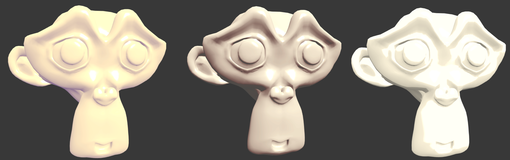

不同的渐变纹理有不同的特性：

- **左边的图**，使用一张**从紫色调到浅黄色调**的渐变纹理。
- **中间的图**，使用渐变纹理与《军团要塞2》中渲染人物使用的渐变纹理类似，都是**从黑色逐渐向浅灰色靠拢**，而且中间的分界线部分微微发红。
- **右边的图**，通常用于卡通风格的渲染，这种渐变纹理中的**色调通常是突变的，即没有平滑过渡**，以此来模拟卡通中的阴影色块。

1. 在Unity中新建一个场景，默认情况下场景包含**一个摄像机和一个平行光**，并且使用了**内置的天空盒子**。`Window->Lighting->Setting`中去掉场景中的天空盒子

2. 新建一个材质，材质名：`RampTextureMat`
3. 新建一个Unity Shader，名称为`RampTexture`，将其赋给第2步的材质
4. 场景中拖拽一个**Suzanne模型**，并把第2步中的材质赋给该模型
5. 保存场景

打开第3步的Shader，输入以下代码：

```c++
// Upgrade NOTE: replaced '_Object2World' with 'unity_ObjectToWorld'
// Upgrade NOTE: replaced 'mul(UNITY_MATRIX_MVP,*)' with 'UnityObjectToClipPos(*)'

Shader "Unity Shaders Book/Chapter 7/Ramp Texture" {
	Properties {
		_Color ("Color Tint", Color) = (1, 1, 1, 1)
		// 在Properties语义块中声明一个纹理属性来存储渐变纹理
		_RampTex ("Ramp Tex", 2D) = "white" {}
		_Specular ("Specular", Color) = (1, 1, 1, 1)
		_Gloss ("Gloss", Range(8.0, 256)) = 20
	}
	SubShader {
		Pass { 
			Tags { "LightMode"="ForwardBase" }
		
			CGPROGRAM
			
			#pragma vertex vert
			#pragma fragment frag

			#include "Lighting.cginc"
			
			// 定义和Properties中各个属性类型相匹配的变量
			fixed4 _Color;
			sampler2D _RampTex;
			// 为渐变纹理_RampTex定义它的纹理属性变量_RampTex_ST
			float4 _RampTex_ST;
			fixed4 _Specular;
			float _Gloss;
			
			struct a2v {
				float4 vertex : POSITION;
				float3 normal : NORMAL;
				float4 texcoord : TEXCOORD0;
			};
			
			struct v2f {
				float4 pos : SV_POSITION;
				float3 worldNormal : TEXCOORD0;
				float3 worldPos : TEXCOORD1;
				float2 uv : TEXCOORD2;
			};
			
			v2f vert(a2v v) {
				v2f o;
				o.pos = UnityObjectToClipPos(v.vertex);
				
				o.worldNormal = UnityObjectToWorldNormal(v.normal);
				
				o.worldPos = mul(unity_ObjectToWorld, v.vertex).xyz;
				
				// 使用内置的TRANSFORM_TEX宏来计算经过平铺和偏移后的纹理坐标
				o.uv = TRANSFORM_TEX(v.texcoord, _RampTex);
				
				return o;
			}
			
			fixed4 frag(v2f i) : SV_Target {
				fixed3 worldNormal = normalize(i.worldNormal);
				fixed3 worldLightDir = normalize(UnityWorldSpaceLightDir(i.worldPos));
				
				fixed3 ambient = UNITY_LIGHTMODEL_AMBIENT.xyz;
				
				// Use the texture to sample the diffuse color
				// 使用半朗伯模型,通过对法线方向和光照方向的点积做一次0.5倍的缩放以及一个0.5大小的偏移来计算半郎伯部分halfLambert
				// 得到的halfLambert的范围被映射到[0,1]之间
				fixed halfLambert  = 0.5 * dot(worldNormal, worldLightDir) + 0.5;
				// 使用halfLambert构建一个纹理坐标,并用这个纹理坐标对渐变纹理_RampTex进行采样
				// 由于_RampTex是一个一维纹理(纵轴方向颜色不变),因此纹理坐标的u和v方向都使用halfLambert
				// 把渐变纹理采样得到的颜色和材质颜色_Color相乘,得到最终的漫反射颜色
				fixed3 diffuseColor = tex2D(_RampTex, fixed2(halfLambert, halfLambert)).rgb * _Color.rgb;
				
				fixed3 diffuse = _LightColor0.rgb * diffuseColor;
				
				fixed3 viewDir = normalize(UnityWorldSpaceViewDir(i.worldPos));
				fixed3 halfDir = normalize(worldLightDir + viewDir);
				fixed3 specular = _LightColor0.rgb * _Specular.rgb * pow(max(0, dot(worldNormal, halfDir)), _Gloss);
				
				return fixed4(ambient + diffuse + specular, 1.0);
			}
			
			ENDCG
		}
	} 
	// 设置合适的Fallback
	FallBack "Specular"
}
```

**注意**：需要把渐变纹理的**Wrap Mode**设为**Clamp模式**，以防止对纹理进行采样时**由于浮点数精度**而造成的问题。如果采用**Repeat模式**则在高光区域有一些黑点，这是由浮点精度造成的，当使用`fixed2(halfLambert, halfLambert)`对渐变纹理进行采样时，虽然理论上`halfLambert`的值在[0,1]之间，但可能会有`1.00001`这样的值出现。如果使用**Repeat模式**，则会舍弃整数部分，只保留小数部分，得到的值就是`0.00001`，**对应渐变图中的黑点**，即高光区域反而有黑点的情况。使用Clamp模式可以解决这种问题。


# 遮罩纹理

**遮蔽纹理（mask texture）**允许保护某些区域，使他们免于某些修改，在很多商业游戏中都能见到它的身影。

例如在之前的实现中，都是**把高光反射应用到模型表面的所有地方**，即**所有的像素都使用同样大小的高光强度和高光指数**。但有时希望模型表面某些区域的反光强烈一些，而某些区域弱一些。为了的得到更加细腻的效果，可以**使用一张遮罩纹理来控制光照**。

另一种常见的应用是**在制作地形材质时需要混合多张图片**，例如表现草地的纹理、表现石子的纹理、表现裸露土地的纹理等，**使用遮罩纹理可以控制如何混合这些纹理**。

**流程**：通过采样得到遮罩纹理的**纹素值**，使用其中某个（或某几个）通道的值（例如`texel.r`）来与某种表面属性进行相乘，这样，**当该通道的值为0时，可以保护表面不受该属性的影响**。

总而言之，使用遮罩纹理可以**让美术人员更加精准（像素级别）地控制模型表面的各种属性**。

## 实践

使用一种高光遮罩纹理，**逐像素地控制模型表面的高光反射强度**。

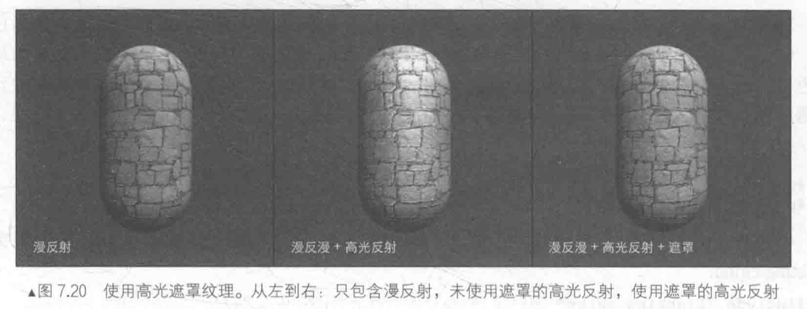

可以看出，遮罩纹理可以更加精细地控制光照细节，得到更加细腻的效果。

1. 在Unity中新建一个场景，默认情况下场景包含**一个摄像机和一个平行光**，并且使用了**内置的天空盒子**。`Window->Lighting->Setting`中去掉场景中的天空盒子

2. 新建一个材质，材质名：`MaskTextureMat`
3. 新建一个Unity Shader，名称为`MaskTexture`，将其赋给第2步的材质
4. 场景中拖拽一个胶囊体，并把第2步中的材质赋给该胶囊体
5. 保存场景

打开第3步的Shader，输入以下代码：

```c++
// Upgrade NOTE: replaced 'mul(UNITY_MATRIX_MVP,*)' with 'UnityObjectToClipPos(*)'

Shader "Unity Shaders Book/Chapter 7/Mask Texture" {
	Properties {
		_Color ("Color Tint", Color) = (1, 1, 1, 1)
		_MainTex ("Main Tex", 2D) = "white" {}
		_BumpMap ("Normal Map", 2D) = "bump" {}
		_BumpScale("Bump Scale", Float) = 1.0
		// _SpecularMask是需要使用的高光反射遮罩纹理
		_SpecularMask ("Specular Mask", 2D) = "white" {}
		// _SpecularScale用于控制遮罩影响度的系数
		_SpecularScale ("Specular Scale", Float) = 1.0
		_Specular ("Specular", Color) = (1, 1, 1, 1)
		_Gloss ("Gloss", Range(8.0, 256)) = 20
	}
	SubShader {
		Pass { 
			Tags { "LightMode"="ForwardBase" }
		
			CGPROGRAM
			
			#pragma vertex vert
			#pragma fragment frag
			
			#include "Lighting.cginc"
			
			// 定义和Properties中各个属性类型相匹配的变量
			// 为主纹理_MainTex,法线纹理_BumpMap和遮罩纹理_SpecularMask定义它们共同使用的纹理属性_MainTex_ST
			// 在材质面板中修改主纹理的平铺系数和偏移系数会同时影响3个纹理的采样
			// 使用这种方式可以节省需要存储的纹理坐标的数目,如果为每个纹理都使用一个单独的属性变量_ST,
			// 则随着使用纹理数目的增加,会迅速占满顶点着色器中可以使用的插值寄存器
			// 如果不需要对纹理进行平铺和偏移操作,或很多纹理使用同一种平铺和偏移操作,则可以对这些纹理使用同一个变换后的纹理坐标进行采样
			fixed4 _Color;
			sampler2D _MainTex;
			float4 _MainTex_ST;
			sampler2D _BumpMap;
			float _BumpScale;
			sampler2D _SpecularMask;
			float _SpecularScale;
			fixed4 _Specular;
			float _Gloss;
			
			struct a2v {
				float4 vertex : POSITION;
				float3 normal : NORMAL;
				float4 tangent : TANGENT;
				float4 texcoord : TEXCOORD0;
			};
			
			struct v2f {
				float4 pos : SV_POSITION;
				float2 uv : TEXCOORD0;
				float3 lightDir: TEXCOORD1;
				float3 viewDir : TEXCOORD2;
			};
			
			v2f vert(a2v v) {
				v2f o;
				o.pos = UnityObjectToClipPos(v.vertex);
				
				o.uv.xy = v.texcoord.xy * _MainTex_ST.xy + _MainTex_ST.zw;
				
				TANGENT_SPACE_ROTATION;
				
				// 顶点着色器中,对光照方向和视角方向进行了坐标空间的变换,把它们从模型空间变换到了切线空间
				// 以便在片元着色器中和法线进行光照计算
				o.lightDir = mul(rotation, ObjSpaceLightDir(v.vertex)).xyz;
				o.viewDir = mul(rotation, ObjSpaceViewDir(v.vertex)).xyz;
				
				return o;
			}
			
			// 使用遮罩纹理的地方是片元着色器,使用它来控制模型表面的高光反射强度
			fixed4 frag(v2f i) : SV_Target {
			 	fixed3 tangentLightDir = normalize(i.lightDir);
				fixed3 tangentViewDir = normalize(i.viewDir);

				fixed3 tangentNormal = UnpackNormal(tex2D(_BumpMap, i.uv));
				tangentNormal.xy *= _BumpScale;
				tangentNormal.z = sqrt(1.0 - saturate(dot(tangentNormal.xy, tangentNormal.xy)));

				fixed3 albedo = tex2D(_MainTex, i.uv).rgb * _Color.rgb;
				
				// 环境光照和漫反射光照与之前代码一致
				fixed3 ambient = UNITY_LIGHTMODEL_AMBIENT.xyz * albedo;
				
				fixed3 diffuse = _LightColor0.rgb * albedo * max(0, dot(tangentNormal, tangentLightDir));
				
			 	fixed3 halfDir = normalize(tangentLightDir + tangentViewDir);
			 	// Get the mask value
				 // 计算高光反射时,首先对遮罩纹理_SpecularMask进行采样
				 // 由于遮罩纹理中每个纹素的rgb分量一致,表明该点对应的高光反射强度
				 // 因此在此处选择使用r分量来计算掩码值
				 // 之后用得到的掩码值与_SpecularScale相乘,一起来控制高光反射的强度
			 	fixed specularMask = tex2D(_SpecularMask, i.uv).r * _SpecularScale;
			 	// Compute specular term with the specular mask
			 	fixed3 specular = _LightColor0.rgb * _Specular.rgb * pow(max(0, dot(tangentNormal, halfDir)), _Gloss) * specularMask;
			
				return fixed4(ambient + diffuse + specular, 1.0);
			}
			
			ENDCG
		}
	} 
	FallBack "Specular"
}
```

注意：使用的这张遮罩纹理其实有很多空间被浪费了——**它的rgb分量存储的都是同一个值**。在实际的游戏制作中，往往会**充分利用遮罩纹理中的每一个颜色通道来存储不同的表面属性**。

## 其他遮罩纹理

真实的游戏制作过程中，遮罩纹理已经不止限于保护某些区域使他们免于某些修改，而是可以**存储任何希望逐像素控制的表面属性**。

利用一张纹理的**RGBA四个通道**，存储不同的属性。

（把高光反射的强度存储在**R通道**，把边缘光照的强度存储在**G通道**，把高光反射的指数部分存储在**B通道**，最后把自发光强度存储在**A通道**）

《DOTA2》开发中，开发人员为每个模型使用4张纹理：

- 一张用于定义模型的颜色
- 一张用于定义表面法线
- 另外两张则都是遮罩纹理

两张遮罩纹理**提供8种额外的表面属性**，使得**游戏中的人物材质自由度很强**，支持很多高级的模型属性。
