**透明**是游戏中经常要使用的一种效果。

在实时渲染中若要实现透明效果，则通常会在渲染模型时控制它的**透明通道（Alpha Channel）**。

开启透明混合后，一个物体被渲染到屏幕上时，每个片元除了颜色值和深度值之外，还有另一个属性——**透明度**。

- **透明度为1**：完全不透明。
- **透明度为0**：完全不显示。

**渲染顺序：**当场景中包含很多模型时，并没有考虑先渲染A，再渲染B，最后再渲染C，或是按照其他的顺序来渲染。

对于**不透明的（opaque）物体**。不考虑渲染顺序也能得到正确的排序效果，这是由于强大的深度缓冲（depth buffer，z-buffer）的存在。

**实时渲染**中，深度缓冲可用于解决**可见性（visibility）**问题，决定哪个物体的哪些部分会被渲染在前面，而哪些部分会被其他物体遮挡。

> **基本思想：**根据**深度缓存中的值**来判断**该片元距离摄像机的距离**，当渲染一个片元时，需要把它的深度值和已经存在于深度缓冲中的值进行比较（开启深度测试），**如果该值距离摄像机更远**，则说明这个片元不应该被渲染到屏幕上（有物体挡住了它），否则，**该片元应该覆盖掉此时颜色缓冲中的像素值**，并把它的深度值更新到深度缓冲中（开启深度写入）。

开启深度缓冲，**可以不用关心不透明物体的渲染顺序**，由于A挡住B，即使先渲染A后渲染B也不用担心B会遮盖A，因为**在进行深度测试的时候会判断出B距离摄像机更远**（也不会写入颜色缓冲中）。

如果想要实现**透明效果**，则当使用透明度混合时，需要关闭**深度写入（ZWrite）**。

Unity中使用两种方法来实现透明效果：

- **透明度测试（Alpha Test）**：“霸道极端”的机制，**只要一个片元的透明度不满足条件**（小于某个阈值），则其对应的片元就会被舍弃。**被舍弃的片元不会再进行任何处理，也不会对颜色缓冲产生任何影响**。否则，就会按照普通的不透明物体处理方式来对待它（进行深度测试、深度写入）。它产生的效果很极端，**要么完全透明，要么完全不透明**。
- **透明度混合（Alpha Blending）**：可以得到真正的**半透明效果**。使用当前片元的透明度作为混合因子，与已经存储在颜色缓冲中的颜色值进行混合，得到新的颜色。需要**关闭深度写入**（未关闭深度测试，当使用**透明度混合**渲染一个片元时，还是会**比较它的深度值与当前深度缓冲中的深度值**，如果它的深度值距离摄像机更远，则不再进行混合操作），因此需要**非常小心物体的渲染顺序**。当一个**不透明物体出现在一个透明物体前面**，如果先渲染不透明物体，它仍然可以**正常地遮挡住透明物体**，即，对于**透明度混合**来说，深度缓冲是只读的。


# 渲染顺序

为什么要关闭深度写入？

>如果不关闭深度写入，一个**半透明表面背后的表面**本来是可以透过被看到的，但由于**深度测试时判断结果是该半透明表面距离摄像机更近**，导致后面的表面会被剔除，因此**无法透过半透明表面看到后面的物体**。

但是，由此**破坏了深度缓冲的工作机制**，这是一个**非常糟糕的事情**——由此导致**渲染顺序变得非常重要**。

假设场景有两个物体A和B，A是半透明物体，B是不透明物体，**A比B距离摄像机更近**。

考虑不同渲染顺序出现的结果：

- **先渲染B后渲染A**。由于不透明物体开启**深度测试**和**深度检验**，此时**深度缓冲中没有任何有效数据**，因此B首先会写入颜色缓冲和深度缓冲。随后渲染A，**透明物体仍然会进行深度测试**，因此发现**和B相比A距离摄像机更近**，因此，使用A的透明度来和颜色缓冲中的B的颜色进行混合，得到正确的半透明效果。
- **先渲染A和渲染B**。渲染A时**深度缓冲区中没有任何有效数据**，因此**A直接写入颜色缓冲中**，但由于对半透明物体关闭了深度写入，因此**A不会修改深度缓冲**。渲染B时，B会进行深度测试，由于**深度缓冲是空缺的**（说明没有物体被存储过），因此**B直接写入颜色缓冲**，导致**将A的颜色完全覆盖**。从视觉上来看，B就出现在A的前面，**出现错误结果**。

由此可知，应该**在不透明物体全部渲染完之后，再渲染半透明物体**。

如果两个**物体A和B均为半透明物体**，渲染顺序还是**必须的**。

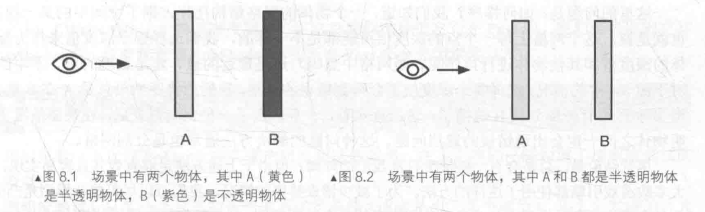

基于这两点，渲染引擎一般都会**先对物体进行排序，再渲染**，常用的方法：

1. **先渲染所有不透明物体**，并开启它们的**深度测试**和**深度写入**。
2. 半透明物体**按照距离摄像机的远近进行排序**，之后按照**从后往前**的顺序渲染这些半透明物体，并**开启它们的深度测试**，但**关闭深度写入**。

但是上述方法仍然存在一些问题：

**物体距离摄像机的远近如何决定？**深度缓冲中的值都是**像素级别**的，即每个像素有一个深度值，但是对单个物体级别进行排序，意味着排序结果是**整体概念**（要么物体A全部在物体B前面渲染，要么物体A全部在物体B后面渲染）。但是如果存在**循环重叠**的情况，则**使用这种方法永远无法得到正确的结果**。

如下图所示，无法得到一个正确的排序顺序（此时需要**通过分割的方法**解决循环覆盖的问题）。

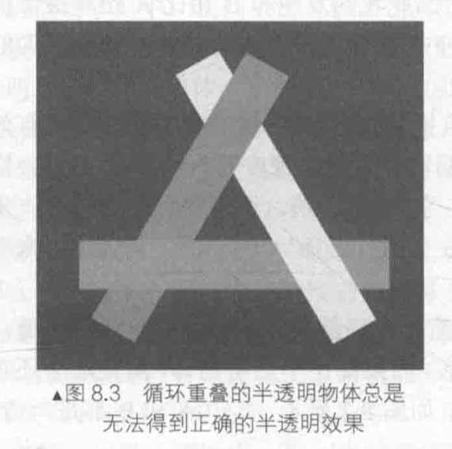

一个**物体的网格结构往往占据空间中某一块区域**，即，网格上每一个点的深度值可能都是**不一样**的，则此时需要确定**选择哪个像素的深度值作为整个物体的深度值来和其他物体进行排序**。如下图所示，无论选择哪个点（网格中点，最近点，最远点），**得到的排序结果总是A在B的前面**，但实际上A有一部分被B遮挡了。

这也意味着，**一旦选定了一种判断方式后**，在**某些情况下半透明物体之间一定会出现错误的遮挡问题**（通常也是**分割网格**来解决）。

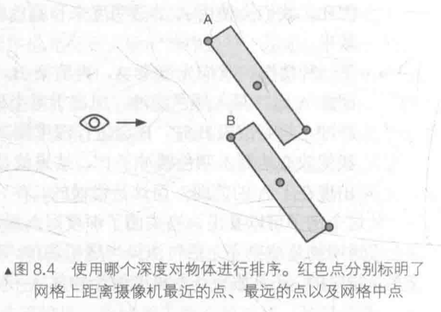

尽管某些情况下会**出现错误排序的情况**，但由于上述方法足够有效并且容易实现，因此大多数游戏引擎都使用了这种方法。为**尽量减少错误排序**的情况，让模型是**凸面体**，并且考虑**将复杂的模型拆分成可以独立排序的多个子模型**。

其实**排序错误有时候也不会非常糟糕**，如果不想分割网格，可以**试着让透明通道更加柔和，使穿插看起来并不是那么明显**，同时也可以**开启深度写入的半透明效果来近似模拟物体的半透明**。


# Unity Shader的渲染顺序

Unity提供**渲染队列（render queue）**来解决**渲染顺序**的问题。

使用`SubShader`的`Queue`标签决定模型归于哪个渲染队列，Unity在内部**使用一系列整数索引来表示每个渲染队列**，且**索引号越小表示越早被渲染**。

Unity提前定义**5个渲染队列**（每个队列中可以使用其他队列），下表给出了5个提前定义的渲染队列及它们的描述。

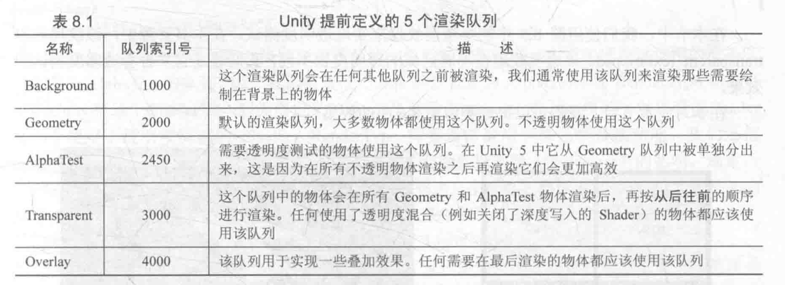

如果想要通过**透明度测试**实现透明效果，代码中需要包含：

```c++
SubShader {
    Tags {"Queue"="AlphaTest"}
  	Pass {
        ...
    }
}
```

如果想要通过**透明度混合**实现透明效果，代码中需要包含：

```c++
SubShader {
    Tags {"Queue"="Transparent"}
  	Pass {
        ZWrite Off	// 关闭深度写入, 如果将其写在SubShader,则该SubShader中所有Pass都会关闭深度写入
        ...
    }
}
```


# 透明度测试

**透明度测试（Alpha Test）**：“霸道极端”的机制，**只要一个片元的透明度不满足条件**（小于某个阈值），则其对应的片元就会被舍弃。**被舍弃的片元不会再进行任何处理，也不会对颜色缓冲产生任何影响**。否则，就会按照普通的不透明物体处理方式来对待它（进行深度测试、深度写入）。它产生的效果很极端，**要么完全透明，要么完全不透明**。

通常在**片元着色器**中使用`clip`函数来进行**透明度测试**，`clip`是CG中的一个函数，它的定义如下：

>**函数**：void clip(float4 x); void clip(float3 x); void clip(float2 x); void clip(float1 x); void clip(float x);
>
>**参数**：裁剪时使用的**标量或矢量条件**。
>
>**描述**：如果给定参数的任何一个分量是负数，就会舍弃当前像素的输出颜色，等同于：
>
>```c++
>void clip(float4 x){
>		if(any(x < 0))
>        discard;
>}
>```

使用下图的半透明纹理来实现**透明度测试**，纹理名`transparent_texture.psd`，该**透明纹理在不同区域的透明度不同**。

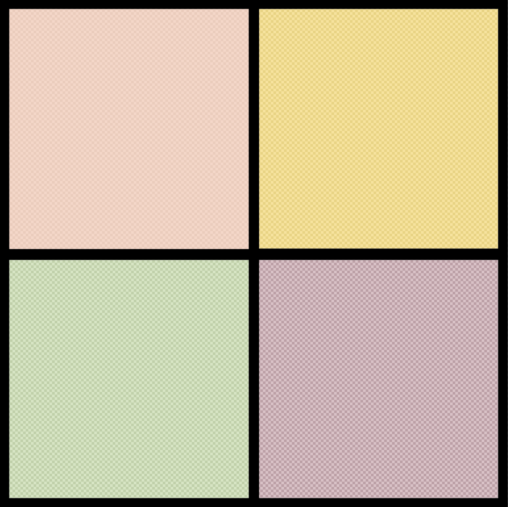

1. 在Unity中新建一个场景，默认情况下场景包含**一个摄像机和一个平行光**，并且使用了**内置的天空盒子**。`Window->Lighting->Setting`中去掉场景中的天空盒子

2. 新建一个材质，材质名：`AlphaTestMat`
3. 新建一个Unity Shader，名称为`AlphaTest`，将其赋给第2步的材质
4. 场景中创建一个立方体，并把第2步中的材质赋给该模型。创建一个平面，使得平面位于立方体下方
5. 保存场景

打开第3步的Shader，输入以下代码：

```c++
// Upgrade NOTE: replaced '_Object2World' with 'unity_ObjectToWorld'
// Upgrade NOTE: replaced 'mul(UNITY_MATRIX_MVP,*)' with 'UnityObjectToClipPos(*)'

Shader "Unity Shaders Book/Chapter 8/Alpha Test" {
	Properties {
		_Color ("Color Tint", Color) = (1, 1, 1, 1)
		_MainTex ("Main Tex", 2D) = "white" {}
		// 为了在材质面板中控制透明度测试使用的阈值,声明一个[0,1]之间的属性_Cutoff
		// _Cutoff参数用于决定调用clip进行透明度测试时使用的判断条件,其范围在[0,1]
		// 这是因为纹理像素的透明度就是在此范围内
		_Cutoff ("Alpha Cutoff", Range(0, 1)) = 0.5
	}
	SubShader {
		// 渲染顺序的重要性,Unity中透明度测试使用的渲染队列为:AlphaTest,因此需要设置Queue标签
		// RenderType标签可以让Unity把这个Shader归入到提前定义的组(此处是TransparentCutout组)
		// 以指明该Shader是一个使用了透明度测试的Shader
		// RenderType标签通常被用于着色器替换功能
		// IgnoreProjector设置为True,意味着这个Shader不会受到投影器(Projector)的影响
		// 通常使用透明度测试的Shader都应该在SubShader中设置这三个标签
		Tags {"Queue"="AlphaTest" "IgnoreProjector"="True" "RenderType"="TransparentCutout"}
		
		Pass {
			// LightMode标签是Pass标签的一种,它用于定义该Pass在Unity的光照流水线中的角色
			// 只有定义了正确的LightMode,才能得到一些Unity的内置光照变量,例如_LightColor0
			Tags { "LightMode"="ForwardBase" }
			
			CGPROGRAM
			
			#pragma vertex vert
			#pragma fragment frag
			
			#include "Lighting.cginc"
			
			// 为了和Properties语义块中声明的属性建立联系,需要定义和各个属性类型相匹配的变量
			fixed4 _Color;
			sampler2D _MainTex;
			float4 _MainTex_ST;
			// 由于_Cutoff的范围在[0,1],因此可以使用fixed精度存储它
			fixed _Cutoff;
			
			struct a2v {
				float4 vertex : POSITION;
				float3 normal : NORMAL;
				float4 texcoord : TEXCOORD0;
			};
			
			struct v2f {
				float4 pos : SV_POSITION;
				float3 worldNormal : TEXCOORD0;
				float3 worldPos : TEXCOORD1;
				float2 uv : TEXCOORD2;
			};
			
			v2f vert(a2v v) {
				v2f o;
				o.pos = UnityObjectToClipPos(v.vertex);
				
				o.worldNormal = UnityObjectToWorldNormal(v.normal);
				
				o.worldPos = mul(unity_ObjectToWorld, v.vertex).xyz;
				
				o.uv = TRANSFORM_TEX(v.texcoord, _MainTex);
				
				return o;
			}
			
			// 透明度测试的代码写在片元着色器中
			fixed4 frag(v2f i) : SV_Target {
				fixed3 worldNormal = normalize(i.worldNormal);
				fixed3 worldLightDir = normalize(UnityWorldSpaceLightDir(i.worldPos));
				
				fixed4 texColor = tex2D(_MainTex, i.uv);
				
				// Alpha test
				// clip判断参数是否为负值,如果是就会舍弃该片元的输出,产生完全透明效果
				clip (texColor.a - _Cutoff);
				// Equal to 
//				if ((texColor.a - _Cutoff) < 0.0) {
//					discard;
//				}

				// 计算环境光照和漫反射光照				
				fixed3 albedo = texColor.rgb * _Color.rgb;
				
				fixed3 ambient = UNITY_LIGHTMODEL_AMBIENT.xyz * albedo;
				
				fixed3 diffuse = _LightColor0.rgb * albedo * max(0, dot(worldNormal, worldLightDir));
				
				return fixed4(ambient + diffuse, 1.0);
			}
			
			ENDCG
		}
	} 
	// 设置合适的Fallback
	// 使用内置的Transparent/Cutout/VertexLit作为回调Shader
	// 不仅能够保证编写的SubShader无法在当前显卡上工作时有合适的代替Shader
	// 还能够保证使用透明度测试的物体可以正确地向其他物体投射阴影
	FallBack "Transparent/Cutout/VertexLit"
}
```

材质面板中的`Alpha cutoff`参数用于**调整透明度测试时使用的阈值**，当纹理像素的透明度小于该值时，对应的片元就会被舍弃。**当逐渐调大该值时，立方体上的网格会逐渐消失**。

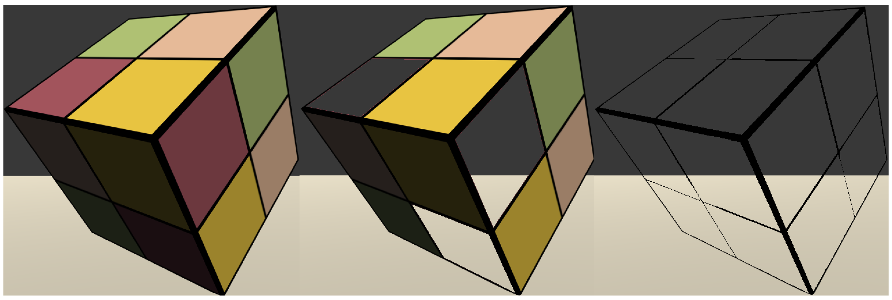

**透明度测试**得到的透明效果很**极端**——要么完全透明，要么完全不透明，它的效果就像在一个不透明物体上挖了一个空洞。得到的透明效果在边缘处往往**参差不齐**，有**锯齿**（边界处纹理透明度的变化精度问题）。


# 透明度混合

**透明度混合（Alpha Blending）**：可以得到真正的**半透明效果**。使用当前片元的透明度作为混合因子，与已经存储在颜色缓冲中的颜色值进行混合，得到新的颜色。需要**关闭深度写入**（未关闭深度测试，当使用**透明度混合**渲染一个片元时，还是会**比较它的深度值与当前深度缓冲中的深度值**，如果它的深度值距离摄像机更远，则不再进行混合操作），因此需要**非常小心物体的渲染顺序**。当一个**不透明物体出现在一个透明物体前面**，如果先渲染不透明物体，它仍然可以**正常地遮挡住透明物体**，即，对于**透明度混合**来说，深度缓冲是只读的。

为了进行混合，需要使用Unity提供的混合命令——**Blend**。想要**实现半透明的效果就需要把当前自身的颜色和已经存在于颜色缓冲中的颜色值进行混合**，混合时使用的函数就是由该指令决定的。

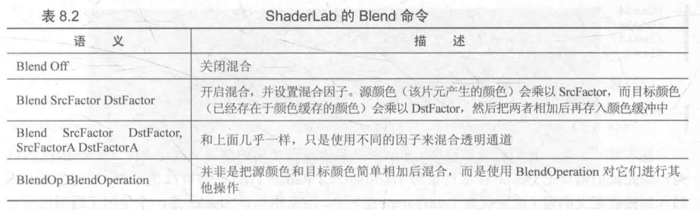

主要采用第二种语义`Blend SrcFactor DesFactor`来进行混合（该命令设置**混合因子**的同时也开启了**混合模式**，只有开启了混合之后，**设置片元的透明通道才有意义**，因此Unity在**使用Blend命令**的时候就**自动打开**了）。

很多初学者总是抱怨为何自己的模型**没有任何透明效果**，这往往是因为他们**没有在Pass中使用Blend命令**，一方面是**没有设置混合因子**，更重要的是**没有打开混合模式**。

当把**源颜色的混合因子SrcFactor设为SrcAlpha**，而**目标颜色的混合因子DstFactor设为OneMinusSrcAlpha**，则混合后新的颜色是：
$$
DstColor_{new}=SrcAlpha\times SrcColor+(1-SrcAlpha)\times DstColor_{old} \tag{1}
$$
**透明度混合**使用的就是这样的**混合命令**。

1. 在Unity中新建一个场景，默认情况下场景包含**一个摄像机和一个平行光**，并且使用了**内置的天空盒子**。`Window->Lighting->Setting`中去掉场景中的天空盒子

2. 新建一个材质，材质名：`AlphaBlendMat`
3. 新建一个Unity Shader，名称为`AlphaBlend`，将其赋给第2步的材质
4. 场景中创建一个立方体，并把第2步中的材质赋给该模型。创建一个平面，使得平面位于立方体下方
5. 保存场景

打开第3步的Shader，输入以下代码：

```c++
// Upgrade NOTE: replaced '_Object2World' with 'unity_ObjectToWorld'
// Upgrade NOTE: replaced 'mul(UNITY_MATRIX_MVP,*)' with 'UnityObjectToClipPos(*)'

Shader "Unity Shaders Book/Chapter 8/Alpha Blend" {
	Properties {
		_Color ("Color Tint", Color) = (1, 1, 1, 1)
		_MainTex ("Main Tex", 2D) = "white" {}
		// _AlphaScale用于在透明纹理的基础上控制整体的透明度
		_AlphaScale ("Alpha Scale", Range(0, 1)) = 1
	}
	SubShader {
		// Unity中透明度混合使用的渲染队列是Transparent
		// RenderType标签可以让Unity把这个Shader归入到提前定义的组(Transparent组)
		// 用于指明该Shader是一个使用了透明度混合的Shader
		// RenderType标签通常被用于着色器替换功能
		// 把IgnoreProjector设置为True,意味着这个Shader不会受到投影器(Projectors)的影响
		// 通常,使用透明度混合的Shader都应该在SubShader中设置这3个标签
		Tags {"Queue"="Transparent" "IgnoreProjector"="True" "RenderType"="Transparent"}
		
		Pass {
			Tags { "LightMode"="ForwardBase" }

			// 把该Pass的深度写入ZWrite设置为关闭状态Off
			ZWrite Off
			// 开启并设置该Pass的混合模式
			// 将源颜色(片元着色器产生的颜色)的混合因子设为SrcAlpha
			// 将目标颜色(存在于颜色缓冲中的颜色)的混合因子设为OneMinusSrcAlpha
			// 以得到合适的半透明效果
			Blend SrcAlpha OneMinusSrcAlpha
			
			CGPROGRAM
			
			#pragma vertex vert
			#pragma fragment frag
			
			#include "Lighting.cginc"
			
			fixed4 _Color;
			sampler2D _MainTex;
			float4 _MainTex_ST;
			fixed _AlphaScale;
			
			struct a2v {
				float4 vertex : POSITION;
				float3 normal : NORMAL;
				float4 texcoord : TEXCOORD0;
			};
			
			struct v2f {
				float4 pos : SV_POSITION;
				float3 worldNormal : TEXCOORD0;
				float3 worldPos : TEXCOORD1;
				float2 uv : TEXCOORD2;
			};
			
			v2f vert(a2v v) {
				v2f o;
				o.pos = UnityObjectToClipPos(v.vertex);
				
				o.worldNormal = UnityObjectToWorldNormal(v.normal);
				
				o.worldPos = mul(unity_ObjectToWorld, v.vertex).xyz;
				
				o.uv = TRANSFORM_TEX(v.texcoord, _MainTex);
				
				return o;
			}
			
			fixed4 frag(v2f i) : SV_Target {
				fixed3 worldNormal = normalize(i.worldNormal);
				fixed3 worldLightDir = normalize(UnityWorldSpaceLightDir(i.worldPos));
				
				fixed4 texColor = tex2D(_MainTex, i.uv);
				
				fixed3 albedo = texColor.rgb * _Color.rgb;
				
				fixed3 ambient = UNITY_LIGHTMODEL_AMBIENT.xyz * albedo;
				
				fixed3 diffuse = _LightColor0.rgb * albedo * max(0, dot(worldNormal, worldLightDir));
				
				// 设置该片元着色器返回值中的透明通道,它是纹理像素的透明通道和材质参数_AlphaScale的乘积
				// 只有使用Blend命令打开混合后,在这里设置透明通道才有意义,否则这些透明度并不会对片元的透明效果有任何影响
				return fixed4(ambient + diffuse, texColor.a * _AlphaScale);
			}
			
			ENDCG
		}
	} 
	// 修改Unity Shader的Fallback
	FallBack "Transparent/VertexLit"
}
```

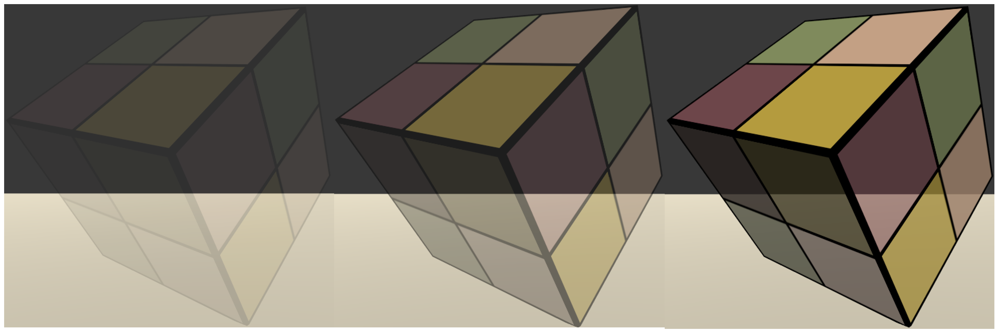

可以通过调节材质面板上的`Alpha Scale`参数，以控制整体透明度。

由于**关闭深度写入**（无法对模型进行**像素级别的深度排序**），当模型本身有复杂的遮挡关系或是包含了复杂的非凸网格的时候，就会有**各种各样因为排序错误而产生的错误的透明效果**。


# 开启深度写入的半透明效果

**关闭深度写入**造成错误排序的情况。

**解决办法：**使用**两个Pass**来渲染模型：

- **第一个Pass开启深度写入**，但不输出颜色，目的是**把该模型的深度值写入深度缓冲**中。
- **第二个Pass进行正常的透明度混合**，由于上一个Pass已经得到了逐像素的正确的深度信息，该Pass就可以**按照像素级别的深度排序结果进行透明渲染**。

**缺点：**多使用一个Pass会对性能造成一定的影响。

1. 在Unity中新建一个场景，默认情况下场景包含**一个摄像机和一个平行光**，并且使用了**内置的天空盒子**。`Window->Lighting->Setting`中去掉场景中的天空盒子

2. 新建一个材质，材质名：`AlphaBlendZWriteMat`
3. 新建一个Unity Shader，名称为`AlphaBlendZWrite`，将其赋给第2步的材质
4. 场景中创建一个立方体，并把第2步中的材质赋给该模型。创建一个平面，使得平面位于立方体下方
5. 保存场景

打开第3步的Shader，输入以下代码：

```c++
// Upgrade NOTE: replaced '_Object2World' with 'unity_ObjectToWorld'
// Upgrade NOTE: replaced 'mul(UNITY_MATRIX_MVP,*)' with 'UnityObjectToClipPos(*)'

Shader "Unity Shaders Book/Chapter 8/Alpha Blending With ZWrite" {
	Properties {
		_Color ("Color Tint", Color) = (1, 1, 1, 1)
		_MainTex ("Main Tex", 2D) = "white" {}
		_AlphaScale ("Alpha Scale", Range(0, 1)) = 1
	}
	SubShader {
		Tags {"Queue"="Transparent" "IgnoreProjector"="True" "RenderType"="Transparent"}
		
		// Extra pass that renders to depth buffer only
		// 新加的Pass目的仅仅是为了把模型的深度信息写入深度缓冲中
		// 从而剔除模型中被自身遮挡的片元
		Pass {
			// 开启深度写入
			ZWrite On
			// 新的渲染命令:ColorMask,用于设置颜色通道的写掩码(write mask)
			// 它的语义如下: ColorMask RGB | A | 0 | 其他任何R/G/B/A的组合
			// 当ColorMask设为0时,意味着该Pass不写入任何颜色通道,即不会输出任何颜色
			// 该Pass只需写入深度缓存即可
			ColorMask 0
		}
		
		Pass {
			Tags { "LightMode"="ForwardBase" }
			
			ZWrite Off
			Blend SrcAlpha OneMinusSrcAlpha
			
			CGPROGRAM
			
			#pragma vertex vert
			#pragma fragment frag
			
			#include "Lighting.cginc"
			
			fixed4 _Color;
			sampler2D _MainTex;
			float4 _MainTex_ST;
			fixed _AlphaScale;
			
			struct a2v {
				float4 vertex : POSITION;
				float3 normal : NORMAL;
				float4 texcoord : TEXCOORD0;
			};
			
			struct v2f {
				float4 pos : SV_POSITION;
				float3 worldNormal : TEXCOORD0;
				float3 worldPos : TEXCOORD1;
				float2 uv : TEXCOORD2;
			};
			
			v2f vert(a2v v) {
				v2f o;
				o.pos = UnityObjectToClipPos(v.vertex);
				
				o.worldNormal = UnityObjectToWorldNormal(v.normal);
				
				o.worldPos = mul(unity_ObjectToWorld, v.vertex).xyz;
				
				o.uv = TRANSFORM_TEX(v.texcoord, _MainTex);
				
				return o;
			}
			
			fixed4 frag(v2f i) : SV_Target {
				fixed3 worldNormal = normalize(i.worldNormal);
				fixed3 worldLightDir = normalize(UnityWorldSpaceLightDir(i.worldPos));
				
				fixed4 texColor = tex2D(_MainTex, i.uv);
				
				fixed3 albedo = texColor.rgb * _Color.rgb;
				
				fixed3 ambient = UNITY_LIGHTMODEL_AMBIENT.xyz * albedo;
				
				fixed3 diffuse = _LightColor0.rgb * albedo * max(0, dot(worldNormal, worldLightDir));
				
				return fixed4(ambient + diffuse, texColor.a * _AlphaScale);
			}
			
			ENDCG
		}
	} 
	FallBack "Transparent/VertexLit"
}
```

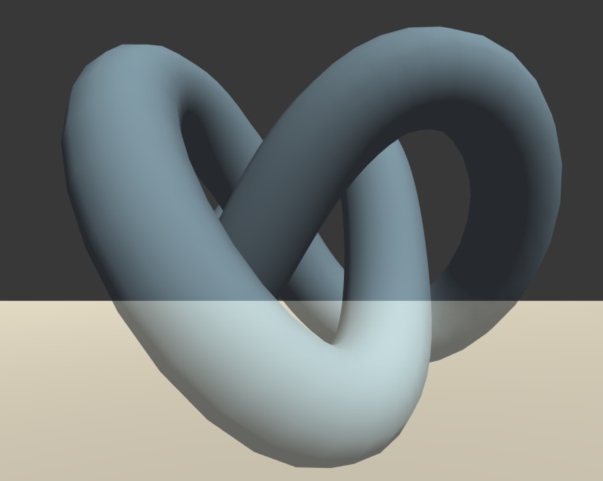


# ShaderLab混合命令

**混合实现：**当片元着色器产生一个颜色的时候，可以选择**与颜色缓存中的颜色进行混合**。

混合与两个操作数有关：**S**和**D**

- **源颜色（source color）**：**S**表示，由片元着色器产生的颜色值
- **目标颜色（destination color）**：**D**表示，从颜色缓冲中读取到的颜色值
- **输出颜色（output color）**：**O**表示，重新写入到颜色缓冲中

**注意：**当谈及混合颜色中的**源颜色**、**目标颜色**和**输出颜色**时，都包含**RGBA**四个通道的值，而并非仅仅是RGB通道。

想要使用混合，必须**首先开启它**。在Unity中，当使用Blend（Blend Off命令除外）命令时，除了设置混合状态外也开启了混合。但是**在其他图形API中往往是需要手动开启的**。（例如OpenGL中，需要使用`glEnable(GL_BLEND)`来开启混合）

## 混合等式和参数

混合是一个**逐片元的操作**，并且是不可编程的，但却是**高度可配置的**。（可以设置混合时使用的**运算操作**、**混合因子**等来影响混合）

已知**两个操作数**：**源颜色S和目标颜色D**，想要得到**输出颜色O**就必须使用一个**等式（混合等式Blend Equation）**来计算。

当进行混合时，需要使用**两个混合等式**：

- 一个用于混合**RGB通道**
- 一个用于混合**A通道**

当设置混合状态时，实际上设置的就是混合等式中的**操作**和**因子**。

默认情况下，混合等式使用的操作都是**加操作**（也可以使用其他操作），只需要再设置一下**混合因子**即可。由于需要**两个等式**（分别用于混合**RGB通道**和**A通道**），每个等式有**两个因子**（一个用于和源颜色相乘，一个用于和目标颜色相乘），因此一共需要**4个因子**，以下是ShaderLab中设置混合因子的命令。

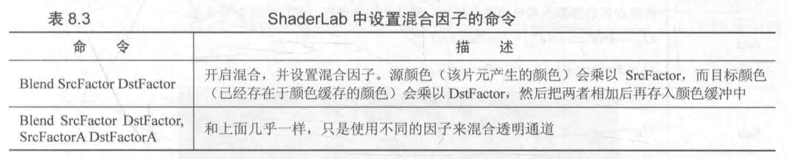

第一个命令提供了两个因子，意味着将**使用相同的混合因子来混合RGB通道和A通道**（此时`SrcFactorA`等于`SrcFactor`，`DstFactorA`等于`DstFactor`）。

使用这些因子**进行加法混合时使用的混合公式**：
$$
O_{rgb}=SrcFactor\times S_{rgb} + DstFactor\times D_{rgb} \tag{2}
$$

$$
O_a = SrcFactorA\times S_a+DstFactorA\times D_a	\tag{3}
$$

**ShaderLab**支持的几种混合因子如下：

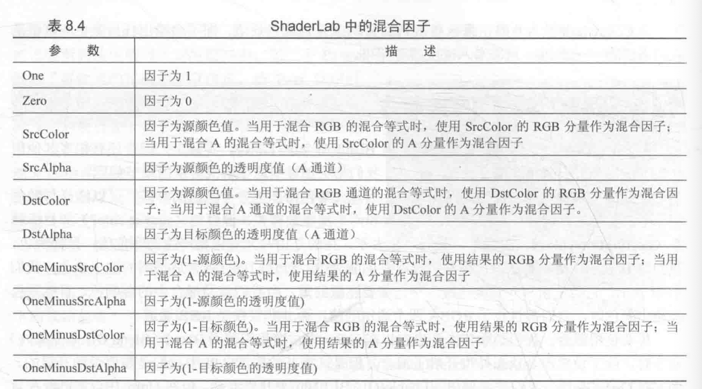

使用上面的指令进行设置时，**RGB通道的混合因子和A通道的混合因子都是一样的**，有时希望可以使用不同的参数混合A通道，此时可以利用`Blend SrcFactor DstFactor, SrcFactorA DstFactorA`指令。

如果想要**在混合后**，**输出颜色的透明度就是源颜色的透明度**，可以使用下面命令：

`Blend SrcAlpha OneMinusSrcAlpha, One Zero`

```c++
// Upgrade NOTE: replaced 'mul(UNITY_MATRIX_MVP,*)' with 'UnityObjectToClipPos(*)'

Shader "Unity Shaders Book/Chapter 8/Blend Operations 0" {
	Properties {
		_Color ("Color Tint", Color) = (1, 1, 1, 1)
		_MainTex ("Main Tex", 2D) = "white" {}
		_AlphaScale ("Alpha Scale", Range(0, 1)) = 1
	}
	SubShader {
		Tags {"Queue"="Transparent" "IgnoreProjector"="True" "RenderType"="Transparent"}
		
		Pass {
			Tags { "LightMode"="ForwardBase" }
			
			ZWrite Off
			
			Blend SrcAlpha OneMinusSrcAlpha, One Zero
			
			CGPROGRAM
			
			#pragma vertex vert
			#pragma fragment frag
			
			#include "Lighting.cginc"
			
			fixed4 _Color;
			sampler2D _MainTex;
			float4 _MainTex_ST;
			fixed _AlphaScale;
			
			struct a2v {
				float4 vertex : POSITION;
				float3 normal : NORMAL;
				float4 texcoord : TEXCOORD0;
			};
			
			struct v2f {
				float4 pos : SV_POSITION;
				float2 uv : TEXCOORD0;
			};
			
			v2f vert(a2v v) {
			 	v2f o;
			 	o.pos = UnityObjectToClipPos(v.vertex);

			 	o.uv = TRANSFORM_TEX(v.texcoord, _MainTex);
			 	
			 	return o;
			}
			
			fixed4 frag(v2f i) : SV_Target {				
				fixed4 texColor = tex2D(_MainTex, i.uv);
			 	
				return fixed4(texColor.rgb * _Color.rgb, texColor.a * _AlphaScale);
			}
			
			ENDCG
		}
	} 
	FallBack "Transparent/VertexLit"
}
```

## 混合操作

混合等式中，当**把源颜色和目标颜色与它们对应的混合因子相乘后**，把它们的**结果加起来作为输出颜色**。同时还有其他的一些**混合操作**，如下：

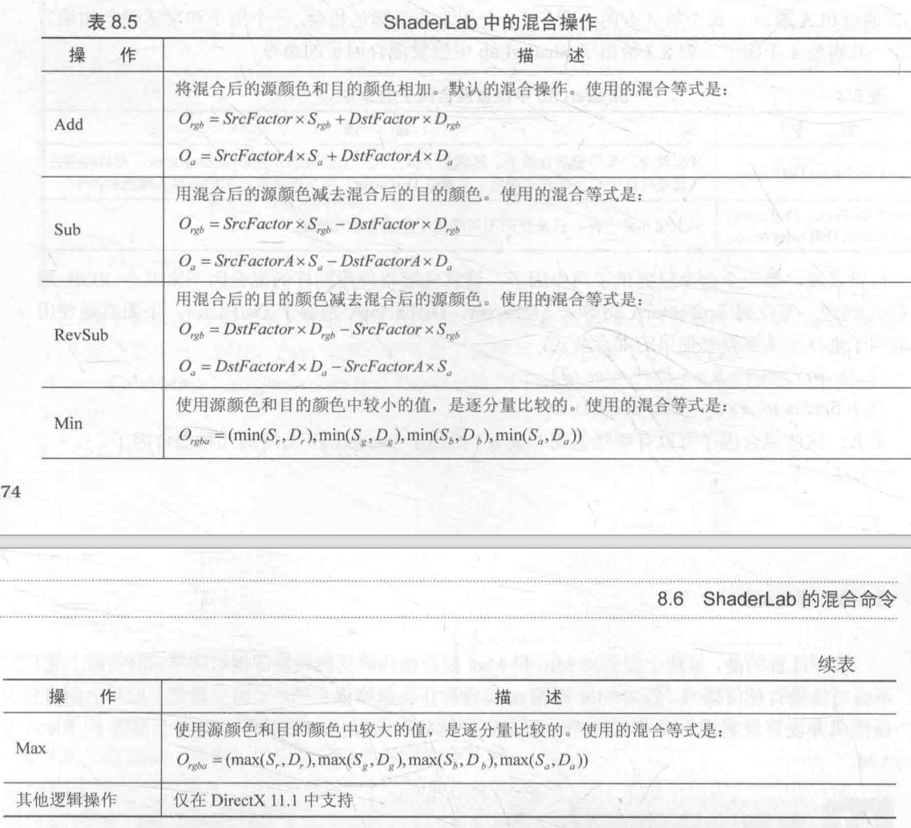

混合操作命令**通常是与混合因子一起工作的**，但需要注意的是，当使用**Min**或**Max**混合操作时，**混合因子实际上是不起任何作用的**，它们**仅会判断的源颜色和目标颜色之间**的比较结果。

## 常见的混合类型

通过**混合操作和混合因子**命令的组合，可以得到一些**类似Photoshop混合模式**中的混合效果：

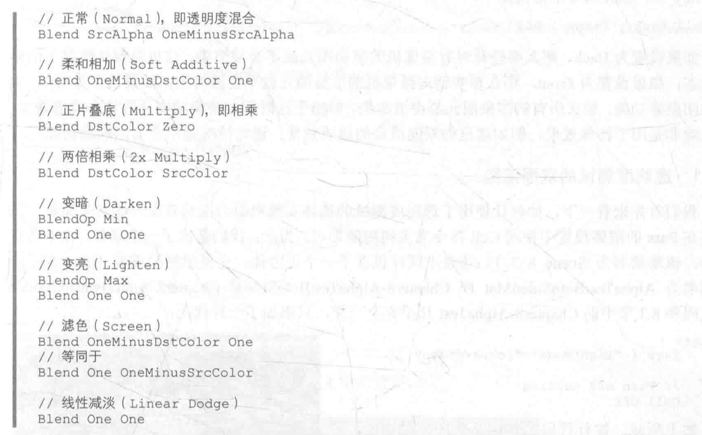

下图给出了上面不同设置下的结果：

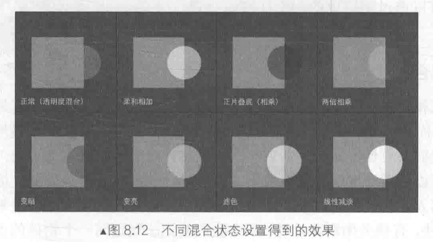

需要注意的是，虽然使用**Min**和**Max**混合操作时仍然设置了**混合因子**，但实际上它们并不会对结果有任何影响，因为**Min**和**Max**混合操作时会忽略混合因子。

另一点，虽然上面有些**混合模式**并没有设置混合操作的种类，但是它们默认就是使用加法操作，相当于设置了`BlendOpAdd`

```c++
// Upgrade NOTE: replaced 'mul(UNITY_MATRIX_MVP,*)' with 'UnityObjectToClipPos(*)'

Shader "Unity Shaders Book/Chapter 8/Blend Operations 1" {
	Properties {
		_Color ("Color Tint", Color) = (1, 1, 1, 1)
		_MainTex ("Main Tex", 2D) = "white" {}
		_AlphaScale ("Alpha Scale", Range(0, 1)) = 1
	}
	SubShader {
		Tags {"Queue"="Transparent" "IgnoreProjector"="True" "RenderType"="Transparent"}
		
		Pass {
			Tags { "LightMode"="ForwardBase" }
			
			ZWrite Off
			
//			// Normal
//			Blend SrcAlpha OneMinusSrcAlpha
//			
//			// Soft Additive
//			Blend OneMinusDstColor One
//			
//			// Multiply
			Blend DstColor Zero
//			
//			// 2x Multiply
//			Blend DstColor SrcColor
//			
//			// Darken
//			BlendOp Min
//			Blend One One	// When using Min operation, these factors are ignored
//			
//			//  Lighten
//			BlendOp Max
//			Blend One One // When using Max operation, these factors are ignored
//			
//			// Screen
//			Blend OneMinusDstColor One
			// Or
//			Blend One OneMinusSrcColor
//			
//			// Linear Dodge
			Blend One One
			
			CGPROGRAM
			
			#pragma vertex vert
			#pragma fragment frag
			
			#include "Lighting.cginc"
			
			fixed4 _Color;
			sampler2D _MainTex;
			float4 _MainTex_ST;
			fixed _AlphaScale;
			
			struct a2v {
				float4 vertex : POSITION;
				float3 normal : NORMAL;
				float4 texcoord : TEXCOORD0;
			};
			
			struct v2f {
				float4 pos : SV_POSITION;
				float2 uv : TEXCOORD0;
			};
			
			v2f vert(a2v v) {
			 	v2f o;
			 	o.pos = UnityObjectToClipPos(v.vertex);

			 	o.uv = TRANSFORM_TEX(v.texcoord, _MainTex);
			 	
			 	return o;
			}
			
			fixed4 frag(v2f i) : SV_Target {				
				fixed4 texColor = tex2D(_MainTex, i.uv);
			 	
				return fixed4(texColor.rgb * _Color.rgb, texColor.a * _AlphaScale);
			}
			
			ENDCG
		}
	} 
	FallBack "Transparent/VertexLit"
}
```


# 双面渲染的透明效果

如果一个物体是透明的，则**不仅可以透过它看到其他物体的样子**，**也可以看到它内部的结构**。

但**无论在透明度测试还是透明度混合**，都无法观察到**立方体内部及其背面的形状**，导致物体**看起来就像只有半个一样**。（默认情况下，**渲染引擎剔除了物体背面【相对于摄像机的方向】的渲染图元**，而只渲染了物体的正面）

如果想要得到双面渲染的效果，可以使用`Cull`指令来**控制需要剔除哪个面的渲染图元**。

Unity中，`Cull`指令的语法如下：

```c++
Cull Back | Front | Off
```

- 如果设置为`Back`，则**背对着摄像机的渲染图元就不会被渲染**，这也是默认情况下的**剔除状态**。
- 如果设置为`Front`，则**朝向摄像机的渲染图元就不会被渲染**。
- 如果设置为`Off`，就会关闭剔除功能，**所有的渲染图元都会被渲染**，但**由于此时需要渲染的图元数目会成倍增加**，因此除非是用于特殊效果（**例如双面渲染的透明效果**），通常是不会关闭剔除功能的。

## 透明度测试的双面渲染

只需要在`Pass`的渲染设置中使用`Cull`指令**关闭剔除**即可。

1. 在Unity中新建一个场景，默认情况下场景包含**一个摄像机和一个平行光**，并且使用了**内置的天空盒子**。`Window->Lighting->Setting`中去掉场景中的天空盒子

2. 新建一个材质，材质名：`AlphaTestBothSidedMat`
3. 新建一个Unity Shader，名称为`AlphaTestBothSided`，将其赋给第2步的材质
4. 场景中创建一个立方体，并把第2步中的材质赋给该模型。创建一个平面，使得平面位于立方体下方
5. 保存场景

打开第3步的Shader，输入以下代码：

```c++
// Upgrade NOTE: replaced '_Object2World' with 'unity_ObjectToWorld'
// Upgrade NOTE: replaced 'mul(UNITY_MATRIX_MVP,*)' with 'UnityObjectToClipPos(*)'

Shader "Unity Shaders Book/Chapter 8/Alpha Test With Both Side" {
	Properties {
		_Color ("Color Tint", Color) = (1, 1, 1, 1)
		_MainTex ("Main Tex", 2D) = "white" {}
		_Cutoff ("Alpha Cutoff", Range(0, 1)) = 0.5
	}
	SubShader {
		Tags {"Queue"="AlphaTest" "IgnoreProjector"="True" "RenderType"="TransparentCutout"}
		
		Pass {
			Tags { "LightMode"="ForwardBase" }
			
			// Turn off culling
			// 关闭剔除功能,使得该物体的所有渲染图元都会被渲染
			Cull Off
			
			CGPROGRAM
			
			#pragma vertex vert
			#pragma fragment frag
			
			#include "Lighting.cginc"
			
			fixed4 _Color;
			sampler2D _MainTex;
			float4 _MainTex_ST;
			fixed _Cutoff;
			
			struct a2v {
				float4 vertex : POSITION;
				float3 normal : NORMAL;
				float4 texcoord : TEXCOORD0;
			};
			
			struct v2f {
				float4 pos : SV_POSITION;
				float3 worldNormal : TEXCOORD0;
				float3 worldPos : TEXCOORD1;
				float2 uv : TEXCOORD2;
			};
			
			v2f vert(a2v v) {
				v2f o;
				o.pos = UnityObjectToClipPos(v.vertex);
				
				o.worldNormal = UnityObjectToWorldNormal(v.normal);
				
				o.worldPos = mul(unity_ObjectToWorld, v.vertex).xyz;
				
				o.uv = TRANSFORM_TEX(v.texcoord, _MainTex);
				
				return o;
			}
			
			fixed4 frag(v2f i) : SV_Target {
				fixed3 worldNormal = normalize(i.worldNormal);
				fixed3 worldLightDir = normalize(UnityWorldSpaceLightDir(i.worldPos));
				
				fixed4 texColor = tex2D(_MainTex, i.uv);

				clip (texColor.a - _Cutoff);
				
				fixed3 albedo = texColor.rgb * _Color.rgb;
				
				fixed3 ambient = UNITY_LIGHTMODEL_AMBIENT.xyz * albedo;
				
				fixed3 diffuse = _LightColor0.rgb * albedo * max(0, dot(worldNormal, worldLightDir));
				
				return fixed4(ambient + diffuse, 1.0);
			}
			
			ENDCG
		}
	} 
	FallBack "Transparent/Cutout/VertexLit"
}
```

此时，可以透过立方体的镂空区域看到内部的渲染结果。

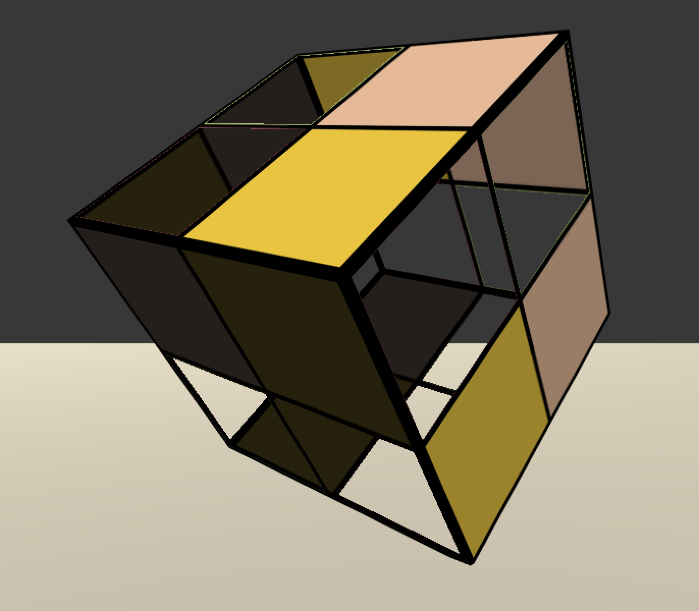

## 透明度混合的双面渲染

与透明度测试相比，让透明度混合实现双面渲染会更复杂一些，这是由于**透明度混合需要关闭深度写入**，而这是**一切混乱的开端**。

想要得到正确的透明效果，**渲染顺序是非常重要的**——保证图元是**从后往前**渲染的。

- 对于**透明度测试**，由于**未关闭深度写入**，因此可以**利用深度缓冲逐像素的粒度进行深度排序**，从而保证渲染的正确性。
- 一旦**关闭深度写入**，需要**小心地控制渲染顺序来得到正确的深度关系**。如果**直接关闭剔除功能**，则无法保证同一物体的正面和背面图元的渲染顺序，可能**得到错误的半透明效果**。

为此，把双面渲染的工作**分成两个Pass**：

- 第一个Pass只渲染**背面**
- 第二个Pass只渲染**正面**

由于Unity会**顺序执行SubShader中的各个Pass**，因此可以保证**背面总是在正面被渲染之前渲染**，从而保证正确的深度渲染关系。

1. 在Unity中新建一个场景，默认情况下场景包含**一个摄像机和一个平行光**，并且使用了**内置的天空盒子**。`Window->Lighting->Setting`中去掉场景中的天空盒子

2. 新建一个材质，材质名：`AlphaTestBothSidedMat`
3. 新建一个Unity Shader，名称为`AlphaTestBothSided`，将其赋给第2步的材质
4. 场景中创建一个立方体，并把第2步中的材质赋给该模型。创建一个平面，使得平面位于立方体下方
5. 保存场景

打开第3步的Shader，输入以下代码：

```c++
// Upgrade NOTE: replaced '_Object2World' with 'unity_ObjectToWorld'
// Upgrade NOTE: replaced 'mul(UNITY_MATRIX_MVP,*)' with 'UnityObjectToClipPos(*)'

Shader "Unity Shaders Book/Chapter 8/Alpha Blend With Both Side" {
	Properties {
		_Color ("Color Tint", Color) = (1, 1, 1, 1)
		_MainTex ("Main Tex", 2D) = "white" {}
		_AlphaScale ("Alpha Scale", Range(0, 1)) = 1
	}
	SubShader {
		Tags {"Queue"="Transparent" "IgnoreProjector"="True" "RenderType"="Transparent"}
		
		// 复制原Pass,得到另一个Pass
		Pass {
			Tags { "LightMode"="ForwardBase" }
			
			// First pass renders only back faces 
			// 在两个Pass中分别使用Cull指令剔除不同朝向的渲染图元
			Cull Front
			
			ZWrite Off
			Blend SrcAlpha OneMinusSrcAlpha
			
			CGPROGRAM
			
			#pragma vertex vert
			#pragma fragment frag
			
			#include "Lighting.cginc"
			
			fixed4 _Color;
			sampler2D _MainTex;
			float4 _MainTex_ST;
			fixed _AlphaScale;
			
			struct a2v {
				float4 vertex : POSITION;
				float3 normal : NORMAL;
				float4 texcoord : TEXCOORD0;
			};
			
			struct v2f {
				float4 pos : SV_POSITION;
				float3 worldNormal : TEXCOORD0;
				float3 worldPos : TEXCOORD1;
				float2 uv : TEXCOORD2;
			};
			
			v2f vert(a2v v) {
				v2f o;
				o.pos = UnityObjectToClipPos(v.vertex);
				
				o.worldNormal = UnityObjectToWorldNormal(v.normal);
				
				o.worldPos = mul(unity_ObjectToWorld, v.vertex).xyz;
				
				o.uv = TRANSFORM_TEX(v.texcoord, _MainTex);
				
				return o;
			}
			
			fixed4 frag(v2f i) : SV_Target {
				fixed3 worldNormal = normalize(i.worldNormal);
				fixed3 worldLightDir = normalize(UnityWorldSpaceLightDir(i.worldPos));
				
				fixed4 texColor = tex2D(_MainTex, i.uv);
				
				fixed3 albedo = texColor.rgb * _Color.rgb;
				
				fixed3 ambient = UNITY_LIGHTMODEL_AMBIENT.xyz * albedo;
				
				fixed3 diffuse = _LightColor0.rgb * albedo * max(0, dot(worldNormal, worldLightDir));
				
				return fixed4(ambient + diffuse, texColor.a * _AlphaScale);
			}
			
			ENDCG
		}
		
		Pass {
			Tags { "LightMode"="ForwardBase" }
			
			// Second pass renders only front faces 
			Cull Back
			
			ZWrite Off
			Blend SrcAlpha OneMinusSrcAlpha
			
			CGPROGRAM
			
			#pragma vertex vert
			#pragma fragment frag
			
			#include "Lighting.cginc"
			
			fixed4 _Color;
			sampler2D _MainTex;
			float4 _MainTex_ST;
			fixed _AlphaScale;
			
			struct a2v {
				float4 vertex : POSITION;
				float3 normal : NORMAL;
				float4 texcoord : TEXCOORD0;
			};
			
			struct v2f {
				float4 pos : SV_POSITION;
				float3 worldNormal : TEXCOORD0;
				float3 worldPos : TEXCOORD1;
				float2 uv : TEXCOORD2;
			};
			
			v2f vert(a2v v) {
				v2f o;
				o.pos = UnityObjectToClipPos(v.vertex);
				
				o.worldNormal = UnityObjectToWorldNormal(v.normal);
				
				o.worldPos = mul(unity_ObjectToWorld, v.vertex).xyz;
				
				o.uv = TRANSFORM_TEX(v.texcoord, _MainTex);
				
				return o;
			}
			
			fixed4 frag(v2f i) : SV_Target {
				fixed3 worldNormal = normalize(i.worldNormal);
				fixed3 worldLightDir = normalize(UnityWorldSpaceLightDir(i.worldPos));
				
				fixed4 texColor = tex2D(_MainTex, i.uv);
				
				fixed3 albedo = texColor.rgb * _Color.rgb;
				
				fixed3 ambient = UNITY_LIGHTMODEL_AMBIENT.xyz * albedo;
				
				fixed3 diffuse = _LightColor0.rgb * albedo * max(0, dot(worldNormal, worldLightDir));
				
				return fixed4(ambient + diffuse, texColor.a * _AlphaScale);
			}
			
			ENDCG
		}
	} 
	FallBack "Transparent/VertexLit"
}
```

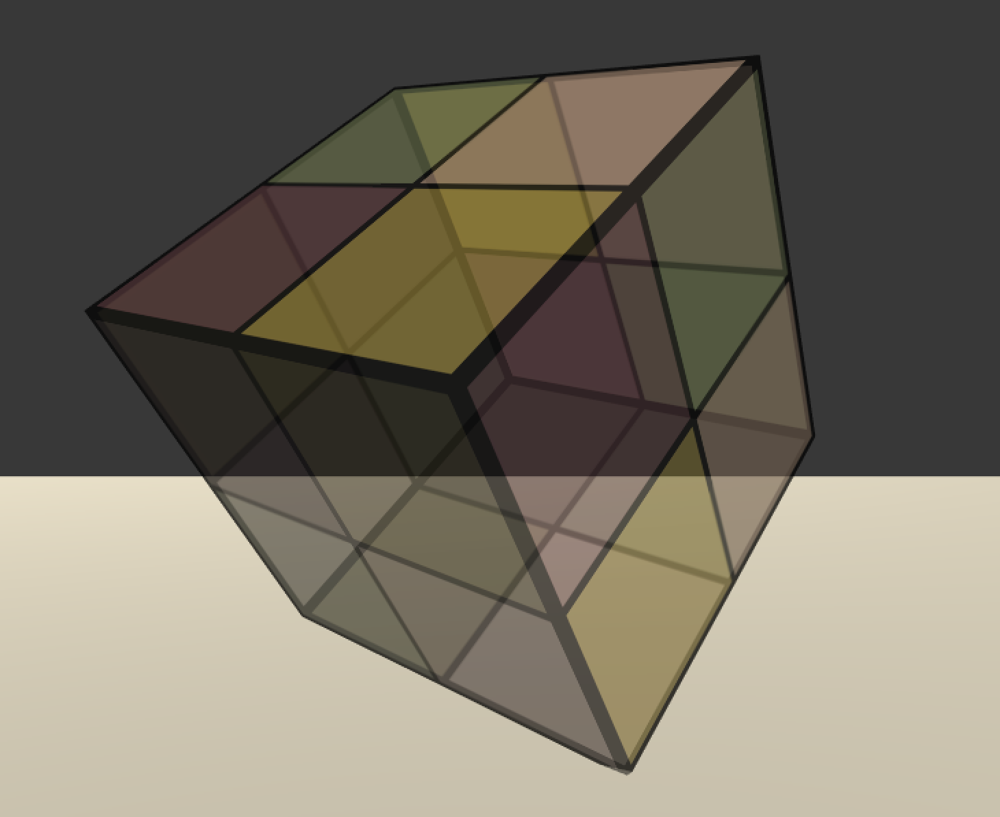
