之前的场景**仅有一个光源且光源类型是平行光**，但在实际游戏开发中，需要**处理数目更多、类型更复杂**的光源。更重要的是，想要得到**阴影**。

# Unity的渲染路径

Unity中，**渲染路径（Rendering Path）**决定**光照是如何应用到Unity Shader中的**。

如果要和光源打交道，需要**为Shader的每个Pass指定它使用的渲染路径**，这样光照计算才能被**正确执行**。

Unity支持多种类型的**渲染路径**：

- **前向渲染路径（Forward Rendering Path）**
- **延迟渲染路径（Deferred Rendering Path）**
- **顶点照明渲染路径（Vertex Lit Rendering Path）**

多数情况下，一个项目只使用一种渲染路径，因此可以**为整个项目设置渲染时的渲染路径**。

可以通过在Unity的`Edit->Project Setting->Player->Other Setting->Rendering Path`中选择项目所需的渲染路径。（默认情况下是**前向渲染路径**）

有时希望使用**多个渲染路径**，例如**摄像机A渲染的物体使用前向渲染路径**，而**摄像机B渲染的物体使用延迟渲染路径**。（可以在**每个摄像机的渲染路径设置中设置该摄像机使用的渲染路径**，以覆盖Project Setting中的设置）

注意：如果在摄像机的`Rendering Path`选择了`Use Player Settings`，则这个摄像机会使用`Project Setting`中的设置，否则就会覆盖掉`Project Setting`中的设置。

如果**当前的显卡并不支持所选择的渲染路径**，Unity会**自动使用更低一级**的渲染路径。（例如GPU不支持延迟渲染，则Unity就会使用前向渲染）

完成上述设置后，可以**在每个Pass中使用标签**来指定该Pass使用的渲染路径。通过**设置Pass的LightMode标签**实现。不同类型的渲染路径可能会包含多种标签设置。

```c++
Pass {
  	// 该Pass使用前向渲染路径中的ForwardBase路径
  	// 前向渲染路径还有一种路径叫做ForwardAdd
    Tags {"LightMode" = "ForwardBase"}
}
```

下表给出了Pass的LightMode标签支持的渲染路径设置选项。

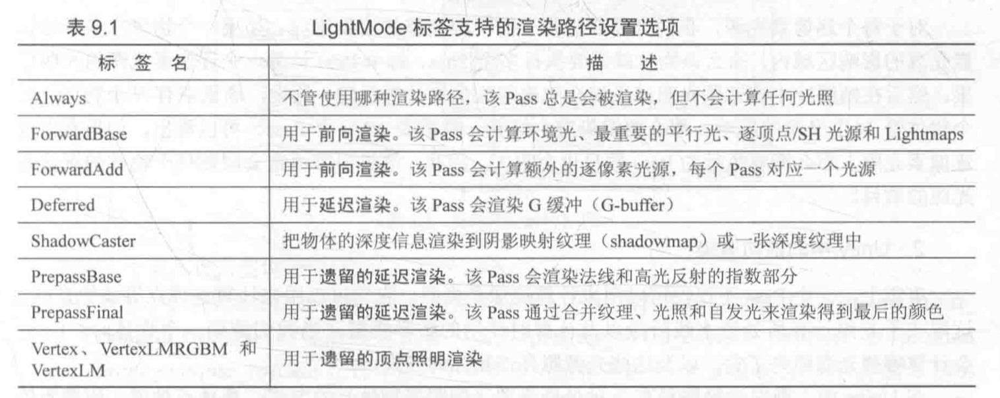

指定渲染路径是**和Unity的底层渲染引擎的一次重要的沟通**。

如果**为一个Pass设置了前向渲染路径的标签**，相当于让Unity把光照属性都按前向渲染的流程准备好。随后可以**通过Unity提供的内置光照变量来访问这些属性**。

如果没有指定任何渲染路径（实际上**如果使用了前向渲染又没有为Pass指定任何前向渲染适合的标签**，则会被当成一个和顶点照明渲染路径等同的Pass），则一些**光照变量**可能不会被正确赋值，**计算出的效果**也很有可能是**错误的**。

## 前向渲染路径

前向渲染路径是**传统的渲染方式**，也是最常用的一种渲染路径。

### 前向渲染路径的原理

每进行一次**完整的前向渲染**，需要渲染该对象的**渲染图元**，并计算**两个缓冲区**的信息：

- 一个是**颜色缓冲区**
- 一个是**深度缓冲区**

利用**深度缓冲区决定一个片元是否可见**，如果**可见就更新颜色缓冲区中的颜色值**。

前向渲染路径的大致过程**伪代码**：

```c++
Pass {
		for (each primitive in this model){
        for (each fragment covered by this primitive) {
            if (failed in depth test) {
                // 如果没有通过深度测试, 说明该片元是不可见的
                discard;
            } else {
                // 如果该片元可见
                // 就进行光照计算
                float4 color = Shading(materialInfo, pos, normal, lightDir, viewDir);
                // 更新帧缓冲
                writeFrameBuffer(fragment, color);
            }
        }
    }
}
```

对于**每个逐像素光源**，需要进行上面一次**完整的渲染流程**。

如果一个物体在**多个逐像素光源的影响区域内**，则该物体就需要执行多个`Pass`，每个`Pass`计算一个逐像素光源的光照结果，然后**在帧缓冲中把这些光照结果混合起来得到最终的颜色值**。

假设，场景中**有N个物体**，每个物体受**M个光源**的影响，则渲染整个场景一共需要**N*M个Pass**。可以看出，如果有大量逐像素光照，则需要执行的Pass数目也会很大。

因此，**渲染引擎会限制每个物体的逐像素光照的数目**。

### Unity中的前向渲染

一个Pass不仅仅可以用于计算**逐像素的光照**，也可以用于计算**逐顶点等其他光照**。

这取决于光照计算所处**流水线阶段**以及计算时使用的**数学模型**。

当渲染一个物体时，Unity会计算**哪些光源照亮了它**，以及**这些光源照亮该物体的方式**。

Unity中，前向渲染路径有3种处理光照（照亮物体）的方式：

- **逐顶点处理**
- **逐像素处理**
- **球谐函数（Spherical Harmonics，SH）处理**

决定**一个光源使用哪种处理模式**取决于它的**类型和渲染模式**：

- **光源类型**：该光源是平行光还是其他类型的光源
- **光源渲染模式**：该光源是否是重要的，如果把一个光照的模式设置为`Important`，则Unity会把它当成一个逐像素光源来处理。

可以在光源的**Light组件**中设置这些属性。

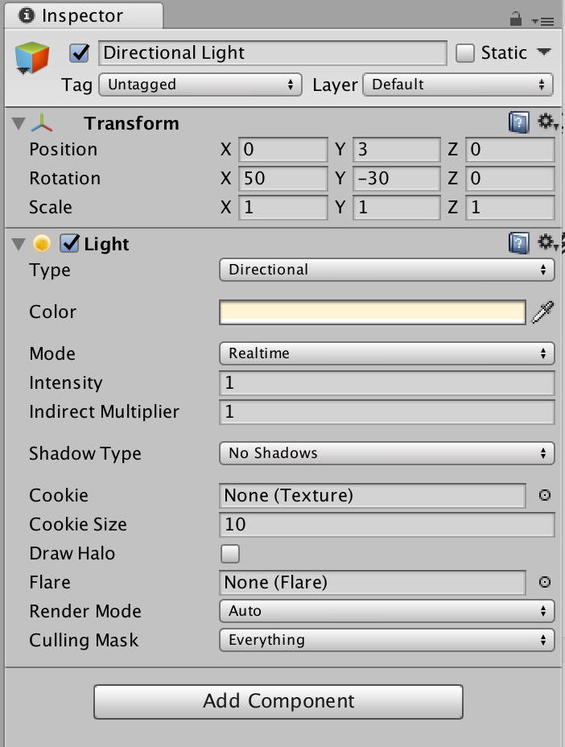

前向渲染中，当渲染一个物体时，**Unity会根据场景中各个光源的设置以及这些光源对物体的影响程度**（距离该物体的远近、光源强度等）对这些光源进行一个**重要度排序**。

其中，一定数目的光源会**按逐像素的方式处理**，然后**最多有4个光源按逐顶点的方式处理**，**剩下的光源可以按SH方式处理**。Unity使用的判断规则如下：

- 场景中最亮的平行光总是按逐像素处理。
- 渲染模式被设置成**Not Important**的光源，会按逐顶点或者SH处理。
- 渲染模式被设置成**Important**的光源，会按逐像素处理。
- 如果根据以上规则得到的逐像素光源数量小于**Quality Setting**中的逐像素光源数目（Pixel Light Count），**会有更多的光源以逐像素的方式进行渲染**。

在Pass里进行光照计算，前向渲染有**两种Pass**：

- **Base Pass**
- **Additional Pass**

通常来说，这两种Pass进行的**标签**和**渲染设置**以及**常规光照计算**如下图所示：

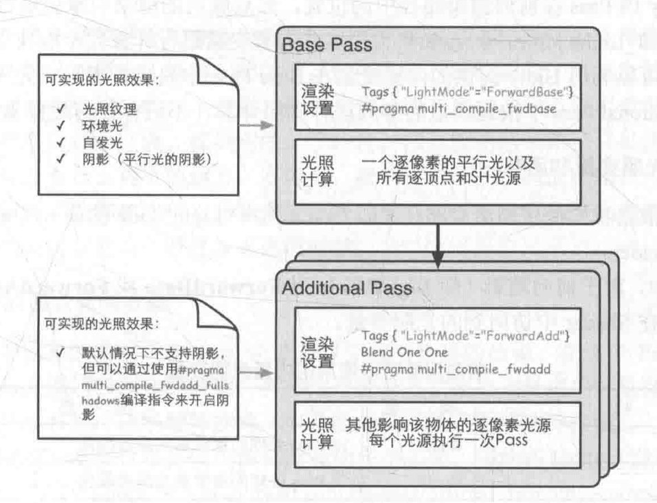

- 渲染设置中，除了**设置Pass的标签外**，还使用`#pragma multi_compile_fwdbase`或`#pragma multi_compile_fwdadd`这样的编译指令，实验表明，只有分别为**Base Pass**和**Additional Pass**使用这两个编译指令，才可以**在相关的Pass中得到一些正确的光照变量**（例如光照衰减值）。
- **Base Pass**中渲染的平行光默认是**支持阴影的**（如果开启了光源的阴影功能），而**Additional Pass**中渲染的光源在默认情况下是没有阴影效果的，即便在它的Light组件中设置了有阴影的**Shadow Type**。可以在**Additional Pass**中使用`#pragma multi_compile_fwdadd_fullshadows`代替`#pragma multi_compile_fwdadd`编译指令，**为点光源和聚光灯开启阴影效果**，但这需要Unity在内部**使用更多的Shader变种**。
- 环境光和自发光也是在**Base Pass**中计算的，这是因为，对于一个物体来说，**环境光和自发光只希望计算一次**，而如果在**Additional Pass**中计算这两种光照，就会造成叠加多次环境光和自发光，这是错误的。
- 在**Additional Pass**的渲染设置中，还**开启和设置了混合模式**，因此我们希望每个**Additional Pass**可以与上一次的光照结果在帧缓存中进行叠加，从而**得到最终的有多个光照的渲染效果**。如果**没有开启和设置混合模式**，则Additional Pass的渲染结果会覆盖掉之前的渲染结果，**看起来好像该物体只受该光源的影响**。通常情况下，选择的混合模式是`Blend One One`。
- 对于**前向渲染**来说，一个**Unity Shader**通常会定义一个**Base Pass**（Base Pass也可以定义多次，例如需要双面渲染等情况）以及一个**Additional Pass**。一个**Base Pass**仅会执行一次（定义多个Base Pass的情况除外），而一个**Additional Pass**会根据**影响该物体的其他逐像素光源的数目被多次调用**，即每个逐像素光源会执行一次Additional Pass。

上图给出的光照计算是**通常情况下在每种Pass中进行的计算**，实际上，**渲染路径的设置用于告诉Unity该Pass在前向渲染路径中的位置**，然后底层的**渲染引擎会进行相关计算并填充一些内置变量**（如`_LightColor0`等）。如何使用这些内置变量进行计算完全取决于开发者的选择。

（例如，完全可以利用Unity提供的内置变量在**Base Pass**中只进行逐顶点光照；同样，也完全可以在**Additional Pass**中按逐顶点的方式进行光照计算，**不进行任何逐像素光照计算**）

### 内置的光照变量和函数

根据使用的渲染路径（**Pass标签中LightMode的值**），Unity把不同的**光照变量**传递给Shader。

对于**前向渲染**（即**LightMode**为**ForwardBase**或**ForwardAdd**）来说，下表给出可以**在Shader中访问到的光照变量**：

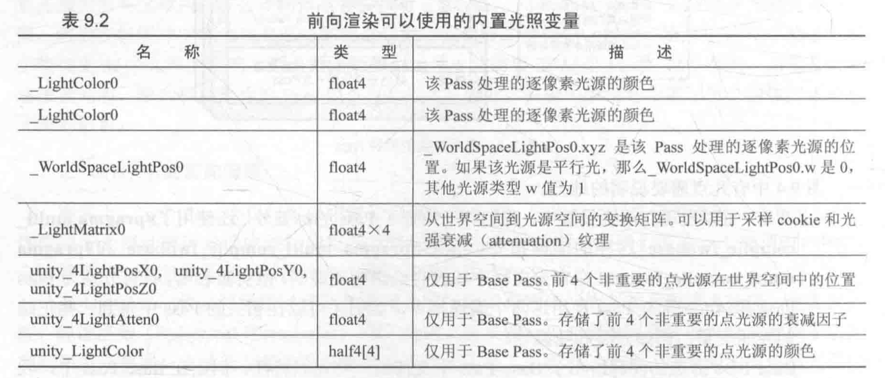

下表列出了**前向渲染中可以使用的内置光照函数**：

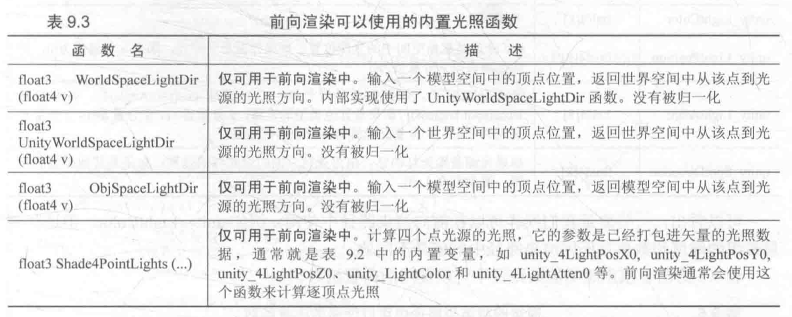

需要说明的是，上面给出的变量和函数**并不是完整的**。

## 顶点照明渲染路径

顶点照明渲染路径是**对硬件配置要求最少**、**运算性能最高**，但同时也是**得到的效果最差**的一种类型。

它不支持那些**逐像素才能得到的效果**，例如**阴影**、**法线映射**、**高精度的高光反射**等。

实际上，其仅仅是**前向渲染路径的一个子集**，所有可以在**顶点照明渲染路径中实现的功能**都可以在**前向渲染路径中完成**。

**顶点照明渲染路径只是使用了逐顶点的方式来计算光照**，并没有什么神奇的地方，但如果选择使用顶点照明渲染路径，则Unity只会填充那些逐顶点相关的光源变量，意味着**不可以使用一些逐像素光照变量**。

### Unity中的顶点照明渲染

顶点照明渲染路径**通常在一个Pass中就可以完成对物体的渲染**。

在这个Pass中，会**计算关心的所有光源对该物体的照明**，并且这个计算是逐顶点处理的。

这是Unity中**最快速的渲染路径**，并且具有**最广泛的硬件支持**（但是游戏机上并不支持这种路径）。

### 可访问的内置变量和函数

Unity中，可以**在一个顶点照明的Pass中最多访问8个逐顶点光源**。

如果只需要**渲染其中两个光源对物体的照明**，可以仅使用下表**中内置光照数据的前两个**。

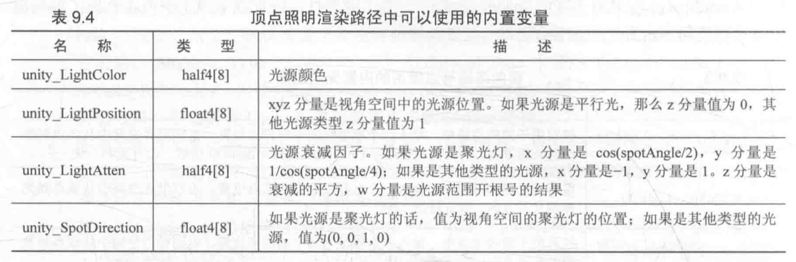

如果**影响该物体的光源数目小于8**，则数组中剩下的光源颜色**会设置成黑色**。

一些变量**同样可以在前向渲染路径中使用**（例如：`unity_LightColor`），但**这些变量数组的维度和数值在不同渲染路径中的值是不同的**。

下表给出了**顶点照明渲染路径中可以使用的内置函数**：

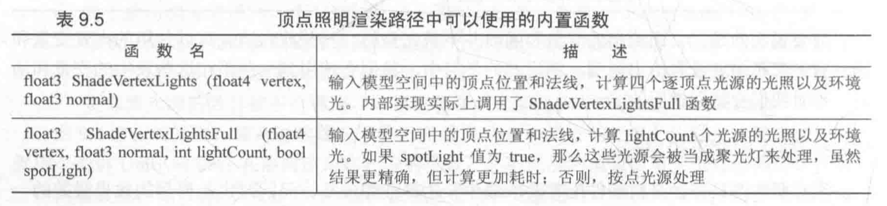

## 延迟渲染路径

**前向渲染存在的问题**：当场景中包含**大量实时光源**时，前向渲染的**性能会急速下降**。

（例如，如果在场景的**某一块区域放置多个光源**，这些**光源影响的区域互相重叠**，则为了得到最终的光照效果，就需要**为该区域内的每个物体执行多个Pass来计算不同光源对该物体的光照结果**，然后在颜色缓存中把这些结果混合起来得到**最终的光照**。然而每执行一个Pass都需要**重新渲染一遍物体**，包含很多**重复计算**）

延迟渲染是一种**更古老的渲染方法**，由于前向渲染可能造成的**瓶颈问题**，近几年**延迟渲染又流行起来**。

除了前向渲染中使用的**颜色缓冲和深度缓冲**，延迟渲染还会利用额外的**G缓冲（Geometry-Buffer）**。G缓冲区存储所有关心的表面（通常指的是离摄像机最近的表面）的其他信息，例如**该表面的法线、位置、用于光照计算的材质属性**等。

### 延迟渲染的原理

延迟渲染主要包括**两个Pass**：

- **第一个Pass中**，不进行任何光照计算，而是**仅仅计算哪些片元是可见的，主要通过深度缓冲计算实现**。当发现一个片区是可见的，就把它的相关信息存储到**G缓冲区**中。
- **第二个Pass中**，利用G缓冲区的**各个片元信息**（例如表面法线、视角方向、漫反射系数等）**进行真正的光照计算**。

延迟渲染的**伪代码**：

```c++
Pass 1 {
		// 第一个Pass不进行真正的光照计算
		// 仅仅把光照计算需要的信息存储到G缓冲中
		for (each primitive in this model) {
        for (each fragment covered by this primitive) {
            if (failed in depth test) {
                // 如果没有通过深度测试, 说明该片元是不可见的
                discard;
            } else {
                // 如果该片元可见
                // 就把需要的信息存储到G缓冲中
                writeGBuffer(materialInfo, pos, normal, lightDir, viewDir);
            }
        }
    }
}

Pass 2 {
    // 利用G缓冲中的信息进行真正的光照计算
    for (each pixel in the screen) {
        if (the pixel is valid) {
            // 如果该像素是有效地
            // 读取它对应的G缓冲中的信息
            readGBuffer(pixel, materialInfo, pos, normal, lightDir, viewDir);
            
            // 根据读取到的信息进行光照计算
            float4 color = Shading(materialInfo, pos, normal, lightDir, viewDir);
            // 更新版帧缓冲
            writeFrameBuffer(pixel, color)
        }
    }
}
```

延迟渲染使用的**Pass数目**通常就是两个，这**与场景中包含的光源数目没有任何关系**。

即，延迟渲染的效率**不依赖于场景的复杂度**，而是与**使用的屏幕空间大小有关**。这是因为**需要的信息都存储在缓冲区中**，而这些缓冲区可以理解是**一张张2D图像**，最后的计算实际上就是在这些图像空间中进行的。

### Unity中的延迟渲染

如果游戏中**使用了大量的实时光照**，则希望**选择延迟渲染路径**（前向渲染会造成性能瓶颈），延迟渲染路径中的每个光源都可以按**逐像素**的方式处理，但**这种路径需要一定的硬件支持**。

延迟渲染的**缺点**：

- **不支持真正的抗锯齿**（anti-aliasing）功能
- **不能处理半透明物体**
- **对显卡有要求**，显卡必须支持**MRT（Multiple Render Targets）**、**Shader Mode 3.0**及以上、**深度渲染纹理**以及**双面的模板缓冲**。

当使用延迟渲染时，Unity要求提供**两个Pass**：

1. 第一个Pass用于**渲染G缓冲**，该Pass会把物体的**漫反射颜色**、**高光反射颜色**、**平滑度**、**法线**、**自发光**和**深度**等信息渲染到**屏幕空间的G缓冲区**中。对于每个物体来说，这个Pass仅会执行一次。
2. 第二个Pass用于**计算真正的光照模型**，这个Pass会**使用上一个Pass中渲染的数据**来计算最终的光照颜色，再存储到帧缓冲中。

默认的**G缓冲区**包含以下几个**渲染纹理（Render Texture，RT）**

- **RT0**：格式是ARGB32，RGB通道用于存储**漫反射颜色**，A通道没有被使用。
- **RT1**：格式是ARGB32，RGB通道用于存储**高光反射颜色**，A通道用于存储**高光反射的指数部分**。
- **RT2**：格式是ARGB2101010，RGB通道用于存储**法线**，A通道没有被使用。
- **RT3**：格式是ARGB32（非HDR）或ARGBHalf（HDR），用于存储**自发光+lightmap+反射探针（reflection probes）**。

当第二个Pass计算光照时，默认情况下**仅可以使用Unity内置的Standard光照模型**。如果想要使用其他光照模型，需要替换掉原有的`Internal-DeferredShading.shader`文件。

### 可访问的变量和函数

下表给出了处理延迟渲染路径可以使用的**光照变量**：

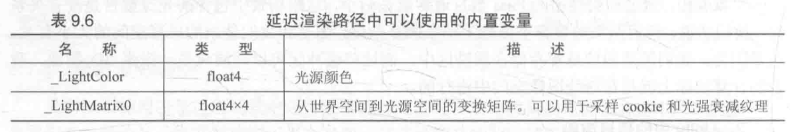

这些变量都可以在`UnityDeferredLibrary.cginc`文件中找到它们的声明。


# Unity的光源类型

Unity一种支持**4种光源类型**：

- 平行光
- 点光源
- 聚光灯
- 面光源（area light）：仅在烘焙时才可发挥作用。

由于**每种光源的几何定义不同**，因此它们**对应的光源属性也就各不相同**。

## 光源类型

最常使用的光源属性有光源的**位置**、**方向（到某点的方向）**、**颜色**、**强度**以及**衰减（到某点的衰减，与该点到光源的距离有关）**。这些属性和它们的集合定义息息相关。

### 平行光

几何定义**最简单**。

平行光可以**照亮的范围**是没有限制的，通常作为**太阳这样的角色**在场景中出现。

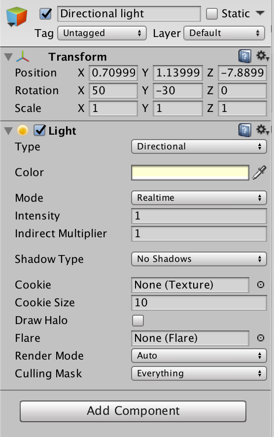

平行光之所以简单，是因为**它没有一个唯一的位置**。可以放在场景中的任意位置（总感觉太阳跟着我们一起移动），它的几何属性只有方向，可以调整平行光的**Transform组件**中的**Rotation属性**来改变它的光源方向，并且**平行光到场景中所有点的方向都是一样的**。

由于**平行光没有一个具体的位置**，因此也**没有衰减的概念**，即，**光照强度不会随着距离而发生改变**。

### 点光源

点光源的**照亮空间是有限的**，由空间中的一个**球体定义**，点光源可以表示由一个点发出的、向所有方向延伸的光。

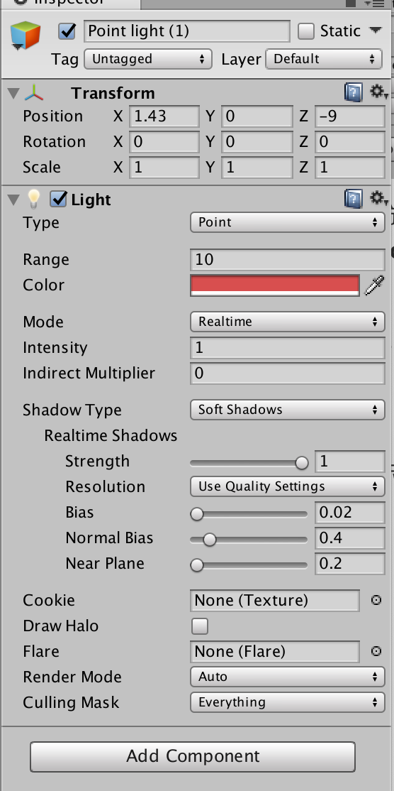

需要在Scene视图中**开启光照**才能看到**预览光源是如何影响场景中的物体的**。

**球体的半径**可以由面板中的**Range属性**来调整，也可以在Scene视图中直接**拖拉点光源的线框**（球体上的黄色控制点）来修改它的属性。

点光源有**位置属性**，由**Transform组件**中的**Position属性**定义。

对于**方向属性**，需要用**点光源的位置减去某点的位置来得到它到该点的方向**。

点光源的**颜色**和**强度**可以在**Light组件面板**中调整。

点光源**会衰减**，随着物体**逐渐远离点光源**，它**接收到的光照强度也会逐渐减小**。

点光源**球心处的光照强度最强**，**球体边界处的最弱，值为0**，中间的**衰减值可以由一个函数定义**。

### 聚光灯

最复杂的一种，它的照亮空间是有限的，但不再是简单的球体，而是由空间中的一块**锥形区域**定义的。

聚光灯表示**由一个特定位置出发，向特定方向延伸的光**。

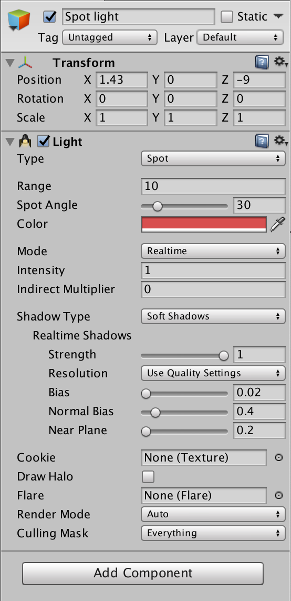

锥形区域的**半径由面板中的Range属性决定**，而锥体的**张开角度由Spot Angle属性决定**。

可以在Scene视图中直接**拖拉聚光灯的线框**（中间的黄色控制点和四周的黄色控制点）来修改它的属性。

聚光灯的**位置属性**，由**Transform组件**中的**Position属性**定义。

对于**方向属性**，需要用**聚光灯的位置减去某点的位置来得到它到该点的方向**。

聚光灯**会衰减**，随着物体**逐渐远离聚光灯**，它**接收到的光照强度也会逐渐减小**。

锥形的**顶点处光照最强**，锥形的**边界处强度为0**，其中间的衰减值可以由一个函数定义，这个函数相对于点光源衰减计算公式要更复杂，因为需要**额外判断一个点是否在锥体的范围内**。

## 前向渲染中处理不同的光源类型

如何在Unity Shader中访问它们的**5个属性**：**位置**、**方向**、**颜色**、**强度**以及**衰减**。

### 实践

1. 在Unity中新建一个场景，默认情况下场景包含**一个摄像机和一个平行光**，并且使用了**内置的天空盒子**。`Window->Lighting->Setting`中去掉场景中的天空盒子
2. 新建一个材质，材质名：`ForwardRenderingMat`
3. 新建一个Unity Shader，名称为`ForwardRender`，将其赋给第2步的材质
4. 场景中创建一个胶囊体，并把第2步中的材质赋给该胶囊体
5. 为了让物体受多个光源的影响，再新建一个点光源，把其颜色设为绿色，以和平行光进行区分
6. 保存场景

编写的代码使用了**Blinn-Phong光照模型**，并为**前向渲染**定义了**Base Pass**和**Additional Pass**来处理多个光源。

代码如下：

```c++
// Upgrade NOTE: replaced '_LightMatrix0' with 'unity_WorldToLight'
// Upgrade NOTE: replaced '_Object2World' with 'unity_ObjectToWorld'
// Upgrade NOTE: replaced 'mul(UNITY_MATRIX_MVP,*)' with 'UnityObjectToClipPos(*)'

Shader "Unity Shaders Book/Chapter 9/Forward Rendering" {
	Properties {
		_Diffuse ("Diffuse", Color) = (1, 1, 1, 1)
		_Specular ("Specular", Color) = (1, 1, 1, 1)
		_Gloss ("Gloss", Range(8.0, 256)) = 20
	}
	SubShader {
		Tags { "RenderType"="Opaque" }
		
		// 定义Base Pass
		Pass {
			// Pass for ambient light & first pixel light (directional light)
			// 设置该Pass的渲染路径标签
			Tags { "LightMode"="ForwardBase" }
		
			CGPROGRAM
			
			// Apparently need to add this declaration
			// 除了设置渲染路径外,还使用#pragma编译指令
			// 保证在Shader中使用光照衰减等光照变量可以被正确赋值 
			#pragma multi_compile_fwdbase	
			
			#pragma vertex vert
			#pragma fragment frag
			
			#include "Lighting.cginc"
			
			fixed4 _Diffuse;
			fixed4 _Specular;
			float _Gloss;
			
			struct a2v {
				float4 vertex : POSITION;
				float3 normal : NORMAL;
			};
			
			struct v2f {
				float4 pos : SV_POSITION;
				float3 worldNormal : TEXCOORD0;
				float3 worldPos : TEXCOORD1;
			};
			
			v2f vert(a2v v) {
				v2f o;
				o.pos = UnityObjectToClipPos(v.vertex);
				
				o.worldNormal = UnityObjectToWorldNormal(v.normal);
				
				o.worldPos = mul(unity_ObjectToWorld, v.vertex).xyz;
				
				return o;
			}
			
			fixed4 frag(v2f i) : SV_Target {
				fixed3 worldNormal = normalize(i.worldNormal);
				// 使用_WorldSpaceLightPos0得到这个平行光的方向(位置对于平行光来说没有意义)
				fixed3 worldLightDir = normalize(_WorldSpaceLightPos0.xyz);
				
				// 计算场景中的环境光,只计算一次,之后的Additional Pass不会再计算该部分
				// 与此相同的还有自发光
				fixed3 ambient = UNITY_LIGHTMODEL_AMBIENT.xyz;
				
				// 之后处理场景中最重要的平行光,该场景中只有一个平行光
				// 如果场景中包含多个平行光,Unity会选择最亮的平行光传递给Base PAss进行逐像素处理
				// 其他平行光会按照逐顶点或在Additional Pass中按逐像素的方式处理
				// 如果场景中没有任何平行光,则Base Pass会当成全黑的光源处理
				// 每一个光源有5个属性:位置/方向/颜色/强度/衰减
				// Base Pass来说,它处理的逐像素光源类型一定是平行光
				// 使用_LightColor0得到平行光的颜色和强度(_LightColor0已经是颜色和强度相乘后的结果)
			 	fixed3 diffuse = _LightColor0.rgb * _Diffuse.rgb * max(0, dot(worldNormal, worldLightDir));

			 	fixed3 viewDir = normalize(_WorldSpaceCameraPos.xyz - i.worldPos.xyz);
			 	fixed3 halfDir = normalize(worldLightDir + viewDir);
			 	fixed3 specular = _LightColor0.rgb * _Specular.rgb * pow(max(0, dot(worldNormal, halfDir)), _Gloss);

				// 由于平行光可以认为是没有衰减的,因此这里直接令衰减值为1.0
				fixed atten = 1.0;
				
				return fixed4(ambient + (diffuse + specular) * atten, 1.0);
			}
			
			ENDCG
		}

		// 为场景中其他逐像素光源定义Additional Pass
		Pass {
			// Pass for other pixel lights
			// 设置Pass的渲染路径标签
			Tags { "LightMode"="ForwardAdd" }
			
			// 使用Blend命令开启和设置混合模式
			// 希望Additional Pass计算得到的光照结果可以在帧缓存中与之前的光照结果进行叠加
			// 如果没有使用Blend命令的话,Additional Pass会直接覆盖掉之前的光照结果
			// 混合系数选择的是Blend One One,也可以是其他
			Blend One One
		
			CGPROGRAM
			
			// Apparently need to add this declaration
			// 使用multi_compile_fwdadd指令,保证在Additional Pass中访问到正确的光照变量
			#pragma multi_compile_fwdadd
			
			#pragma vertex vert
			#pragma fragment frag
			
			#include "Lighting.cginc"
			#include "AutoLight.cginc"
			
			fixed4 _Diffuse;
			fixed4 _Specular;
			float _Gloss;
			
			struct a2v {
				float4 vertex : POSITION;
				float3 normal : NORMAL;
			};
			
			struct v2f {
				float4 pos : SV_POSITION;
				float3 worldNormal : TEXCOORD0;
				float3 worldPos : TEXCOORD1;
			};
			
			v2f vert(a2v v) {
				v2f o;
				o.pos = UnityObjectToClipPos(v.vertex);
				
				o.worldNormal = UnityObjectToWorldNormal(v.normal);
				
				o.worldPos = mul(unity_ObjectToWorld, v.vertex).xyz;
				
				return o;
			}
			
			// 通常来说,Additional Pass的光照处理和Base Pass的处理方式是一样的
			// 因此只需要把Base Pass的顶点和片元着色器代码贴到Additional Pass中,稍微修改一部分即可
			// 这些修改往往是去掉Base Pass中环境光/自发光/逐顶点光照/SH光照的部分,并添加一些对不同光源类型的支持
			fixed4 frag(v2f i) : SV_Target {
				// 在Additional Pass的片元着色器中,没有计算场景中的环境光
				fixed3 worldNormal = normalize(i.worldNormal);
				// 判断逐像素光源的类型,如果当前前向渲染的Pass处理的光源类型是平行光
				// 则Unity的底层渲染引擎就会定义USING_DIRECTIONAL_LIGHT
				// 如果是平行光,则光源方向可以直接由
				#ifdef USING_DIRECTIONAL_LIGHT_WorldSpaceLightPos0.xyz得到
					fixed3 worldLightDir = normalize(_WorldSpaceLightPos0.xyz);
				#else
				// 如果光源方向是点光源或聚光灯,则_WorldSpaceLightPos0表示的是世界空间下的光源位置
				// 光源方向需要用这个位置减去世界空间下的顶点位置
					fixed3 worldLightDir = normalize(_WorldSpaceLightPos0.xyz - i.worldPos.xyz);
				#endif
				
				// 由于Additional Pass处理的光源类型可能是平行光/点光源/聚光灯
				// 因此在计算光源的5个属性时,颜色和强度仍然可以使用_LightColor0来得到
				// 但对于位置/方向/和衰减属性,可以根据光源类型分别计算
				fixed3 diffuse = _LightColor0.rgb * _Diffuse.rgb * max(0, dot(worldNormal, worldLightDir));
				
				fixed3 viewDir = normalize(_WorldSpaceCameraPos.xyz - i.worldPos.xyz);
				fixed3 halfDir = normalize(worldLightDir + viewDir);
				fixed3 specular = _LightColor0.rgb * _Specular.rgb * pow(max(0, dot(worldNormal, halfDir)), _Gloss);
				
				// 处理不同光源的衰减
				#ifdef USING_DIRECTIONAL_LIGHT
				// 如果是平行光,衰减值为1.0
					fixed atten = 1.0;
				#else
				// 如果是其他光源类型,处理更复杂一些
				// 尽管可以使用数学表达式来计算给定点相对于点光源或聚光灯的衰减,但这些计算往往涉及开根号/除法等计算量较大的操作
				// 因此Unity使用一张纹理作为查找表(Lookup Table,LUT),以在片元着色器中得到光源的衰减
				// 首先得到光源空间下的坐标,然后使用该坐标对衰减纹理进行采样得到衰减值
					#if defined (POINT)
				        float3 lightCoord = mul(unity_WorldToLight, float4(i.worldPos, 1)).xyz;
				        fixed atten = tex2D(_LightTexture0, dot(lightCoord, lightCoord).rr).UNITY_ATTEN_CHANNEL;
				    #elif defined (SPOT)
				        float4 lightCoord = mul(unity_WorldToLight, float4(i.worldPos, 1));
				        fixed atten = (lightCoord.z > 0) * tex2D(_LightTexture0, lightCoord.xy / lightCoord.w + 0.5).w * tex2D(_LightTextureB0, dot(lightCoord, lightCoord).rr).UNITY_ATTEN_CHANNEL;
				    #else
				        fixed atten = 1.0;
				    #endif
				#endif

				return fixed4((diffuse + specular) * atten, 1.0);
			}
			
			ENDCG
		}
	}
	FallBack "Specular"
}
```

### Base Pass和Additional Pass的调用

1. 在Unity中新建一个场景，默认情况下场景包含**一个摄像机和一个平行光**，并且使用了**内置的天空盒子**。`Window->Lighting->Setting`中去掉场景中的天空盒子
2. 调整平行光的颜色为绿色
3. 场景中创建一个胶囊体，并把之前的`ForwardRenderingMat`材质赋给该胶囊体
4. 新建4个点光源，调整它们的颜色为相同的红色
5. 保存场景

当创建一个光源时，默认情况下它的**Render Mode**（可以在Light组件中设置）是**Auto**。

这意味着，Unity会在背后判断哪些光源会按**逐像素处理**，哪些按**逐顶点**或**SH**的方式处理。

由于没有更改`Edit->Project Settings->Quality->Pixel Light Count`中的数值，因此默认情况下一个物体**可以接收除最亮的平行光外的4个逐像素光照**。

该例子中，场景中包含5个光源，其中一个是平行光，它在`ForwardRendering`中的**Base Pass**中按**逐像素**的方式被处理；其余4个都是点光源，由于它们的**Render Mode为Auto且数目正好等于4**，因此都会在`ForwardRendering`的**Additional Pass**中逐像素的方式被处理，**每个光源会调用一次Additional Pass**。

可以使用**帧调试器（Frame Debugger）**查看场景的绘制过程，使用的方法是：在`Windows->Frame Debugger`中打开帧调试器。

从**帧调试器**中可以看出，渲染这个场景Unity一共进行了**6个渲染事件**，由于本例只包含一个物体，因此这6个渲染事件几乎都是用于**渲染该物体的光照结果**。可以通过**依次单击帧调试器中的渲染事件**，来**查看Unity是怎样渲染物体**的。

>第一个渲染事件中，Unity首先清除颜色、深度和模板缓冲，为后面的渲染做准备；
>
>第二个渲染事件中，Unity利用`ForwardRendering`的第一个Pass，即Base Pass，将平行光的光照渲染到帧缓存中；
>
>后面的四个渲染事件中，Unity使用`ForwardRendering`的第二个Pass，即Additional Pass，依次将4个点光源的光照应用到物体上，得到最后的渲染结果。
>
>Unity处理这些点光源的顺序是按照它们的**重要度**排序的。
>
>由于所有点光源的颜色和强度都相同，因此它们的重要度取决于**它们的距离胶囊体的远近**，因此首先绘制的是**距离胶囊体最近的点光源**。
>
>但是如果**光源的强度和颜色互不相同**，则距离就不再是唯一的衡量标准。（例如把现在距离最近的点光源的强度设为0.2，则从帧调试器中可以发现绘制顺序发生了变化，此时**首先绘制的是距离胶囊体第二近的点光源，最近的光源则会在最后被渲染**）
>
>Unity官方文档中并未给出**光源强度、颜色和距离物体的远近**是如何具体影响广义的重要度排序的，仅知道排序结果和这三者都有关系。

对于场景中的个物体，**如果它不在一个光源的光照范围内，Unity是不会为这个物体调用Pass来处理这个光源的**。

如果**逐像素光源**的数目很多，该物体的**Additional Pass**就会被调用多次，影响性能。可以通过把光源的**Render Mode设为Not Important**使得把该光源**不当成逐像素处理**。

如果把本例的**4个点光源的Render Mode都设为Not Important**，由于在`ForwardRendering`没有在**Base Pass**中计算**逐顶点和SH光源**，因此，场景中的4个点光源**实际上不会对物体造成任何影响**。如果把平行光的**Render Mode也设为Not Important**，则物体**仅显示环境光的光照结果**。

>如何在前向渲染路径的Base Pass中计算逐顶点和SH光？
>
>可以使用内置变量和函数来计算这些光源的光照效果。


# Unity 的光照衰减

Unity使用**一张纹理作为查找表**在片元着色器中**计算逐像素光照的衰减**。

**好处**：计算衰减不依赖于数学公式的复杂性，只需要使用一个参数值去纹理中采样即可。

**坏处**：

- 需要**预处理得到的采样纹理**，并且纹理的大小也会影响衰减的精度。
- **不直观也不方便**，一旦把数据存储到查找表中，就无法使用其他数学公式来计算衰减。

由于这种方法可以在一定程度上**提升性能**，并且得到的**效果在大部分情况下都是良好的**，因此Unity默认使用这种纹理查找的方法来计算逐像素的**点光源和聚光灯的衰减**。

## 用于光照衰减的纹理

Unity内部使用一种名为`_LightTexture0`的纹理来计算光源衰减。

如果对该光源**使用cookie**，则衰减查找纹理是`_LightTextureB0`。

通常只关心`_LightTexture0`对角线上的纹理颜色值，这些值表明在光源空间中不同位置的点的衰减值。

例如，`(0,0)`点表明**与光源位置重合的点的衰减值**，而`(1,1)`表明在光源空间中**所关心的距离最远的点的衰减**。

为了对`_LightTexture0`纹理采样得到**给定点到该光源的衰减值**，首先需要得到**该点在光源空间中的位置**，通过`_LightMatrix0`变换矩阵得到的。

`_LightTexture0`可以把顶点**从世界空间变换到光源空间**，因此，只需要把`_LightTexture0`和**世界空间中的顶点坐标相乘**即可得到光源空间中的相应位置。

```c++
float3 lightCoord = mul(_LightMatrix0, float4(i.worldPosition, 1)).xyz;
```

然后，使用这个**坐标的模的平方对衰减纹理进行采样**，得到衰减值。

```c++
fixed atten = tex2D(_LightTexture0, dot(lightCoord, lightCoord).rr).UNITY_ATTEN_CHANNEL;
```

上面代码中，使用**光源空间中顶点距离的平方（通过dot函数实现）**来对纹理采样，之所以没有使用距离值来采样是因为这种方法可以**避免开方操作**。

使用宏`UNITY_ATTEN_CHANNEL`得到**衰减纹理中的衰减值所在的分量**，以得到最终的衰减值。

## 使用数学公式计算衰减

尽管纹理采样的方法可以减少计算衰减时的复杂度，但有时希望**在代码中利用公式来计算光源的衰减**。

例如，下面计算光源的**线性衰减**：

```c++
float distance = length(_WorldSpaceLightPos0.xyz - i.worldPosition.xyz);
atten = 1.0 / distance;   // linear attenuation
```

Unity没有在文档中给出内置衰减计算的相关说明。

尽管可以**在片元着色器中利用数学公式计算衰减**，但由于无法在Shader中通过内置变量得到**光源的范围、聚光灯的朝向、张开角度**等信息，因此得到的效果往往不尽人意，尤其在**物体离开光源的照明范围时会发生突变**（因为如果物体不在该光源的照明范围内，Unity就不会为物体执行一个**Additional Pass**）。

当然可以**利用脚本将光源的相关信息传递给Shader**，但这样的灵活性很低。


# Unity的阴影

为了让场景看起来更加真实，具有深度信息，让**光源把一些物体的阴影投射到其他物体上**。

## 阴影实现

考虑真实生活中阴影是如何产生的。

当一个光源发射一条光线遇到一个不透明物体时，这条光线就**不可以再继续照亮其他物体（不考虑光线反射）**。

该物体就会**向周围物体投射阴影**，这些阴影区域的产生是因为光线无法达到这些区域。

实时渲染中，最常使用的是**Shadow Map技术**（Unity就是使用这种技术）。

> 首先把摄像机的位置放在与光源重合的位置上，则场景中该光源的阴影区域就是那些摄像机看不到的地方。

前向渲染路径中，**如果场景中最重要的平行光开启了阴影**，Unity就会为该光源计算它的**阴影映射纹理**（shadowmap），其本质上也是一张**深度图**，记录**从该光源位置出发，能看到的场景中距离它最近的表面位置**（深度信息）。

计算阴影映射纹理时，**如何判断距离它最近的表面位置**？

- 一种方法是，先**把摄像机放置在光源位置**，按正常渲染流程，调用**Base Pass**和**Additional Pass**来更新深度信息，得到阴影映射纹理。但该方法会**对性能造成一定的浪费**（仅需要**深度信息**而已，而**Pass中涉及很多复杂的光照模型计算**）。

为此，Unity使用一个**额外的Pass来专门更新光源的阴影映射纹理**，这个Pass的**LightMode**标签被设置为**ShadowCaster**，其渲染目标不是帧缓存，而是**阴影映射纹理（深度纹理）**。

Unity首先**把摄像机放置到光源的位置上**，然后**调用该Pass**，通过**对顶点变换后得到光源空间下的位置**，并据此**输出深度信息到阴影映射纹理中**。

当**开启光源的阴影效果后**，底层渲染引擎首先会在当前渲染物体的**Unity Shader**中找到**LightMode为ShadowCaster**的Pass。

- 如果没有，就会在**Fallback**指定的Unity Shader中继续寻找，如**果仍然没有找到，该物体就无法向其他物体投射阴影**（当仍然可以**接收来自其他物体的阴影**）。
- 如果找到，Unity会**使用该Pass来更新光源的阴影映射纹理**。

> **传统阴影映射纹理实现中**，会在正常渲染的Pass中把顶点位置变换到光源空间下，以得到它**在光源空间中的三维位置信息**。然后**使用xy分量对阴影映射纹理进行采样**，得到阴影映射纹理中**该位置的深度信息**。
>
> 如果**深度值小于该顶点的深度值**（通常由**z分量**得到），则说明**该点位于阴影中**。

Unity使用不同于这种传统的阴影采样技术，即**屏幕空间的阴影映射技术（Screenspace Shadow Map）**。屏幕空间的阴影映射原本是**延迟渲染中产生阴影的方法**。

**注意**：不是所有平台的Unity都使用这种技术，因为屏幕空间的阴影映射**需要显卡支持MRT**，而有些移动平台不支持这种特性。

当使用**屏幕空间的阴影映射技术**时，Unity首先会通过调用**LightMode为ShadowCaster**的Pass来得到**可投射阴影的光源的阴影映射纹理**以及**摄像机的深度纹理**。之后**根据光源的阴影映射纹理**和**摄像机的深度纹理**来得到**屏幕空间的阴影图**。

如果摄像机的深度图中记录的**表面深度大于转换到阴影纹理中的深度值**，就说明该表面虽然是可见的，但是却处于该光源的阴影中。通过这样的方式，**阴影图就包含了屏幕空间中所有有阴影的区域**。

如果**想要一个物体接收来自其他物体的阴影**，只需要在Shader中**对阴影图进行采样**。由于**阴影图是屏幕空间下的**，因此，首先需要**把表面坐标从模型空间变换到屏幕空间中**，然后**使用这个坐标对阴影图进行采样**即可。

总结，**一个物体接收来自其他物体的阴影，以及它向其他物体投射阴影**是两个过程：

- 如果想要一个物体接收来自其他物体的阴影，就必须**在Shader中对阴影映射纹理**（包括屏幕空间的阴影图）进行采样，并**把采样结果和最后的光照结果相乘来产生阴影效果**。
- 如果想要一个物体向其他物体投射阴影，就必须**把该物体加入到光源的阴影映射纹理的计算中**，从而让其他物体在对阴影映射纹理采样时可以得到该物体的相关信息。Unity中，该过程通过为该物体执行**LightMode为ShadowCaster**的Pass来实现的。**如果使用屏幕空间的投影映射技术，Unity还会使用这个Pass产生一张摄像机的深度纹理**。

## 不透明物体的阴影

1. 在Unity中新建一个场景，默认情况下场景包含**一个摄像机和一个平行光**，并且使用了**内置的天空盒子**。`Window->Lighting->Setting`中去掉场景中的天空盒子
2. 新建一个材质，材质名：`ShadowMat`，把之前的`ForwardRendering`赋给该材质
3. 场景中创建一个立方体、两个平面，并把第2步中的材质赋给该立方体，但不改变两个平面的材质（默认情况下，他们会使用**内置的Standard材质**）
4. 为了让场景可以产生阴影，首先需要让平行光可以收集阴影信息，需要在**光源的Light组件中开启阴影**
5. 保存场景

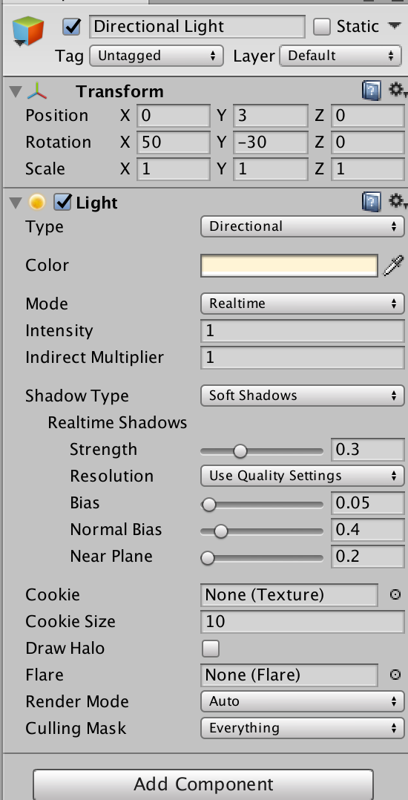

本例使用的是**软阴影（Soft Shadows）**。

### 让物体投射阴影

Unity中，可以选择**是否让一个物体投射阴影或接收阴影**。

通过设置**Mesh Renderer**组件中的**Cast Shadows**和**Receive Shadows**属性来实现。

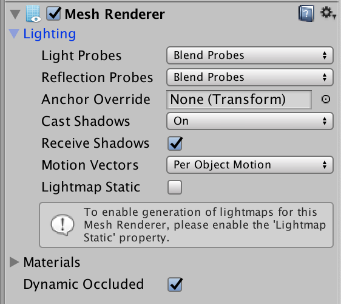

**Cast Shadows**可以被设置为**开启（On）或关闭（Off）**。如果开启了**Cast Shadows**属性，则Unity就会**把该物体加入到光源的阴影映射纹理的计算中**，从而让其他物体在对阴影映射纹理采样时可以得到该物体的相关信息。这个过程是通过为该物体执行**LightMode为ShadowCaster**的Pass来实现的。

**Receive Shadow**可以选择是否让物体接收来自其他物体的阴影。如果没有开启**Receive Shadow**，则当调用Unity的内置宏和变量计算阴影时，**这些宏通过判断该物体没有开启接收阴影的功能**，就不会在内部计算阴影。

如果把立方体和两个平面的**Cast Shadow**和**Receive Shadow**都设为**开启状态**，可以得到下图结果。

默认情况下，**计算光源的阴影映射纹理时会剔除掉物体的背面**，但对于内置的平面来说，它只有一个面，因此在本例中当计算阴影映射纹理时，由于右侧的平面在光源空间下没有任何**正面（frontface）**，因此就**不会添加到阴影映射纹理中**。（可以**将Cast Shadow设置为Two Sided**来允许对物体的所有面都**计算阴影信息**）

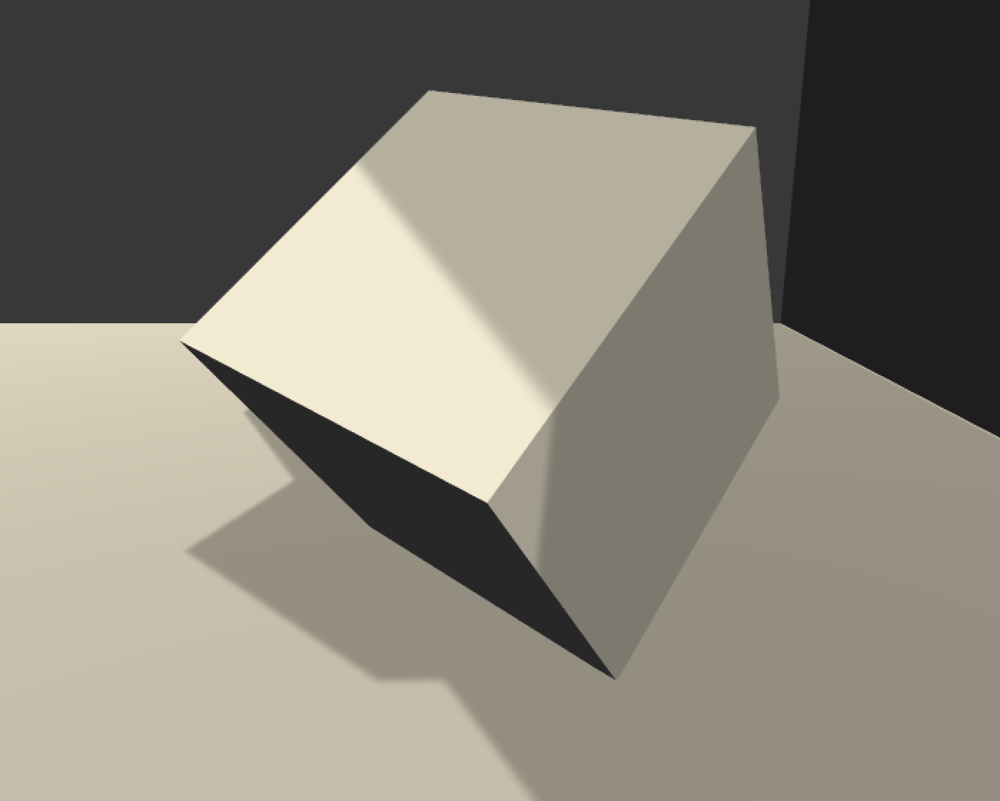

最下面的平面之所以可以接收阴影是因为它使用了**内置的Standard Shader**，而这个内置的**Shader**进行了接收阴影的相关操作。

由于立方体使用的`ForwardRendering`并没有对阴影进行任何处理，因此它**并不会显示出右侧平面投射来的阴影**。

此处使用的还是之前`ForwardRendering`的shader，但**该立方体仍然可以向下面的平面投射阴影**（并未使用**LightMode为ShadowCaster的Pass**来渲染阴影映射纹理和深度图）。

>在`ForwardRendering`的**SubShader**只定义了两个Pass——Base Pass和Additional Pass。
>
>为何其可以投射阴影？
>
>原因在于**Fallback**语义指定了内置**Specular**（类似还有**Diffuse**）
>
>```c++
>Fallback "Specular"
>```
>
>虽然**Specular**本身也没有包含这样一个Pass，但由于它的**Fallback调用了VertexLit**，它会继续回调，并最终回调到内置的**VertexLit**。
>
>```c++
>// Pass to render object as a shadow caster
>Pass {
>    Name "ShadowCaster"
>    Tags {"LightMode" = "ShadowCaster"}
>    
>    CGPROGRAM
>    #pragma vertex vert
>    #pragma fragment frag
>    #pragma multi_compile_shadowcaster
>    
>    #include "UnityCG.cginc"
>    
>    struct v2f {
>        V2F_SHADOW_CASTER;
>    }
>    
>    v2f vert(appdata_base v) {
>        v2f o;
>        TRANSFER_SHADOW_CASTER_NORMALOFFSET(o)
>        return o;
>    }
>    
>    float4 frag(v2f i) : SV_Target {
>        SHADOW_CASTER_FRAGMENT(i) 
>    } 
>    ENDCG
>}
>```
>
>尽管有一些宏和指令是之前没有遇到过的，它们的实际用处是为了把深度信息写入渲染目标中。

如果把`ForwardRendering`中的`Fallback`注释掉，就可以发现立方体不会再向平面投射阴影了。

当然也可以不依赖`Fallback`，而自行在**SubShader**中定义自己的**LightMode为ShadowCaster的Pass**。

这种自定义的**Pass**可以更加灵活地控制阴影的产生。

由于**这个Pass的功能通常是可以在多个Unity Shader间通用的**，因此直接`Fallback`是一个更加方便的用法。

### 让物体接收阴影

为了让立方体可以接收阴影，作如下步骤：

1. 新建一个Unity Shader，名称为`Shadow`，将其赋给立方体，并删除之前的`ShadowMat`
2. 删除`Shadow`中的代码，把`ForwardRendering`的代码复制给它

对代码进行一些更改：

```c++
// Upgrade NOTE: replaced '_LightMatrix0' with 'unity_WorldToLight'
// Upgrade NOTE: replaced '_Object2World' with 'unity_ObjectToWorld'
// Upgrade NOTE: replaced 'mul(UNITY_MATRIX_MVP,*)' with 'UnityObjectToClipPos(*)'

Shader "Unity Shaders Book/Chapter 9/Shadow" {
	Properties {
		_Diffuse ("Diffuse", Color) = (1, 1, 1, 1)
		_Specular ("Specular", Color) = (1, 1, 1, 1)
		_Gloss ("Gloss", Range(8.0, 256)) = 20
	}
	SubShader {
		Tags { "RenderType"="Opaque" }
		
		Pass {
			// Pass for ambient light & first pixel light (directional light)
			Tags { "LightMode"="ForwardBase" }
		
			CGPROGRAM
			
			// Apparently need to add this declaration 
			#pragma multi_compile_fwdbase	
			
			#pragma vertex vert
			#pragma fragment frag
			
			// Need these files to get built-in macros
			#include "Lighting.cginc"
			// 引入AutoLight内置文件,因为下面计算阴影时所用的宏都是在这个文件中声明的
			#include "AutoLight.cginc"
			
			fixed4 _Diffuse;
			fixed4 _Specular;
			float _Gloss;
			
			struct a2v {
				float4 vertex : POSITION;
				float3 normal : NORMAL;
			};
			
			struct v2f {
				float4 pos : SV_POSITION;
				float3 worldNormal : TEXCOORD0;
				float3 worldPos : TEXCOORD1;
				// 顶点着色器的输出结构体v2f中添加一个内置宏SHADOW_COORDS
				// 这个宏的作用很简单,就是声明一个用于对阴影纹理采样的坐标
				// 这个宏的参数需要是下一个可用的插值寄存器的索引值
				SHADOW_COORDS(2)
			};
			
			v2f vert(a2v v) {
			 	v2f o;
			 	o.pos = UnityObjectToClipPos(v.vertex);
			 	
			 	o.worldNormal = UnityObjectToWorldNormal(v.normal);

			 	o.worldPos = mul(unity_ObjectToWorld, v.vertex).xyz;
			 	
			 	// Pass shadow coordinates to pixel shader
				// 在顶点着色器返回之前添加另一个内置宏TRANSFER_SHADOW
				// 这个宏用于在顶点着色器中计算上一步中声明的阴影纹理坐标
			 	TRANSFER_SHADOW(o);
			 	
			 	return o;
			}
			
			fixed4 frag(v2f i) : SV_Target {
				fixed3 worldNormal = normalize(i.worldNormal);
				fixed3 worldLightDir = normalize(_WorldSpaceLightPos0.xyz);
				
				fixed3 ambient = UNITY_LIGHTMODEL_AMBIENT.xyz;

			 	fixed3 diffuse = _LightColor0.rgb * _Diffuse.rgb * max(0, dot(worldNormal, worldLightDir));

			 	fixed3 viewDir = normalize(_WorldSpaceCameraPos.xyz - i.worldPos.xyz);
			 	fixed3 halfDir = normalize(worldLightDir + viewDir);
			 	fixed3 specular = _LightColor0.rgb * _Specular.rgb * pow(max(0, dot(worldNormal, halfDir)), _Gloss);

				fixed atten = 1.0;
				
				// 片元着色器中计算阴影值,同样使用一个内置宏SHADOW_ATTENUATION
				fixed shadow = SHADOW_ATTENUATION(i);
				// 完成了上述所有操作以后，只需要把阴影值shadow和漫反射以及高光反射颜色相乘即可
				return fixed4(ambient + (diffuse + specular) * atten * shadow, 1.0);
			}
			
			ENDCG
		}
	
		Pass {
			// Pass for other pixel lights
			Tags { "LightMode"="ForwardAdd" }
			
			Blend One One
		
			CGPROGRAM
			
			// Apparently need to add this declaration
			#pragma multi_compile_fwdadd
			// Use the line below to add shadows for point and spot lights
//			#pragma multi_compile_fwdadd_fullshadows
			
			#pragma vertex vert
			#pragma fragment frag
			
			#include "Lighting.cginc"
			#include "AutoLight.cginc"
			
			fixed4 _Diffuse;
			fixed4 _Specular;
			float _Gloss;
			
			struct a2v {
				float4 vertex : POSITION;
				float3 normal : NORMAL;
			};
			
			struct v2f {
				float4 position : SV_POSITION;
				float3 worldNormal : TEXCOORD0;
				float3 worldPos : TEXCOORD1;
			};
			
			v2f vert(a2v v) {
			 	v2f o;
			 	o.position = UnityObjectToClipPos(v.vertex);
			 	
			 	o.worldNormal = UnityObjectToWorldNormal(v.normal);
			 	
			 	o.worldPos = mul(unity_ObjectToWorld, v.vertex).xyz;
			 	
			 	return o;
			}
			
			fixed4 frag(v2f i) : SV_Target {
				fixed3 worldNormal = normalize(i.worldNormal);
				#ifdef USING_DIRECTIONAL_LIGHT
					fixed3 worldLightDir = normalize(_WorldSpaceLightPos0.xyz);
				#else
					fixed3 worldLightDir = normalize(_WorldSpaceLightPos0.xyz - i.worldPos.xyz);
				#endif

			 	fixed3 diffuse = _LightColor0.rgb * _Diffuse.rgb * max(0, dot(worldNormal, worldLightDir));

			 	fixed3 viewDir = normalize(_WorldSpaceCameraPos.xyz - i.worldPos.xyz);
			 	fixed3 halfDir = normalize(worldLightDir + viewDir);
			 	fixed3 specular = _LightColor0.rgb * _Specular.rgb * pow(max(0, dot(worldNormal, halfDir)), _Gloss);

				#ifdef USING_DIRECTIONAL_LIGHT
					fixed atten = 1.0;
				#else
					float3 lightCoord = mul(unity_WorldToLight, float4(i.worldPos, 1)).xyz;
					fixed atten = tex2D(_LightTexture0, dot(lightCoord, lightCoord).rr).UNITY_ATTEN_CHANNEL;
				#endif
			 	
				return fixed4((diffuse + specular) * atten, 1.0);
			}
			
			ENDCG
		}
	}
	FallBack "Specular"
}
```

`SHADOW_COORDS`、`TRANSFER_SHADOW`和`SHADOW_ATTENUATION`是计算阴影时的“三剑客”。这些内置宏帮助我们在必要时计算光源的阴影。

可以在`AutoLight.cginc`中找到它们的声明：

```c++
// -----------------------
// Shadow helpers
// -----------------------

// -----Screen space shadows
#if defined (SHADOWS_SCREEN)
    UNITY_DECLARE_SHADOWMAP(_ShadowMapTexture);
    #define SHADOW_COORDS(idx1) unityShadowCoord4 _ShadowCoord : TEXCOORD##idx1;
    #if defined(UNITY_NO_SCREENSPACE_SHADOWS)
        #define TRANSFER_SHADOW(a) a._ShadowCoord = mul(unity_World2Shadow[0], mul(_Object2World, v.vertex));
        inline fixed unitySampleShadow(unityShadowCoord4 shadowCoord) {
            ...
        }
    #else  // UNITY_NO_SCREENSPACE_SHADOWS
        #define TRANSFER_SHADOW(a) a._ShadowCoord = ComputeScreenPos(a.pos);
        inline fixed unitySampleShadow(unityShadowCoord4 shadowCoord) {
            fixed shadow = tex2Dproj(_ShadowMapTexture, UNITY_PROJ_COORD(shadowCoord)).r;
            return shadow;
        }
    #endif
    #define SHADOW_ATTENUATION(a) unitySampleShadow(a._ShadowCoord)
#endif

// ---- Spot light shadows
#if defined (SHADOWS_DEPTH) && defined (SPOT)
    ...
#endif

// ---- Point light shadows
#if defined (SHADOWS_CUBE)
    ...
#endif

// ---- Shadow off
#if !defined(SHADOWS_SCREEN) && !defined(SHADOWS_DEPTH) && !defined(SHADOWS_CUBE)
    #define SHADOW_COORDS(idx1)
    #define TRANSFER_SHADOW(a)
    #define SHADOW_ATTENUATION(a) 1.0
#endif
```

上面的代码**看起来很多、很复杂**，实际上**只是Unity为了处理不同光源类型、不同平台而定义的多个版本的宏**。

前向渲染中：

- 宏**SHADOW_COORDS**实际上就是声明了一个名为**_ShadowCoord**的阴影纹理坐标变量。
- 宏**TRANSFER_SHADOW**的实现则会根据平台不同而有所差异。
    - 如果当前平台可以使用屏幕空间的阴影映射技术（判断是否定义`UNITY_NO_SCREENSPACE_SHADOWS`来得到），`TRANSFER_SHADOW`会调用内置的`ComputeScreenPos`函数来计算`_ShadowCoord`。
    - 如果该平台不支持屏幕空间的阴影映射技术，就会**使用传统的阴影映射技术**，**TRANSFER_SHADOW**会把顶点坐标从模型空间变换到光源空间后存储到`_ShadowCoord`中。
- 宏**SHADOW_ATTENUATION**负责使用`_ShadowCoord`对相关的纹理进行采样，得到阴影信息。

注意到，上面内置代码的最后定义了**在关闭阴影时的处理代码**。可以看出，当关闭了阴影后，`SHADOW_COORDS`和`TRANSFER_SHADOW`实际上没有任何作用，而`SHADOW_ATTENUATION`会直接等同于数值1。

**注意**：由于这些宏中会**使用上下文变量来进行相关计算**，例如`TRANSFER_SHADOW`会使用`v.vertex`或`a.pos`来计算坐标，因此为了**能够让这些宏正确工作**，需要保证**自定义的变量名和这些宏中使用的变量名相匹配**。

**需要保证**：`a2f`结构体中的顶点坐标变量名必须是`vertex`，顶点着色器的输出结构体`v2f`必须命名为`v`，且`v2f`中的顶点位置变量必须命名为`pos`。

## 使用帧调试器查看阴影绘制过程

在`Window->Frame Debugger`中打开帧调试器。

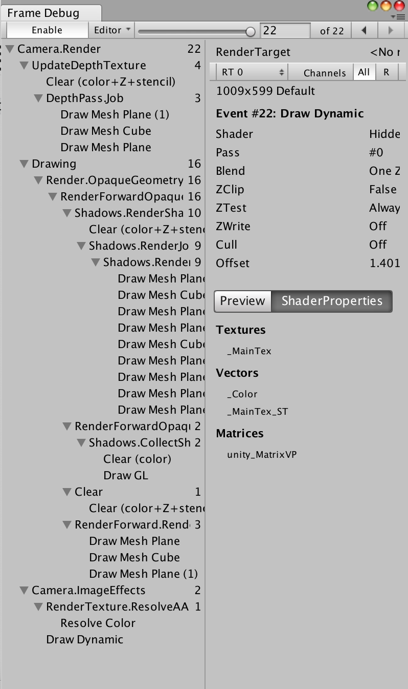

上图展示了帧调试器中的分析结果，绘制该场景共需要**花费22个渲染事件**，这些渲染事件可以分为4个部分：

- **UpdateDepthTexture**：更新摄像机的深度纹理

点击该事件可以查看它们的绘制结果，下图中给出了立方体对深度纹理的更新结果。

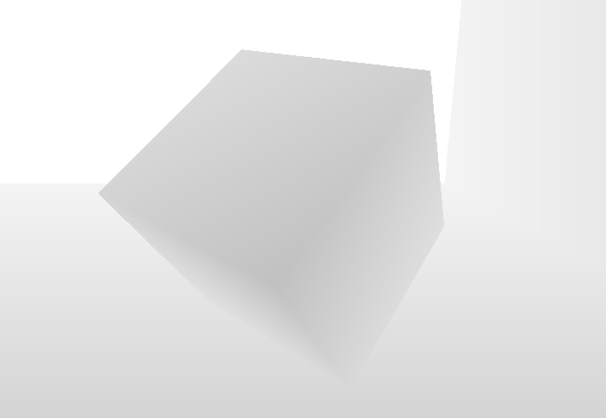

从帧调试器右侧面板中可以了解这一渲染事件的详细信息。

Unity调用了**Shader**: `Unity Shader Book/Chapter9 Shadow, SubShader #2`；的更新深度纹理

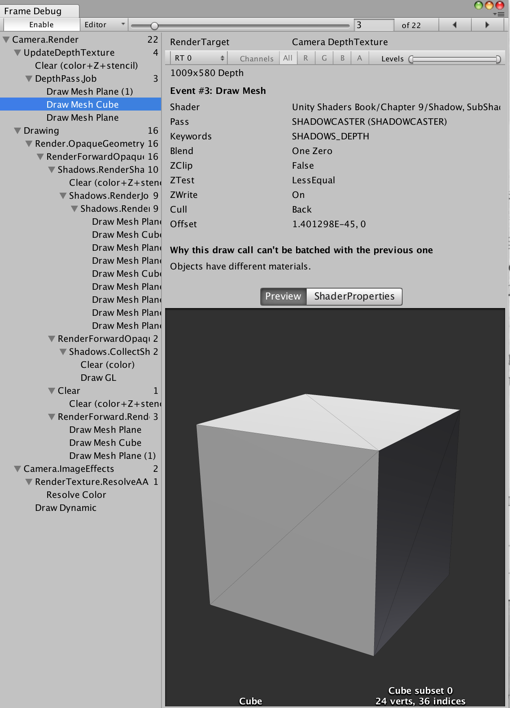


- **RenderShadowmap**：渲染得到平行光的阴影映射纹理

- **CollectShadows**：根据深度纹理和阴影映射纹理得到屏幕空间的阴影图

    该部分中，Unity会根据之前两部的结果得到屏幕空间的阴影图。

    这张图包含了最终屏幕上所有阴影区域的阴影。

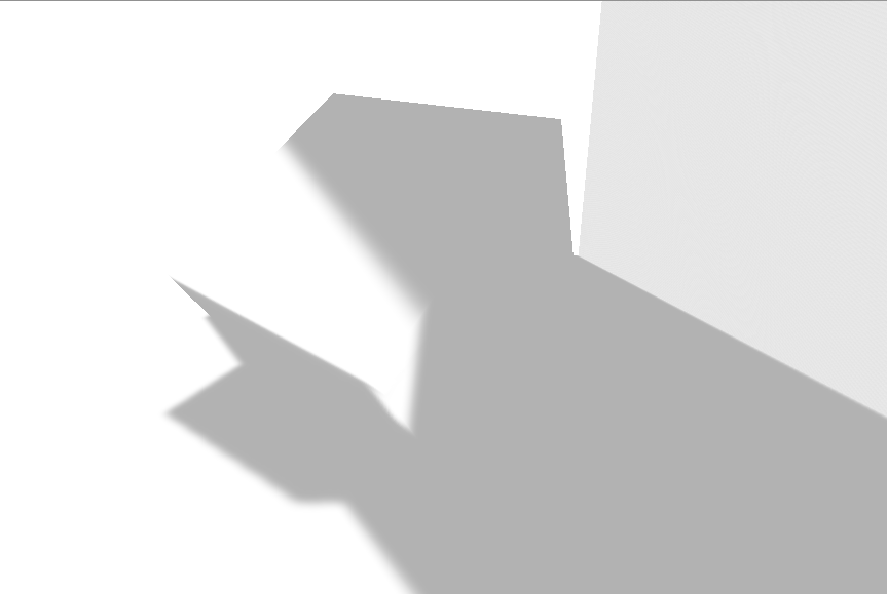

- 绘制渲染结果

    如果物体所使用的Shader包含对这张阴影图的采样，就会得到阴影效果。

下图展示了Unity是如何一步步绘制出有阴影的画面效果的。

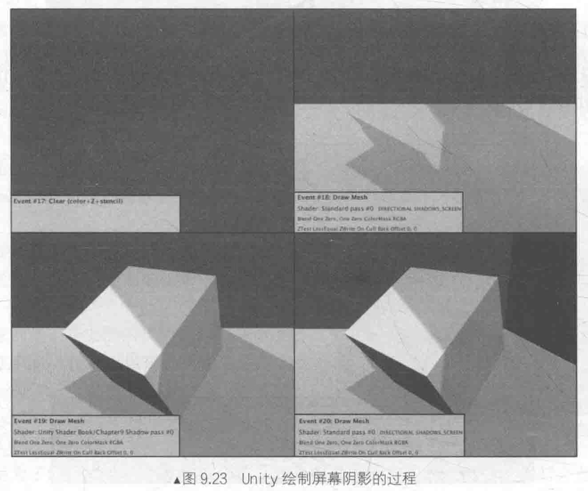

## 统一管理光照衰减和阴影

Unity Shader的前向渲染路径中**计算光照衰减**：

- Base Pass中，平行光的**衰减因子总是等于1**
- Additional Pass中，需要**判断该Pass处理光源类型，再使用内置变量和宏计算衰减因子**。

实际上，**光线衰减和阴影对物体最终的渲染结果的影响本质上是相同的**——都是把**光照衰减因子**和**阴影值**及**光照结果**相乘得到**最终的渲染结果**。

>是否有一个方法可以同时计算两个信息？
>
>Unity在Shader里提供了这样的功能，通过内置的UNITY_LIGHT_ATTENUATION宏来实现

为此，准备如下工作：

1. 创建一个场景
2. 新建一个材质，材质名：`AttenuationAndShadowUseBuildInFunctionsMat`
3. 新建一个Unity Shader，名为：`AttenuationAndShadowUseBuildInFunctions`，把该Shader赋给第2步中创建的材质
4. 把2步中的材质赋给一个立方体
5. 保存场景

打开第3步中的Shader，添加如下代码：

```c++
// Upgrade NOTE: replaced '_Object2World' with 'unity_ObjectToWorld'
// Upgrade NOTE: replaced 'mul(UNITY_MATRIX_MVP,*)' with 'UnityObjectToClipPos(*)'

Shader "Unity Shaders Book/Chapter 9/Attenuation And Shadow Use Build-in Functions" {
	Properties {
		_Diffuse ("Diffuse", Color) = (1, 1, 1, 1)
		_Specular ("Specular", Color) = (1, 1, 1, 1)
		_Gloss ("Gloss", Range(8.0, 256)) = 20
	}
	SubShader {
		Tags { "RenderType"="Opaque" }
		
		Pass {
			// Pass for ambient light & first pixel light (directional light)
			Tags { "LightMode"="ForwardBase" }
		
			CGPROGRAM
			
			// Apparently need to add this declaration
			#pragma multi_compile_fwdbase	
			
			#pragma vertex vert
			#pragma fragment frag
			
			// Need these files to get built-in macros
			// 包含所需头文件
			#include "Lighting.cginc"
			#include "AutoLight.cginc"
			
			fixed4 _Diffuse;
			fixed4 _Specular;
			float _Gloss;
			
			struct a2v {
				float4 vertex : POSITION;
				float3 normal : NORMAL;
			};
			
			struct v2f {
				float4 pos : SV_POSITION;
				float3 worldNormal : TEXCOORD0;
				float3 worldPos : TEXCOORD1;
				// 使用内置宏SHADOW_COORDS声明阴影坐标
				SHADOW_COORDS(2)
			};
			
			v2f vert(a2v v) {
			 	v2f o;
			 	o.pos = UnityObjectToClipPos(v.vertex);
			 	
			 	o.worldNormal = UnityObjectToWorldNormal(v.normal);
			 	
			 	o.worldPos = mul(unity_ObjectToWorld, v.vertex).xyz;
			 	
			 	// Pass shadow coordinates to pixel shader
				// 顶点着色器中使用内置宏TRANSFER_SHADOW计算并向片元着色器传递阴影坐标
			 	TRANSFER_SHADOW(o);
			 	
			 	return o;
			}
			
			fixed4 frag(v2f i) : SV_Target {
				fixed3 worldNormal = normalize(i.worldNormal);
				fixed3 worldLightDir = normalize(UnityWorldSpaceLightDir(i.worldPos));
				
				fixed3 ambient = UNITY_LIGHTMODEL_AMBIENT.xyz;
				
			 	fixed3 diffuse = _LightColor0.rgb * _Diffuse.rgb * max(0, dot(worldNormal, worldLightDir));

			 	fixed3 viewDir = normalize(UnityWorldSpaceViewDir(i.worldPos));
			 	fixed3 halfDir = normalize(worldLightDir + viewDir);
			 	fixed3 specular = _LightColor0.rgb * _Specular.rgb * pow(max(0, dot(worldNormal, halfDir)), _Gloss);

				// UNITY_LIGHT_ATTENUATION not only compute attenuation, but also shadow infos
				// 片元着色器中使用内置宏UNITY_LIGHT_ATTENUATION计算光照衰减和阴影
				// 接受三个参数,将光照衰减和阴影相乘后的结果存储到第一个参数中
				// 注意,此处并没有在代码中声明一个参数atten,这是因为UNITY_LIGHT_ATTENUATION会自动声明这个变量
				// 第二个参数是结构体v2f,这个参数会传递给SHADOW_ATTENUATION,用于计算阴影值
				// 第三个参数是世界空间的坐标,这个参数会用于计算光源空间下的坐标,再对光照衰减纹理采样来得到光照衰减
				// Unity针对不同光源类型,是否启用cookie等不同情况声明了多个版本的UNITY_LIGHT_ATTENUATION
				// 这些不同版本的声明是保证通过这样一个简单的代码来得到正确结果的关键
				// 由于使用了UNITY_LIGHT_ATTENUATION,Base Pass和Additional Pass的代码得以统一
				// 不需要在Base Pass里单独处理阴影,也不需要在Additional Pass中判断光源类型来处理光照衰减
				// 一切都只需要通过UNITY_LIGHT_ATTENUATION来完成即可(这正是Unity内置文件的魅力所在)
				UNITY_LIGHT_ATTENUATION(atten, i, i.worldPos);
				
				return fixed4(ambient + (diffuse + specular) * atten, 1.0);
			}
			
			ENDCG
		}
	
		Pass {
			// Pass for other pixel lights
			Tags { "LightMode"="ForwardAdd" }
			
			Blend One One
		
			CGPROGRAM
			
			// Apparently need to add this declaration
			#pragma multi_compile_fwdadd
			// Use the line below to add shadows for point and spot lights
			// 如果希望在Additional Pass中添加阴影效果,需要使用下面的编译指令
			// 这样一来,Unity也会为这些额外的逐像素光源计算阴影,并传递给Shader
//			#pragma multi_compile_fwdadd_fullshadows
			
			#pragma vertex vert
			#pragma fragment frag
			
			#include "Lighting.cginc"
			#include "AutoLight.cginc"
			
			fixed4 _Diffuse;
			fixed4 _Specular;
			float _Gloss;
			
			struct a2v {
				float4 vertex : POSITION;
				float3 normal : NORMAL;
			};
			
			struct v2f {
				float4 pos : SV_POSITION;
				float3 worldNormal : TEXCOORD0;
				float3 worldPos : TEXCOORD1;
				SHADOW_COORDS(2)
			};
			
			v2f vert(a2v v) {
			 	v2f o;
			 	o.pos = UnityObjectToClipPos(v.vertex);
			 	
			 	o.worldNormal = UnityObjectToWorldNormal(v.normal);
			 	
			 	o.worldPos = mul(unity_ObjectToWorld, v.vertex).xyz;
			 	
			 	// Pass shadow coordinates to pixel shader
			 	TRANSFER_SHADOW(o);
			 	
			 	return o;
			}
			
			fixed4 frag(v2f i) : SV_Target {
				fixed3 worldNormal = normalize(i.worldNormal);
				fixed3 worldLightDir = normalize(UnityWorldSpaceLightDir(i.worldPos));
				
			 	fixed3 diffuse = _LightColor0.rgb * _Diffuse.rgb * max(0, dot(worldNormal, worldLightDir));

			 	fixed3 viewDir = normalize(UnityWorldSpaceViewDir(i.worldPos));
			 	fixed3 halfDir = normalize(worldLightDir + viewDir);
			 	fixed3 specular = _LightColor0.rgb * _Specular.rgb * pow(max(0, dot(worldNormal, halfDir)), _Gloss);

				// UNITY_LIGHT_ATTENUATION not only compute attenuation, but also shadow infos
				UNITY_LIGHT_ATTENUATION(atten, i, i.worldPos);
			 	
				return fixed4((diffuse + specular) * atten, 1.0);
			}
			
			ENDCG
		}
	}
	FallBack "Specular"
}
```

## 透明物体的阴影

想要**在Unity里让物体能够向其他物体投射阴影**，一定要在它使用的Unity Shader中**提供一个LightMode为ShadowCaster的Pass**。

之前的例子中，使用内置的`VertexLit`提供的`ShadowCaster`来投射阴影，它的实现很简单，会正常渲染整个物体，然后**把深度结果输出到一张深度图或阴影映射纹理中**。

对于大多数不透明的物体来说，把`Fallback`设为`VertexLit`就可以得到正确的阴影。

但**对于透明物体来说**，需要**小心处理它的阴影**，透明物体的实现通常会**使用透明度测试或透明度混合**，需要小心设置这些物体的`Fallback`。

**透明度测试**的处理比较简单，但是如果仍然使用`VertexLit`、`Diffuse`、`Specular`等作为回调，往往无法得到正确的阴影（因为**透明度测试**需要在**片元着色器中舍弃某些片元**，而`VertexLit`中的阴影投射纹理并没有进行这样的操作）。

```c++
// Upgrade NOTE: replaced '_Object2World' with 'unity_ObjectToWorld'
// Upgrade NOTE: replaced 'mul(UNITY_MATRIX_MVP,*)' with 'UnityObjectToClipPos(*)'

Shader "Unity Shaders Book/Chapter 9/Alpha Test With Shadow" {
	Properties {
		_Color ("Color Tint", Color) = (1, 1, 1, 1)
		_MainTex ("Main Tex", 2D) = "white" {}
    // 需要注意,VertexLit中计算透明度测试时,使用了名为_Cutoff的属性来进行透明度测试
    // 因此Shader中也必须提供名为_Cutoff的属性
		_Cutoff ("Alpha Cutoff", Range(0, 1)) = 0.5
	}
	SubShader {
		Tags {"Queue"="AlphaTest" "IgnoreProjector"="True" "RenderType"="TransparentCutout"}
		
		Pass {
			Tags { "LightMode"="ForwardBase" }
			
			Cull Off
			
			CGPROGRAM
			
			#pragma multi_compile_fwdbase
			
			#pragma vertex vert
			#pragma fragment frag
			
			// 包含需要的头文件
			#include "Lighting.cginc"
			#include "AutoLight.cginc"
			
			fixed4 _Color;
			sampler2D _MainTex;
			float4 _MainTex_ST;
			fixed _Cutoff;
			
			struct a2v {
				float4 vertex : POSITION;
				float3 normal : NORMAL;
				float4 texcoord : TEXCOORD0;
			};
			
			struct v2f {
				float4 pos : SV_POSITION;
				float3 worldNormal : TEXCOORD0;
				float3 worldPos : TEXCOORD1;
				float2 uv : TEXCOORD2;
				// 使用内置宏SHADOW_COORDS声明阴影纹理坐标
				// 由于已经占用了3个插值寄存器(TEXCOORD0,TEXCOORD1,TEXCOORD2)
				// 因此SHADOW_COORDS中传入的参数是3
				// 这意味着阴影纹理坐标将占用第四个插值寄存器TEXCOORD3
				SHADOW_COORDS(3)
			};
			
			v2f vert(a2v v) {
			 	v2f o;
			 	o.pos = UnityObjectToClipPos(v.vertex);
			 	
			 	o.worldNormal = UnityObjectToWorldNormal(v.normal);
			 	
			 	o.worldPos = mul(unity_ObjectToWorld, v.vertex).xyz;

			 	o.uv = TRANSFORM_TEX(v.texcoord, _MainTex);
			 	
			 	// Pass shadow coordinates to pixel shader
				// 在顶点着色器中使用内置宏TRANSFER_SHADOW计算阴影纹理坐标后传递给片元着色器
			 	TRANSFER_SHADOW(o);
			 	
			 	return o;
			}
			
			fixed4 frag(v2f i) : SV_Target {
				fixed3 worldNormal = normalize(i.worldNormal);
				fixed3 worldLightDir = normalize(UnityWorldSpaceLightDir(i.worldPos));
				
				fixed4 texColor = tex2D(_MainTex, i.uv);

				clip (texColor.a - _Cutoff);
				
				fixed3 albedo = texColor.rgb * _Color.rgb;
				
				fixed3 ambient = UNITY_LIGHTMODEL_AMBIENT.xyz * albedo;
				
				fixed3 diffuse = _LightColor0.rgb * albedo * max(0, dot(worldNormal, worldLightDir));
							 	
			 	// UNITY_LIGHT_ATTENUATION not only compute attenuation, but also shadow infos
				// 使用内置宏UNITY_LIGHT_ATTENUATION计算阴影和光照衰减
				UNITY_LIGHT_ATTENUATION(atten, i, i.worldPos);
			 	
				return fixed4(ambient + diffuse * atten, 1.0);
			}
			
			ENDCG
		}
	} 
	// 更改Fallback为VertexLit
	FallBack "Transparent/Cutout/VertexLit"
}
```

可以得到如下结果：

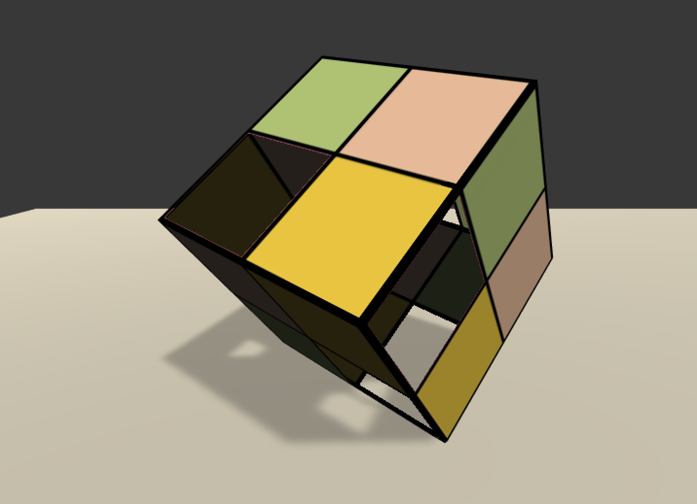

此处有一些问题，例如**出现了一些不应该透过光的部分**。

**原因**：默认情况下**把物体渲染到深度图和阴影映射纹理中仅考虑物体的正面**。对于本例的立方体来说，**由于一些面完全背对着光源**，因此这些面的深度信息没有加入到阴影映射纹理的计算中。

为了得到正确的结果，可以将立方体的**Mesh Renderer组件**中的**Cast Shadows属性**设置为**Two Sided**，强制Unity在**计算阴影映射纹理时计算所有面的深度信息**。

为使用**透明度混合**的物体**添加阴影是一件比较复杂的事情**。

所有内置的透明度混合的Unity Shader，如`Transparent/VertexLit`等，都没有包含阴影投射的Pass。

这意味着，这些半透明物体**不会参与深度图和阴影映射纹理的计算**，即，它们**不会向其他物体投射阴影**，同样也**不会接收来自其他物体的阴影**。

```c++
// Upgrade NOTE: replaced '_Object2World' with 'unity_ObjectToWorld'
// Upgrade NOTE: replaced 'mul(UNITY_MATRIX_MVP,*)' with 'UnityObjectToClipPos(*)'

Shader "Unity Shaders Book/Chapter 9/Alpha Blend With Shadow" {
	Properties {
		_Color ("Color Tint", Color) = (1, 1, 1, 1)
		_MainTex ("Main Tex", 2D) = "white" {}
		_AlphaScale ("Alpha Scale", Range(0, 1)) = 1
	}
	SubShader {
		Tags {"Queue"="Transparent" "IgnoreProjector"="True" "RenderType"="Transparent"}
		
		Pass {
			Tags { "LightMode"="ForwardBase" }
			
			ZWrite Off
			Blend SrcAlpha OneMinusSrcAlpha
			
			CGPROGRAM
			
			#pragma multi_compile_fwdbase
			
			#pragma vertex vert
			#pragma fragment frag
			
			#include "Lighting.cginc"
			#include "AutoLight.cginc"
			
			fixed4 _Color;
			sampler2D _MainTex;
			float4 _MainTex_ST;
			fixed _AlphaScale;
			
			struct a2v {
				float4 vertex : POSITION;
				float3 normal : NORMAL;
				float4 texcoord : TEXCOORD0;
			};
			
			struct v2f {
				float4 pos : SV_POSITION;
				float3 worldNormal : TEXCOORD0;
				float3 worldPos : TEXCOORD1;
				float2 uv : TEXCOORD2;
				SHADOW_COORDS(3)
			};
			
			v2f vert(a2v v) {
			 	v2f o;
			 	o.pos = UnityObjectToClipPos(v.vertex);
			 	
			 	o.worldNormal = UnityObjectToWorldNormal(v.normal);
			 	
			 	o.worldPos = mul(unity_ObjectToWorld, v.vertex).xyz;

			 	o.uv = TRANSFORM_TEX(v.texcoord, _MainTex);
			 	
			 	// Pass shadow coordinates to pixel shader
			 	TRANSFER_SHADOW(o);
			 	
			 	return o;
			}
			
			fixed4 frag(v2f i) : SV_Target {
				fixed3 worldNormal = normalize(i.worldNormal);
				fixed3 worldLightDir = normalize(UnityWorldSpaceLightDir(i.worldPos));
				
				fixed4 texColor = tex2D(_MainTex, i.uv);
				
				fixed3 albedo = texColor.rgb * _Color.rgb;
				
				fixed3 ambient = UNITY_LIGHTMODEL_AMBIENT.xyz * albedo;
				
				fixed3 diffuse = _LightColor0.rgb * albedo * max(0, dot(worldNormal, worldLightDir));

			 	// UNITY_LIGHT_ATTENUATION not only compute attenuation, but also shadow infos
				UNITY_LIGHT_ATTENUATION(atten, i, i.worldPos);
			 	
				return fixed4(ambient + diffuse * atten, texColor.a * _AlphaScale);
			}
			
			ENDCG
		}
	} 
	FallBack "Transparent/VertexLit"
	// Or  force to apply shadow
//	FallBack "VertexLit"
}
```

> Unity这样处理的原因：
>
> 由于**透明度混合需要关闭深度写入**，由此带来的问题也影响了阴影的生成。
>
> 总体来说，要想为这些半透明物体产生正确的阴影，需要**在每个光源空间下仍然严格按照从后往前的顺序进行渲染**，这会让阴影处理变得非常复杂，而且会影响性能。
>
> 因此，在Unity中，**所有内置的半透明Shader是不会产生任何阴影效果的**。
>
> 当然，可以使用一些**dirty trick强制为半透明物体生成阴影**，可以通过把它们的Fallback设置为VertexLit、Diffuse这些不透明物体使用的Unity Shader，这样Unity就会在它的Fallback找到一个阴影投射的Pass。
>
> 之后可以通过物体的Mesh Renderer组件上的Cast Shadows和Receive Shadows选项来控制是否需要向其他物体投射或接收阴影。

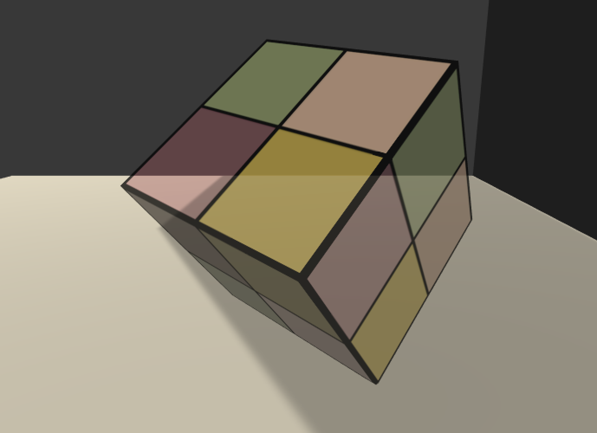


# 标准的Unity Shader

BumpedDiffuse使用Phong光照模型：

```c++
// Upgrade NOTE: replaced '_Object2World' with 'unity_ObjectToWorld'
// Upgrade NOTE: replaced 'mul(UNITY_MATRIX_MVP,*)' with 'UnityObjectToClipPos(*)'

Shader "Unity Shaders Book/Common/Bumped Diffuse" {
	Properties {
		_Color ("Color Tint", Color) = (1, 1, 1, 1)
		_MainTex ("Main Tex", 2D) = "white" {}
		_BumpMap ("Normal Map", 2D) = "bump" {}
	}
	SubShader {
		Tags { "RenderType"="Opaque" "Queue"="Geometry"}

		Pass { 
			Tags { "LightMode"="ForwardBase" }
		
			CGPROGRAM
			
			#pragma multi_compile_fwdbase
			
			#pragma vertex vert
			#pragma fragment frag
			
			#include "Lighting.cginc"
			#include "AutoLight.cginc"
			
			fixed4 _Color;
			sampler2D _MainTex;
			float4 _MainTex_ST;
			sampler2D _BumpMap;
			float4 _BumpMap_ST;
			
			struct a2v {
				float4 vertex : POSITION;
				float3 normal : NORMAL;
				float4 tangent : TANGENT;
				float4 texcoord : TEXCOORD0;
			};
			
			struct v2f {
				float4 pos : SV_POSITION;
				float4 uv : TEXCOORD0;
				float4 TtoW0 : TEXCOORD1;  
				float4 TtoW1 : TEXCOORD2;  
				float4 TtoW2 : TEXCOORD3;
				SHADOW_COORDS(4)
			};
			
			v2f vert(a2v v) {
				v2f o;
				o.pos = UnityObjectToClipPos(v.vertex);
				
				o.uv.xy = v.texcoord.xy * _MainTex_ST.xy + _MainTex_ST.zw;
				o.uv.zw = v.texcoord.xy * _BumpMap_ST.xy + _BumpMap_ST.zw;
				
				float3 worldPos = mul(unity_ObjectToWorld, v.vertex).xyz;  
				fixed3 worldNormal = UnityObjectToWorldNormal(v.normal);  
				fixed3 worldTangent = UnityObjectToWorldDir(v.tangent.xyz);  
				fixed3 worldBinormal = cross(worldNormal, worldTangent) * v.tangent.w; 
				
				o.TtoW0 = float4(worldTangent.x, worldBinormal.x, worldNormal.x, worldPos.x);
				o.TtoW1 = float4(worldTangent.y, worldBinormal.y, worldNormal.y, worldPos.y);
				o.TtoW2 = float4(worldTangent.z, worldBinormal.z, worldNormal.z, worldPos.z);  
				
				TRANSFER_SHADOW(o);
				
				return o;
			}
			
			fixed4 frag(v2f i) : SV_Target {
				float3 worldPos = float3(i.TtoW0.w, i.TtoW1.w, i.TtoW2.w);
				fixed3 lightDir = normalize(UnityWorldSpaceLightDir(worldPos));
				fixed3 viewDir = normalize(UnityWorldSpaceViewDir(worldPos));
				
				fixed3 bump = UnpackNormal(tex2D(_BumpMap, i.uv.zw));
				bump = normalize(half3(dot(i.TtoW0.xyz, bump), dot(i.TtoW1.xyz, bump), dot(i.TtoW2.xyz, bump)));
				
				fixed3 albedo = tex2D(_MainTex, i.uv.xy).rgb * _Color.rgb;
				
				fixed3 ambient = UNITY_LIGHTMODEL_AMBIENT.xyz * albedo;
			
			 	fixed3 diffuse = _LightColor0.rgb * albedo * max(0, dot(bump, lightDir));
				
				UNITY_LIGHT_ATTENUATION(atten, i, worldPos);
				
				return fixed4(ambient + diffuse * atten, 1.0);
			}
			
			ENDCG
		}
		
		Pass { 
			Tags { "LightMode"="ForwardAdd" }
			
			Blend One One
		
			CGPROGRAM
			
			#pragma multi_compile_fwdadd
			// Use the line below to add shadows for point and spot lights
//			#pragma multi_compile_fwdadd_fullshadows
			
			#pragma vertex vert
			#pragma fragment frag
			
			#include "Lighting.cginc"
			#include "AutoLight.cginc"
			
			fixed4 _Color;
			sampler2D _MainTex;
			float4 _MainTex_ST;
			sampler2D _BumpMap;
			float4 _BumpMap_ST;
			
			struct a2v {
				float4 vertex : POSITION;
				float3 normal : NORMAL;
				float4 tangent : TANGENT;
				float4 texcoord : TEXCOORD0;
			};
			
			struct v2f {
				float4 pos : SV_POSITION;
				float4 uv : TEXCOORD0;
				float4 TtoW0 : TEXCOORD1;  
				float4 TtoW1 : TEXCOORD2;  
				float4 TtoW2 : TEXCOORD3;
				SHADOW_COORDS(4)
			};
			
			v2f vert(a2v v) {
				v2f o;
				o.pos = UnityObjectToClipPos(v.vertex);
				
				o.uv.xy = v.texcoord.xy * _MainTex_ST.xy + _MainTex_ST.zw;
				o.uv.zw = v.texcoord.xy * _BumpMap_ST.xy + _BumpMap_ST.zw;
				
				float3 worldPos = mul(unity_ObjectToWorld, v.vertex).xyz;  
				fixed3 worldNormal = UnityObjectToWorldNormal(v.normal);  
				fixed3 worldTangent = UnityObjectToWorldDir(v.tangent.xyz);  
				fixed3 worldBinormal = cross(worldNormal, worldTangent) * v.tangent.w; 
				
				o.TtoW0 = float4(worldTangent.x, worldBinormal.x, worldNormal.x, worldPos.x);
				o.TtoW1 = float4(worldTangent.y, worldBinormal.y, worldNormal.y, worldPos.y);
				o.TtoW2 = float4(worldTangent.z, worldBinormal.z, worldNormal.z, worldPos.z);  
				
				TRANSFER_SHADOW(o);
				
				return o;
			}
			
			fixed4 frag(v2f i) : SV_Target {
				float3 worldPos = float3(i.TtoW0.w, i.TtoW1.w, i.TtoW2.w);
				fixed3 lightDir = normalize(UnityWorldSpaceLightDir(worldPos));
				fixed3 viewDir = normalize(UnityWorldSpaceViewDir(worldPos));
				
				fixed3 bump = UnpackNormal(tex2D(_BumpMap, i.uv.zw));
				bump = normalize(half3(dot(i.TtoW0.xyz, bump), dot(i.TtoW1.xyz, bump), dot(i.TtoW2.xyz, bump)));
				
				fixed3 albedo = tex2D(_MainTex, i.uv.xy).rgb * _Color.rgb;
				
			 	fixed3 diffuse = _LightColor0.rgb * albedo * max(0, dot(bump, lightDir));
				
				UNITY_LIGHT_ATTENUATION(atten, i, worldPos);
				
				return fixed4(diffuse * atten, 1.0);
			}
			
			ENDCG
		}
	} 
	FallBack "Diffuse"
}
```

BumpedSpecualr使用Blinn-Phong光照模型：

```c++
// Upgrade NOTE: replaced '_Object2World' with 'unity_ObjectToWorld'
// Upgrade NOTE: replaced 'mul(UNITY_MATRIX_MVP,*)' with 'UnityObjectToClipPos(*)'

Shader "Unity Shaders Book/Common/Bumped Specular" {
	Properties {
		_Color ("Color Tint", Color) = (1, 1, 1, 1)
		_MainTex ("Main Tex", 2D) = "white" {}
		_BumpMap ("Normal Map", 2D) = "bump" {}
		_Specular ("Specular Color", Color) = (1, 1, 1, 1)
		_Gloss ("Gloss", Range(8.0, 256)) = 20
	}
	SubShader {
		Tags { "RenderType"="Opaque" "Queue"="Geometry"}
		
		Pass { 
			Tags { "LightMode"="ForwardBase" }
		
			CGPROGRAM
			
			#pragma multi_compile_fwdbase	
			
			#pragma vertex vert
			#pragma fragment frag
			
			#include "UnityCG.cginc"
			#include "Lighting.cginc"
			#include "AutoLight.cginc"
			
			fixed4 _Color;
			sampler2D _MainTex;
			float4 _MainTex_ST;
			sampler2D _BumpMap;
			float4 _BumpMap_ST;
			fixed4 _Specular;
			float _Gloss;
			
			struct a2v {
				float4 vertex : POSITION;
				float3 normal : NORMAL;
				float4 tangent : TANGENT;
				float4 texcoord : TEXCOORD0;
			};
			
			struct v2f {
				float4 pos : SV_POSITION;
				float4 uv : TEXCOORD0;
				float4 TtoW0 : TEXCOORD1;  
                float4 TtoW1 : TEXCOORD2;  
                float4 TtoW2 : TEXCOORD3; 
				SHADOW_COORDS(4)
			};
			
			v2f vert(a2v v) {
			 	v2f o;
			 	o.pos = UnityObjectToClipPos(v.vertex);
			 
			 	o.uv.xy = v.texcoord.xy * _MainTex_ST.xy + _MainTex_ST.zw;
			 	o.uv.zw = v.texcoord.xy * _BumpMap_ST.xy + _BumpMap_ST.zw;

				TANGENT_SPACE_ROTATION;
				
				float3 worldPos = mul(unity_ObjectToWorld, v.vertex).xyz;  
                fixed3 worldNormal = UnityObjectToWorldNormal(v.normal);  
                fixed3 worldTangent = UnityObjectToWorldDir(v.tangent.xyz);  
                fixed3 worldBinormal = cross(worldNormal, worldTangent) * v.tangent.w; 
                
                o.TtoW0 = float4(worldTangent.x, worldBinormal.x, worldNormal.x, worldPos.x);  
                o.TtoW1 = float4(worldTangent.y, worldBinormal.y, worldNormal.y, worldPos.y);  
                o.TtoW2 = float4(worldTangent.z, worldBinormal.z, worldNormal.z, worldPos.z);  
  				
  				TRANSFER_SHADOW(o);
			 	
			 	return o;
			}
			
			fixed4 frag(v2f i) : SV_Target {
				float3 worldPos = float3(i.TtoW0.w, i.TtoW1.w, i.TtoW2.w);
				fixed3 lightDir = normalize(UnityWorldSpaceLightDir(worldPos));
				fixed3 viewDir = normalize(UnityWorldSpaceViewDir(worldPos));
				
				fixed3 bump = UnpackNormal(tex2D(_BumpMap, i.uv.zw));
				bump = normalize(half3(dot(i.TtoW0.xyz, bump), dot(i.TtoW1.xyz, bump), dot(i.TtoW2.xyz, bump)));

				fixed3 albedo = tex2D(_MainTex, i.uv.xy).rgb * _Color.rgb;
				
				fixed3 ambient = UNITY_LIGHTMODEL_AMBIENT.xyz * albedo;
				
			 	fixed3 diffuse = _LightColor0.rgb * albedo * max(0, dot(bump, lightDir));
			 	
			 	fixed3 halfDir = normalize(lightDir + viewDir);
			 	fixed3 specular = _LightColor0.rgb * _Specular.rgb * pow(max(0, dot(bump, halfDir)), _Gloss);
			
				UNITY_LIGHT_ATTENUATION(atten, i, worldPos);

				return fixed4(ambient + (diffuse + specular) * atten, 1.0);
			}
			
			ENDCG
		}
		
		Pass { 
			Tags { "LightMode"="ForwardAdd" }
			
			Blend One One
		
			CGPROGRAM
			
			#pragma multi_compile_fwdadd
			// Use the line below to add shadows for point and spot lights
//			#pragma multi_compile_fwdadd_fullshadows
			
			#pragma vertex vert
			#pragma fragment frag
			
			#include "Lighting.cginc"
			#include "AutoLight.cginc"
			
			fixed4 _Color;
			sampler2D _MainTex;
			float4 _MainTex_ST;
			sampler2D _BumpMap;
			float4 _BumpMap_ST;
			float _BumpScale;
			fixed4 _Specular;
			float _Gloss;
			
			struct a2v {
				float4 vertex : POSITION;
				float3 normal : NORMAL;
				float4 tangent : TANGENT;
				float4 texcoord : TEXCOORD0;
			};
			
			struct v2f {
				float4 pos : SV_POSITION;
				float4 uv : TEXCOORD0;
				float4 TtoW0 : TEXCOORD1;  
                float4 TtoW1 : TEXCOORD2;  
                float4 TtoW2 : TEXCOORD3;
				SHADOW_COORDS(4)
			};
			
			v2f vert(a2v v) {
			 	v2f o;
			 	o.pos = UnityObjectToClipPos(v.vertex);
			 
			 	o.uv.xy = v.texcoord.xy * _MainTex_ST.xy + _MainTex_ST.zw;
			 	o.uv.zw = v.texcoord.xy * _BumpMap_ST.xy + _BumpMap_ST.zw;

				float3 worldPos = mul(unity_ObjectToWorld, v.vertex).xyz;  
                fixed3 worldNormal = UnityObjectToWorldNormal(v.normal);  
                fixed3 worldTangent = UnityObjectToWorldDir(v.tangent.xyz);  
                fixed3 worldBinormal = cross(worldNormal, worldTangent) * v.tangent.w; 
	
  				o.TtoW0 = float4(worldTangent.x, worldBinormal.x, worldNormal.x, worldPos.x);
			  	o.TtoW1 = float4(worldTangent.y, worldBinormal.y, worldNormal.y, worldPos.y);
			  	o.TtoW2 = float4(worldTangent.z, worldBinormal.z, worldNormal.z, worldPos.z);  
			 	
			 	TRANSFER_SHADOW(o);
			 	
			 	return o;
			}
			
			fixed4 frag(v2f i) : SV_Target {
				float3 worldPos = float3(i.TtoW0.w, i.TtoW1.w, i.TtoW2.w);
				fixed3 lightDir = normalize(UnityWorldSpaceLightDir(worldPos));
				fixed3 viewDir = normalize(UnityWorldSpaceViewDir(worldPos));
				
				fixed3 bump = UnpackNormal(tex2D(_BumpMap, i.uv.zw));
				bump = normalize(half3(dot(i.TtoW0.xyz, bump), dot(i.TtoW1.xyz, bump), dot(i.TtoW2.xyz, bump)));
				
				fixed3 albedo = tex2D(_MainTex, i.uv.xy).rgb * _Color.rgb;
				
			 	fixed3 diffuse = _LightColor0.rgb * albedo * max(0, dot(bump, lightDir));
			 	
			 	fixed3 halfDir = normalize(lightDir + viewDir);
			 	fixed3 specular = _LightColor0.rgb * _Specular.rgb * pow(max(0, dot(bump, halfDir)), _Gloss);
			
				UNITY_LIGHT_ATTENUATION(atten, i, worldPos);

				return fixed4((diffuse + specular) * atten, 1.0);
			}
			
			ENDCG
		}
	} 
	FallBack "Specular"
}
```


